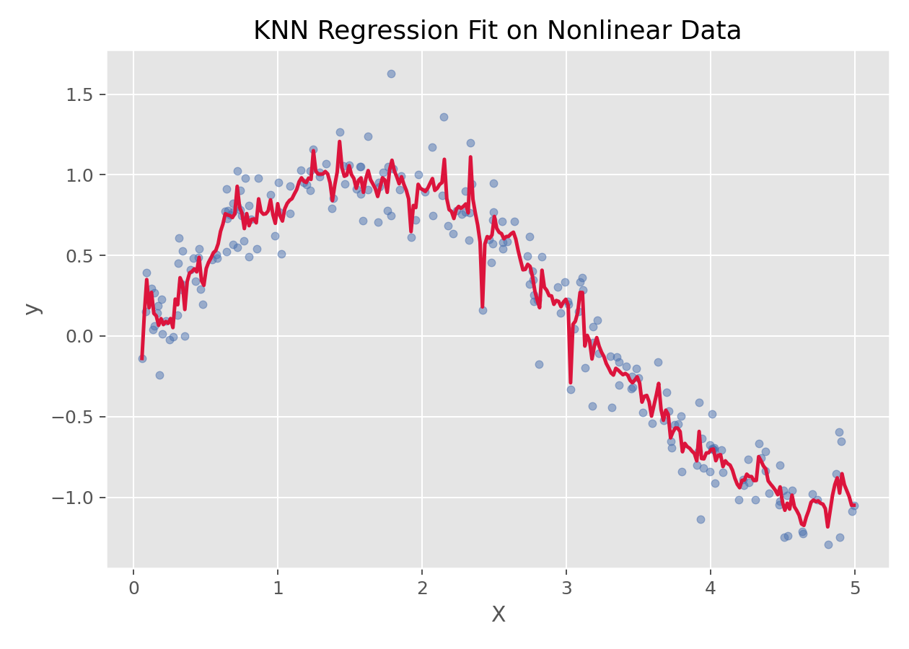

# K近邻回归（K-Nearest Neighbors Regression）

## 1. 方法概览

### 1.1 一句话本质

K 近邻回归把新样本的连续结局估计为其局部邻域中已观察结局的平均或距离加权平均。

### 1.2 定义

K近邻回归是一种非参数回归方法，它通过寻找离目标样本最近的 $K$ 个邻居，并对这些邻居的目标值做平均或加权平均来完成预测。

### 1.3 它主要解决什么问题

- 研究问题：如何基于“局部相似样本”的信息来预测连续结局。
- 适用任务：小到中等规模数据的局部回归、非线性回归。
- 常见医学场景：根据相似患者的特征预测某连续指标、评分或风险值。

### 1.4 直觉理解

KNN 回归的思路很直接：要预测一个新样本，就去看“和它最像”的几个老样本，它们的结果平均起来，大致就是新样本的预测值。

## 2. 核心思想与原理

### 2.1 根本困难

同一特征对结局的关系可能随患者所处区域改变，预先指定一条全局直线或固定函数容易欠拟合；但只参考极少病例又会被噪声牵着走。

### 2.2 关键洞察

用距离确定一个随查询点移动的局部窗口，再对窗口内结局做平均。$K$ 相当于平滑带宽：小 $K$ 保留局部起伏，大 $K$ 降低随机波动但会抹平真实非线性。

### 2.3 局部平滑而非外推

正权重 KNN 预测是邻居结局的凸组合，因此通常落在邻居结局范围内。它擅长在训练数据覆盖区域内插值，却无法像参数回归那样可靠地向样本支持范围之外外推。

## 3. 数学形式

### 3.1 核心公式

最简单的均值型 KNN 回归为：

$$
\hat y(x^*) = \frac{1}{K}\sum_{i \in \mathcal{N}_K(x^*)} y_i
$$

带距离权重时：

$$
\hat y(x^*) = \frac{\sum_{i \in \mathcal{N}_K(x^*)} w_i y_i}{\sum_{i \in \mathcal{N}_K(x^*)} w_i}
$$

其中常见权重可取：

$$
w_i = \frac{1}{d(x^*, x_i)+\epsilon}
$$

### 3.3 参数或统计量含义

- $K$：邻居数。
- $d(\cdot,\cdot)$：距离函数，常见为欧氏距离。
- $\mathcal{N}_K(x^*)$：距离目标样本最近的 $K$ 个训练样本集合。

### 3.4 关键假设

- 相似输入应对应相似输出。
- 特征尺度应可比，因此通常需要标准化。
- 邻域结构在局部上有意义。

## 4. 手把手算例

待预测患者为 $x^*=(2,2)$。最近的 3 位患者分别为 A、B、C：

| 邻居 | 距离 | 连续结局 $y$ |
| --- | ---: | ---: |
| A | 0.4 | 10 |
| B | 0.6 | 14 |
| C | 1.0 | 8 |

普通 $K=3$ 近邻回归给出：

$$
\hat y=\frac{10+14+8}{3}=10.667
$$

若用 $w_i=1/d_i$ 加权，则权重为 $2.5$、$1.667$、$1$：

$$
\hat y_w=
\frac{2.5\times10+1.667\times14+1\times8}
{2.5+1.667+1}
\approx10.90
$$

因为最接近的 A 结局为 10，加权结果被向 10 拉近。两种预测都位于邻居结局范围 $[8,14]$ 内；这正体现了 KNN 的局部插值性质。

## 5. 数据形式与输入输出

### 5.1 适合的数据形式

- 自变量类型：连续变量或编码后的分类变量。
- 因变量类型：连续型。
- 数据结构：宽表数据。
- 是否适合高维数据：维度过高时会遭遇“维数灾难”。
- 是否适合缺失较多数据：需先处理缺失值。
- 是否适合删失数据：不适合。
- 是否适合重复测量数据：不直接适合。

### 5.2 示例表格

下面是一组适合做局部回归的一维示例数据：

| X | y |
| --- | --- |
| 0.026 | 0.045 |
| 1.126 | 0.735 |
| 1.392 | 0.979 |
| 1.501 | 1.123 |
| 1.515 | 0.756 |
| 2.340 | 0.636 |

### 5.3 输入与产出

#### 输入

- 输入数据：连续结局和特征矩阵。
- 关键变量：邻居数 `k`、距离度量、是否使用距离加权。
- 需要预处理的内容：标准化、训练测试集划分。

#### 产出

- 模型对象/统计结果：局部邻域预测器。
- 参数估计：没有全局回归系数。
- 预测结果：连续型预测值。
- 不确定性指标：通常借助交叉验证误差衡量。

## 6. 适用场景

- 适合：局部非线性明显、样本规模中小、希望用邻域信息预测的场景。
- 不适合：高维、超大样本、强可解释性需求场景。
- 使用前需要特别检查的点：标准化、邻居数选择、距离度量。

## 7. 实现

### 7.1 Python

常用包：

- `scikit-learn`

```python
from sklearn.pipeline import make_pipeline
from sklearn.preprocessing import StandardScaler
from sklearn.neighbors import KNeighborsRegressor

fit = make_pipeline(
    StandardScaler(),
    KNeighborsRegressor(n_neighbors=12, weights="distance")
)
fit.fit(X_train, y_train)
y_pred = fit.predict(X_test)
```

### 7.2 R

常用包：

- `FNN`

```r
library(FNN)

pred <- knn.reg(train = X_train, test = X_test, y = y_train, k = 12)$pred
```

## 8. 结果如何解释

- 核心结果看什么：邻居数、预测误差、曲线平滑程度。
- 每个主要参数如何解释：K 越小，模型越灵活但方差更大；K 越大，模型更平滑但偏差更大。
- 临床或医学意义如何表达：适合解释成“参考最相似的一组个体所得到的局部估计”。
- 常见误读：KNN 不会自动学习全局关系，它只依赖局部邻域。

## 9. 假设诊断与稳健性

- **在交叉验证内标准化**：任何尺度变换、插补和筛选都只在训练折拟合。
- **联合选择 $K$ 与权重**：比较均匀/距离权重及多个 $K$，使用 MAE、RMSE 等与临床损失一致的指标。
- **检查数据支持范围**：标记查询点到最近邻的距离；远离训练样本的预测属于低支持区域，应拒绝或警示。
- **查看残差结构**：画预测—残差图和局部残差分布；异方差或系统偏差提示邻域/距离不合适。
- **评价特征冗余**：大量无关变量会稀释有效距离，可用领域筛选、降维或度量学习改善。
- **尊重患者聚类和时间**：重复测量按患者分组切分，纵向预测按时间切分，避免未来或同人信息泄漏。
- **谨慎表达不确定性**：邻居结局离散度不是严格预测区间；需要时采用嵌套重采样或共形预测构造覆盖率可检验的区间。

## 10. 推荐可视化

- 原始散点图 + KNN 拟合曲线。
- 不同 K 值的拟合曲线对比。
- 交叉验证误差随 K 变化图。

### 10.1 图像示例

下图展示 KNN 回归在一组非线性数据上的局部平滑拟合效果。



## 11. 优势、局限与常见坑

### 优势

- 简单直观。
- 非参数、无须线性假设。
- 能较好捕捉局部模式。

### 局限

- 高维问题效果会迅速变差。
- 大样本预测开销高。
- 缺乏全局参数解释。

### 常见坑

- 不标准化特征。
- K 选得过小或过大。
- 在高维稀疏数据上直接使用。

## 12. 与相近方法的区别

- 和局部加权回归的区别：二者都重视局部信息，但局部加权回归在每个点上拟合局部模型，而 KNN 多做邻域平均。
- 和 K近邻算法的区别：这里聚焦连续结局；二分类和多分类任务可看主条目“K近邻算法”。
- 和决策树回归的区别：KNN 用距离，树模型用递归切分。
- 和 SVR 的区别：SVR 学的是一个全局回归函数，KNN 更局部。

## 13. 医学研究中的典型应用

- 相似患者连续结局预测。
- 小规模非线性回归问题。
- 局部模式明显但难以设定参数模型的场景。

## 14. 关键术语

- **局部回归**：只用查询点附近样本估计结局关系。
- **均匀权重**：每个入选邻居对预测贡献相同。
- **距离权重**：邻居越近，对预测贡献越大。
- **平滑参数**：控制局部灵活度的 $K$，作用类似带宽。
- **插值**：在训练样本覆盖区域内预测。
- **外推**：对训练支持范围外样本预测，KNN 通常不擅长。
- **低支持区域**：查询点附近几乎没有训练样本的特征区域。

## 15. 相关方法

- [[K近邻算法（K-Nearest Neighbors, KNN）]]
- [[局部加权回归（Locally Weighted Regression）]]
- [[决策树回归（Decision Tree Regression）]]
- [[支持向量回归（Support Vector Regression, SVR）]]

## 16. 参考资料

- Hastie T, Tibshirani R, Friedman J. *The Elements of Statistical Learning*. 2nd ed. Springer; 2009.
- scikit-learn Developers. `sklearn.neighbors.KNeighborsRegressor`. scikit-learn API Reference. [https://scikit-learn.org/stable/modules/generated/sklearn.neighbors.KNeighborsRegressor.html](https://scikit-learn.org/stable/modules/generated/sklearn.neighbors.KNeighborsRegressor.html) （访问日期：2026-07-02）
- CRAN. Package `FNN`. [https://cran.r-project.org/package=FNN](https://cran.r-project.org/package=FNN) （访问日期：2026-07-02）
