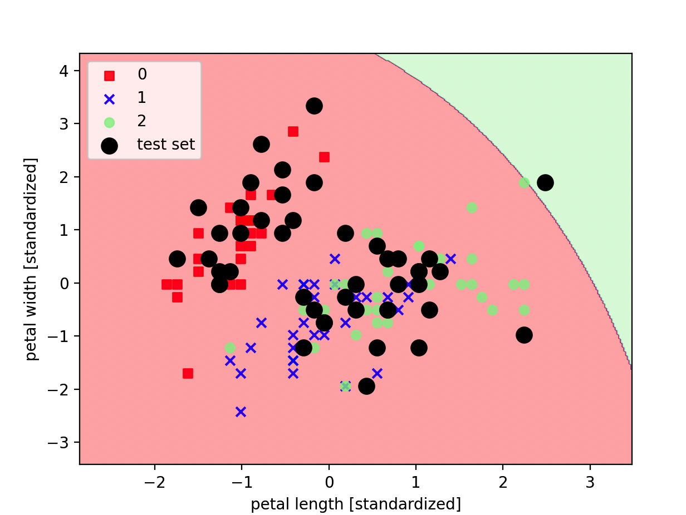

# 朴素贝叶斯（Naive Bayes）

## 1. 方法概览

### 1.1 定义

朴素贝叶斯是一类基于贝叶斯定理的概率分类方法。它假设在给定类别后，各特征彼此条件独立，因此可以把联合概率拆成一组一维条件概率的乘积。

### 1.2 它主要解决什么问题

- 研究问题：如何快速利用先验概率和特征条件分布来判断样本最可能属于哪个类别。
- 适用任务：二分类、多分类、文本分类、小样本高维分类。
- 常见医学场景：症状组合驱动的初步疾病分类、病历文本标签分类、检验指标的快速风险分层。

### 1.3 直觉理解

朴素贝叶斯像是在做一件事：先看某个类别本来有多常见，再看当前样本的每个特征在这个类别下是否“像它该有的样子”，最后把这些证据合在一起比较。

## 2. 数学形式

### 2.1 核心公式

贝叶斯定理为：

$$
P(C_k \mid x) = \frac{P(C_k) P(x \mid C_k)}{P(x)}
$$

在条件独立假设下：

$$
P(C_k \mid x_1, \dots, x_p) \propto P(C_k)\prod_{j=1}^{p} P(x_j \mid C_k)
$$

分类规则为：

$$
\hat y = \arg\max_k \left[ \log P(C_k) + \sum_{j=1}^{p} \log P(x_j \mid C_k) \right]
$$

### 2.2 参数或统计量含义

- $P(C_k)$：第 $k$ 类的先验概率。
- $P(x_j \mid C_k)$：给定类别后第 $j$ 个特征的条件分布。
- 拉普拉斯平滑：避免某特征值在某类中频数为 0 导致整类概率归零。

### 2.3 关键假设

- 给定类别后，各特征条件独立。
- 条件分布形式与所选朴素贝叶斯变体一致。
- 训练数据能较好估计先验与条件概率。

## 3. 数据形式与输入输出

### 3.1 适合的数据形式

- 自变量类型：计数型、二元词袋、连续型特征均可。
- 因变量类型：二分类或多分类。
- 数据结构：宽表数据或文本向量。
- 是否适合高维数据：适合，尤其是高维稀疏文本。
- 是否适合缺失较多数据：通常建议先处理缺失。
- 是否适合删失数据：不适合。
- 是否适合重复测量数据：不直接适合。

### 3.2 示例表格

以门诊文本分诊为例：

| Fever | Cough | Dyspnea | WBC | NoteTokenCount | TriageClass |
| --- | --- | --- | --- | --- | --- |
| 1 | 1 | 0 | 12.4 | 84 | bacterial |
| 0 | 1 | 0 | 6.1 | 73 | viral |
| 1 | 0 | 1 | 14.8 | 95 | bacterial |
| 0 | 0 | 0 | 5.3 | 41 | noninfectious |
| 1 | 1 | 1 | 13.7 | 88 | bacterial |

### 3.3 输入与产出

#### 输入

- 输入数据：类别标签和特征矩阵。
- 关键变量：先验概率、平滑参数、所选分布形式。
- 需要预处理的内容：缺失处理、编码、文本向量化或连续变量标准化策略。

#### 产出

- 模型对象/统计结果：各类先验概率、条件概率参数。
- 参数估计：类别先验、均值方差或频数参数。
- 预测结果：类别标签和后验概率。
- 不确定性指标：测试集准确率、宏平均 F1、AUC、校准情况。

## 4. 适用场景

- 适合：高维稀疏数据、快速基线分类、小样本下的概率判别。
- 不适合：特征高度依赖且分类边界复杂、需要精细交互建模的场景。
- 使用前需要特别检查的点：选对朴素贝叶斯变体、平滑参数、概率校准。

## 5. 实现

### 5.1 Python

常用包：

- `scikit-learn`

```python
import pandas as pd
from sklearn.model_selection import train_test_split
from sklearn.naive_bayes import GaussianNB

df = pd.read_csv("triage_nb.csv")
X = df[["Fever", "Cough", "Dyspnea", "WBC", "NoteTokenCount"]]
y = df["TriageClass"]

X_train, X_test, y_train, y_test = train_test_split(
    X, y, test_size=0.2, random_state=42, stratify=y
)

fit = GaussianNB(var_smoothing=1e-9)
fit.fit(X_train, y_train)

print(fit.predict_proba(X_test[:5]))
```

### 5.2 R

常用包：

- `e1071`

```r
library(e1071)

fit <- naiveBayes(TriageClass ~ Fever + Cough + Dyspnea + WBC + NoteTokenCount, data = df)
pred <- predict(fit, newdata = df_test, type = "raw")
```

## 6. 结果如何解释

- 核心结果看什么：类别先验、主要特征在各类下的条件分布、测试集分类性能。
- 每个主要参数如何解释：先验越高代表该类在训练集中越常见；条件分布参数反映某特征在不同类别中的典型取值模式。
- 临床或医学意义如何表达：适合解释成“在既往分布下，这组症状和检验组合更符合某一类别的概率画像”。
- 常见误读：后验概率高不代表真实风险一定高，尤其在先验偏斜或概率未校准时。

## 7. 推荐可视化

- 各类别预测概率分布图。
- 混淆矩阵。
- 关键词或特征条件概率热图。

### 7.1 图像示例

下图展示朴素贝叶斯在二维投影下的分类区域和测试样本分布，可直观看到不同类别的概率判别边界。



## 8. 优势、局限与常见坑

### 优势

- 训练和预测都很快。
- 在文本和高维稀疏数据上常表现良好。
- 结果带有直观概率解释。

### 局限

- 条件独立假设通常不严格成立。
- 对复杂交互和非线性边界刻画有限。
- 概率输出可能需要校准。

### 常见坑

- 连续型特征分布假设与数据明显不符。
- 忽略零频问题，不做平滑。
- 把朴素贝叶斯当作通用最优分类器。

## 9. 与相近方法的区别

- 和 Logistic 回归的区别：Logistic 回归直接建模判别边界，朴素贝叶斯先建模类条件分布再做判别。
- 和贝叶斯回归的区别：朴素贝叶斯是分类器，贝叶斯回归主要处理连续结局及参数后验推断。
- 和 K近邻算法的区别：朴素贝叶斯依赖概率分布假设，KNN 依赖局部相似性。

## 10. 医学研究中的典型应用

- 病历文本分类。
- 症状与检验组合驱动的初筛分类。
- 小样本、高维特征的快速基线模型。

## 11. 相关方法

- [[贝叶斯回归（Bayesian Regression）]]
- [[Logistic回归（Logistic Regression）]]
- [[K近邻算法（K-Nearest Neighbors, KNN）]]

## 12. 参考资料

- Murphy KP. *Machine Learning: A Probabilistic Perspective*. MIT Press; 2012.
- scikit-learn Developers. Naive Bayes. [https://scikit-learn.org/stable/modules/naive_bayes.html](https://scikit-learn.org/stable/modules/naive_bayes.html) （访问日期：2026-07-02）
- Dimitriadou E, Hornik K, Leisch F, Meyer D, Weingessel A. Package `e1071`. CRAN. [https://cran.r-project.org/package=e1071](https://cran.r-project.org/package=e1071) （访问日期：2026-07-02）
