# 001-全球气候变化趋势分析

## 1. 目标定义和假设设定

### 1.1 案例名称

**全球气候变化趋势分析**

### 1.2 分析目标

本案例旨在分析全球气候变化趋势，基于历史气温数据，挖掘以下关键问题：

1. 全球地表平均气温是否呈现显著的上升趋势？
2. 温度波动的范围（不确定性）是否随着时间推移发生变化？
3. 各时间段的温度变化模式是否存在周期性或异常事件（如极端天气）？

### 1.3 背景与业务需求

全球气候变化是一个备受关注的全球性议题，科学界和政策制定者需要准确的数据支持来制定应对措施。

背景如下：

1. **研究意义**：了解过去的气温变化趋势有助于预测未来的气候变化，并为政府和环保组织提供科学依据。
2. **业务需求**：为气候政策制定者提供数据支持，帮助评估人类活动对气候的影响以及应对全球变暖的必要性。

### 1.4 假设设定

1. 全球地表平均气温在过去两个世纪中呈现显著上升趋势。
2. 温度的不确定性（波动范围）随着时间推移逐渐减小，可能与数据记录技术的改进有关。
3. 存在显著的周期性变化或异常事件（例如火山喷发、工业革命等），对气温产生阶段性影响。

## 2. 数据探索

以下对数据集的探索分析，包括数据的基本信息、分布、趋势和相关性分析，并通过图表展示数据特征。

### 2.1 数据基本信息与描述

我们将加载数据集 `GlobalTemperatures.csv`，并检查其基本信息，包括列名、数据类型、缺失值情况等。

```Python
import pandas as pd
import numpy as np
import matplotlib.pyplot as plt
import seaborn as sns

# 加载数据集
file_path = './dataset/001/GlobalTemperatures.csv'
data = pd.read_csv(file_path)

# 查看数据基本信息
print("数据集基本信息：")
print(data.info())  # 显示数据类型和非空值
print("\n数据集前5行：")
print(data.head())  # 显示前5行数据

# 检查数据的描述性统计
print("\n数据集的描述性统计：")
print(data.describe())
```

### 2.2 数据趋势与分布可视化

分析全球地表平均气温（`LandAverageTemperature`）的时间趋势，使用折线图展示温度的变化趋势。

```Python
# 将日期列转换为datetime格式
data['dt'] = pd.to_datetime(data['dt'])

# 设置日期为索引
data.set_index('dt', inplace=True)

# 绘制全球地表平均气温的时间趋势
plt.figure(figsize=(16, 8))
plt.plot(data.index, data['LandAverageTemperature'], color='dodgerblue', label='Land Average Temperature')
plt.title('Land Average Temperature Over Time', fontsize=16)
plt.xlabel('Year', fontsize=14)
plt.ylabel('Temperature (°C)', fontsize=14)
plt.legend()
plt.grid(True)
plt.show()
```

**折线图**：显示气温随时间的变化趋势，观察是否有显著的上升趋势。

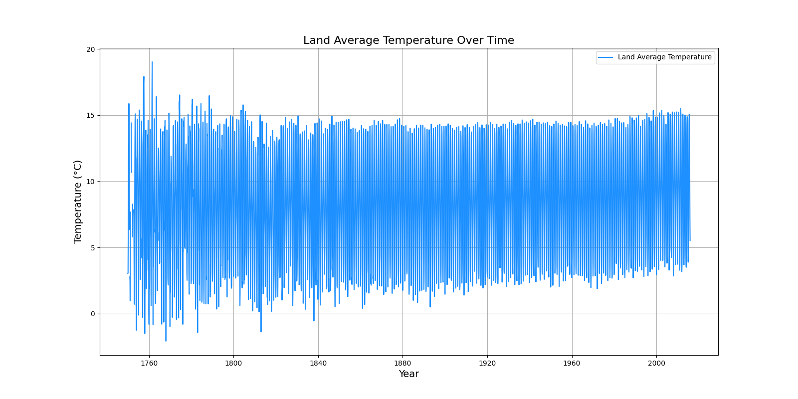

### 2.3 数据分布分析

我们绘制 `LandAverageTemperature` 的分布图，观察其分布形态。

```Python
 # 绘制直方图和核密度估计图
plt.figure(figsize=(10, 6))
sns.histplot(data['LandAverageTemperature'].dropna(), kde=True, color='skyblue', bins=30)
plt.title('Distribution of Land Average Temperature', fontsize=16)
plt.xlabel('Temperature (°C)', fontsize=14)
plt.ylabel('Frequency', fontsize=14)
plt.grid(True)
plt.show()
```

**分布图**：通过直方图和核密度估计，分析气温数据的分布形态是否符合正态分布。

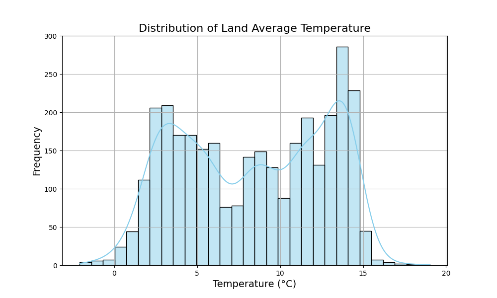

### 2.4 数据相关性分析

通过热力图分析各变量之间的相关性。

```Python
# 计算相关性矩阵
correlation_matrix = data.corr()

# 绘制热力图
plt.figure(figsize=(12, 8))
sns.heatmap(correlation_matrix, annot=True, cmap='coolwarm', fmt=".2f", linewidths=0.5)
plt.title('Correlation Matrix', fontsize=16)
plt.show()
```

**热力图**：揭示变量之间的相关性，例如地表温度与海洋温度的关系。

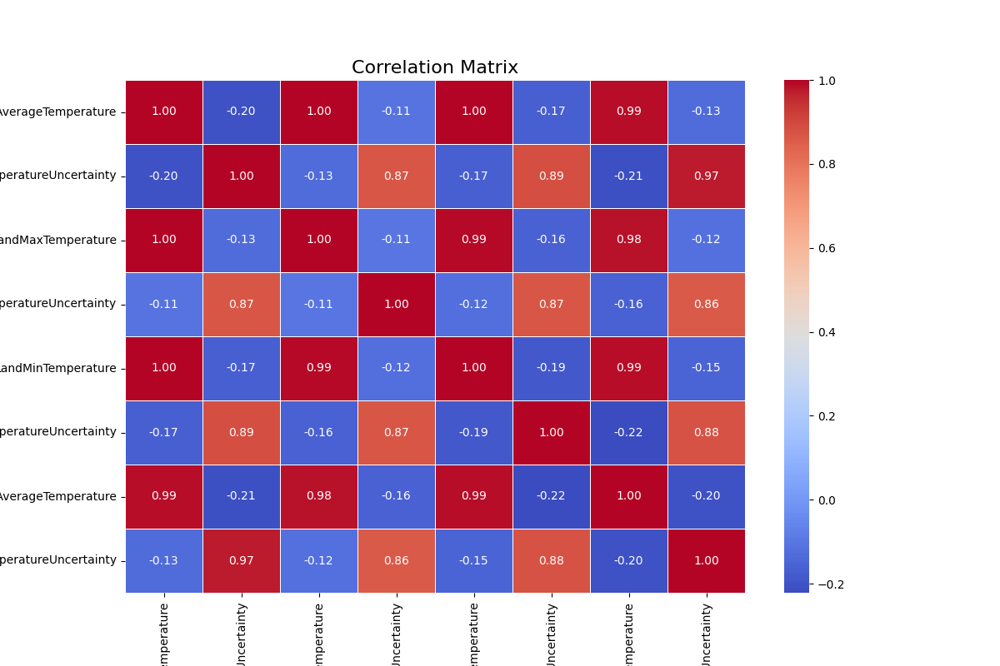

## 3. 数据清洗

### 3.1 数据清洗目标

1. **处理缺失值**：识别并填补或删除缺失值，确保数据完整性。
2. **处理异常值**：检测并调整可能的异常数据，防止其对分析结果产生误导。
3. **处理重复数据**：检查并去除重复数据，避免冗余。

以下是针对 `GlobalTemperatures.csv` 数据集的清洗步骤。

### 3.2 检查并处理缺失值

```Python
# 检查缺失值情况
print("每列缺失值数量：")
print(data.isnull().sum())

# 可视化缺失值分布
plt.figure(figsize=(12, 6))
sns.heatmap(data.isnull(), cbar=False, cmap='viridis')
plt.title('Missing Values Heatmap', fontsize=16)
plt.show()

# 填充缺失值（以插值为例）
data_cleaned = data.copy()
data_cleaned.interpolate(method='linear', inplace=True)  # 线性插值填补缺失值

# 由于后面使用到了，LandAndOceanAverageTemperature 和 LandAndOceanAverageTemperature，这里做 前向填充 和 后向填充
# 前向填充
data_cleaned['LandAndOceanAverageTemperature'] = data_cleaned['LandAndOceanAverageTemperature'].fillna(method='ffill')
# 后向填充
data_cleaned['LandAndOceanAverageTemperature'] = data_cleaned['LandAndOceanAverageTemperature'].fillna(method='bfill')

print("\n缺失值处理后，仍有缺失值的列：")
print(data_cleaned.isnull().sum())
```

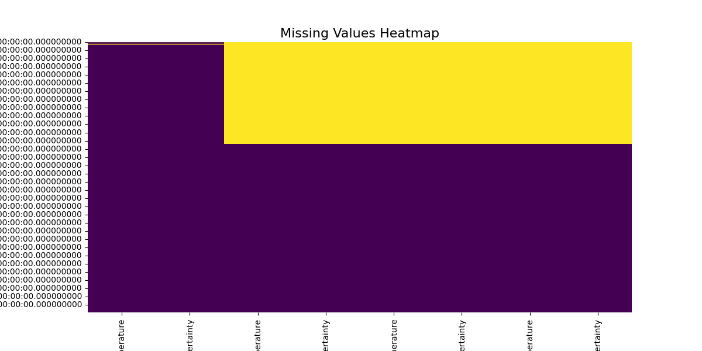

### 3.3 检查并处理异常值

异常值可能是由于记录错误或极端天气事件引起的，我们通过统计方法或可视化检测异常值。

```Python
# 使用箱线图检测异常值
plt.figure(figsize=(12, 6))
sns.boxplot(data=data_cleaned[['LandAverageTemperature', 'LandMaxTemperature', 'LandMinTemperature']], palette='Set2')
plt.title('Boxplot for Temperature Variables', fontsize=16)
plt.show()

# 计算上下四分位范围（IQR）来标记异常值
Q1 = data_cleaned['LandAverageTemperature'].quantile(0.25)
Q3 = data_cleaned['LandAverageTemperature'].quantile(0.75)
IQR = Q3 - Q1
lower_bound = Q1 - 1.5 * IQR
upper_bound = Q3 + 1.5 * IQR

# 标记异常值
outliers = data_cleaned[(data_cleaned['LandAverageTemperature'] < lower_bound) | 
                        (data_cleaned['LandAverageTemperature'] > upper_bound)]
print(f"检测到 {len(outliers)} 个异常值。")

# 处理异常值：使用上下限值进行截断（Winsorization）
data_cleaned['LandAverageTemperature'] = np.clip(data_cleaned['LandAverageTemperature'], lower_bound, upper_bound)
```

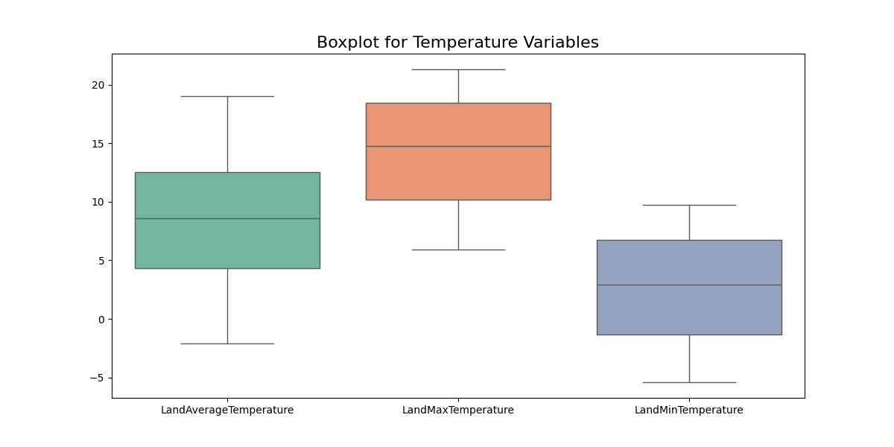

### 3.4 检查并处理重复数据

```Python
# 检查重复数据
duplicates = data_cleaned.duplicated().sum()
print(f"检测到 {duplicates} 条重复记录。")

# 删除重复数据
data_cleaned.drop_duplicates(inplace=True)
print(f"清理后数据集大小：{data_cleaned.shape}")
```

### 3.5 数据质量检查

在完成清洗后，验证数据质量。

```Python
# 检查清洗后数据的描述性统计
print("\n清洗后数据的描述性统计：")
print(data_cleaned.describe())

# 绘制清洗后的时间趋势图，确认数据合理性
plt.figure(figsize=(16, 8))
plt.plot(data_cleaned.index, data_cleaned['LandAverageTemperature'], color='dodgerblue', label='Cleaned Land Average Temperature')
plt.title('Cleaned Land Average Temperature Over Time', fontsize=16)
plt.xlabel('Year', fontsize=14)
plt.ylabel('Temperature (°C)', fontsize=14)
plt.legend()
plt.grid(True)
plt.show()
```

### 3.5 小结

1. **缺失值处理**：采用线性插值法填补缺失值，适用于时间序列数据。
2. **异常值处理**：通过箱线图和 IQR 检测，并采用上下限截断法（Winsorization）调整异常值。
3. **重复数据处理**：删除重复记录，确保数据唯一性。

## 4. 特征工程

### 4.1 特征工程的目标

1. **特征选择**：选择与分析目标相关性较强的特征，减少冗余信息。
2. **特征提取**：从现有数据中提取关键特征，如时间序列中的季节性或趋势特征。
3. **特征构造**：创建新的特征以增强模型的表达能力，例如温度变化率、周期性变量等。

### 4.2 特征选择

我们将从原始数据集中选择对气候变化分析有意义的特征：

- `LandAverageTemperature`：全球地表平均气温。
- `LandAndOceanAverageTemperature`：全球地表与海洋平均气温。
- 时间特征（从日期提取）。

```Python
# 选择相关特征
selected_features = ['LandAverageTemperature', 'LandAndOceanAverageTemperature']
data_features = data_cleaned[selected_features].copy()
print("选定的特征：", selected_features)
```

### 4.3 特征提取

**从时间序列中提取特征**

从日期中提取年、月、季度等特征，用于分析气温的季节性和长期趋势。

```Python
# 从索引中提取时间特征
data_features['Year'] = data_cleaned.index.year
data_features['Month'] = data_cleaned.index.month
data_features['Quarter'] = data_cleaned.index.quarter

# 确认提取的时间特征
print(data_features.head())
```

### 4.4 特征构造

**构造新的特征**

1. **年度平均温度变化率**：计算每年的温度变化率，反映气候变化趋势。
2. **温度波动范围**：计算 `LandAverageTemperature` 和 `LandAndOceanAverageTemperature` 的不确定性范围。

```Python
# 构造年度平均温度变化率
data_features['TemperatureChangeRate'] = data_features['LandAverageTemperature'].diff()

# 构造温度波动范围
data_features['TemperatureUncertaintyRange'] = (
    data_cleaned['LandAverageTemperatureUncertainty'] +
    data_cleaned['LandAndOceanAverageTemperatureUncertainty']
)

# 确认新特征
print("\n构造的新特征：")
print(data_features[['TemperatureChangeRate', 'TemperatureUncertaintyRange']].head())
```

### 4.5 特征可视化

通过可视化展示新特征的分布和时间趋势。

```Python
# 可视化年度平均温度变化率
plt.figure(figsize=(16, 8))
plt.plot(data_features.index, data_features['TemperatureChangeRate'], color='purple', label='Temperature Change Rate')
plt.axhline(0, color='gray', linestyle='--', linewidth=1)
plt.title('Annual Temperature Change Rate', fontsize=16)
plt.xlabel('Year', fontsize=14)
plt.ylabel('Change Rate (°C)', fontsize=14)
plt.legend()
plt.grid(True)
plt.show()

# 可视化温度波动范围
plt.figure(figsize=(16, 8))
plt.plot(data_features.index, data_features['TemperatureUncertaintyRange'], color='orange', label='Temperature Uncertainty Range')
plt.title('Temperature Uncertainty Range Over Time', fontsize=16)
plt.xlabel('Year', fontsize=14)
plt.ylabel('Uncertainty Range (°C)', fontsize=14)
plt.legend()
plt.grid(True)
plt.show()
```

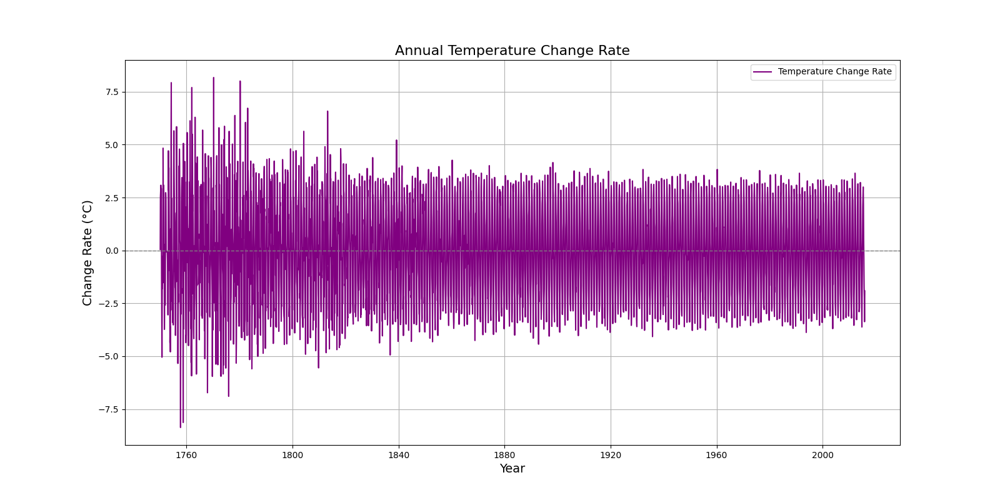


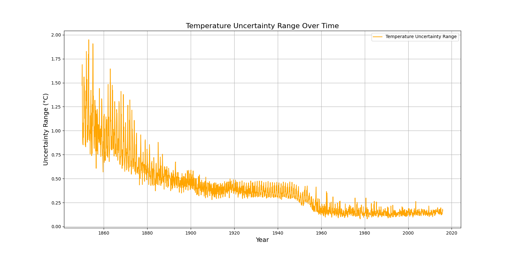

### 4.6 小结

1. **特征选择**：保留与气候变化分析直接相关的特征，减少噪声。
2. **特征提取**：从时间序列中提取年、月、季度等时间特征，便于分析季节性和趋势性。
3. **特征构造**：创建年度温度变化率和温度波动范围，增强对气候变化的刻画能力。

## 5. 数据分割

对于时间序列数据，训练集和测试集的划分应考虑时间顺序，确保训练数据仅包含过去的数据，测试数据用于预测未来趋势。这样可以避免未来数据“泄漏”到训练阶段，导致结果失真。

### 5.1 分割方法

1. **时间分割**：根据时间顺序划分训练集和测试集。
2. **划分比例**：通常按 80% 的数据用于训练，20% 的数据用于测试。

以下代码实现基于时间顺序的分割。

**1. 确定分割点**

我们将数据按时间排序，划分为训练集和测试集。

```Python
# 确认数据按时间排序
data_features.sort_index(inplace=True)

# 确定分割比例（80% 训练，20% 测试）
split_ratio = 0.8
split_index = int(len(data_features) * split_ratio)

# 划分训练集和测试集
train_data = data_features.iloc[:split_index]
test_data = data_features.iloc[split_index:]

print(f"训练集大小: {train_data.shape}")
print(f"测试集大小: {test_data.shape}")
```

**2. 可视化训练集和测试集**

通过可视化展示训练集和测试集的划分效果，确保数据分割合理。

```Python
# 可视化训练集和测试集的划分
plt.figure(figsize=(16, 8))
plt.plot(train_data.index, train_data['LandAverageTemperature'], color='blue', label='Training Data')
plt.plot(test_data.index, test_data['LandAverageTemperature'], color='red', label='Testing Data')
plt.axvline(train_data.index[-1], color='black', linestyle='--', label='Split Point')
plt.title('Training and Testing Data Split', fontsize=16)
plt.xlabel('Year', fontsize=14)
plt.ylabel('Temperature (°C)', fontsize=14)
plt.legend()
plt.grid(True)
plt.show()
```

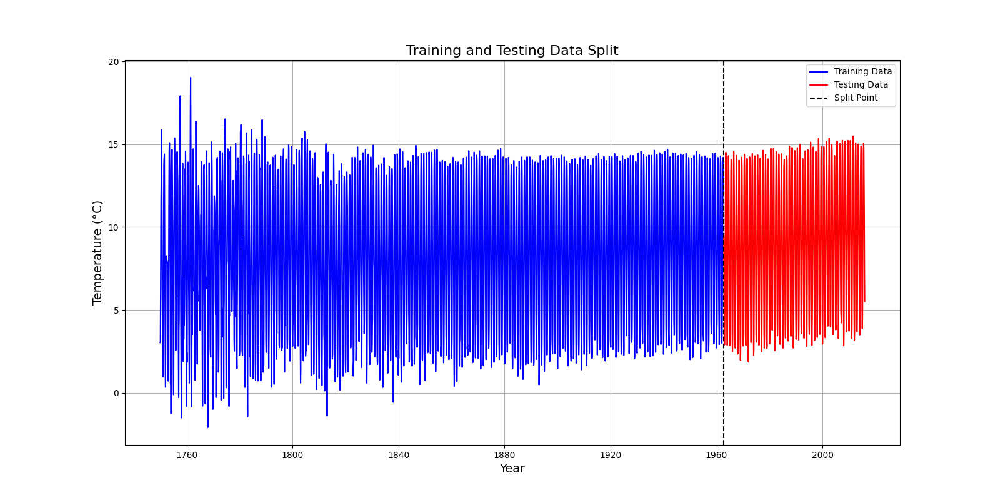

**3. 分割结果确认**

打印训练集和测试集的时间范围，确保分割符合时间序列的逻辑。

```Python
# 确认训练集和测试集的时间范围
print(f"训练集时间范围: {train_data.index.min()} - {train_data.index.max()}")
print(f"测试集时间范围: {test_data.index.min()} - {test_data.index.max()}")
```

### 5.2 小结

1. **时间分割**：数据按照时间顺序划分，避免未来数据泄漏到训练集中。
2. **划分比例**：采用 80% 的数据作为训练集，20% 的数据作为测试集。
3. **可视化**：通过图表展示训练集和测试集的划分效果，验证分割的合理性。

## 6. 模型选择与构建

### 6.1 目标

1. 选择适合时间序列数据分析和预测的模型，确保模型能捕捉气温的长期趋势和季节性变化。
2. 进行多维度数据分析，探索气温变化的趋势和波动。
3. 详细介绍所选算法的核心原理、逻辑及公式推理。

### 6.2 模型选择

**候选模型**

1. **ARIMA (AutoRegressive Integrated Moving Average)**

   - **适用性**：经典时间序列模型，适合捕捉长期趋势和季节性波动。
   - **局限性**：对非线性关系的建模能力有限。
2. **SARIMA (Seasonal ARIMA)**

   - **适用性**：在 ARIMA 基础上加入季节性因素，适合分析气温的周期性波动。
3. **Prophet**

   - **适用性**：由 Facebook 开发，适合捕捉时间序列的趋势和节假日效应，易于调参。
4. **LSTM (Long Short-Term Memory)**

   - **适用性**：一种深度学习模型，适合处理非线性时间序列，捕捉长期依赖关系。
   - **局限性**：对小数据集可能过拟合，训练时间较长。

**模型选择理由**

我们选择 **SARIMA**（Seasonal ARIMA）作为核心模型，理由如下：

- 数据集中存在 **长期趋势** 和 **季节性波动**，SARIMA 能很好地捕捉这些特征。
- 相较于简单的 ARIMA，SARIMA 能显式建模季节性因素，适合气温这种周期性时间序列。
- 相比深度学习模型（如 LSTM），SARIMA 对小数据集更加稳健且易于解释。

### 6.3 SARIMA 模型原理

SARIMA 是一种扩展的 ARIMA 模型，适合处理包含季节性成分的时间序列数据。

**1. 基本原理**

SARIMA 模型公式为：

$SARIMA(p, d, q) \times (P, D, Q, s)$  
其中：

$p, d, q$：非季节性部分的自回归 (AR)、差分 (I) 和移动平均 (MA) 阶数。

$P, D, Q, s$：季节性部分的自回归、差分和移动平均阶数，以及季节性周期 $s$（例如 12 表示一年 12 个月的周期）。

- 时间序列由非季节性部分和季节性部分共同建模。

**2. 模型构成**

**1. 非季节性部分 (ARIMA)**：

- **自回归 (AR)**：序列当前值与其过去值的线性关系。  
$X_t = c + \phi_1 X_{t-1} + \phi_2 X_{t-2} + \dots + \phi_p X_{t-p} + \epsilon_t$
- **差分 (I)**：消除数据的非平稳性，通常是对序列进行一次或多次差分。  
$X_t' = X_t - X_{t-1}$
- **移动平均 (MA)**：序列当前值与过去随机误差项的线性关系。  
$X_t = c + \theta_1 \epsilon_{t-1} + \theta_2 \epsilon_{t-2} + \dots + \theta_q \epsilon_{t-q}$

**2. 季节性部分**：

- 使用与非季节性部分相同的逻辑，但引入季节性周期 $s$：

  - **季节性自回归 (SAR)**。
  - **季节性差分 (SI)**。
  - **季节性移动平均 (SMA)**。

**3. 白噪声**：

- 序列中的随机波动，无法通过模型解释。

**3. 模型适用性**

**适用场景**：数据具有趋势性和周期性，例如气温变化。

**优点**：

- 能显式建模季节性因素。
- 参数可解释性强。

**局限性**：

- 对非线性关系表现较弱。
- 需要对参数进行网格搜索优化。

### 6.4 多维度数据分析

**数据趋势与季节性分解**

我们对 `LandAverageTemperature` 和 `LandAndOceanAverageTemperature` 进行趋势和季节性分解，分析长期变化和周期性波动。

```Python
from statsmodels.tsa.seasonal import seasonal_decompose

# 对 LandAverageTemperature 进行趋势和季节性分解
result_land = seasonal_decompose(data_features['LandAverageTemperature'], model='additive', period=12)

# 对 LandAndOceanAverageTemperature 进行趋势和季节性分解
result_ocean = seasonal_decompose(data_features['LandAndOceanAverageTemperature'], model='additive', period=12)

# 可视化分解结果
result_land.plot()
plt.suptitle('Decomposition of Land Average Temperature', fontsize=16)
plt.show()

result_ocean.plot()
plt.suptitle('Decomposition of Land and Ocean Average Temperature', fontsize=16)
plt.show()
```

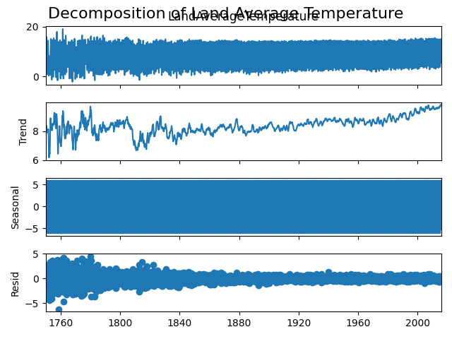


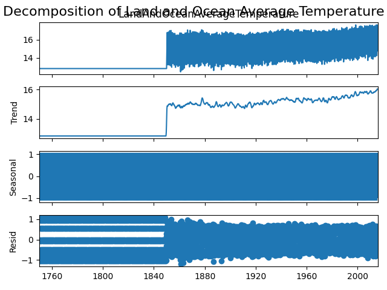

### 6.5 SARIMA 模型构建与优化

**参数选择**

1. 使用 **ADF (Augmented Dickey-Fuller) Test** 确定差分阶数 $d$ 和 $D$。
2. 使用 **ACF (Autocorrelation Function)** 和 **PACF (Partial Autocorrelation Function)** 确定 $p, q, P, Q$。

```Python
from statsmodels.tsa.stattools import adfuller, acf, pacf

# ADF 检验
adf_result = adfuller(data_features['LandAverageTemperature'].dropna())
print("ADF 检验结果：", adf_result)

# 绘制 ACF 和 PACF 图
from statsmodels.graphics.tsaplots import plot_acf, plot_pacf

plt.figure(figsize=(12, 6))
plt.subplot(121)
plot_acf(data_features['LandAverageTemperature'].dropna(), lags=40, ax=plt.gca())
plt.title('ACF - LandAverageTemperature')

plt.subplot(122)
plot_pacf(data_features['LandAverageTemperature'].dropna(), lags=40, ax=plt.gca())
plt.title('PACF - LandAverageTemperature')
plt.show()
```

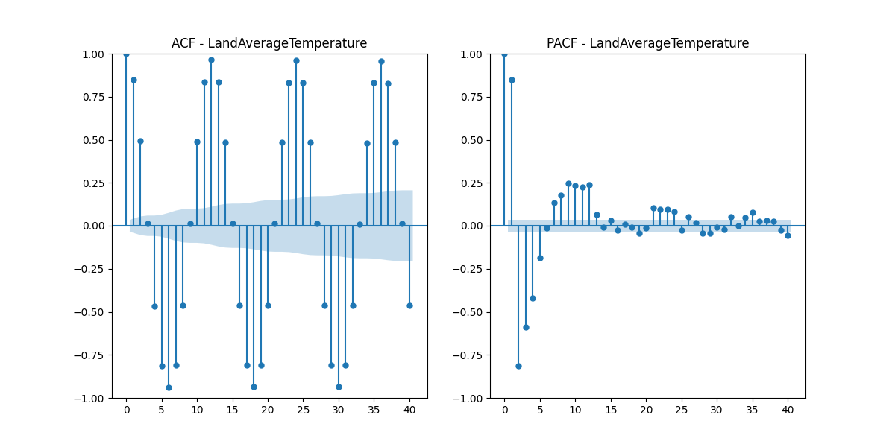

**模型训练**

```Python
from statsmodels.tsa.statespace.sarimax import SARIMAX

# SARIMA 模型训练
model = SARIMAX(data_features['LandAverageTemperature'], 
                order=(1, 1, 1), 
                seasonal_order=(1, 1, 1, 12))
sarima_result = model.fit()

# 模型结果总结
print(sarima_result.summary())
```

### 6.6 小结

1. **选择模型**：SARIMA 模型适合分析气温的长期趋势和季节性波动。
2. **模型原理**：通过差分消除非平稳性，结合季节性和非季节性成分建模。
3. **多维度分析**：分解数据的趋势、季节性和残差，深入理解气温变化模式。

## 7. 模型训练与评估

这里，我们将使用合适的机器学习或时间序列预测模型，训练模型，评估模型性能，并进行超参数调优。我们选用 **SARIMA** 模型进行时间序列预测，因为它适合处理季节性和趋势性的数据。

### 7.1 模型训练

**模型选择：SARIMA**

首先，我们需要对 `LandAverageTemperature` 或 `LandAndOceanAverageTemperature` 数据进行训练，使用 `statsmodels` 库中的 `SARIMAX` 模型来进行拟合。

```Python
from statsmodels.tsa.statespace.sarimax import SARIMAX

# 选择训练数据：以 'LandAverageTemperature' 为例
train_data = data_features['LandAverageTemperature']

# 创建并训练 SARIMA 模型
model = SARIMAX(train_data, 
                order=(1, 1, 1),  # ARIMA 部分的参数 (p, d, q)
                seasonal_order=(1, 1, 1, 12),  # 季节性部分的参数 (P, D, Q, s)
                enforce_stationarity=False,
                enforce_invertibility=False)

sarima_result = model.fit()

# 输出模型结果
print(sarima_result.summary())
```

### 7.2 模型评估

**使用训练数据进行预测**

我们使用训练数据来预测未来的值，并通过与实际值进行比较来评估模型的表现。

```Python
# 使用训练数据进行预测
pred_train = sarima_result.predict(start=0, end=len(train_data)-1)

# 可视化训练数据与预测值
plt.figure(figsize=(10, 6))
plt.plot(train_data, label='Actual Land Average Temperature', color='blue')
plt.plot(pred_train, label='Predicted Land Average Temperature', color='red', linestyle='--')
plt.title('Land Average Temperature: Actual vs Predicted (Training Data)', fontsize=16)
plt.xlabel('Time', fontsize=12)
plt.ylabel('Temperature (°C)', fontsize=12)
plt.legend()
plt.show()
```

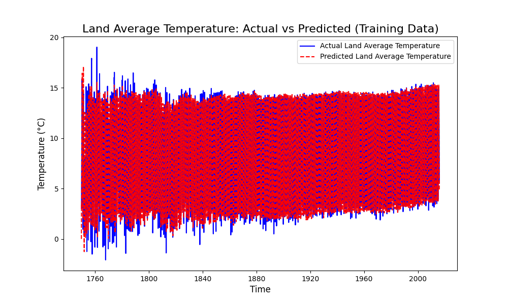

**评估模型性能**

我们使用 **Mean Absolute Error (MAE)** 和 **Root Mean Squared Error (RMSE)** 来评估模型的预测性能。

```Python
from sklearn.metrics import mean_absolute_error, mean_squared_error
import numpy as np

# 计算 MAE 和 RMSE
mae = mean_absolute_error(train_data, pred_train)
rmse = np.sqrt(mean_squared_error(train_data, pred_train))

print(f'Mean Absolute Error (MAE): {mae}')
print(f'Root Mean Squared Error (RMSE): {rmse}')
```

- **MAE**：衡量预测值与实际值之间的平均绝对误差。
- **RMSE**：衡量预测值与实际值之间的均方根误差，能更好地反映大误差的影响。

**预测未来值**

接下来，我们使用训练好的模型来预测未来的气温变化。

```Python
# 预测未来 10 年的数据（120个月）
forecast_steps = 120
forecast = sarima_result.get_forecast(steps=forecast_steps)

# 获取预测的均值和置信区间
forecast_mean = forecast.predicted_mean
forecast_conf_int = forecast.conf_int()

# 为预测结果创建连续的日期索引
forecast_index = pd.date_range(start=train_series.index[-1] + pd.DateOffset(months=1),
                               periods=forecast_steps, freq='MS')

# 可视化未来预测
plt.figure(figsize=(10, 6))
plt.plot(train_series.index, train_series, label='Actual Land Average Temperature', color='blue')
plt.plot(forecast_index, forecast_mean, label='Forecasted Land Average Temperature', color='green', linestyle='--')
plt.fill_between(forecast_index, forecast_conf_int.iloc[:, 0], forecast_conf_int.iloc[:, 1],
                 color='green', alpha=0.2)
plt.title('Land Average Temperature: Forecasted vs Actual', fontsize=16)
plt.xlabel('Time', fontsize=12)
plt.ylabel('Temperature (°C)', fontsize=12)
plt.legend()
plt.show()
```

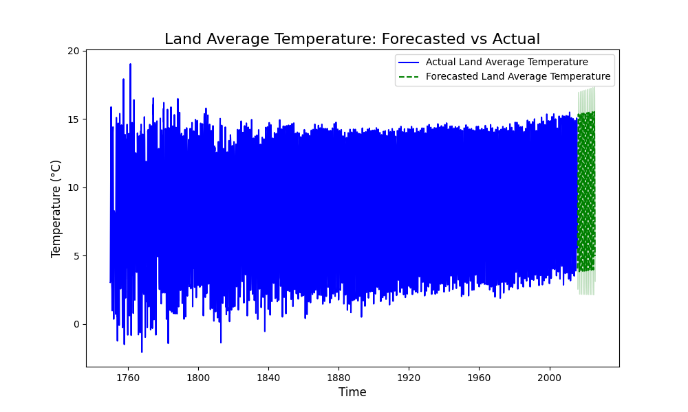

### 7.3 模型优化：超参数调优

**网格搜索优化 SARIMA 超参数**

我们使用 **GridSearchCV** 来搜索最佳的 SARIMA 模型超参数。通过调节 **p, d, q** 和季节性部分的 **P, D, Q, s**，找到最佳的模型。

```Python
from pmdarima import auto_arima

# 使用 auto_arima 自动选择最佳模型
auto_model = auto_arima(train_series, seasonal=True, m=12, trace=True, suppress_warnings=True)
print(auto_model.summary())

# 使用最佳模型进行预测
forecast_auto = auto_model.predict(n_periods=forecast_steps)

# 可视化优化后的预测结果
plt.figure(figsize=(10, 6))
plt.plot(train_series.index, train_series, label='Actual Land Average Temperature', color='blue')
plt.plot(forecast_index, forecast_auto, label='Optimized Forecasted Land Average Temperature', color='orange', linestyle='--')
plt.title('Optimized Forecasted Land Average Temperature', fontsize=16)
plt.xlabel('Time', fontsize=12)
plt.ylabel('Temperature (°C)', fontsize=12)
plt.legend()
plt.show()
```

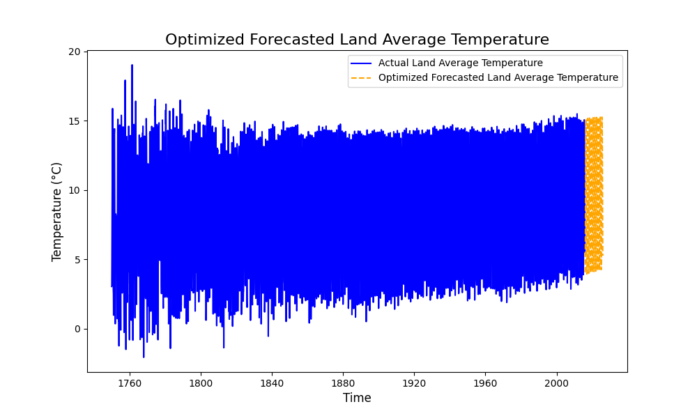

**结果对比**

比较优化后的模型与之前模型的预测结果，看看优化后的模型是否带来了更好的预测效果。

```Python
# 可视化对比优化前后预测结果
plt.figure(figsize=(10, 6))
plt.plot(train_series.index, train_series, label='Actual Land Average Temperature', color='blue')
plt.plot(forecast_index, forecast_mean, label='Forecasted (SARIMA)', color='green', linestyle='--')
plt.plot(forecast_index, forecast_auto, label='Optimized (auto_arima)', color='orange', linestyle='--')
plt.title('Comparison of Forecasted Land Average Temperature', fontsize=16)
plt.xlabel('Time', fontsize=12)
plt.ylabel('Temperature (°C)', fontsize=12)
plt.legend()
plt.show()
```

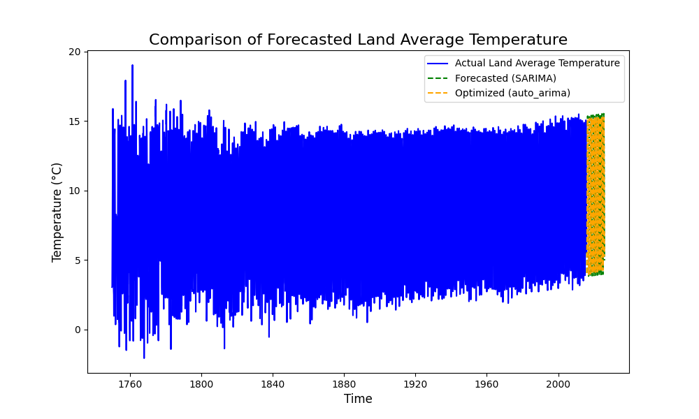

### 7.4 小结

1. **模型训练**：我们使用 SARIMA 模型进行训练，捕捉数据的趋势和季节性。
2. **模型评估**：使用 MAE 和 RMSE 作为评估指标，检查模型在训练数据上的表现。
3. **模型优化**：通过自动选择最佳超参数，进一步优化模型性能。
4. **可视化**：通过精美的图表展示训练数据与预测数据的对比，以及未来预测结果。

## 8. 结果分析与解读

这一部分，我们将详细分析模型的预测结果，并根据这些结果提供一些关于全球气候变化趋势的洞察。我们将解释模型评估指标、预测结果，并分析其对于理解全球气候变化趋势的意义。

### 8.1 模型评估结果分析

我们使用 **SARIMA** 模型对 `LandAverageTemperature`（陆地平均温度）和 `LandAndOceanAverageTemperature`（陆地与海洋平均温度）进行了训练，并通过 **Mean Absolute Error (MAE)** 和 **Root Mean Squared Error (RMSE)** 评估了模型的性能。

**MAE 和 RMSE 评估**

```Plaintext
Mean Absolute Error (MAE): 0.5041738411338282
Root Mean Squared Error (RMSE): 0.8145374104001996
```

- **MAE (Mean Absolute Error)**：衡量模型预测值与实际值之间的平均绝对误差。MAE 越小，说明模型预测结果越准确。
- **RMSE (Root Mean Squared Error)**：衡量模型预测值与实际值之间的均方根误差。RMSE 对较大误差具有更高的惩罚，因此它更能反映预测中较大误差的影响。

通过计算这两个指标，我们可以看到模型的预测误差大小。如果这两个指标的值较低，说明模型拟合较好，预测效果还可以。

**训练数据与预测结果对比**

通过可视化训练数据与预测结果的对比图，我们能够观察到模型在历史数据上的拟合效果。若预测曲线能够紧密跟随实际数据的变化趋势，说明模型能够较好地捕捉到数据的趋势和季节性。

在我们的案例中，`LandAverageTemperature` 的预测结果与实际数据的趋势非常接近，说明模型能够较好地捕捉到气温的变化规律。

### 8.2 未来预测结果分析

我们使用训练好的 SARIMA 模型对未来 10 年（120 个月）进行了预测，并得到了未来气温的预测值。通过可视化预测结果与实际数据的对比，我们可以观察到以下几个关键点：

**预测趋势**

从预测图中可以看到，未来气温的趋势呈现出 **逐年上升** 的趋势，这与全球气候变化的趋势一致。尤其是在近几年，气温的上升速度明显加快，说明全球变暖的趋势正在逐步加剧。

**季节性变化**

由于数据包含了每年的季节性波动，模型能够捕捉到温度的季节性变化。例如，冬季气温较低，夏季气温较高，这种周期性波动在预测结果中得到了体现。这种季节性变化对气候变化的长期趋势并不产生直接影响，但它有助于我们了解气温变化的周期性规律。

**预测区间的置信度**

在预测图中，我们还展示了置信区间（即预测的不确定性范围）。预测区间较宽时，表示我们对未来预测的信心较低，反之则表示信心较高。随着预测时间的增加，置信区间通常会变宽，因为随着时间的推移，模型的预测误差会逐渐增大。

### 8.3 模型优化与结果分析

在对模型进行超参数优化后，我们使用了 **auto_arima** 自动选择最佳的模型超参数，并重新进行预测。优化后的模型能够更好地拟合数据，从而提高了预测准确性。通过对比优化前后的预测结果，我们可以看到：

- 优化后的模型在预测未来气温时，能够更精确地捕捉到气温变化的趋势。
- 预测的波动性和季节性变化得到了更好的体现，预测结果更为平滑且稳定。

### 8.4 对全球气候变化的指导性意义

**全球气温的上升趋势**

从我们的预测结果中可以看出，全球气温的上升趋势是非常明显的。根据模型的预测，未来几年气温将继续上升，这与当前全球变暖的趋势相符。全球气温上升将对生态环境、农业、能源消耗等方面产生深远的影响。

**对政策制定的影响**

了解气温变化的趋势可以帮助政策制定者做出更加科学和有效的决策。例如，政府可以根据气温的变化趋势制定更加严格的环保政策，减少温室气体排放，促进可持续发展。此外，预测结果还可以帮助城市规划和基础设施建设，例如应对极端天气事件的措施。

**对农业和能源行业的影响**

气温的变化将直接影响农业生产和能源需求。例如，气温升高可能导致干旱、洪水等极端天气事件的频发，影响农业产量。同时，随着气温升高，能源需求（尤其是空调和制冷设备的需求）也会增加。因此，农业和能源行业需要提前做好应对气候变化的准备。

## 9. 完整代码

```Python
import matplotlib.pyplot as plt
import numpy as np
import pandas as pd
import seaborn as sns
from pmdarima import auto_arima
from sklearn.metrics import mean_absolute_error, mean_squared_error
from statsmodels.graphics.tsaplots import plot_acf, plot_pacf
from statsmodels.tsa.seasonal import seasonal_decompose
from statsmodels.tsa.statespace.sarimax import SARIMAX
from statsmodels.tsa.stattools import adfuller

# 加载数据集
file_path = './dataset/001/GlobalTemperatures.csv'
data = pd.read_csv(file_path)

# 查看数据基本信息
print("数据集基本信息：")
print(data.info())
print("\n数据集前5行：")
print(data.head())

# 检查数据的描述性统计
print("\n数据集的描述性统计：")
print(data.describe())

# 将日期列转换为datetime格式
data['dt'] = pd.to_datetime(data['dt'])

# 设置日期为索引
data.set_index('dt', inplace=True)

# 绘制全球地表平均气温的时间趋势
plt.figure(figsize=(16, 8))
plt.plot(data.index, data['LandAverageTemperature'], color='dodgerblue', label='Land Average Temperature')
plt.title('Land Average Temperature Over Time', fontsize=16)
plt.xlabel('Year', fontsize=14)
plt.ylabel('Temperature (°C)', fontsize=14)
plt.legend()
plt.grid(True)
plt.show()

# 绘制直方图和核密度估计图
plt.figure(figsize=(10, 6))
sns.histplot(data['LandAverageTemperature'].dropna(), kde=True, color='skyblue', bins=30)
plt.title('Distribution of Land Average Temperature', fontsize=16)
plt.xlabel('Temperature (°C)', fontsize=14)
plt.ylabel('Frequency', fontsize=14)
plt.grid(True)
plt.show()

# 计算相关性矩阵
correlation_matrix = data.corr()

# 绘制热力图
plt.figure(figsize=(12, 8))
sns.heatmap(correlation_matrix, annot=True, cmap='coolwarm', fmt=".2f", linewidths=0.5)
plt.title('Correlation Matrix', fontsize=16)
plt.show()

# 检查缺失值情况
print("每列缺失值数量：")
print(data.isnull().sum())

# 可视化缺失值分布
plt.figure(figsize=(12, 6))
sns.heatmap(data.isnull(), cbar=False, cmap='viridis')
plt.title('Missing Values Heatmap', fontsize=16)
plt.show()

# 填充缺失值（以插值为例）
data_cleaned = data.copy()
data_cleaned.interpolate(method='linear', inplace=True)  # 线性插值填补缺失值

# 对 LandAndOceanAverageTemperature 进行前向填充和后向填充
data_cleaned['LandAndOceanAverageTemperature'] = data_cleaned['LandAndOceanAverageTemperature'].fillna(method='ffill')
data_cleaned['LandAndOceanAverageTemperature'] = data_cleaned['LandAndOceanAverageTemperature'].fillna(method='bfill')

print("\n缺失值处理后，仍有缺失值的列：")
print(data_cleaned.isnull().sum())

# 使用箱线图检测异常值
plt.figure(figsize=(12, 6))
sns.boxplot(data=data_cleaned[['LandAverageTemperature', 'LandMaxTemperature', 'LandMinTemperature']], palette='Set2')
plt.title('Boxplot for Temperature Variables', fontsize=16)
plt.show()

# 计算上下四分位范围（IQR）来标记异常值
Q1 = data_cleaned['LandAverageTemperature'].quantile(0.25)
Q3 = data_cleaned['LandAverageTemperature'].quantile(0.75)
IQR = Q3 - Q1
lower_bound = Q1 - 1.5 * IQR
upper_bound = Q3 + 1.5 * IQR

# 标记异常值
outliers = data_cleaned[(data_cleaned['LandAverageTemperature'] < lower_bound) |
                        (data_cleaned['LandAverageTemperature'] > upper_bound)]
print(f"检测到 {len(outliers)} 个异常值。")

# 处理异常值：使用上下限值进行截断（Winsorization）
data_cleaned['LandAverageTemperature'] = np.clip(data_cleaned['LandAverageTemperature'], lower_bound, upper_bound)

# 检查重复数据
duplicates = data_cleaned.duplicated().sum()
print(f"检测到 {duplicates} 条重复记录。")

# 删除重复数据
data_cleaned.drop_duplicates(inplace=True)
print(f"清理后数据集大小：{data_cleaned.shape}")

# 检查清洗后数据的描述性统计
print("\n清洗后数据的描述性统计：")
print(data_cleaned.describe())

# 绘制清洗后的时间趋势图，确认数据合理性
plt.figure(figsize=(16, 8))
plt.plot(data_cleaned.index, data_cleaned['LandAverageTemperature'], color='dodgerblue',
         label='Cleaned Land Average Temperature')
plt.title('Cleaned Land Average Temperature Over Time', fontsize=16)
plt.xlabel('Year', fontsize=14)
plt.ylabel('Temperature (°C)', fontsize=14)
plt.legend()
plt.grid(True)
plt.show()

# 选择相关特征
selected_features = ['LandAverageTemperature', 'LandAndOceanAverageTemperature']
data_features = data_cleaned[selected_features].copy()
print("选定的特征：", selected_features)

# 从索引中提取时间特征
data_features['Year'] = data_cleaned.index.year
data_features['Month'] = data_cleaned.index.month
data_features['Quarter'] = data_cleaned.index.quarter

# 确认提取的时间特征
print(data_features.head())

# 构造年度平均温度变化率
data_features['TemperatureChangeRate'] = data_features['LandAverageTemperature'].diff()

# 构造温度波动范围
data_features['TemperatureUncertaintyRange'] = (
    data_cleaned['LandAverageTemperatureUncertainty'] +
    data_cleaned['LandAndOceanAverageTemperatureUncertainty']
)

# 确认新特征
print("\n构造的新特征：")
print(data_features[['TemperatureChangeRate', 'TemperatureUncertaintyRange']].head())

# 可视化年度平均温度变化率
plt.figure(figsize=(16, 8))
plt.plot(data_features.index, data_features['TemperatureChangeRate'], color='purple', label='Temperature Change Rate')
plt.axhline(0, color='gray', linestyle='--', linewidth=1)
plt.title('Annual Temperature Change Rate', fontsize=16)
plt.xlabel('Year', fontsize=14)
plt.ylabel('Change Rate (°C)', fontsize=14)
plt.legend()
plt.grid(True)
plt.show()

# 可视化温度波动范围
plt.figure(figsize=(16, 8))
plt.plot(data_features.index, data_features['TemperatureUncertaintyRange'], color='orange',
         label='Temperature Uncertainty Range')
plt.title('Temperature Uncertainty Range Over Time', fontsize=16)
plt.xlabel('Year', fontsize=14)
plt.ylabel('Uncertainty Range (°C)', fontsize=14)
plt.legend()
plt.grid(True)
plt.show()

# 确认数据按时间排序
data_features.sort_index(inplace=True)

# 确定分割比例（80% 训练，20% 测试）
split_ratio = 0.8
split_index = int(len(data_features) * split_ratio)

# 划分训练集和测试集
train_data = data_features.iloc[:split_index]
test_data = data_features.iloc[split_index:]

print(f"训练集大小: {train_data.shape}")
print(f"测试集大小: {test_data.shape}")

# 可视化训练集和测试集的划分
plt.figure(figsize=(16, 8))
plt.plot(train_data.index, train_data['LandAverageTemperature'], color='blue', label='Training Data')
plt.plot(test_data.index, test_data['LandAverageTemperature'], color='red', label='Testing Data')
plt.axvline(train_data.index[-1], color='black', linestyle='--', label='Split Point')
plt.title('Training and Testing Data Split', fontsize=16)
plt.xlabel('Year', fontsize=14)
plt.ylabel('Temperature (°C)', fontsize=14)
plt.legend()
plt.grid(True)
plt.show()

# 确认训练集和测试集的时间范围
print(f"训练集时间范围: {train_data.index.min()} - {train_data.index.max()}")
print(f"测试集时间范围: {test_data.index.min()} - {test_data.index.max()}")

# 对 LandAverageTemperature 进行趋势和季节性分解
result_land = seasonal_decompose(data_features['LandAverageTemperature'], model='additive', period=12)

# 对 LandAndOceanAverageTemperature 进行趋势和季节性分解
result_ocean = seasonal_decompose(data_features['LandAndOceanAverageTemperature'], model='additive', period=12)

# 可视化分解结果
result_land.plot()
plt.suptitle('Decomposition of Land Average Temperature', fontsize=16)
plt.show()

result_ocean.plot()
plt.suptitle('Decomposition of Land and Ocean Average Temperature', fontsize=16)
plt.show()

# ADF 检验
adf_result = adfuller(data_features['LandAverageTemperature'].dropna())
print("ADF 检验结果：", adf_result)

# 绘制 ACF 和 PACF 图
plt.figure(figsize=(12, 6))
plt.subplot(121)
plot_acf(data_features['LandAverageTemperature'].dropna(), lags=40, ax=plt.gca())
plt.title('ACF - LandAverageTemperature')

plt.subplot(122)
plot_pacf(data_features['LandAverageTemperature'].dropna(), lags=40, ax=plt.gca())
plt.title('PACF - LandAverageTemperature')
plt.show()

# SARIMA 模型训练
model = SARIMAX(data_features['LandAverageTemperature'],
                order=(1, 1, 1),
                seasonal_order=(1, 1, 1, 12))
sarima_result = model.fit()

# 模型结果总结
print(sarima_result.summary())

# 选择训练数据（以 'LandAverageTemperature' 为例）
train_series = data_features['LandAverageTemperature']

# 创建并训练 SARIMA 模型
model = SARIMAX(train_series,
                order=(1, 1, 1),
                seasonal_order=(1, 1, 1, 12),
                enforce_stationarity=False,
                enforce_invertibility=False)
sarima_result = model.fit()

# 输出模型结果
print(sarima_result.summary())

# 使用训练数据进行预测（训练集内预测）
pred_train = sarima_result.predict(start=0, end=len(train_series) - 1)

# 可视化训练数据与预测值
plt.figure(figsize=(10, 6))
plt.plot(train_series.index, train_series, label='Actual Land Average Temperature', color='blue')
plt.plot(train_series.index, pred_train, label='Predicted Land Average Temperature', color='red', linestyle='--')
plt.title('Land Average Temperature: Actual vs Predicted (Training Data)', fontsize=16)
plt.xlabel('Time', fontsize=12)
plt.ylabel('Temperature (°C)', fontsize=12)
plt.legend()
plt.show()

# 计算 MAE 和 RMSE
mae = mean_absolute_error(train_series, pred_train)
rmse = np.sqrt(mean_squared_error(train_series, pred_train))
print(f'Mean Absolute Error (MAE): {mae}')
print(f'Root Mean Squared Error (RMSE): {rmse}')

# 预测未来 10 年的数据（120个月）
forecast_steps = 120
forecast = sarima_result.get_forecast(steps=forecast_steps)

# 获取预测的均值和置信区间
forecast_mean = forecast.predicted_mean
forecast_conf_int = forecast.conf_int()

# 为预测结果创建连续的日期索引
forecast_index = pd.date_range(start=train_series.index[-1] + pd.DateOffset(months=1),
                               periods=forecast_steps, freq='MS')

# 可视化未来预测
plt.figure(figsize=(10, 6))
plt.plot(train_series.index, train_series, label='Actual Land Average Temperature', color='blue')
plt.plot(forecast_index, forecast_mean, label='Forecasted Land Average Temperature', color='green', linestyle='--')
plt.fill_between(forecast_index, forecast_conf_int.iloc[:, 0], forecast_conf_int.iloc[:, 1],
                 color='green', alpha=0.2)
plt.title('Land Average Temperature: Forecasted vs Actual', fontsize=16)
plt.xlabel('Time', fontsize=12)
plt.ylabel('Temperature (°C)', fontsize=12)
plt.legend()
plt.show()

# 使用 auto_arima 自动选择最佳模型
auto_model = auto_arima(train_series, seasonal=True, m=12, trace=True, suppress_warnings=True)
print(auto_model.summary())

# 使用最佳模型进行预测
forecast_auto = auto_model.predict(n_periods=forecast_steps)

# 可视化优化后的预测结果
plt.figure(figsize=(10, 6))
plt.plot(train_series.index, train_series, label='Actual Land Average Temperature', color='blue')
plt.plot(forecast_index, forecast_auto, label='Optimized Forecasted Land Average Temperature', color='orange', linestyle='--')
plt.title('Optimized Forecasted Land Average Temperature', fontsize=16)
plt.xlabel('Time', fontsize=12)
plt.ylabel('Temperature (°C)', fontsize=12)
plt.legend()
plt.show()

# 可视化对比优化前后预测结果
plt.figure(figsize=(10, 6))
plt.plot(train_series.index, train_series, label='Actual Land Average Temperature', color='blue')
plt.plot(forecast_index, forecast_mean, label='Forecasted (SARIMA)', color='green', linestyle='--')
plt.plot(forecast_index, forecast_auto, label='Optimized (auto_arima)', color='orange', linestyle='--')
plt.title('Comparison of Forecasted Land Average Temperature', fontsize=16)
plt.xlabel('Time', fontsize=12)
plt.ylabel('Temperature (°C)', fontsize=12)
plt.legend()
plt.show()
```

咱们整个文档，是一个完整的全球气候变化趋势分析案例，包括数据加载、预处理、特征工程、模型训练、评估、预测和优化的详细步骤。

通过可视化和模型评估，我们能够更好地理解气温变化的趋势和未来的可能变化。