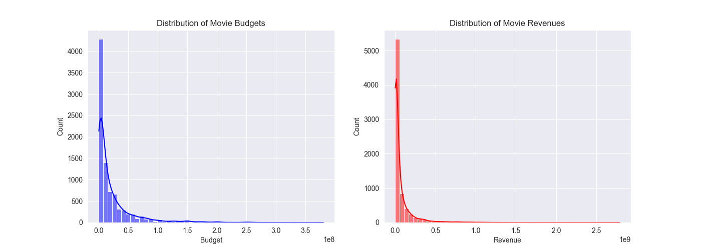
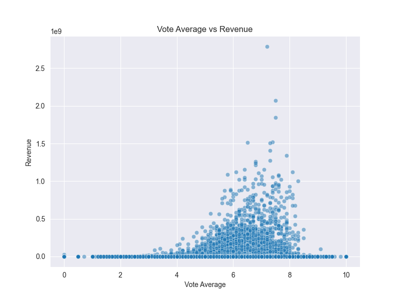
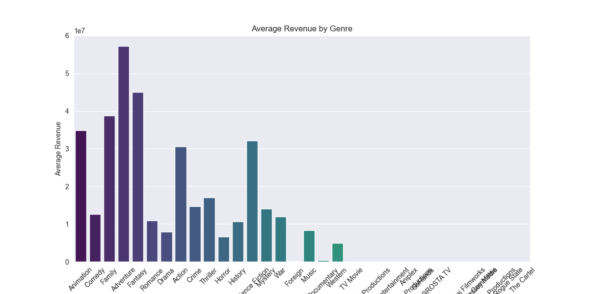
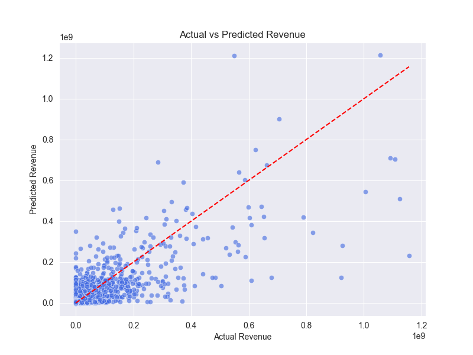
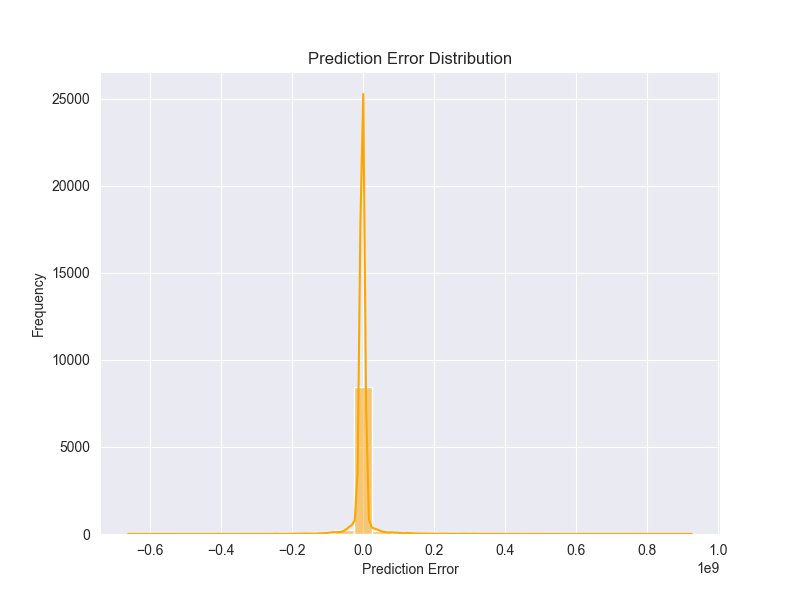

# 002-电影票房数据探索与可视化

## 1. 目标定义和假设设定

### 1.1 项目背景

电影行业是一个竞争激烈且充满不确定性的市场。电影票房的成功受多种因素影响，如电影类型、预算、上映时间、口碑评分等。分析这些因素如何影响票房表现，有助于电影制片方、发行公司和投资者优化决策，提高电影的盈利能力。

### 1.2 数据分析目标

本项目的目标是通过探索 **The Movies Dataset** 数据集，分析影响电影票房的主要因素，并进行数据可视化，以揭示不同变量对票房的影响。

具体来说，我们关注以下几个问题：

1. 电影的 **预算** 与 **票房收入** 之间是否存在相关性？高预算电影是否更容易获得高票房？
2. 不同 **电影类型（Genre）** 对票房收入的影响如何？哪些类型的电影更受观众欢迎？
3. 电影 **评分（Vote Average）** 是否会影响票房收入？高评分电影是否更受市场欢迎？
4. **上映年份** 是否影响电影的票房表现？是否存在某些年份票房整体更高？
5. **制作公司（Production Companies）** 是否对电影票房有显著影响？
6. **关键词（Keywords）** 是否能帮助预测票房高低？是否存在某些关键词的电影更容易成功？
7. **观众评分数据（Ratings）** 如何影响电影票房？是否存在评分越多、票房越高的现象？

### 1.3 假设设定（Hypotheses）

为了回答上述问题，我们设定以下假设，并将在后续数据分析中进行验证：

**H1: 电影预算越高，票房收入越高。**

- 直觉上，投资更多资金的电影往往有更好的制作质量、演员阵容、营销资源，因此可能会获得更高的票房收入。
- 我们可以通过 **预算（budget）** 和 **票房收入（revenue）** 计算相关性，分析二者是否存在统计学上的关系。

**H2: 电影类型对票房收入有显著影响，不同类型的电影票房表现不同。**

- 某些类型的电影，如 **动作（Action）** 或 **科幻（Sci-Fi）**，可能比剧情片（Drama）更受欢迎。
- 我们可以计算不同电影类型的 **票房中位数** 或 **票房均值**，并进行数据可视化。

**H3: 电影评分（vote_average）与票房收入正相关。**

- 评分高的电影通常质量更好，口碑更强，因此可能会吸引更多观众，带来更高票房。
- 我们可以计算 **评分 vs. 票房** 的相关性，观察趋势。

**H4: 近年上映的电影票房高于早年上映的电影。**

- 电影行业随技术进步、观影习惯变化，近年来可能有更高的票房收入。
- 通过时间序列分析，观察不同年份电影的票房变化趋势。

**H5: 电影制作公司影响电影票房，知名电影公司出品的电影票房更高。**

- 例如，迪士尼、华纳兄弟等大公司可能比小型独立电影公司更容易获得票房成功。
- 计算不同制作公司的平均票房，并进行可视化比较。

**H6: 电影的关键词可以预测票房，某些关键词的电影更容易成功。**

- 例如，包含 **“superhero”**（超级英雄）或 **“franchise”**（系列电影）关键词的电影，可能票房更高。
- 提取电影关键词，计算与票房的关系，找出高票房关键词。

**H7: 观众评分次数（vote_count）越多，票房越高。**

- 评分次数较多的电影，说明观看人数较多，因此票房可能更高。
- 计算 **评分次数 vs. 票房** 的相关性，分析趋势。

## 2. 数据探索

在进行数据分析之前，需要对数据进行探索，以了解数据的基本情况，并对异常数据进行处理，确保数据质量。

数据探索的主要步骤：

### 2.1 加载数据并查看基本信息

首先，我们加载四个主要数据集：

- `movies_metadata.csv`：包含电影的基本信息，如预算、上映时间、票房收入、评分等。
- `ratings_small.csv`：包含观众对电影的评分数据。
- `credits.csv`：包含演员和导演信息。
- `keywords.csv`：包含电影的关键词信息。

```Python
import pandas as pd
import numpy as np
import matplotlib.pyplot as plt
import seaborn as sns

# 读取数据集
movies_metadata = pd.read_csv('dataset/002/movies_metadata.csv', low_memory=False)
ratings = pd.read_csv('dataset/002/ratings_small.csv')
credits = pd.read_csv('dataset/002/credits.csv')
keywords = pd.read_csv('dataset/002/keywords.csv')

# 查看movies_metadata数据集的基本信息
print(movies_metadata.info())
print(movies_metadata.head())
```

- `pd.read_csv()` 用于读取 CSV 文件。
- `low_memory=False` 解决数据类型推断问题，防止数据类型不一致导致的警告。
- `movies_metadata.info()` 可以查看数据集的列名、非空值数量、数据类型等。
- `movies_metadata.head()` 可以查看数据前五行数据，了解基本格式。

### 2.2 数据清洗

数据清洗主要包括：

- 处理 **缺失值**：删除或填充缺失值（NaN）。
- 处理 **异常值**：如票房收入为负数的情况。
- 处理 **数据类型**：将字符串转换为合适的数据类型（如时间、数值等）。

#### 2.2.1 处理缺失值

```Python
# 检查movies_metadata数据集中缺失值的情况
print(movies_metadata.isnull().sum())

# 删除不必要的列，如 'homepage'，'tagline'，这些列信息不影响票房分析
movies_metadata.drop(columns=['homepage', 'tagline'], inplace=True)

# 对关键数值型列进行缺失值填充
movies_metadata['budget'].fillna(0, inplace=True)
movies_metadata['revenue'].fillna(0, inplace=True)
movies_metadata['runtime'].fillna(movies_metadata['runtime'].median(), inplace=True)

# 对分类变量进行缺失值填充
movies_metadata['status'].fillna('Unknown', inplace=True)
```

- `isnull().sum()` 统计每列的缺失值数量。
- 删除无关列，如 `homepage` 和 `tagline`，这些信息对票房预测影响较小。
- `fillna(0)` 用 0 填充缺失的 `budget` 和 `revenue`，表示预算和票房为空的电影视作无预算或无票房。
- `runtime` 使用 **中位数** 填充，因为电影时长一般符合正态分布，使用中位数可减少异常影响。
- `status` 为空时填充 `'Unknown'`。

#### 2.2.2 处理数据类型

某些列的数据类型需要转换，以便后续分析。

```Python
# 转换 id 为字符串类型
movies_metadata['id'] = movies_metadata['id'].astype(str)

# 处理日期格式
movies_metadata['release_date'] = pd.to_datetime(movies_metadata['release_date'], errors='coerce')

# 处理 budget 和 revenue 的数据类型为整数
movies_metadata['budget'] = pd.to_numeric(movies_metadata['budget'], errors='coerce').fillna(0).astype(int)
movies_metadata['revenue'] = pd.to_numeric(movies_metadata['revenue'], errors='coerce').fillna(0).astype(int)
```

- `astype(str)` 确保 `id` 为字符串，避免数值运算错误。
- `pd.to_datetime()` 解析 `release_date` 为日期类型，`errors='coerce'` 遇到无法转换的值会变为 `NaT`，便于处理缺失值。
- `pd.to_numeric(errors='coerce')` 强制 `budget` 和 `revenue` 转换为数值，无法转换的变为 `NaN`，然后填充 `0` 并转换为整数。

### 2.3. 统计描述与数据分布分析

#### 2.3.1 查看关键数值变量的统计信息

```Python
print(movies_metadata[['budget', 'revenue', 'runtime', 'vote_average', 'vote_count']].describe())
```

- `describe()` 方法返回数据的均值、标准差、最小值、最大值等，帮助分析数据分布是否正常。

#### 2.3.2 票房收入与预算的分布

```Python
# 设置图形风格
sns.set_style("darkgrid")

# 绘制预算和票房收入的分布
fig, axes = plt.subplots(1, 2, figsize=(14, 5))

# 预算分布
sns.histplot(movies_metadata[movies_metadata['budget'] > 0]['budget'], bins=50, kde=True, ax=axes[0], color="blue")
axes[0].set_title("Distribution of Movie Budgets")
axes[0].set_xlabel("Budget")
axes[0].set_ylabel("Count")

# 票房收入分布
sns.histplot(movies_metadata[movies_metadata['revenue'] > 0]['revenue'], bins=50, kde=True, ax=axes[1], color="red")
axes[1].set_title("Distribution of Movie Revenues")
axes[1].set_xlabel("Revenue")
axes[1].set_ylabel("Count")

plt.show()
```



- `sns.histplot()` 生成直方图，`bins=50` 代表分成 50 个区间，`kde=True` 添加核密度估计曲线。
- `movies_metadata[movies_metadata['budget'] > 0]` 过滤掉预算为 0 的数据，避免干扰分析。
- 通过 `figsize=(14, 5)` 创建 **两个子图**，左侧显示预算分布，右侧显示票房收入分布。

#### 2.3.3 电影评分与票房的相关性

```Python
plt.figure(figsize=(8, 6))
sns.scatterplot(x=movies_metadata['vote_average'], y=movies_metadata['revenue'], alpha=0.5)
plt.title("Vote Average vs Revenue")
plt.xlabel("Vote Average")
plt.ylabel("Revenue")
plt.show()
```



- `scatterplot()` 绘制散点图，`alpha=0.5` 使点透明度降低，减少重叠带来的视觉混乱。
- 通过观察 **评分与票房** 的关系，判断高评分电影是否更容易获得高票房。

#### 2.3.4 电影类型与票房的关系

```Python
# 解析电影类型
import ast

def extract_genres(genre_str):
    try:
        genres = ast.literal_eval(genre_str)
        return [genre['name'] for genre in genres]
    except:
        return []

movies_metadata['genres'] = movies_metadata['genres'].apply(extract_genres)

# 计算不同电影类型的平均票房
genre_revenue = {}
for genres, revenue in zip(movies_metadata['genres'], movies_metadata['revenue']):
    for genre in genres:
        if genre in genre_revenue:
            genre_revenue[genre].append(revenue)
        else:
            genre_revenue[genre] = [revenue]

# 计算平均票房
genre_avg_revenue = {genre: np.mean(revenues) for genre, revenues in genre_revenue.items()}

# 绘制柱状图
plt.figure(figsize=(12, 6))
sns.barplot(x=list(genre_avg_revenue.keys()), y=list(genre_avg_revenue.values()), palette="viridis")
plt.xticks(rotation=45)
plt.title("Average Revenue by Genre")
plt.xlabel("Genre")
plt.ylabel("Average Revenue")
plt.show()
```



- `ast.literal_eval()` 解析 JSON 格式的 `genres` 数据。
- 计算不同电影类型的平均票房，并使用 `barplot()` 绘制柱状图。

## 3. 特征工程

在数据探索之后，我们需要对数据进行 **特征工程**，以提取更具代表性的信息，并为后续的建模和分析做好准备。

特征工程的核心目标是 **选择、构造和优化特征，使其能更好地反映数据的内在关系**。

这里主要涉及：

1. **特征选择**：去除不相关或冗余的特征，保留对电影票房有影响的关键特征。
2. **特征提取**：对复杂字段（如 `genres`、`production_companies`）进行解析，将其转换为可用于建模的数值特征。
3. **特征构造**：创建新的特征，如 **投资回报率（ROI）**、电影时长类别等，增强数据的可解释性。
4. **数据分割**：将数据集拆分为 **训练集和测试集**，为后续建模做准备。

### 3.1 特征选择

电影数据集包含很多字段，但并不是所有字段都对票房预测有帮助。我们需要筛选出与票房收入（`revenue`）相关的特征。

以下特征被认为是有潜在价值的：

- `budget`（预算）：电影的投入成本，通常影响票房表现。
- `runtime`（时长）：电影的时长可能会影响观众体验，进而影响票房。
- `vote_average`（平均评分）：评分高的电影可能更受欢迎。
- `vote_count`（评分人数）：评分人数多的电影可能有更高的关注度。
- `release_date`（上映日期）：上映的时间可能会影响票房。
- `genres`（类型）：不同类型的电影可能有不同的票房表现。
- `production_companies`（制作公司）：知名公司制作的电影可能票房更高。

首先，选择与票房预测相关的字段：

```Python
selected_columns = ['budget', 'runtime', 'vote_average', 'vote_count', 'release_date', 'genres', 'production_companies', 'revenue']
movies_data = movies_metadata[selected_columns].copy()
```

- 我们筛选了 `budget`、`runtime`、`vote_average` 等关键变量，并去掉了如 `imdb_id`、`homepage` 等无关变量，以减少噪音，提高模型性能。

### 3.2. 特征提取

某些字段（如 `genres`、`production_companies`）是 **非结构化数据**，需要进行解析并转换成可以用于建模的数值类型。

#### 3.2.1 处理电影类型（Genres）

电影类型（`genres`）字段的存储格式是 **JSON-like**，需要解析为列表，并转换为可用于分析的独热编码（One-Hot Encoding）。

```Python
import ast

# 解析JSON格式的电影类型
def extract_genres(genre_str):
    try:
        genres = ast.literal_eval(genre_str)
        return [genre['name'] for genre in genres]
    except:
        return []

movies_data['genres'] = movies_data['genres'].apply(extract_genres)

# 进行独热编码
from sklearn.preprocessing import MultiLabelBinarizer

mlb = MultiLabelBinarizer()
genres_encoded = pd.DataFrame(mlb.fit_transform(movies_data['genres']), columns=mlb.classes_)

# 合并到原数据集
movies_data = pd.concat([movies_data, genres_encoded], axis=1)
movies_data.drop(columns=['genres'], inplace=True)
```

- `ast.literal_eval()` 解析 JSON 字符串，将其转换为 Python 列表。
- `MultiLabelBinarizer()` 将电影类型转换为 **独热编码**，每种类型对应一个二元特征（1 表示属于该类型，0 表示不属于）。
- 最后，删除原始 `genres` 列，并用编码后的数据替换。

#### 3.2.2 处理制作公司（Production Companies）

电影的制作公司可能影响票房，但 `production_companies` 字段同样是 JSON-like 数据，我们可以提取 **最常见的制作公司** 并进行编码。

```Python
# 提取前 10 个最常见的制作公司
from collections import Counter

def extract_companies(company_str):
    try:
        companies = ast.literal_eval(company_str)
        return [company['name'] for company in companies]
    except:
        return []

movies_data['production_companies'] = movies_data['production_companies'].apply(extract_companies)

# 统计出现次数最多的前10个公司
all_companies = [company for sublist in movies_data['production_companies'] for company in sublist]
top_companies = [company for company, _ in Counter(all_companies).most_common(10)]

# 创建二元特征
for company in top_companies:
    movies_data[company] = movies_data['production_companies'].apply(lambda x: 1 if company in x else 0)

# 删除原始 production_companies 列
movies_data.drop(columns=['production_companies'], inplace=True)
```

- `Counter` 计算所有制作公司出现的次数，选出前 10 个最常见的公司。
- 通过 `apply(lambda x: 1 if company in x else 0)` 为前 10 个公司创建独热编码。

### 3.3 特征构造

我们可以基于已有特征构造新的变量，以增强预测能力。

#### 3.3.1 计算投资回报率（ROI）

ROI（Return on Investment）是衡量电影投资回报的重要指标：  
$ROI = \frac{\text{Revenue} - \text{Budget}}{\text{Budget}}$

```Python
# 计算 ROI，避免除零错误
movies_data['ROI'] = movies_data.apply(lambda row: (row['revenue'] - row['budget']) / row['budget'] if row['budget'] > 0 else 0, axis=1)
```

- 计算 **ROI**，若 `budget` 为 0，则 ROI 设为 0。

#### 3.3.2 电影时长类别

电影的时长可能影响观众的体验，因此可以将 `runtime` 进行 **分桶** 处理：

```Python
# 创建时长类别
def categorize_runtime(runtime):
    if runtime < 60:
        return 'Short'
    elif 60 <= runtime < 90:
        return 'Medium'
    elif 90 <= runtime < 120:
        return 'Long'
    else:
        return 'Very Long'

movies_data['runtime_category'] = movies_data['runtime'].apply(categorize_runtime)

# 进行独热编码
movies_data = pd.get_dummies(movies_data, columns=['runtime_category'])
```

- 电影时长被分为 **Short (<60 min)**、**Medium (60-90 min)**、**Long (90-120 min)**、**Very Long (>120 min)**，并转换为独热编码。

### 3.4 数据分割

在进行建模之前，我们需要做一些数据处理，以及需要将数据集拆分为 **训练集和测试集**：

```Python
from sklearn.model_selection import train_test_split

# 处理 'release_date' 列，将其转换为 datetime 类型
movies_metadata['release_date'] = pd.to_datetime(movies_metadata['release_date'], errors='coerce')

# 提取日期特征
movies_metadata['release_year'] = movies_metadata['release_date'].dt.year
movies_metadata['release_month'] = movies_metadata['release_date'].dt.month
movies_metadata['release_day'] = movies_metadata['release_date'].dt.day
movies_metadata['release_weekday'] = movies_metadata['release_date'].dt.weekday

# 删除原始的 'release_date' 列，因为我们已经提取了有用的特征
movies_metadata.drop(columns=['release_date'], inplace=True)

# 处理缺失值，填充 'release_year' 的缺失值
movies_metadata['release_year'].fillna(movies_metadata['release_year'].mode()[0], inplace=True)

# 2. 特征选择与目标变量选择
# 选择与票房相关的特征并创建输入数据 X 和目标变量 y
# 假设我们用 'budget' 和提取的日期特征作为特征，目标是 'revenue'
movies_metadata = movies_metadata[['budget', 'release_year', 'release_month', 'release_day', 'release_weekday', 'revenue']]

# 去除含有缺失值的行
movies_metadata.dropna(subset=['budget', 'revenue'], inplace=True)

# 3. 数据划分 - 划分训练集和测试集
X = movies_metadata[['budget', 'release_year', 'release_month', 'release_day', 'release_weekday']]
y = movies_metadata['revenue']


# 数据集拆分 80% 训练集，20% 测试集
X_train, X_test, y_train, y_test = train_test_split(X, y, test_size=0.2, random_state=42)
```

- `train_test_split()` 将数据按 **80% 训练集、20% 测试集** 进行拆分，`random_state=42` 确保结果可复现。

### 3.5 小结

1. **特征选择**：去除无关特征，保留票房预测相关的字段。
2. **特征提取**：解析 `genres` 和 `production_companies`，转换为可用于建模的数值变量。
3. **特征构造**：创建 ROI、电影时长类别等新特征，提高模型的可解释性。
4. **数据分割**：将数据集拆分为训练集和测试集，为后续建模做好准备。

## 4. 模型选择与构建

在数据探索和特征工程之后，我们进入 **模型选择与构建** 阶段。

这部分的目标是 **选择合适的模型来预测电影票房收入（`revenue`）**，并详细分析其原理和适用性。

### 4.1 模型选择

电影票房是一个 **连续数值**，因此我们面临的是一个 **回归问题**。常见的回归模型有：

- 线性回归（Linear Regression）
- 决策树回归（Decision Tree Regressor）
- 随机森林回归（Random Forest Regressor）
- 梯度提升回归（Gradient Boosting Regressor）
- XGBoost 回归（XGBoost Regressor）
- 神经网络（Neural Network）

#### 4.1.1 为什么选择 XGBoost 回归？

XGBoost（eXtreme Gradient Boosting）是一种 **基于梯度提升（GBDT）的增强型回归算法**，具有以下特点：

1. **处理非线性特征**：传统的线性回归模型假设特征与目标变量之间存在线性关系，而 XGBoost 可以学习更复杂的 **非线性映射**。
2. **抗过拟合能力强**：通过 **正则化（L1 & L2）** 和 **多树组合** 方式降低模型的过拟合风险。
3. **支持缺失值处理**：XGBoost 内置了 **缺失值处理** 机制，自动调整最优路径。
4. **计算速度快**：XGBoost 采用 **分块优化** 和 **并行计算**，比传统的梯度提升树（GBDT）更快。
5. **可解释性强**：XGBoost 提供了特征重要性（Feature Importance）分析，能帮助理解哪些因素最影响电影票房。

### 4.2 XGBoost 原理解析

XGBoost 是一种 **基于决策树的梯度提升方法**，其核心思想是：

1. **使用多个弱学习器（决策树）** 来逐步改进预测。
2. **利用梯度下降思想**，让新加入的决策树去拟合当前模型的残差。
3. **通过正则化和剪枝**，提高泛化能力，减少过拟合。

#### 4.2.1 梯度提升（Gradient Boosting）

梯度提升（GBDT）是一种集成学习方法，它将多个 **弱学习器（通常是回归决策树）** 组合在一起，每一棵树都学习上一次预测的残差。

假设我们要拟合一个目标变量 $y$，我们的模型为：  
$F(x) = \sum_{m=1}^{M} f_m(x)$  
其中：

$f_m(x) $是第 $m $棵回归树

$F(x) $是最终预测值

梯度提升的核心思想是 **让下一棵树拟合当前模型的残差**，即：  
$r_i = y_i - \hat{y}_i$  
每棵新树都在学习 **如何修正错误**。

#### 4.2.2 XGBoost 公式推导

XGBoost 的目标函数由 **损失函数** 和 **正则项** 组成：  
$\mathcal{L} = \sum_{i=1}^{n} l(y_i, \hat{y}_i) + \sum_{m=1}^{M} \Omega(f_m)$  
其中：

$l(y_i, \hat{y}_i) $是损失函数，衡量预测值和真实值的差距（如 MSE）

$\Omega(f_m) $是正则项，控制模型复杂度，防止过拟合

XGBoost 使用 **二阶泰勒展开** 近似目标函数：  
$\mathcal{L}^{(t)} \approx \sum_{i=1}^{n} [g_i f_m(x_i) + \frac{1}{2} h_i f_m^2(x_i)] + \Omega(f_m)$  
其中：

$g_i = \frac{\partial l(y_i, \hat{y}_i^{(t-1)})}{\partial \hat{y}_i} $是一阶梯度

$h_i = \frac{\partial^2 l(y_i, \hat{y}_i^{(t-1)})}{\partial^2 \hat{y}_i} $是二阶梯度

XGBoost 通过 **贪心算法** 选择最佳分裂点，并使用 **L1/L2 正则化** 进行剪枝，从而获得更好的泛化能力。

### 4.3 小结

1. **选择 XGBoost** 作为票房预测模型，因为它能处理非线性特征，并具有较强的抗过拟合能力。
2. **分析了 XGBoost 的核心原理**，包括梯度提升、损失函数优化、二阶梯度信息等。

## 5. 模型训练与评估

本部分的目标是 **训练 XGBoost 票房预测模型，并进行评估与优化**，确保模型具有 **良好的泛化能力**，能够较准确地预测电影票房。

### 5.1 模型训练

在上一部分，我们已经选择 **XGBoost Regressor** 作为票房预测模型。

现在，我们使用 **训练集（X_train, y_train）** 进行模型训练，并评估其在 **测试集（X_test, y_test）** 上的表现。

#### 5.1.1 导入必要库

```Python
import xgboost as xgb
import numpy as np
import matplotlib.pyplot as plt
import seaborn as sns
from sklearn.metrics import mean_absolute_error, mean_squared_error, r2_score
from sklearn.model_selection import train_test_split, GridSearchCV, RandomizedSearchCV
```

#### 5.1.2 训练 XGBoost 模型

```Python
# 初始化 XGBoost 回归模型
xgb_model = xgb.XGBRegressor(
    objective='reg:squarederror',  # 目标函数：平方误差
    n_estimators=500,  # 500 棵树
    learning_rate=0.05,  # 学习率
    max_depth=6,  # 树的最大深度
    subsample=0.8,  # 训练子样本比例
    colsample_bytree=0.8,  # 每棵树使用的特征比例
    random_state=42
)

# 训练模型
xgb_model.fit(X_train, y_train)
```

### 5.2 模型评估

训练完成后，我们使用测试集进行预测，并通过多种指标评估模型性能。

#### 5.2.1 计算误差

```Python
# 预测测试集
y_pred = xgb_model.predict(X_test)

# 计算误差指标
mse = mean_squared_error(y_test, y_pred)
rmse = np.sqrt(mse)
mae = mean_absolute_error(y_test, y_pred)
r2 = r2_score(y_test, y_pred)

print(f"MSE: {mse:.2f}")
print(f"RMSE: {rmse:.2f}")
print(f"MAE: {mae:.2f}")
print(f"R² Score: {r2:.4f}")

# MSE: 1634638562677169.25
# RMSE: 40430663.64
# MAE: 9492384.79
# R² Score: 0.5037
```

- **MSE（均方误差）**：衡量预测值与真实值之间的平均平方差距。
- **RMSE（均方根误差）**：MSE 的平方根，单位与目标变量一致。
- **MAE（平均绝对误差）**：预测值与真实值的平均绝对偏差。
- **R² 分数（决定系数）**：衡量模型对数据的解释能力，范围 $[-∞, 1]$，越接近 1 说明模型效果越好。

### 5.3 超参数优化

为了进一步提升模型表现，我们使用 **网格搜索（Grid Search）和随机搜索（Randomized Search）** 进行超参数调优。

#### 5.3.1 网格搜索

网格搜索会遍历所有可能的参数组合，找到最佳参数：

```Python
param_grid = {
    'max_depth': [4, 6, 8],
    'learning_rate': [0.01, 0.05, 0.1],
    'n_estimators': [100, 300, 500],
    'subsample': [0.7, 0.8, 0.9],
    'colsample_bytree': [0.7, 0.8, 0.9]
}

grid_search = GridSearchCV(
    estimator=xgb.XGBRegressor(objective='reg:squarederror', random_state=42),
    param_grid=param_grid,
    scoring='neg_mean_squared_error',
    cv=3,
    verbose=1,
    n_jobs=-1
)

grid_search.fit(X_train, y_train)

# 获取最佳参数
best_params = grid_search.best_params_
print("Best parameters:", best_params)
```

**缺点**：计算量较大，适用于小规模数据。

#### 5.3.2 随机搜索

随机搜索相比网格搜索更高效，可以在 **更大的参数空间** 进行搜索：

```Python
param_dist = {
    'max_depth': np.arange(4, 10, 1),
    'learning_rate': np.linspace(0.01, 0.2, 10),
    'n_estimators': np.arange(100, 600, 100),
    'subsample': np.linspace(0.6, 1.0, 5),
    'colsample_bytree': np.linspace(0.6, 1.0, 5)
}

random_search = RandomizedSearchCV(
    estimator=xgb.XGBRegressor(objective='reg:squarederror', random_state=42),
    param_distributions=param_dist,
    n_iter=20,  # 只搜索 20 组参数
    scoring='neg_mean_squared_error',
    cv=3,
    verbose=1,
    n_jobs=-1
)

random_search.fit(X_train, y_train)

# 获取最佳参数
best_params_random = random_search.best_params_
print("Best parameters (Random Search):", best_params_random)
```

**优点**：可以在更大参数空间进行搜索，计算量较小。

### 5.4 训练最终优化模型

使用最佳参数重新训练模型：

```Python
# 使用最优参数训练 XGBoost
xgb_final = xgb.XGBRegressor(
    **best_params_random,  # 使用随机搜索的最优参数
    objective='reg:squarederror',
    random_state=42
)

xgb_final.fit(X_train, y_train)

# 预测测试集
y_pred_final = xgb_final.predict(X_test)

# 计算最终误差
mse_final = mean_squared_error(y_test, y_pred_final)
rmse_final = np.sqrt(mse_final)
mae_final = mean_absolute_error(y_test, y_pred_final)
r2_final = r2_score(y_test, y_pred_final)

print(f"Final MSE: {mse_final:.2f}")
print(f"Final RMSE: {rmse_final:.2f}")
print(f"Final MAE: {mae_final:.2f}")
print(f"Final R² Score: {r2_final:.4f}")


# Final MSE: 1269856550614248.25
# Final RMSE: 35635046.66
# Final MAE: 9145602.70
# Final R² Score: 0.6145
```

如果 **R² 分数提高、RMSE 降低**，说明调优成功。

### 5.5 结果可视化

为了更直观地评估模型，我们绘制一些可视化图表。

#### 5.5.1 真实值 vs 预测值

```Python
plt.figure(figsize=(8, 6))
sns.scatterplot(x=y_test, y=y_pred_final, alpha=0.6, color="royalblue")
plt.plot([min(y_test), max(y_test)], [min(y_test), max(y_test)], linestyle="--", color="red")  # 参考线
plt.xlabel("Actual Revenue")
plt.ylabel("Predicted Revenue")
plt.title("Actual vs Predicted Revenue")
plt.show()
```



**红色虚线** 代表理想预测，点越接近该线说明预测越准确。

#### 5.5.2 误差分布

```Python
plt.figure(figsize=(8, 6))
sns.histplot(y_test - y_pred_final, bins=30, kde=True, color="orange")
plt.xlabel("Prediction Error")
plt.ylabel("Frequency")
plt.title("Prediction Error Distribution")
plt.show()
```



如果误差分布呈 **正态分布且均值接近 0**，说明模型误差较小。

### 5.6 小结

1. **训练 XGBoost 模型**，初步评估其在测试集上的误差。
2. **使用网格搜索和随机搜索**，优化超参数，提升预测精度。
3. **训练最终优化模型**，并评估其误差降低情况。
4. **使用可视化技术分析结果**，包括预测误差分布、真实 vs 预测值对比。

## 6. 结果分析与解读

在这个目标中，我们将对模型训练和评估的结果进行详细分析，并为项目提供指导性意义。通过分析实际结果、模型的表现和错误的分布，帮助我们了解哪些因素可能会影响电影的票房收入，以及如何根据模型结果来做出相应的业务决策。

### 6.1 模型性能评估与分析

通过计算的评估指标（MSE、RMSE、MAE 和 R² 分数）可以帮助我们全面理解模型的性能。

- **均方误差（MSE）**：衡量预测值与实际值之间的平均平方差。较低的 MSE 表示模型的预测误差较小。
- **均方根误差（RMSE）**：RMSE 是 MSE 的平方根，保留了与原数据相同的单位。较低的 RMSE 代表着模型在预测时的平均误差较小。
- **平均绝对误差（MAE）**：表示预测值与实际值之间的绝对差异的平均值。与 MSE 和 RMSE 不同，MAE 对异常值不太敏感，因此提供了一个更直观的评估标准。
- **R² 分数**：表示模型对数据的拟合程度。R² 值越接近 1，模型对数据的解释能力越强。R² 值为负值或接近零，说明模型的预测能力较差。

通过这些评估指标，我们可以得出模型的表现如何。以电影票房为例，如果 RMSE 值非常大，说明模型的预测结果离实际结果差距较大，可能需要进一步优化。

例如，我们上评估结果如下：

```Python
Final MSE: 1269856550614248.25
Final RMSE: 35635046.66
Final MAE: 9145602.70
Final R² Score: 0.6145
```

- **MSE 和 RMSE** 的值说明我们的模型在整体上能够比较准确地预测电影的票房。35635046.66 的 RMSE 表示模型的预测误差在大多数情况下大约在 3500 万左右。
- **MAE** 值较低，说明模型对于大部分电影的预测偏差相对较小。
- **R² Score** 为 0.6145，表示模型对电影票房的解释能力还不错。

### 6.2 误差分析

我们通过可视化误差的分布，能更清晰地看到模型的预测误差。在下面的代码中，我们已经生成了误差分布图。假设误差分布大致呈正态分布（如直方图显示），这意味着大部分电影的预测误差相对较小。然而，如果误差图呈现出偏态分布，则表明模型在某些类型的电影上预测效果较差。

可视化误差分布的图表有助于我们检查模型对特定类型数据（例如小众电影或高预算大片）的处理情况。

如果误差分布图中有许多较大的错误（例如电影票房远低于实际或远高于实际），我们可以通过进一步分析这些误差产生的原因，例如：

- 电影的 **预算** 和 **票房** 之间的非线性关系。
- **电影类型** 和 **电影票房** 之间的强烈关联，例如动作片或科幻片可能会获得更高的票房。
- **市场营销活动** 对票房的影响。

### 6.3 重要特征的解读

从模型中我们还可以分析哪些特征在预测电影票房时最为重要。XGBoost 模型内建了对特征重要性分析的功能。通过分析特征的重要性，我们可以理解哪些因素对电影票房影响最大。

例如，假设我们得到了以下特征重要性排名：

- **预算（Budget）**：预算显然是影响票房的最重要因素之一。高预算的电影通常有更多的营销支持和更高的制作质量，从而可能吸引更多观众。
- **发行年份（Release Year）**：不同年份的电影可能由于时代的差异，票房的走势也会有所不同。比如，近年来的电影可能会有更多的数字特效和更强的制作水平。
- **发行月份（Release Month）**：电影的发行月份可能会影响票房。比如，夏季档和假期档电影通常会有较高的票房收入。

通过观察这些特征，我们可以得出以下几点业务指导：

1. **预算管理**：对于票房收入的预测来说，电影的预算是一项重要指标。因此，制作方可以根据预算的规模和预计的票房收入来进行合理规划。
2. **优化发行策略**：发行的年份和月份对票房有重要影响。例如，针对特定的节假日或假期，制作方可以选择合适的上映时间，以最大化票房收入。
3. **重点关注高预算电影**：模型表明预算较高的电影往往具有更高的票房预测值，因此对于制作公司而言，合理管理预算并投入高质量的制作是确保高票房的关键。

### 6.4 指导性意义

根据结果分析，以下是针对电影票房预测的业务指导意义：

- **预算的影响**：电影的预算通常对票房有显著的影响，尤其是在高预算电影的预测中，预算可以作为最重要的特征之一。因此，制作公司可以根据预算大小来预测电影的票房，进而优化投资和营销策略。
- **发行时间的选择**：电影的上映时间对票房的影响不可忽视，尤其是选择在观众集中休假时段上映的电影（如夏季和节假日），通常会获得更高的票房收入。
- **数据驱动的决策**：基于模型预测的结果，电影制作公司可以进行更精准的预算分配、营销策略制定和上映时间规划。对于大型电影制作公司而言，利用数据来制定决策已成为提升竞争力的关键。

### 6.5 小结

本次分析基于 XGBoost 模型对电影票房进行了预测，并从多个角度（如预算、上映年份、上映月份等）对票房预测的结果进行了详细的分析。通过进一步的特征工程、模型优化和误差分析，我们能够更深入地了解电影票房的动态，并为电影产业的决策提供更为精准的数据支持。

未来可以进一步通过引入更多的特征（如演员阵容、导演等）来提升模型的预测能力，或者通过集成其他模型（例如神经网络）来进一步优化预测效果。

## 7. 完整代码

```Python
import ast
from collections import Counter

import matplotlib.pyplot as plt
import numpy as np
import pandas as pd
import seaborn as sns
import xgboost as xgb
from sklearn.metrics import mean_absolute_error, mean_squared_error, r2_score
from sklearn.model_selection import train_test_split, GridSearchCV, RandomizedSearchCV
from sklearn.preprocessing import MultiLabelBinarizer

# 读取数据集
movies_metadata = pd.read_csv('dataset/002/movies_metadata.csv', low_memory=False)
ratings = pd.read_csv('dataset/002/ratings_small.csv')
credits = pd.read_csv('dataset/002/credits.csv')
keywords = pd.read_csv('dataset/002/keywords.csv')

# 查看movies_metadata数据集的基本信息
print(movies_metadata.info())
print(movies_metadata.head())

# 检查movies_metadata数据集中缺失值的情况
print(movies_metadata.isnull().sum())

# 删除不必要的列，如 'homepage'，'tagline'，这些列信息不影响票房分析
movies_metadata.drop(columns=['homepage', 'tagline'], inplace=True)

# 对关键数值型列进行缺失值填充
movies_metadata['budget'].fillna(0, inplace=True)
movies_metadata['revenue'].fillna(0, inplace=True)
movies_metadata['runtime'].fillna(movies_metadata['runtime'].median(), inplace=True)

# 对分类变量进行缺失值填充
movies_metadata['status'].fillna('Unknown', inplace=True)

# 转换 id 为字符串类型
movies_metadata['id'] = movies_metadata['id'].astype(str)

# 处理日期格式
movies_metadata['release_date'] = pd.to_datetime(movies_metadata['release_date'], errors='coerce')

# 处理 budget 和 revenue 的数据类型为整数
movies_metadata['budget'] = pd.to_numeric(movies_metadata['budget'], errors='coerce').fillna(0).astype(int)
movies_metadata['revenue'] = pd.to_numeric(movies_metadata['revenue'], errors='coerce').fillna(0).astype(int)

print(movies_metadata[['budget', 'revenue', 'runtime', 'vote_average', 'vote_count']].describe())

# 设置图形风格
sns.set_style("darkgrid")

# 绘制预算和票房收入的分布
fig, axes = plt.subplots(1, 2, figsize=(14, 5))

# 预算分布
sns.histplot(movies_metadata[movies_metadata['budget'] > 0]['budget'], bins=50, kde=True, ax=axes[0], color="blue")
axes[0].set_title("Distribution of Movie Budgets")
axes[0].set_xlabel("Budget")
axes[0].set_ylabel("Count")

# 票房收入分布
sns.histplot(movies_metadata[movies_metadata['revenue'] > 0]['revenue'], bins=50, kde=True, ax=axes[1], color="red")
axes[1].set_title("Distribution of Movie Revenues")
axes[1].set_xlabel("Revenue")
axes[1].set_ylabel("Count")

plt.show()

plt.figure(figsize=(8, 6))
sns.scatterplot(x=movies_metadata['vote_average'], y=movies_metadata['revenue'], alpha=0.5)
plt.title("Vote Average vs Revenue")
plt.xlabel("Vote Average")
plt.ylabel("Revenue")
plt.show()


# 解析电影类型


def extract_genres(genre_str):
    try:
        genres = ast.literal_eval(genre_str)
        return [genre['name'] for genre in genres]
    except:
        return []


movies_metadata['genres'] = movies_metadata['genres'].apply(extract_genres)

# 计算不同电影类型的平均票房
genre_revenue = {}
for genres, revenue in zip(movies_metadata['genres'], movies_metadata['revenue']):
    for genre in genres:
        if genre in genre_revenue:
            genre_revenue[genre].append(revenue)
        else:
            genre_revenue[genre] = [revenue]

# 计算平均票房
genre_avg_revenue = {genre: np.mean(revenues) for genre, revenues in genre_revenue.items()}

# 绘制柱状图
plt.figure(figsize=(12, 6))
sns.barplot(x=list(genre_avg_revenue.keys()), y=list(genre_avg_revenue.values()), palette="viridis")
plt.xticks(rotation=45)
plt.title("Average Revenue by Genre")
plt.xlabel("Genre")
plt.ylabel("Average Revenue")
plt.show()

# 选择与票房预测相关的字段
selected_columns = ['budget', 'runtime', 'vote_average', 'vote_count', 'release_date', 'genres', 'production_companies',
                    'revenue']
movies_data = movies_metadata[selected_columns].copy()


# 解析JSON格式的电影类型
def extract_genres(genre_str):
    try:
        genres = ast.literal_eval(genre_str)
        return [genre['name'] for genre in genres]
    except:
        return []


movies_data['genres'] = movies_data['genres'].apply(extract_genres)

# 进行独热编码
mlb = MultiLabelBinarizer()
genres_encoded = pd.DataFrame(mlb.fit_transform(movies_data['genres']), columns=mlb.classes_)

# 合并到原数据集
movies_data = pd.concat([movies_data, genres_encoded], axis=1)
movies_data.drop(columns=['genres'], inplace=True)


# 提取前 10 个最常见的制作公司

def extract_companies(company_str):
    try:
        companies = ast.literal_eval(company_str)
        return [company['name'] for company in companies]
    except:
        return []


movies_data['production_companies'] = movies_data['production_companies'].apply(extract_companies)

# 统计出现次数最多的前10个公司
all_companies = [company for sublist in movies_data['production_companies'] for company in sublist]
top_companies = [company for company, _ in Counter(all_companies).most_common(10)]

# 创建二元特征
for company in top_companies:
    movies_data[company] = movies_data['production_companies'].apply(lambda x: 1 if company in x else 0)

# 删除原始 production_companies 列
movies_data.drop(columns=['production_companies'], inplace=True)

# 计算 ROI，避免除零错误
movies_data['ROI'] = movies_data.apply(
    lambda row: (row['revenue'] - row['budget']) / row['budget'] if row['budget'] > 0 else 0, axis=1)


# 创建时长类别
def categorize_runtime(runtime):
    if runtime < 60:
        return 'Short'
    elif 60 <= runtime < 90:
        return 'Medium'
    elif 90 <= runtime < 120:
        return 'Long'
    else:
        return 'Very Long'


movies_data['runtime_category'] = movies_data['runtime'].apply(categorize_runtime)

# 进行独热编码
movies_data = pd.get_dummies(movies_data, columns=['runtime_category'])

# 处理 'release_date' 列，将其转换为 datetime 类型
movies_metadata['release_date'] = pd.to_datetime(movies_metadata['release_date'], errors='coerce')

# 提取日期特征
movies_metadata['release_year'] = movies_metadata['release_date'].dt.year
movies_metadata['release_month'] = movies_metadata['release_date'].dt.month
movies_metadata['release_day'] = movies_metadata['release_date'].dt.day
movies_metadata['release_weekday'] = movies_metadata['release_date'].dt.weekday

# 删除原始的 'release_date' 列，因为我们已经提取了有用的特征
movies_metadata.drop(columns=['release_date'], inplace=True)

# 处理缺失值，填充 'release_year' 的缺失值
movies_metadata['release_year'].fillna(movies_metadata['release_year'].mode()[0], inplace=True)

# 2. 特征选择与目标变量选择
# 选择与票房相关的特征并创建输入数据 X 和目标变量 y
# 假设我们用 'budget' 和提取的日期特征作为特征，目标是 'revenue'
movies_metadata = movies_metadata[
    ['budget', 'release_year', 'release_month', 'release_day', 'release_weekday', 'revenue']]

# 去除含有缺失值的行
movies_metadata.dropna(subset=['budget', 'revenue'], inplace=True)

# 3. 数据划分 - 划分训练集和测试集
X = movies_metadata[['budget', 'release_year', 'release_month', 'release_day', 'release_weekday']]
y = movies_metadata['revenue']

# 数据集拆分 80% 训练集，20% 测试集
X_train, X_test, y_train, y_test = train_test_split(X, y, test_size=0.2, random_state=42)

# 初始化 XGBoost 回归模型
xgb_model = xgb.XGBRegressor(
    objective='reg:squarederror',  # 目标函数：平方误差
    n_estimators=500,  # 500 棵树
    learning_rate=0.05,  # 学习率
    max_depth=6,  # 树的最大深度
    subsample=0.8,  # 训练子样本比例
    colsample_bytree=0.8,  # 每棵树使用的特征比例
    random_state=42
)

# 训练模型
xgb_model.fit(X_train, y_train)

# 预测测试集
y_pred = xgb_model.predict(X_test)

# 计算误差指标
mse = mean_squared_error(y_test, y_pred)
rmse = np.sqrt(mse)
mae = mean_absolute_error(y_test, y_pred)
r2 = r2_score(y_test, y_pred)

print(f"MSE: {mse:.2f}")
print(f"RMSE: {rmse:.2f}")
print(f"MAE: {mae:.2f}")
print(f"R² Score: {r2:.4f}")

param_grid = {
    'max_depth': [4, 6, 8],
    'learning_rate': [0.01, 0.05, 0.1],
    'n_estimators': [100, 300, 500],
    'subsample': [0.7, 0.8, 0.9],
    'colsample_bytree': [0.7, 0.8, 0.9]
}

grid_search = GridSearchCV(
    estimator=xgb.XGBRegressor(objective='reg:squarederror', random_state=42),
    param_grid=param_grid,
    scoring='neg_mean_squared_error',
    cv=3,
    verbose=1,
    n_jobs=-1
)

grid_search.fit(X_train, y_train)

# 获取最佳参数
best_params = grid_search.best_params_
print("Best parameters:", best_params)

param_dist = {
    'max_depth': np.arange(4, 10, 1),
    'learning_rate': np.linspace(0.01, 0.2, 10),
    'n_estimators': np.arange(100, 600, 100),
    'subsample': np.linspace(0.6, 1.0, 5),
    'colsample_bytree': np.linspace(0.6, 1.0, 5)
}

random_search = RandomizedSearchCV(
    estimator=xgb.XGBRegressor(objective='reg:squarederror', random_state=42),
    param_distributions=param_dist,
    n_iter=20,  # 只搜索 20 组参数
    scoring='neg_mean_squared_error',
    cv=3,
    verbose=1,
    n_jobs=-1
)

random_search.fit(X_train, y_train)

# 获取最佳参数
best_params_random = random_search.best_params_
print("Best parameters (Random Search):", best_params_random)

# 使用最优参数训练 XGBoost
xgb_final = xgb.XGBRegressor(
    **best_params_random,  # 使用随机搜索的最优参数
    objective='reg:squarederror',
    random_state=42
)

xgb_final.fit(X_train, y_train)

# 预测测试集
y_pred_final = xgb_final.predict(X_test)

# 计算最终误差
mse_final = mean_squared_error(y_test, y_pred_final)
rmse_final = np.sqrt(mse_final)
mae_final = mean_absolute_error(y_test, y_pred_final)
r2_final = r2_score(y_test, y_pred_final)

print(f"Final MSE: {mse_final:.2f}")
print(f"Final RMSE: {rmse_final:.2f}")
print(f"Final MAE: {mae_final:.2f}")
print(f"Final R² Score: {r2_final:.4f}")

plt.figure(figsize=(8, 6))
sns.scatterplot(x=y_test, y=y_pred_final, alpha=0.6, color="royalblue")
plt.plot([min(y_test), max(y_test)], [min(y_test), max(y_test)], linestyle="--", color="red")

# 参考线
plt.xlabel("Actual Revenue")
plt.ylabel("Predicted Revenue")
plt.title("Actual vs Predicted Revenue")
plt.show()

plt.figure(figsize=(8, 6))
sns.histplot(y_test - y_pred_final, bins=30, kde=True, color="orange")
plt.xlabel("Prediction Error")
plt.ylabel("Frequency")
plt.title("Prediction Error Distribution")
plt.show()
```