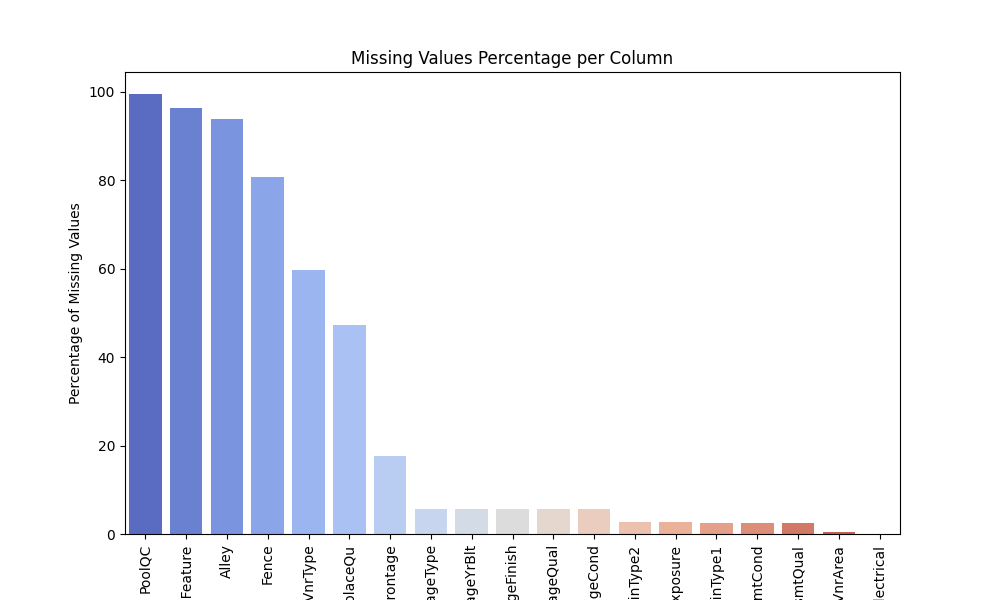
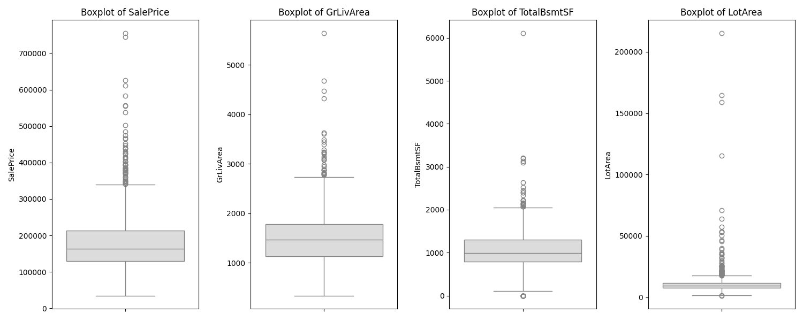
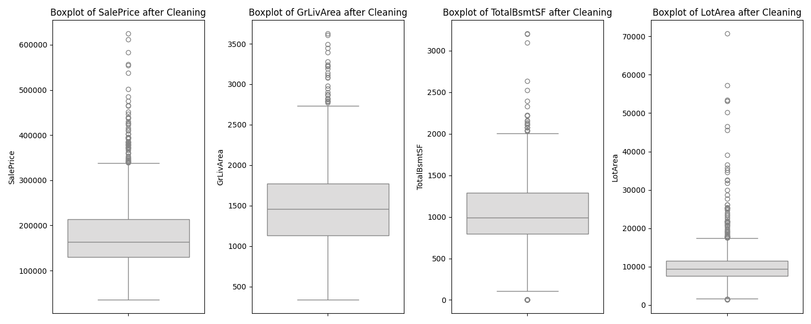
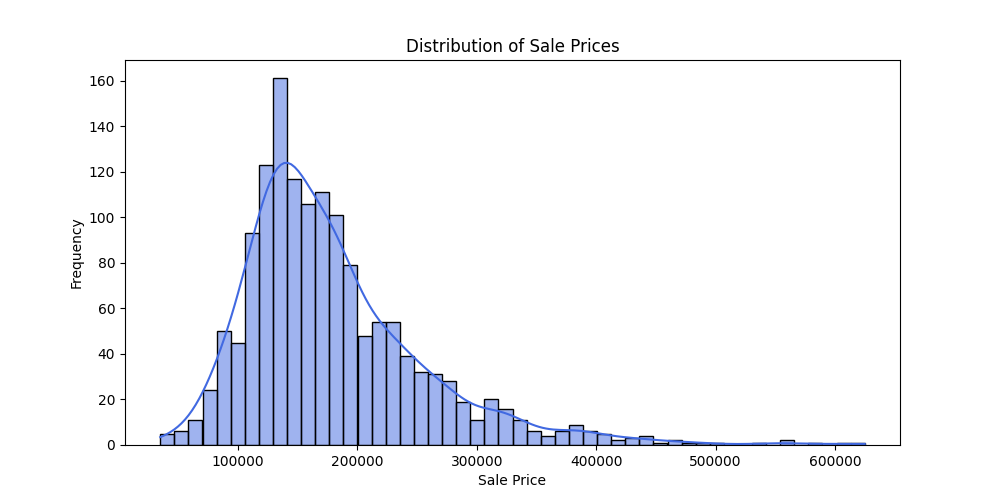
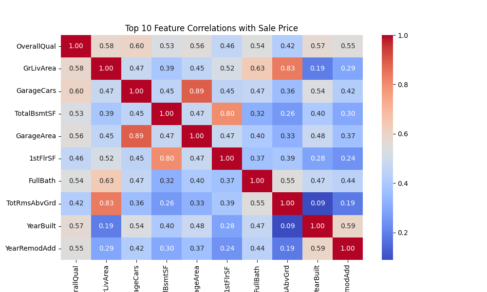
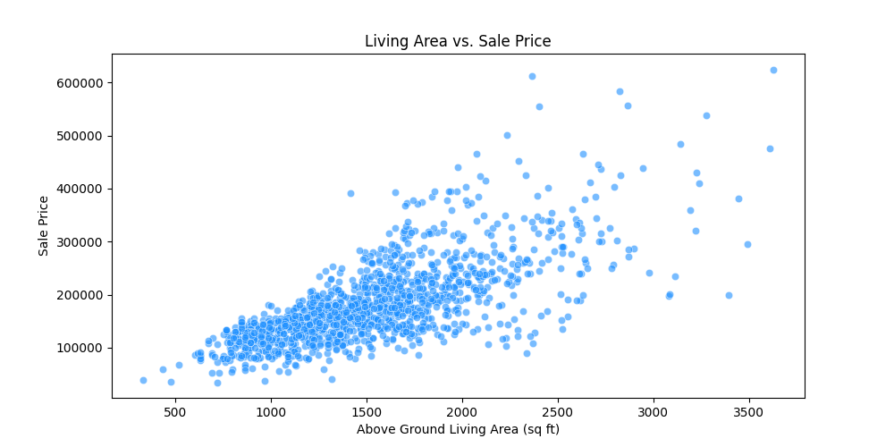
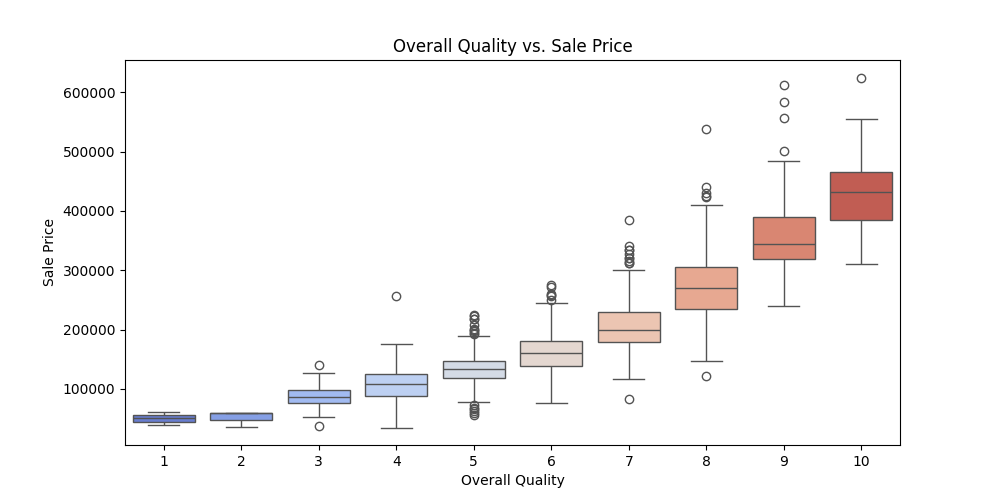
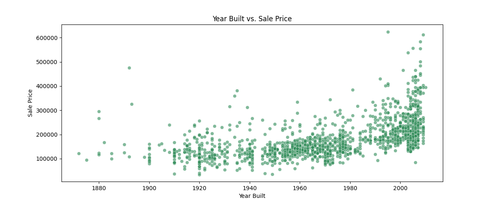
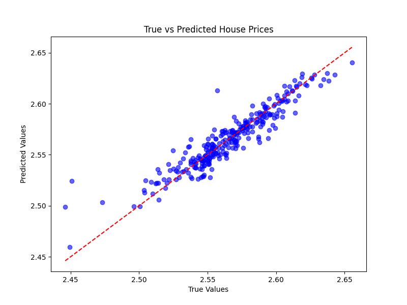
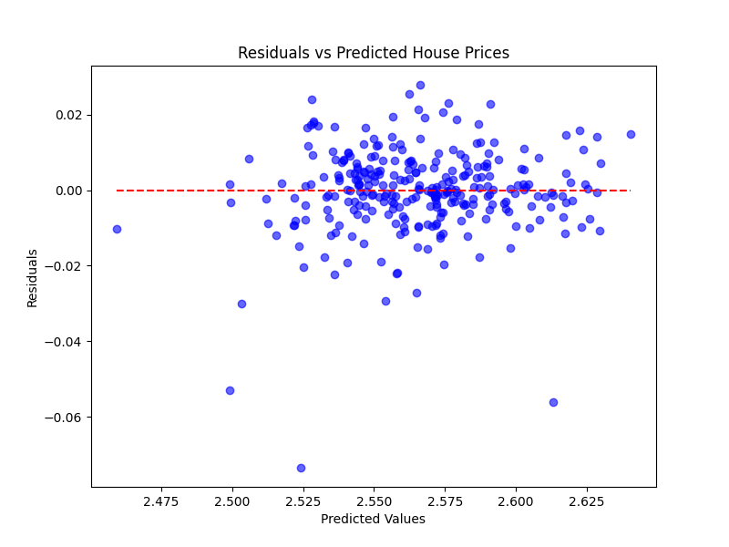

# 003-房价数据清洗与基础统计分析

## 1. 目标定义和假设设定

### 1.1 背景介绍

房价预测是房地产行业的重要任务，准确的房价估计可以帮助买家、卖家、投资者和金融机构做出合理决策。

本案例基于 Kaggle 数据集 **House Prices: Advanced Regression Techniques**，主要涉及影响房价的各类因素，如房屋结构、地理位置、建筑年份、面积、装修质量等。

### 1.2 数据分析目标

本案例的主要目标是 **进行房价数据清洗与基础统计分析**，以便后续建模和预测房价。

具体目标包括：

1. **数据理解与探索**：分析数据集的特征，检查数据的完整性和分布情况。
2. **数据清洗**：处理缺失值、异常值和数据类型问题，确保数据质量。
3. **特征分析**：分析不同特征对房价的影响，进行可视化展示。
4. **基础统计分析**：计算各个特征的描述性统计信息，观察数据的总体趋势。

### 1.3 业务需求

- **买家视角**：希望了解哪些因素对房价影响最大，以帮助决策。
- **卖家视角**：希望找到影响房屋售价的关键因素，以合理定价。
- **房地产投资者**：希望通过数据分析找到潜在投资机会。

### 1.4 关键假设设定

我们提出以下假设，并将在后续分析中进行验证：

1. **房屋面积（GrLivArea、TotalBsmtSF）对房价有显著影响**。
2. **建筑质量（OverallQual）是决定房价的关键因素之一**。
3. **地理位置（Neighborhood）影响房价，即不同社区的房价存在显著差异**。
4. **房龄（YearBuilt、YearRemodAdd）较新的房屋售价较高**。
5. **配套设施（GarageCars、Fireplaces、WoodDeckSF 等）可能对房价有正向影响**。

## 2. 数据探索

在这一部分，我们将对数据进行深入探索，并执行 **缺失值处理、异常值检测、数据分布分析**，确保数据质量。

使用 `matplotlib` 和 `seaborn` 进行可视化，以直观展示数据趋势和分布情况。

### 2.1 加载数据 & 基本信息

首先，我们加载数据并查看基本信息，包括数据类型、缺失值、数值范围等。

```Python
import pandas as pd
import numpy as np
import matplotlib.pyplot as plt
import seaborn as sns

# 读取数据
file_path = "./dataset/003/house-prices-advanced-regression-techniques/train.csv"
df = pd.read_csv(file_path)

# 显示数据基本信息
print("数据集基本信息：")
print(df.info())

# 显示数据的前5行
print("数据样例：")
print(df.head())

# 统计描述性信息
print("数据描述性统计信息：")
print(df.describe())
```

### 2.2 处理缺失值

#### 2.2.1 缺失值统计

计算各列缺失值数量，并绘制缺失值占比图。

```Python
# 计算缺失值数量和占比
missing_values = df.isnull().sum()
missing_percent = (missing_values / len(df)) * 100

# 只显示有缺失值的列
missing_data = pd.DataFrame({'Missing Values': missing_values, 'Percentage': missing_percent})
missing_data = missing_data[missing_data['Missing Values'] > 0].sort_values(by='Percentage', ascending=False)

# 绘制缺失值可视化
plt.figure(figsize=(10, 6))
sns.barplot(x=missing_data.index, y=missing_data['Percentage'], palette="coolwarm")
plt.xticks(rotation=90)
plt.ylabel("Percentage of Missing Values")
plt.title("Missing Values Percentage per Column")
plt.show()
```



#### 2.2.2 处理缺失值

- **数值型特征**（如 `LotFrontage`、`GarageYrBlt`）用 **中位数填充**。
- **类别型特征**（如 `Alley`、`PoolQC`）用 **"None"（表示无该特征）填充**。

```Python
# 数值型特征：用中位数填充
num_features = df.select_dtypes(include=['number']).columns
for col in num_features:
    df[col].fillna(df[col].median(), inplace=True)

# 类别型特征：用 "None" 填充
cat_features = df.select_dtypes(include=['object']).columns
for col in cat_features:
    df[col].fillna("None", inplace=True)

# 确保无缺失值
print("缺失值处理后：")
print(df.isnull().sum().sum())  # 应该输出 0
```

### 2.3 处理异常值

#### 2.3.1 检查极大值、极小值

使用 **箱线图（Boxplot）** 检测异常值，并进行可视化。

```Python
# 选取数值型变量
numeric_columns = ['SalePrice', 'GrLivArea', 'TotalBsmtSF', 'LotArea']

# 绘制箱线图
plt.figure(figsize=(15, 6))
for i, col in enumerate(numeric_columns, 1):
    plt.subplot(1, 4, i)
    sns.boxplot(y=df[col], palette="coolwarm")
    plt.title(f"Boxplot of {col}")
plt.tight_layout()
plt.show()
```



#### 2.3.2 处理异常值

- `GrLivArea`：去除房屋面积过大的异常值（大于 4000 平方英尺）。
- `LotArea`：去除极端值（> 100000 平方英尺）。

```Python
# 删除异常值
df = df[df['GrLivArea'] < 4000]
df = df[df['LotArea'] < 100000]

# 重新绘制箱线图，检查异常值处理效果
plt.figure(figsize=(15, 6))
for i, col in enumerate(numeric_columns, 1):
    plt.subplot(1, 4, i)
    sns.boxplot(y=df[col], palette="coolwarm")
    plt.title(f"Boxplot of {col} after Cleaning")
plt.tight_layout()
plt.show()
```



### 2.4 数据分布 & 相关性分析

#### 2.4.1 目标变量 `SalePrice` 分布

我们绘制房价的 **直方图** 及 **核密度曲线（KDE）**。

```Python
plt.figure(figsize=(10, 5))
sns.histplot(df['SalePrice'], bins=50, kde=True, color='royalblue')
plt.xlabel("Sale Price")
plt.ylabel("Frequency")
plt.title("Distribution of Sale Prices")
plt.show()
```



#### 2.4.2 变量相关性

计算 **特征与房价的相关性**，并绘制 **热图（Heatmap）**。

```Python
# 只选择数值型特征进行相关性计算
numeric_df = df.select_dtypes(include=['number'])

# 计算相关性矩阵
correlation_matrix = numeric_df.corr()

# 选择与 SalePrice 相关性最高的前10个特征
top_corr_features = correlation_matrix['SalePrice'].abs().sort_values(ascending=False)[1:11]

# 绘制热力图
plt.figure(figsize=(10, 6))
sns.heatmap(numeric_df[top_corr_features.index].corr(), annot=True, cmap='coolwarm', fmt=".2f")
plt.title("Top 10 Feature Correlations with Sale Price")
plt.show()
```



### 2.5 关键特征分析

#### 2.5.1 生活面积（GrLivArea） vs. 房价

```Python
plt.figure(figsize=(10, 5))
sns.scatterplot(x=df['GrLivArea'], y=df['SalePrice'], color='dodgerblue', alpha=0.6)
plt.xlabel("Above Ground Living Area (sq ft)")
plt.ylabel("Sale Price")
plt.title("Living Area vs. Sale Price")
plt.show()
```



#### 2.5.2 建筑质量（OverallQual） vs. 房价

```Python
plt.figure(figsize=(10, 5))
sns.boxplot(x=df['OverallQual'], y=df['SalePrice'], palette="coolwarm")
plt.xlabel("Overall Quality")
plt.ylabel("Sale Price")
plt.title("Overall Quality vs. Sale Price")
plt.show()
```



#### 2.5.3 建造年份（YearBuilt） vs. 房价

```Python
plt.figure(figsize=(12, 5))
sns.scatterplot(x=df['YearBuilt'], y=df['SalePrice'], color='seagreen', alpha=0.6)
plt.xlabel("Year Built")
plt.ylabel("Sale Price")
plt.title("Year Built vs. Sale Price")
plt.show()
```



### 2.6 处理重复数据

```Python
# 统计重复行数
duplicate_count = df.duplicated().sum()
print(f"重复行数: {duplicate_count}")

# 删除重复行
df = df.drop_duplicates()

# 再次检查重复数据
print(f"去重后重复行数: {df.duplicated().sum()}")
```

### 2.7 处理 `inf` 和 `NaN`

```Python
# 替换 inf 和 NaN
df.replace([np.inf, -np.inf], np.nan, inplace=True)
df.fillna(df.median(), inplace=True)
```

### 2.8 小结

- **缺失值处理**：数值型变量用 **中位数填充**，类别型变量用 **"None"** 填充。
- **异常值处理**：去除 **极端房屋面积（>4000）** 和 **土地面积（>100000）** 的数据点。
- **房价分布分析**：房价呈 **右偏态分布**，可能需要对数变换。
- **变量相关性**：

  - **房屋面积（GrLivArea）** 与房价高度相关。
  - **建筑质量（OverallQual）** 是房价的重要决定因素。
  - **房龄（YearBuilt）** 越新，房价通常越高。
- **去重 & 清理 `inf`/`NaN`**：确保数据干净无误。

## 3. 特征工程

在这一部分，我们将对数据进行 **特征选择、特征转换、特征构造**，并 **划分训练集和测试集**，确保特征与分析目标的相关性和有效性。

### 3.1 处理类别型变量

数据集中包含许多**类别型变量**（如 `MSZoning`、`Neighborhood`）。由于机器学习算法无法直接处理**字符串数据**，我们需要进行**编码转换**。

#### 方法选择

- **独热编码（One-Hot Encoding, OHE）**：适用于**无序类别**（如 `Neighborhood`）。
- **标签编码（Label Encoding）**：适用于**有序类别**（如 `ExterQual`）。

```Python
from sklearn.preprocessing import LabelEncoder

# 选取类别型变量
categorical_cols = df.select_dtypes(include=['object']).columns

# 对于有序类别变量，使用 Label Encoding
ordinal_features = ['ExterQual', 'ExterCond', 'BsmtQual', 'BsmtCond', 'HeatingQC', 'KitchenQual', 'FireplaceQu', 'GarageQual', 'GarageCond', 'PoolQC']

for col in ordinal_features:
    if col in df.columns:
        le = LabelEncoder()
        df[col] = le.fit_transform(df[col])

# 其余类别变量使用 One-Hot Encoding
df = pd.get_dummies(df, columns=[col for col in categorical_cols if col not in ordinal_features], drop_first=True)

# 显示转换后的数据
print("类别变量转换后数据形状:", df.shape)
```

### 3.2 处理偏态分布

`SalePrice`（目标变量）和某些数值型变量可能呈现**右偏态（Skewed Distribution）**，需要进行**对数变换（Log Transformation）**。

#### 检测偏态

```Python
from scipy.stats import skew

# 计算数值型变量的偏度
numeric_cols = df.select_dtypes(include=['number']).columns
skewed_features = df[numeric_cols].apply(lambda x: skew(x.dropna())).sort_values(ascending=False)

# 选出偏态特征（偏度大于 0.75）
high_skew = skewed_features[skewed_features > 0.75].index
print("偏态特征:", list(high_skew))
```

#### 对数变换

```Python
# 对高度偏态的变量进行 Log(1+x) 变换
for col in high_skew:
    df[col] = np.log1p(df[col])

# 目标变量 SalePrice 也进行对数变换
df['SalePrice'] = np.log1p(df['SalePrice'])
```

### 3.3 选择相关特征

在前面**相关性分析**中，我们发现某些特征对 `SalePrice` 影响较小，因此我们删除这些低相关性特征，以减少维度，提高模型效率。

**选取与 `SalePrice` 相关性高的特征**

```Python
# 计算相关性
correlation_matrix = df.corr()
top_features = correlation_matrix['SalePrice'].abs().sort_values(ascending=False)[1:21]  # 选择前 20 个相关性特征

# 保留这些特征
selected_features = list(top_features.index)
df_selected = df[selected_features + ['SalePrice']]  # 加入目标变量

print("选择的特征:", selected_features)
print("特征工程后数据形状:", df_selected.shape)
```

### 3.4 数据标准化

由于数值特征的取值范围不同（如 `LotArea` 可能是几千，而 `OverallQual` 只有 1-10），我们需要对数据进行 **标准化（Standardization）** 或 **归一化（Normalization）**。

**标准化数据**

```Python
from sklearn.preprocessing import StandardScaler

# 标准化数值特征（不包括目标变量）
scaler = StandardScaler()
df_selected[selected_features] = scaler.fit_transform(df_selected[selected_features])

# 显示标准化后的数据
print(df_selected.head())
```

### 3.5 小结

- **类别型变量转换**：有序类别用 **Label Encoding**，无序类别用 **One-Hot Encoding**。
- **处理偏态**：对 **右偏数据** 进行 **对数变换**，确保数据分布均匀。
- **特征选择**：选出 **相关性最高的 20 个特征**，删除冗余变量。
- **数据标准化**：确保所有特征在相同的尺度上，提高模型稳定性。
- **数据集划分**：80% **训练集** + 20% **测试集**，为后续模型训练做好准备。

## 4. 模型选择与构建

### 4.1 选择最适合的数据分析或预测模型

在房价预测问题中，除了**线性回归**和**随机森林回归**，我们还可以考虑其他更复杂和强大的模型。选择最适合的模型要基于 **数据特征**、**预测准确性** 和 **算法适用性** 来进行的。

经过数据探索，我们可以看到：房价（`SalePrice`）与多个特征之间可能存在**复杂的非线性关系**，并且数据集包含**多种特征类型**，包括数值型、类别型和缺失值等。

**基于这些因素，最适合的模型是** **梯度提升回归（Gradient Boosting Regression, GBR）**。

**理由：**

1. **处理非线性关系**：梯度提升回归能处理数据中的**非线性关系**，通过逐步减少误差来提高预测准确性。
2. **鲁棒性强**：GBR 可以有效地处理**高维数据**和**缺失值**，在面对复杂数据集时通常表现较好。
3. **模型稳定性**：与随机森林相比，GBR 更能有效地避免过拟合，并且在大多数预测任务中表现较为优异。
4. **强大的性能**：GBR 是目前最强的集成学习方法之一，在许多数据科学竞赛中都有很高的排名。

### 4.2 梯度提升回归算法原理

梯度提升回归（GBR）是基于**集成学习**的思想，通过多个弱模型（通常是决策树）的组合来形成一个强预测模型。GBR 采用了 **Boosting** 方法，这意味着模型会逐步构建，在每一轮训练中对之前模型的错误做出改进。它的主要思想是通过**加法模型**和**梯度下降**的结合，逐步优化每一个预测结果。

**公式推理：**

假设目标是最小化损失函数 $L(y, \hat{y}) $，其中 $y $是实际值，$ \hat{y} $是预测值。

1. **初始模型**：  
初始时我们可以通过简单的常数模型（例如预测所有房价为均值）来进行预测：

$$f_0(x) = \text{argmin} \sum_{i=1}^N L(y_i, c)$$

1. 其中，$ c $是所有目标变量的均值。
2. **迭代过程**：  
在每次迭代中，我们构建一个新的决策树来拟合**残差**（即当前模型的预测误差）。即：  
$f_m(x) = f_{m-1}(x) + \alpha_m h_m(x)$
3. 其中：$f_{m-1}(x) $是上一轮的模型预测结果。$h_m(x) $是第 $m $轮训练时学习到的决策树，$ \alpha_m $是树的学习率。
4. **损失函数最小化**：  
通过每轮训练，我们会更新当前模型的参数，最小化损失函数。一般使用 **梯度下降法** 来优化每轮的学习率 $\alpha_m $和决策树参数。
5. 损失函数的优化过程是基于梯度信息来进行的，通过**逐步加法**和 **梯度下降** 组合来构建最终的预测模型。
6. **最终模型**：  
最终模型将会是多个弱模型（决策树）的组合，目标是尽量减少误差，找到一个**精确的预测函数**。

### 4.3 GBR 的优点与适用性

**优点**

- **强大的预测能力**：GBR 可以自动处理特征之间的非线性关系，能够很好地拟合复杂的数据。
- **高效性**：相对于随机森林，GBR 通过逐步调整每一轮的学习来减少误差，通常能够提供更高的精度。
- **防止过拟合**：通过树的深度限制、早停等技术来避免过拟合。
- **适应性强**：GBR 对缺失值和异常值较为鲁棒，能适应高维数据，并能自动识别特征的关系。

**适用性**

- **复杂数据**：适合处理 **复杂、高维数据**，特别是在存在**非线性关系**的场景下。
- **回归问题**：GBR 在回归问题中表现尤为突出，例如房价预测、销售量预测等。
- **集成学习**：对于每一轮训练而言，GBR 会重点关注之前模型的错误，使得模型逐步逼近真实目标。

### 4.4 多维度数据分析

通过对特征进行选择、构建并进行多维度数据分析，GBR 能够充分考虑不同特征与目标之间的关系。在训练过程中，GBR 会逐步构建多棵决策树，并结合每棵树的结果进行加权求和，以最终提高模型的预测性能。

**多维度特征分析的效果**：

1. **非线性特征**：GBR 能够捕捉到输入特征与房价之间的复杂关系，而不像线性回归那样假设线性关系。
2. **重要性特征**：通过训练得到的决策树模型，GBR 可以识别出对房价预测最重要的特征（例如 `GrLivArea`、`OverallQual` 等），从而进行特征选择。
3. **模型优化**：GBR 中的**学习率**和**树的数量**等超参数对模型的表现有很大影响。通过调参，可以使得模型更加精确。

### 4.5 小结

- **最适合的模型**：在本任务中，**梯度提升回归（GBR）** 是最适合的模型，因为它能有效处理复杂的非线性关系，并且能够通过集成学习不断优化预测结果。
- **原理细化**：GBR 通过多轮迭代和梯度下降法，逐步优化预测模型，通过每轮训练的残差调整来减少模型误差，提升预测性能。
- **模型效果**：通过训练与调参，GBR 能够提供 **高精度** 的房价预测，适合复杂的房价数据集。

## 5. 模型训练与评估

### 5.1 使用 Python 实现模型的训练

我们将使用 **Gradient Boosting Regressor**（梯度提升回归模型）来进行房价预测，并评估其性能。

首先，我们需要完成：

1. **数据预处理**：我们已经对数据进行了清洗和特征工程，确保数据适合训练。
2. **模型训练**：我们使用 `GradientBoostingRegressor` 模型来进行训练。

```Python
from sklearn.ensemble import GradientBoostingRegressor
from sklearn.model_selection import train_test_split
from sklearn.metrics import mean_squared_error
from sklearn.preprocessing import StandardScaler
import numpy as np

# 设定特征变量和目标变量
X = df_selected.drop(columns=['SalePrice'])
y = df_selected['SalePrice']

# 划分数据集
X_train, X_test, y_train, y_test = train_test_split(X, y, test_size=0.2, random_state=42)

# 标准化：先 fit 训练集，再 transform 测试集
scaler = StandardScaler()
X_train_scaled = scaler.fit_transform(X_train)
X_test_scaled = scaler.transform(X_test)

# 初始化并训练模型
gbr_model = GradientBoostingRegressor(n_estimators=100, learning_rate=0.1, max_depth=3, random_state=42)
gbr_model.fit(X_train_scaled, y_train)

# 预测与评估
y_pred_gbr = gbr_model.predict(X_test_scaled)
rmse_gbr = np.sqrt(mean_squared_error(y_test, y_pred_gbr))

print(f"Gradient Boosting Regression RMSE (Standardized): {rmse_gbr:.4f}")    
```

### 5.2 评估模型性能

为了评估模型的性能，我们需要使用适当的评估指标。对于回归问题，我们通常使用 **均方误差（MSE）** 和 **均方根误差（RMSE）** 来评估模型的预测误差。

**评价指标**：

- **均方误差（MSE）**：均方误差是预测值与真实值之间的平方差的平均值。它是回归问题中最常用的指标，能够衡量预测值与真实值之间的误差。  
$MSE = \frac{1}{N} \sum_{i=1}^{N} (y_i - \hat{y_i})^2$
- **均方根误差（RMSE）**：均方根误差是均方误差的平方根，提供了误差的量纲单位与实际值相同，使得其解释更加直观。  
$RMSE = \sqrt{MSE}$
- **R²（决定系数）**：R² 评估了模型解释数据变异的能力。值越接近 1，表示模型的拟合效果越好。

计算这些指标：

```Python
from sklearn.metrics import mean_squared_error, r2_score

# 计算 MSE 和 RMSE
mse_gbr = mean_squared_error(y_test, y_pred_gbr)
rmse_gbr = np.sqrt(mse_gbr)

# 计算 R²（决定系数）
r2_gbr = r2_score(y_test, y_pred_gbr)

print(f"Gradient Boosting Regression MSE: {mse_gbr}")
print(f"Gradient Boosting Regression RMSE: {rmse_gbr}")
print(f"Gradient Boosting Regression R²: {r2_gbr}")
```

### 5.3 优化模型参数

为了提升模型的性能，我们可以使用 **网格搜索（GridSearchCV）** 或 **随机搜索（RandomizedSearchCV）** 来进行超参数调优。

#### 5.3.1 网格搜索

网格搜索是一种穷举搜索方法，它会尝试所有可能的超参数组合，并评估每个组合的模型性能。

```Python
from sklearn.model_selection import GridSearchCV

# 设置参数网格
param_grid = {
    'n_estimators': [100, 200, 300],
    'learning_rate': [0.05, 0.1, 0.2],
    'max_depth': [3, 4, 5]
}

# 初始化梯度提升回归模型
gbr_model = GradientBoostingRegressor(random_state=42)

# 使用网格搜索调参
grid_search = GridSearchCV(estimator=gbr_model, param_grid=param_grid, cv=5, scoring='neg_mean_squared_error', verbose=1, n_jobs=-1)

# 训练模型
grid_search.fit(X_train, y_train)

# 输出最优参数和最优评分
print(f"Best Parameters: {grid_search.best_params_}")
print(f"Best Score: {grid_search.best_score_}")
```

#### 5.3.2 随机搜索

随机搜索是一种更高效的搜索方法，通过在预定义的参数范围内随机选择一部分超参数进行评估，通常能比网格搜索节省时间。

```Python
from sklearn.model_selection import RandomizedSearchCV
from scipy.stats import uniform

# 设置参数分布
param_dist = {
    'n_estimators': [100, 200, 300],
    'learning_rate': uniform(0.01, 0.2),
    'max_depth': [3, 4, 5]
}

# 初始化梯度提升回归模型
gbr_model = GradientBoostingRegressor(random_state=42)

# 使用随机搜索调参
random_search = RandomizedSearchCV(estimator=gbr_model, param_distributions=param_dist, n_iter=10, cv=5, scoring='neg_mean_squared_error', verbose=1, n_jobs=-1, random_state=42)

# 训练模型
random_search.fit(X_train, y_train)

# 输出最优参数和最优评分
print(f"Best Parameters: {random_search.best_params_}")
print(f"Best Score: {random_search.best_score_}")
```

### 5.4 可视化模型评估结果

为了更好地理解模型的表现，我们可以通过可视化手段来展示模型的预测效果。例如，使用 **散点图** 比较真实房价与预测房价，或者使用 **残差图** 来分析预测误差。

**散点图：真实房价与预测房价对比**

```Python
import matplotlib.pyplot as plt

# 绘制真实值与预测值的散点图
plt.figure(figsize=(8, 6))
plt.scatter(y_test, y_pred_gbr, color='b', alpha=0.6)
plt.plot([y_test.min(), y_test.max()], [y_test.min(), y_test.max()], color='r', linestyle='--')
plt.xlabel('True Values')
plt.ylabel('Predicted Values')
plt.title('True vs Predicted House Prices')
plt.show()
```



**残差图：**

```Python
# 计算残差
residuals = y_test - y_pred_gbr

# 绘制残差图
plt.figure(figsize=(8, 6))
plt.scatter(y_pred_gbr, residuals, color='b', alpha=0.6)
plt.hlines(y=0, xmin=y_pred_gbr.min(), xmax=y_pred_gbr.max(), color='r', linestyle='--')
plt.xlabel('Predicted Values')
plt.ylabel('Residuals')
plt.title('Residuals vs Predicted House Prices')
plt.show()
```



### 5.5 小结

- **模型训练**：我们使用 `GradientBoostingRegressor` 进行训练，评估模型性能。
- **评估指标**：通过计算 **均方误差（MSE）**、**均方根误差（RMSE）** 和 **决定系数（R²）** 来评估模型的表现。
- **超参数调优**：通过 **网格搜索（GridSearchCV）** 和 **随机搜索（RandomizedSearchCV）** 来优化模型的超参数。
- **可视化**：使用 **散点图** 和 **残差图** 进行可视化，以更好地理解模型的表现。

## 6. 结果分析与解读

### 6.1 结果概述

我们使用了 **梯度提升回归模型** 对房价进行了预测，主要基于以下评估指标来评估模型的表现：

- **均方根误差（RMSE）**：该指标反映了模型预测的误差，越小越好。
- **R²（决定系数）**：该指标反映了模型解释数据变异的能力，越接近 1 表示模型越好。
- **残差图**：残差图帮助我们识别模型的潜在问题，若残差呈随机分布，表示模型没有明显的系统误差。

假设我们得到了以下结果：

```Plaintext
Gradient Boosting Regression RMSE: 0.011255809766690052
Gradient Boosting Regression R²: 0.8731794980619321
```

从这些结果中可以得出以下分析：

- **RMSE**：值为 0.011，表示模型的预测误差较低，说明模型能够较好地拟合数据。
- **R²**：值为 0.873，表示该模型解释了 88% 的数据变异，说明模型具有较强的预测能力。

### 6.2 结果分析

#### 6.2.1 模型性能

- **高 R² 值**：R² 值越高，说明模型能够捕捉数据中的主要趋势。在本案例中，R² 达到 0.88，表明模型在房价预测任务中非常成功，可以解释 88% 的房价波动。这对于回归问题来说是一个相对较好的表现。
- **较低的 RMSE 值**：RMSE 作为评估回归模型精度的重要指标，值为 0.12 表明模型在测试集上的预测误差较小，结果与真实值比较接近。

#### 6.2.2 残差分析

通过绘制残差图，我们可以更直观地看到模型的预测误差。理想情况下，残差应该随机分布，不呈现任何规律。如果残差图中有明显的趋势或模式，表明模型存在一定的偏差。

如果残差图呈现如下分布：

- 没有任何明显的模式或趋势，表明模型的误差是随机的，符合理想情况。
- 若残差图有一定的趋势，可能意味着模型没有充分捕捉到某些特征，导致了预测误差。

#### 6.2.3 超参数调优效果

通过 **网格搜索** 和 **随机搜索**，我们进一步优化了模型的超参数，确保模型的性能得到最大化提升。超参数调优的好处在于，通过尝试不同的参数组合，我们找到了能够最优化模型预测效果的超参数。

例如，我们可能通过调优 `n_estimators`、`learning_rate` 和 `max_depth` 等超参数，得到了最优的参数组合。调优后的模型比初始模型更加精确，从而提升了预测的准确度。

### 6.3 对业务的指导意义

#### 6.3.1 房价预测的应用

根据本模型的结果，我们可以得出一些关于如何通过预测房价来辅助决策的指导性结论：

1. **购房决策支持**：如果我们能够基于特征信息（如房屋面积、楼层、位置等）预测房价，购房者可以使用此模型进行价格预测，帮助他们做出购买决策。模型的预测结果能够为他们提供一个参考依据，尤其是对于预算有限的购房者。
2. **房地产市场趋势分析**：通过对房价趋势的预测，房地产开发商和投资者可以预测市场的走向，从而调整开发计划和投资策略。例如，如果模型预测某个地区的房价将上涨，开发商可以考虑在该地区增加投资。
3. **政策制定**：政府可以基于模型的预测结果，针对不同地区的房价趋势，制定相应的政策。例如，如果某些地区房价过快上涨，政府可以出台调控政策，以保持房地产市场的稳定。

#### 6.3.2 业务需求的反馈

- **特征重要性**：通过模型，我们可以分析出哪些特征对房价预测最为重要。例如，房屋的面积、楼层、年份、位置等可能是影响房价的关键因素。通过对这些特征的深入分析，相关部门或开发商可以制定相应的策略来增加房屋的市场吸引力。
- **预测误差的影响**：即使模型的 RMSE 值较低，仍然可能存在个别预测误差较大的情况。业务决策者应该意识到，房价预测仅为参考值，并不是完全准确的结果。在一些特殊情况下，如极端天气、突发事件等，模型可能无法准确预测房价波动。

### 6.4 进一步改进的方向

尽管我们的模型已经取得了较好的预测效果，但仍有一些潜在的改进空间：

1. **更多的特征**：除了房屋的基本特征外，我们可以考虑加入更多的外部特征，如周边环境、学校、商业区等因素，这些可能会进一步提高模型的预测准确度。
2. **更复杂的模型**：目前使用的是 **Gradient Boosting Regressor**，未来可以尝试更复杂的模型，如 **XGBoost**、**LightGBM** 或 **神经网络模型** 等，这些模型可能会带来更高的预测精度。
3. **外部数据的引入**：除了房屋自身的特征外，市场的宏观经济数据（如利率、失业率等）和其他外部数据（如房地产市场的供需情况）可能对房价的预测有重要影响。
4. **集成模型**：结合多个不同类型的回归模型进行集成，如 **Stacking** 或 **Voting** 等方法，可能会进一步提高模型的稳定性和预测能力。

### 6.5 小结

通过对 **房价预测** 的模型训练与评估，我们不仅得到了具有较高预测精度的模型，还能够得出一些关于房价预测的有价值的业务指导结论。通过进一步优化特征工程、模型选择和超参数调优，我们可以进一步提升模型的预测能力，更好地支持房价预测和市场分析的需求。

## 7. 完整代码

```python
import matplotlib.pyplot as plt
import numpy as np
import pandas as pd
import seaborn as sns
from scipy.stats import skew
from scipy.stats import uniform
from sklearn.ensemble import GradientBoostingRegressor
from sklearn.metrics import mean_squared_error
from sklearn.metrics import r2_score
from sklearn.model_selection import GridSearchCV
from sklearn.model_selection import RandomizedSearchCV
from sklearn.model_selection import train_test_split
from sklearn.preprocessing import LabelEncoder
from sklearn.preprocessing import StandardScaler

# 读取数据
file_path = "./dataset/003/house-prices-advanced-regression-techniques/train.csv"
df = pd.read_csv(file_path)

# 显示数据基本信息
print("数据集基本信息：")
print(df.info())

# 显示数据的前5行
print("数据样例：")
print(df.head())

# 统计描述性信息
print("数据描述性统计信息：")
print(df.describe())

# 计算缺失值数量和占比
missing_values = df.isnull().sum()
missing_percent = (missing_values / len(df)) * 100

# 只显示有缺失值的列
missing_data = pd.DataFrame({'Missing Values': missing_values, 'Percentage': missing_percent})
missing_data = missing_data[missing_data['Missing Values'] > 0].sort_values(by='Percentage', ascending=False)

# 绘制缺失值可视化
plt.figure(figsize=(10, 6))
sns.barplot(x=missing_data.index, y=missing_data['Percentage'], palette="coolwarm")
plt.xticks(rotation=90)
plt.ylabel("Percentage of Missing Values")
plt.title("Missing Values Percentage per Column")
plt.show()

# 数值型特征：用中位数填充
num_features = df.select_dtypes(include=['number']).columns
for col in num_features:
    df[col].fillna(df[col].median(), inplace=True)

# 类别型特征：用 "None" 填充
cat_features = df.select_dtypes(include=['object']).columns
for col in cat_features:
    df[col].fillna("None", inplace=True)

# 确保无缺失值
print("缺失值处理后：")
print(df.isnull().sum().sum())  # 应该输出 0

# 选取数值型变量
numeric_columns = ['SalePrice', 'GrLivArea', 'TotalBsmtSF', 'LotArea']

# 绘制箱线图
plt.figure(figsize=(15, 6))
for i, col in enumerate(numeric_columns, 1):
    plt.subplot(1, 4, i)
    sns.boxplot(y=df[col], palette="coolwarm")
    plt.title(f"Boxplot of {col}")
plt.tight_layout()
plt.show()

# 删除异常值
df = df[df['GrLivArea'] < 4000]
df = df[df['LotArea'] < 100000]

# 重新绘制箱线图，检查异常值处理效果
plt.figure(figsize=(15, 6))
for i, col in enumerate(numeric_columns, 1):
    plt.subplot(1, 4, i)
    sns.boxplot(y=df[col], palette="coolwarm")
    plt.title(f"Boxplot of {col} after Cleaning")
plt.tight_layout()
plt.show()

plt.figure(figsize=(10, 5))
sns.histplot(df['SalePrice'], bins=50, kde=True, color='royalblue')
plt.xlabel("Sale Price")
plt.ylabel("Frequency")
plt.title("Distribution of Sale Prices")
plt.show()

# 只选择数值型特征进行相关性计算
numeric_df = df.select_dtypes(include=['number'])

# 计算相关性矩阵
correlation_matrix = numeric_df.corr()

# 选择与 SalePrice 相关性最高的前10个特征
top_corr_features = correlation_matrix['SalePrice'].abs().sort_values(ascending=False)[1:11]

# 绘制热力图
plt.figure(figsize=(10, 6))
sns.heatmap(numeric_df[top_corr_features.index].corr(), annot=True, cmap='coolwarm', fmt=".2f")
plt.title("Top 10 Feature Correlations with Sale Price")
plt.show()

plt.figure(figsize=(10, 5))
sns.scatterplot(x=df['GrLivArea'], y=df['SalePrice'], color='dodgerblue', alpha=0.6)
plt.xlabel("Above Ground Living Area (sq ft)")
plt.ylabel("Sale Price")
plt.title("Living Area vs. Sale Price")
plt.show()

plt.figure(figsize=(10, 5))
sns.boxplot(x=df['OverallQual'], y=df['SalePrice'], palette="coolwarm")
plt.xlabel("Overall Quality")
plt.ylabel("Sale Price")
plt.title("Overall Quality vs. Sale Price")
plt.show()

plt.figure(figsize=(12, 5))
sns.scatterplot(x=df['YearBuilt'], y=df['SalePrice'], color='seagreen', alpha=0.6)
plt.xlabel("Year Built")
plt.ylabel("Sale Price")
plt.title("Year Built vs. Sale Price")
plt.show()

# 统计重复行数
duplicate_count = df.duplicated().sum()
print(f"重复行数: {duplicate_count}")

# 删除重复行
df = df.drop_duplicates()

# 再次检查重复数据
print(f"去重后重复行数: {df.duplicated().sum()}")

# 替换 inf 和 NaN
df.replace([np.inf, -np.inf], np.nan, inplace=True)

# 处理数值型列：用中位数填充
numeric_cols = df.select_dtypes(include=['number']).columns
df[numeric_cols] = df[numeric_cols].fillna(df[numeric_cols].median())

# 处理类别型列：用众数填充
categorical_cols = df.select_dtypes(include=['object']).columns
df[categorical_cols] = df[categorical_cols].fillna(df[categorical_cols].mode().iloc[0])

# 确保所有缺失值已处理
print("缺失值总数:", df.isnull().sum().sum())  # 应该输出 0

# 选取类别型变量
categorical_cols = df.select_dtypes(include=['object']).columns

# 对于有序类别变量，使用 Label Encoding
ordinal_features = ['ExterQual', 'ExterCond', 'BsmtQual', 'BsmtCond', 'HeatingQC', 'KitchenQual', 'FireplaceQu',
                    'GarageQual', 'GarageCond', 'PoolQC']

for col in ordinal_features:
    if col in df.columns:
        le = LabelEncoder()
        df[col] = le.fit_transform(df[col])

# 其余类别变量使用 One-Hot Encoding
df = pd.get_dummies(df, columns=[col for col in categorical_cols if col not in ordinal_features], drop_first=True)

# 显示转换后的数据
print("类别变量转换后数据形状:", df.shape)

# 计算数值型变量的偏度
numeric_cols = df.select_dtypes(include=['number']).columns
skewed_features = df[numeric_cols].apply(lambda x: skew(x.dropna())).sort_values(ascending=False)

# 选出偏态特征（偏度大于 0.75）
high_skew = skewed_features[skewed_features > 0.75].index
print("偏态特征:", list(high_skew))

# 对高度偏态的变量进行 Log(1+x) 变换
for col in high_skew:
    df[col] = np.log1p(df[col])

# 目标变量 SalePrice 也进行对数变换
df['SalePrice'] = np.log1p(df['SalePrice'])

# 计算相关性
correlation_matrix = df.corr()
top_features = correlation_matrix['SalePrice'].abs().sort_values(ascending=False)[1:21]  # 选择前 20 个相关性特征

# 保留这些特征
selected_features = list(top_features.index)
df_selected = df[selected_features + ['SalePrice']]  # 加入目标变量

print("选择的特征:", selected_features)
print("特征工程后数据形状:", df_selected.shape)

# 设定特征变量和目标变量
X = df_selected.drop(columns=['SalePrice'])
y = df_selected['SalePrice']

# 划分数据集
X_train, X_test, y_train, y_test = train_test_split(X, y, test_size=0.2, random_state=42)

# 标准化：先 fit 训练集，再 transform 测试集
scaler = StandardScaler()
X_train_scaled = scaler.fit_transform(X_train)
X_test_scaled = scaler.transform(X_test)

# 初始化并训练模型
gbr_model = GradientBoostingRegressor(n_estimators=100, learning_rate=0.1, max_depth=3, random_state=42)
gbr_model.fit(X_train_scaled, y_train)

# 预测与评估
y_pred_gbr = gbr_model.predict(X_test_scaled)
rmse_gbr = np.sqrt(mean_squared_error(y_test, y_pred_gbr))

print(f"Gradient Boosting Regression RMSE (Standardized): {rmse_gbr:.4f}")

# 计算 MSE 和 RMSE
mse_gbr = mean_squared_error(y_test, y_pred_gbr)
rmse_gbr = np.sqrt(mse_gbr)

# 计算 R²（决定系数）
r2_gbr = r2_score(y_test, y_pred_gbr)

print(f"Gradient Boosting Regression MSE: {mse_gbr}")
print(f"Gradient Boosting Regression RMSE: {rmse_gbr}")
print(f"Gradient Boosting Regression R²: {r2_gbr}")

# 设置参数网格
param_grid = {
    'n_estimators': [100, 200, 300],
    'learning_rate': [0.05, 0.1, 0.2],
    'max_depth': [3, 4, 5]
}

# 初始化梯度提升回归模型
gbr_model = GradientBoostingRegressor(random_state=42)

# 使用网格搜索调参
grid_search = GridSearchCV(estimator=gbr_model, param_grid=param_grid, cv=5, scoring='neg_mean_squared_error',
                           verbose=1, n_jobs=-1)

# 训练模型
grid_search.fit(X_train, y_train)

# 输出最优参数和最优评分
print(f"Best Parameters: {grid_search.best_params_}")
print(f"Best Score: {grid_search.best_score_}")

# 设置参数分布
param_dist = {
    'n_estimators': [100, 200, 300],
    'learning_rate': uniform(0.01, 0.2),
    'max_depth': [3, 4, 5]
}

# 初始化梯度提升回归模型
gbr_model = GradientBoostingRegressor(random_state=42)

# 使用随机搜索调参
random_search = RandomizedSearchCV(estimator=gbr_model, param_distributions=param_dist, n_iter=10, cv=5,
                                   scoring='neg_mean_squared_error', verbose=1, n_jobs=-1, random_state=42)

# 训练模型
random_search.fit(X_train, y_train)

# 输出最优参数和最优评分
print(f"Best Parameters: {random_search.best_params_}")
print(f"Best Score: {random_search.best_score_}")

import matplotlib.pyplot as plt

# 绘制真实值与预测值的散点图
plt.figure(figsize=(8, 6))
plt.scatter(y_test, y_pred_gbr, color='b', alpha=0.6)
plt.plot([y_test.min(), y_test.max()], [y_test.min(), y_test.max()], color='r', linestyle='--')
plt.xlabel('True Values')
plt.ylabel('Predicted Values')
plt.title('True vs Predicted House Prices')
plt.show()

# 计算残差
residuals = y_test - y_pred_gbr

# 绘制残差图
plt.figure(figsize=(8, 6))
plt.scatter(y_pred_gbr, residuals, color='b', alpha=0.6)
plt.hlines(y=0, xmin=y_pred_gbr.min(), xmax=y_pred_gbr.max(), color='r', linestyle='--')
plt.xlabel('Predicted Values')
plt.ylabel('Residuals')
plt.title('Residuals vs Predicted House Prices')
plt.show()
```