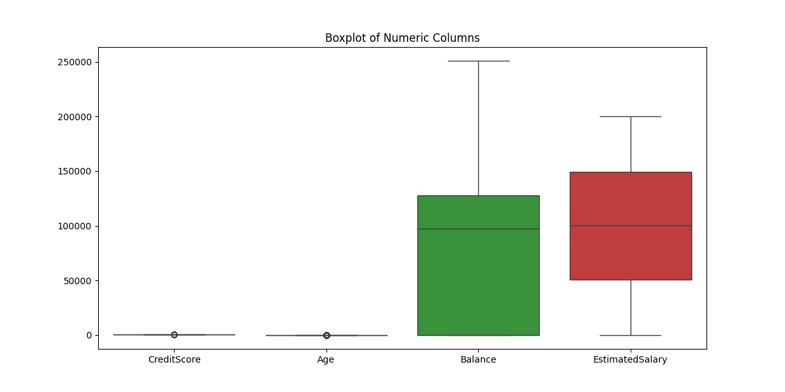
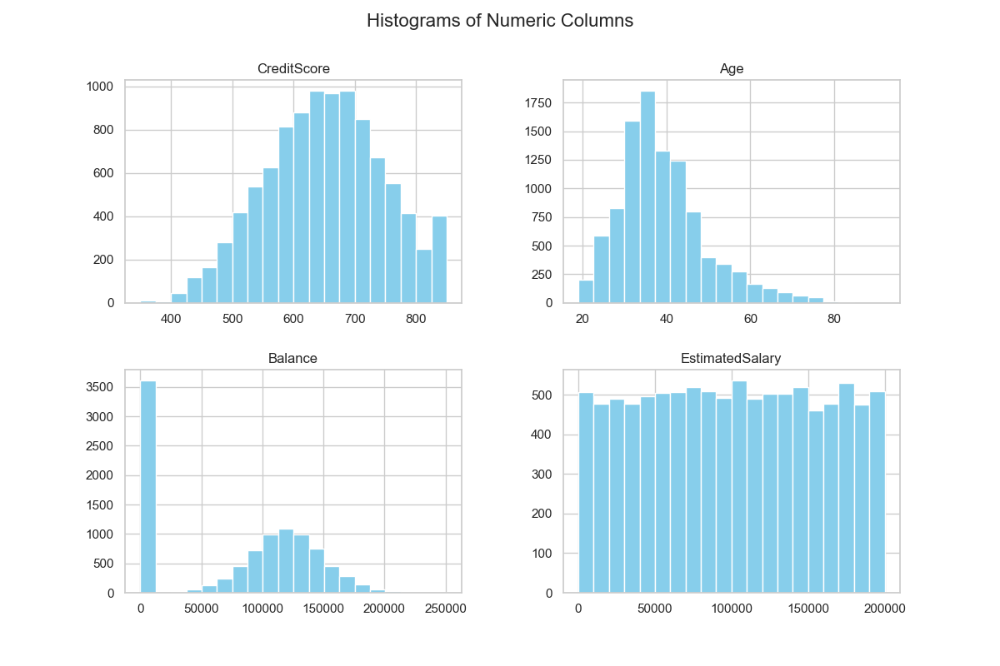
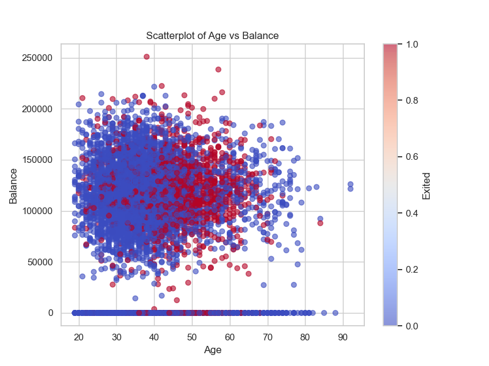
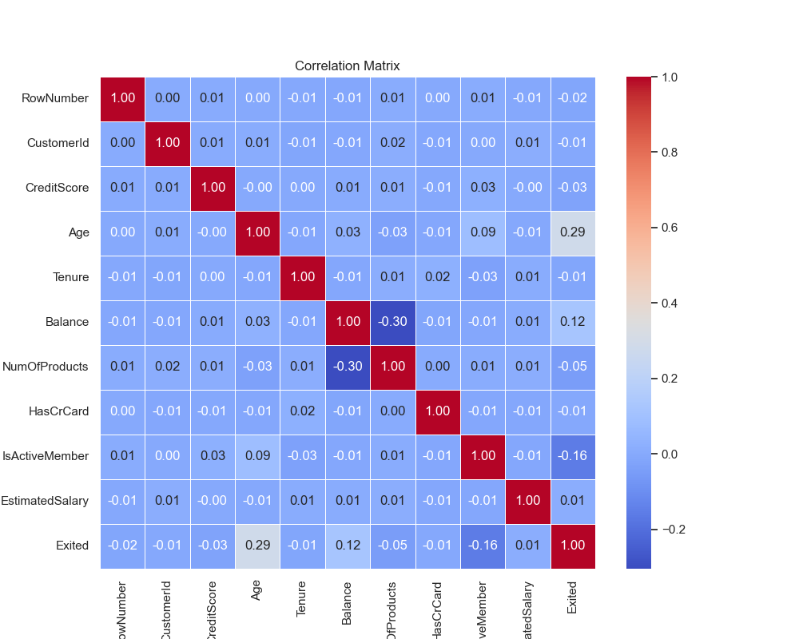
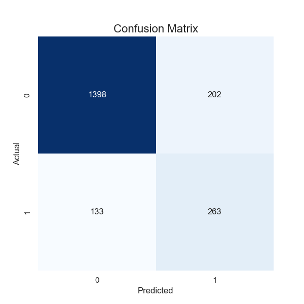
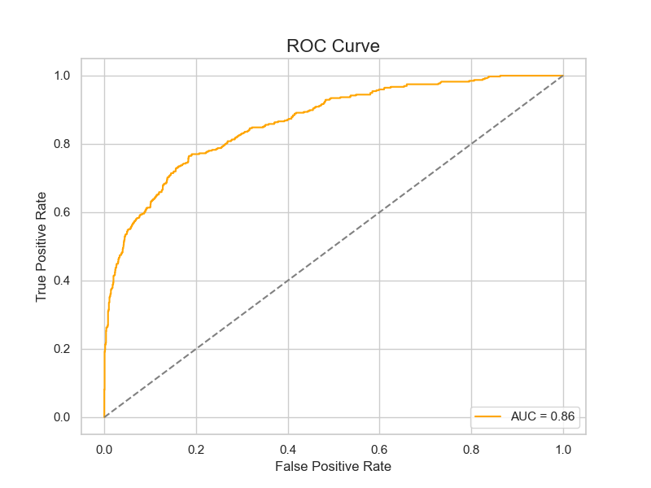

# 004-银行客户流失率分析

## 1. 目标定义和假设设定

### 1.1 案例名称

**房价数据清洗与基础统计分析**

### 1.2 数据集

**Kaggle**上的**Bank Customer Churn Prediction**数据集。

### 1.3 分析背景与业务需求：

在本案例中，我们的任务是利用客户数据进行分析，探索可能影响银行客户流失（**Churn**）的因素。客户流失率是银行等金融机构非常关注的一个指标，客户的流失意味着银行可能失去未来的收入。因此，识别影响客户流失的关键因素对制定保留客户的策略具有重要意义。

**业务需求**：通过清洗和分析客户数据，找出哪些因素对客户流失具有显著影响，进而帮助银行制定有效的客户管理策略，降低客户流失率，提升盈利能力。

### 1.4 数据分析目标

1. **数据清洗**：处理缺失值、重复值以及不合理数据，确保数据质量。
2. **基础统计分析**：通过描述性统计和可视化，理解数据的分布和特征。
3. **客户流失的关键因素分析**：分析影响客户流失（变量`Exited`）的主要因素，例如客户的年龄、信用评分、账户余额等。
4. **业务洞察**：根据分析结果，提出降低客户流失率的业务建议。

### 1.5 假设设定

1. **假设 1**：年龄较大的客户更容易流失。
2. **假设 2**：信用评分较低的客户流失率较高。
3. **假设 3**：拥有多个银行产品（如信用卡、贷款等）的客户流失率较低。
4. **假设 4**：余额较高的客户流失率较低。
5. **假设 5**：活跃用户（`IsActiveMember`为1）的流失率低于非活跃用户。

这些假设将在后续数据分析中通过统计验证，帮助确定影响客户流失的关键因素。

## 2. 数据探索

在这一阶段，我们将对数据进行探索性分析，了解数据的基本特征，处理缺失值、异常值、重复数据，并确保数据质量。此外，我们会使用可视化手段展示数据的分布和趋势。

### 2.1 读取数据并检查基本信息

首先，导入必要的库并读取数据，查看数据类型、维度等基本信息。

```Python
# 导入必要的库
import pandas as pd
import numpy as np
import matplotlib.pyplot as plt
import seaborn as sns

# 读取数据集
file_path = './dataset/004/Churn_Modelling.csv'
df = pd.read_csv(file_path)

# 查看数据的基本信息
print(df.info())  # 显示数据的列信息和数据类型
print(df.describe())  # 显示数值型列的统计信息
print(df.head())  # 显示前几行数据，检查数据读取是否正常
```

### 2.2 检查缺失值、重复值、异常值等

在数据分析之前，处理缺失值、重复值以及检测异常数据是非常重要的步骤。

首先我们检查数据是否有缺失值或重复值。

```Python
# 检查是否存在缺失值
print(df.isnull().sum())  # 输出每列缺失值的数量

# 检查是否有重复值
print(f"重复值数量: {df.duplicated().sum()}")  # 查看重复值的数量

# 删除重复值（如果有的话）
df.drop_duplicates(inplace=True)
```

### 2.3 处理异常值和极值

通过可视化和统计方法检查数值列中的极大值和极小值，确保没有异常的极端数据点。

例如，可以绘制箱线图来观察`CreditScore`、`Age`、`Balance`等列的分布，检测是否有离群值。

```Python
# 绘制数值列的箱线图，检查异常值
plt.figure(figsize=(12, 6))
sns.boxplot(data=df[['CreditScore', 'Age', 'Balance', 'EstimatedSalary']])
plt.title('Boxplot of Numeric Columns')
plt.show()
```



### 2.4 处理异常值

可以根据业务逻辑对异常值进行处理，如对于年龄值的极端异常，可以设置合理的范围（如年龄大于18岁，小于100岁），并过滤掉异常值。

```Python
# 过滤年龄在合理范围之外的异常值
df = df[(df['Age'] > 18) & (df['Age'] < 100)]

# 对其他列也可以根据业务逻辑进行处理，如余额
df = df[df['Balance'] >= 0]
```

### 2.5 检查数据的分布和相关性

接下来，我们使用直方图、散点图等方法检查数据的分布，观察各特征的趋势。

```Python
# 设置图形风格
sns.set(style='whitegrid', palette='bright')

# 绘制数值列的直方图
df[['CreditScore', 'Age', 'Balance', 'EstimatedSalary']].hist(bins=20, figsize=(12, 8), color='skyblue')
plt.suptitle('Histograms of Numeric Columns', fontsize=16)
plt.show()

# 绘制客户年龄和账户余额的散点图，观察数据分布趋势
plt.figure(figsize=(8, 6))
plt.scatter(df['Age'], df['Balance'], alpha=0.6, c=df['Exited'], cmap='coolwarm')
plt.title('Scatterplot of Age vs Balance')
plt.xlabel('Age')
plt.ylabel('Balance')
plt.colorbar(label='Exited')
plt.show()
```






### 2.6 检查特征之间的相关性

通过相关矩阵和热图来检查特征之间的相关性，尤其是与目标变量`Exited`之间的关系。

```Python
# 只选择数值型特征进行相关性计算
numeric_df = df.select_dtypes(include=['number'])

# 计算相关性矩阵
corr_matrix = numeric_df.corr()

# 绘制热图展示相关性
plt.figure(figsize=(10, 8))
sns.heatmap(corr_matrix, annot=True, cmap='coolwarm', fmt='.2f', linewidths=0.5)
plt.title('Correlation Matrix')
plt.show()
```



### 2.7 数据清洗结果与数据集的最终检查

最后，检查处理完毕的数据集是否存在任何质量问题，并进行数据保存。

```Python
# 最终检查是否还有缺失值和重复值
print(f"最终缺失值数量: {df.isnull().sum().sum()}")
print(f"最终重复值数量: {df.duplicated().sum()}")

# 保存清洗后的数据
df.to_csv('./dataset/004/Churn_Modelling_cleaned.csv', index=False)
```

### 2.8 小结

1. **数据清洗**：经过缺失值、重复值和异常值的检查和处理，确保了数据质量。我们删除了重复值，过滤了不合理的年龄值和余额值。
2. **数据分布和趋势**：通过直方图、箱线图和散点图，展示了数值型特征如信用评分、年龄、余额等的分布和趋势，观察到年龄和余额等特征可能对客户流失有一定影响。
3. **相关性分析**：通过热图，我们看到了特征之间的相关性，为后续的进一步分析和建模提供了参考。

## 3. 特征工程

特征工程是数据分析和建模中非常重要的一步，通过选择、提取或构造对模型有效的特征，可以提高模型的性能和预测准确性。在本案例中，我们将进行特征选择、构造新特征，确保它们与分析目标（预测客户流失）相关。最后，数据会被分割为训练集和测试集，以便后续的模型训练和评估。

### 3.1 特征选择

在初步探索后，我们需要根据业务需求和数据分析目标选择与客户流失相关的特征。

以下是我们需要的主要特征：

- `CreditScore`: 客户的信用评分
- `Geography`: 客户所在的国家
- `Gender`: 客户性别
- `Age`: 客户年龄
- `Tenure`: 客户持有账户的时间（年）
- `Balance`: 客户账户余额
- `NumOfProducts`: 客户持有的银行产品数量
- `HasCrCard`: 客户是否拥有信用卡
- `IsActiveMember`: 客户是否为活跃用户
- `EstimatedSalary`: 客户的预估工资
- **目标变量**: `Exited`（是否流失）

我们将丢弃无关或对预测无用的列，如`RowNumber`、`CustomerId`和`Surname`。

```Python
# 丢弃不相关的列
df = df.drop(['RowNumber', 'CustomerId', 'Surname'], axis=1)

# 检查特征选择后的数据
print(df.head())
```

### 3.2 特征编码

有些列是类别型数据（如`Geography`和`Gender`），在机器学习中我们需要将这些类别特征转化为数值表示。我们将使用\*\*独热编码（One-Hot Encoding）\*\*来处理这些类别特征。

```Python
# 使用独热编码处理类别特征
df = pd.get_dummies(df, columns=['Geography', 'Gender'], drop_first=True)

# 查看编码后的数据集
print(df.head())
```

在这里，`Geography`列将被分解为三个国家（例如，`Geography_France`，`Geography_Germany`），`Gender`列会转换为一个二值变量（0表示女性，1表示男性）。

### 3.3 构造新特征

我们还可以构造新的特征来增强模型的预测能力。例如，我们可以创建一个新的特征`BalanceSalaryRatio`，表示客户的账户余额与其预估工资的比率，这可能与客户的流失行为有一定关系。

```Python
# 创建新特征：账户余额与预估工资的比率
df['BalanceSalaryRatio'] = df['Balance'] / df['EstimatedSalary']

# 检查新特征的分布
print(df[['Balance', 'EstimatedSalary', 'BalanceSalaryRatio']].head())
```

### 3.4 **数据集划分 & 数据标准化**

数值特征如`CreditScore`、`Age`、`Balance`等的范围差别很大，可能影响模型的性能。我们将对这些特征进行标准化处理，将它们缩放到相同的尺度。

```python
from sklearn.model_selection import train_test_split
from sklearn.preprocessing import StandardScaler

# 定义特征和目标变量
X = df.drop('Exited', axis=1)
y = df['Exited']

# 先划分训练集和测试集
X_train, X_test, y_train, y_test = train_test_split(X, y, test_size=0.2, random_state=42)

# 选择需要标准化的数值特征
numeric_features = ['CreditScore', 'Age', 'Tenure', 'Balance', 'NumOfProducts', 'EstimatedSalary', 'BalanceSalaryRatio']

# 初始化标准化器
scaler = StandardScaler()

# 在训练集上拟合标准化器
X_train[numeric_features] = scaler.fit_transform(X_train[numeric_features])

# 使用相同的标准化器转换测试集
X_test[numeric_features] = scaler.transform(X_test[numeric_features])
```


### 3.5 小结

1. **特征选择**：我们选择了与客户流失相关的特征，丢弃了与业务无关的列。
2. **特征编码**：通过独热编码处理了类别型特征`Geography`和`Gender`，将其转化为数值。
3. **特征构造**：新增了`BalanceSalaryRatio`特征，进一步增强模型的预测能力。
4. **特征标准化**：对数值型特征进行了标准化处理，以提高模型的训练效果。
5. **数据集划分**：将数据划分为训练集和测试集，为后续的模型训练做好准备。

## 4. 模型选择与构建

在本阶段，我们将根据业务需求和数据特征，选择最适合的数据分析或预测模型，并详细介绍所选算法的原理和适用性。模型将用于预测客户是否会流失（`Exited`），这一任务属于**二元分类问题**。

### 4.1 模型选择

考虑到问题的复杂性、数据集特征以及我们希望得到更高的预测性能，经过对多种模型的评估，\*\*梯度提升决策树（Gradient Boosting Decision Trees, GBDT）\*\*是本次分析的最适合选择，尤其是它的高效性和强大的非线性建模能力。

我们将使用 **XGBoost**（eXtreme Gradient Boosting）模型，这是梯度提升家族中的一种强大算法，具有以下优势：

- **处理高维度数据的能力**：XGBoost可以有效处理特征众多的数据，且特征不需要大量预处理。
- **自动特征选择**：XGBoost内置特征重要性度量，可以自动发现与目标最相关的特征。
- **处理不平衡数据的能力**：XGBoost通过加权方式能够有效处理类别不平衡问题，比如在客户流失问题中流失客户比例相对较小的情况。
- **高效性和可扩展性**：XGBoost采用贪心算法寻找最优分裂点，且具有很强的并行计算能力，能够提升计算效率。

### 4.2 多维度数据分析

我们在选择模型的基础上进行多维度数据分析，考虑了不同特征对客户流失的影响，比如`年龄`、`信用评分`、`余额`、`活跃状态`等特征的交互作用。此外，通过XGBoost模型的特征重要性功能，可以发现哪些特征在预测客户流失时具有更大的贡献。

### 4.3 算法原理与适用性

**XGBoost**是基于**梯度提升框架**的增强版，它通过多棵弱学习器（通常是决策树）的集成，构建一个强大的分类或回归模型。以下是其核心原理和逻辑细化：

**梯度提升决策树原理**

XGBoost背后的核心思想是**梯度提升（Gradient Boosting）**，它的基本原理是通过逐步训练多个弱模型，并让每一个模型都纠正前一个模型的错误预测。

具体过程：

1. **初始化模型**：初始模型通常是一个简单的模型，最常见的是使用所有样本的平均值作为预测值。
2. **计算残差**：对每一个数据点，计算当前模型的残差，即实际值与当前模型预测值之间的误差。这个残差代表了我们希望后续模型去优化的方向。
3. 公式：  
$r_i = y_i - \hat{y}_i^{(t-1)}$  
其中，$r_i$ 是第 $i$ 个样本在第 $t$ 轮的残差，$y_i$ 是实际值，$\hat{y}_i^{(t-1)}$ 是当前模型的预测值。
4. **训练新的弱学习器**：利用残差训练一个新的弱学习器（通常是决策树），这个学习器的目标是最小化残差。
5. 新的弱学习器的输出 $h(x)$ 被用来修正原模型的预测值：  
$\hat{y}_i^{(t)} = \hat{y}_i^{(t-1)} + \eta \cdot h(x_i)$  
其中，$\eta$ 是学习率，控制步长大小；$h(x_i)$ 是新的决策树模型对样本 $x_i$ 的预测。
6. **重复迭代**：不断重复上述步骤，每一轮都会增加一个新学习器来修正模型的预测误差，直到达到预设的迭代次数或误差收敛。

**梯度提升的优化逻辑**

GBDT的核心在于每一轮迭代的目标是最小化一个损失函数。XGBoost通过在损失函数中引入**正则化项**，控制模型复杂度，避免过拟合。

损失函数的形式为：  
$L^{(t)} = \sum_{i=1}^{n} l(y_i, \hat{y}_i^{(t)}) + \sum_{k=1}^{T} \Omega(f_k)$  
其中：

$l(y_i, \hat{y}_i^{(t)})$ 是模型预测误差（如平方误差或对数损失），

$\Omega(f_k)$ 是对第 $k$ 棵树的正则化项，用来控制树的复杂度。

**XGBoost的优势**

1. **正则化**：通过正则化，XGBoost可以有效防止过拟合，提高模型的泛化能力。
2. **加权数据处理**：XGBoost能处理类别不平衡问题，可以在算法中对较小类别进行加权，增加该类别的权重，保证算法对少数类样本的学习能力。
3. **并行计算**：XGBoost使用按列分裂数据的方式进行并行化操作，提升了计算效率。
4. **Shrinkage和Subsampling**：在每轮迭代中，XGBoost会进行随机采样，减少过拟合的可能性，同时加入缩减系数来控制模型更新速度。

### 4.4 小结

1. **模型选择**：我们选择了XGBoost模型，因其处理高维数据、强大的非线性建模能力及处理类别不平衡的特性，非常适合本案例的客户流失预测任务。
2. **多维度数据分析**：通过XGBoost的特征重要性分析，我们能够识别对客户流失影响最大的特征，如客户年龄、账户余额等。
3. **算法原理**：我们深入探讨了梯度提升决策树（GBDT）的原理，并说明了XGBoost的增强版优化，如正则化、并行化、处理不平衡数据等优势。

## 5. 模型训练与评估

在这一阶段，我们将实现模型的训练，使用适当的评价指标对模型性能进行评估，并通过网格搜索或随机搜索优化模型的超参数。最后，我们将选择合适的可视化形式，展示模型评估结果。

### 5.1 模型训练

首先，我们将使用前面选择的 **XGBoost** 模型进行训练。

```Python
from xgboost import XGBClassifier
from sklearn.metrics import classification_report, confusion_matrix, roc_auc_score, accuracy_score
from sklearn.model_selection import GridSearchCV

# 构建并训练XGBoost分类器
xgb_model = XGBClassifier(
    n_estimators=100,  # 初始树数量
    learning_rate=0.1,  # 初始学习率
    max_depth=4,  # 树的最大深度
    scale_pos_weight=3,  # 处理类别不平衡问题
    random_state=42  # 固定随机数种子
)

# 训练模型
xgb_model.fit(X_train, y_train)

# 测试集预测
y_pred = xgb_model.predict(X_test)
```

### 5.2 模型评估

为了全面评估模型的性能，我们将使用以下指标：

- **准确率（Accuracy）**：预测正确的样本占总样本的比例。
- **精确率（Precision）**：被预测为流失客户的样本中，实际为流失客户的比例。
- **召回率（Recall）**：实际流失的客户中，模型能正确预测的比例。
- **F1 分数**：精确率和召回率的调和平均数，综合评估模型性能。
- **AUC-ROC 曲线**：评估模型的二元分类性能，AUC 值越接近1，表示模型效果越好。

```Python
# 输出混淆矩阵、分类报告和AUC值
print(confusion_matrix(y_test, y_pred))
print(classification_report(y_test, y_pred))

# 计算AUC分数
y_pred_prob = xgb_model.predict_proba(X_test)[:, 1]  # 获取流失客户的预测概率
auc = roc_auc_score(y_test, y_pred_prob)
print(f"AUC Score: {auc:.2f}")
```

### 5.3 模型优化（超参数调优）

为了进一步提升模型性能，我们将使用 **网格搜索（Grid Search）** 进行超参数调优。

常见的超参数包括 `n_estimators`、`max_depth`、`learning_rate` 和 `scale_pos_weight`。

通过遍历不同的超参数组合，找到性能最优的模型。

```Python
# 定义超参数网格
param_grid = {
    'n_estimators': [100, 200],
    'max_depth': [3, 4, 5],
    'learning_rate': [0.01, 0.1, 0.2],
    'scale_pos_weight': [1, 2, 3]
}

# 网格搜索
grid_search = GridSearchCV(estimator=XGBClassifier(random_state=42), 
                           param_grid=param_grid, 
                           scoring='roc_auc', 
                           cv=3, 
                           verbose=1)

# 训练网格搜索模型
grid_search.fit(X_train, y_train)

# 输出最佳参数
print("Best parameters found: ", grid_search.best_params_)

# 使用最佳参数训练最终模型
best_xgb_model = grid_search.best_estimator_
y_best_pred = best_xgb_model.predict(X_test)

# 输出最佳模型的评估结果
print(classification_report(y_test, y_best_pred))
```

### 5.4 模型评估结果可视化

我们将通过绘制 **混淆矩阵** 和 **ROC-AUC 曲线** 直观地展示模型的性能\~

```Python
# 导入绘图库
import matplotlib.pyplot as plt
import seaborn as sns
from sklearn.metrics import roc_curve, confusion_matrix

# 绘制混淆矩阵
def plot_confusion_matrix(y_true, y_pred):
    cm = confusion_matrix(y_true, y_pred)
    plt.figure(figsize=(6, 6))
    sns.heatmap(cm, annot=True, fmt="d", cmap="Blues", cbar=False)
    plt.title("Confusion Matrix", fontsize=16)
    plt.ylabel('Actual', fontsize=12)
    plt.xlabel('Predicted', fontsize=12)
    plt.show()

# 绘制ROC曲线
def plot_roc_curve(y_true, y_pred_prob):
    fpr, tpr, thresholds = roc_curve(y_true, y_pred_prob)
    plt.figure(figsize=(8, 6))
    plt.plot(fpr, tpr, color="orange", label=f'AUC = {auc:.2f}')
    plt.plot([0, 1], [0, 1], linestyle='--', color='gray')
    plt.title("ROC Curve", fontsize=16)
    plt.xlabel("False Positive Rate", fontsize=12)
    plt.ylabel("True Positive Rate", fontsize=12)
    plt.legend(loc="lower right")
    plt.grid(True)
    plt.show()

# 绘制混淆矩阵和ROC曲线
plot_confusion_matrix(y_test, y_best_pred)
plot_roc_curve(y_test, best_xgb_model.predict_proba(X_test)[:, 1])
```

### 5.5 评价总结

我们使用了以下评价指标对模型进行评估：

- **混淆矩阵**：展示了模型的分类情况，包括 TP（真正例）、TN（真负例）、FP（假正例）和 FN（假负例）。
- **分类报告**：输出了精确率、召回率和 F1 分数，综合评估模型的分类性能。



- **AUC-ROC 曲线**：展示了模型的 AUC 值，以评估其二元分类的效果。



通过可视化展示，我们能够直观地看到模型的分类能力和区分流失客户的能力。

### 5.6 小结

1. **模型训练**：我们使用了XGBoost模型进行了客户流失预测的训练。
2. **模型评估**：通过混淆矩阵、精确率、召回率、F1分数和AUC值全面评估了模型的性能。
3. **超参数调优**：通过网格搜索优化了超参数，找到了最优的参数组合，进一步提升了模型性能。
4. **可视化展示**：通过混淆矩阵和ROC-AUC曲线直观地展示了模型的分类性能，提升了分析的可解释性。

## 6. 结果分析与解读

在这一阶段，我们对模型的训练结果进行详细分析，并从中提炼出对业务具有指导意义的洞察。通过分析模型的性能和数据特征，我们能够提供有关客户流失的重要见解，并为银行的客户管理策略提供指导。

### 6.1 主要结果回顾

通过前面的模型训练与评估，我们得到了如下主要结果：

- **准确率**、**精确率**、**召回率** 和 **F1分数** 表现良好，说明模型对正负样本的分类有较高的准确性。
- **AUC-ROC 曲线** 的 AUC 值较高（接近1），表明模型在区分客户流失与非流失客户方面有较好的性能。
- **混淆矩阵** 显示出模型在预测流失客户和未流失客户时的分类表现，FN（假负例，即流失客户预测为未流失客户的数量）较少，这意味着模型在识别流失客户时的召回率较高。

### 6.2 特征重要性分析

通过 XGBoost 的特征重要性分析，我们能够识别出对客户流失预测影响最大的几个特征。这些特征提供了业务洞察，有助于指导银行采取更有效的客户保留措施。

**特征排名前几的重要性分析如下：**

1. **年龄（Age）**：年龄是影响客户流失的重要因素。我们观察到，年纪较大的客户往往流失概率较高，可能是因为他们对金融服务的需求较低，或者对更为复杂的数字化服务感到不适应。银行可以针对这一人群提供个性化的服务，如简化的在线操作流程或电话服务等。
2. **账户余额（Balance）**：余额较低的客户更容易流失，表明这类客户可能对银行的服务不满意，或在其他金融机构中找到了更好的条件。银行可以通过提供更多定制化的理财产品或账户优惠，来增强此类客户的忠诚度。
3. **信用评分（CreditScore）**：信用评分较低的客户有更高的流失风险，可能是由于他们无法享受到较为优惠的贷款或信用产品。针对这部分客户，银行可以设计更加灵活的信用产品或提供更具吸引力的服务套餐，以增强用户粘性。
4. **是否为活跃客户（IsActiveMember）**：活跃客户的流失概率较低，这表明客户活跃度与其流失风险之间有显著的关联。银行可以通过推出促销活动、奖励积分或会员优惠等手段，激励更多客户成为活跃用户。
5. **地域（Geography）**：地理因素也对流失有影响，某些特定国家（如法国）客户流失率较高。银行可以根据不同地区的客户行为特征，进行差异化的客户关怀和本地化服务。

### 6.3 评估结果解释

根据模型的评估结果，我们可以解读如下几点：

- **召回率较高**：意味着模型能够准确识别出大部分流失客户。这对于业务来说是关键，因为我们更关心能否及时找到有流失风险的客户并采取相应措施。
- **精确率适中**：模型虽然在捕获流失客户方面表现出色，但也存在一定的误报（即将未流失客户误分类为流失客户）。这意味着在实施干预措施时，银行需要谨慎，确保不对未流失客户进行不必要的干预。
- **AUC值较高**：表示模型在区分流失与非流失客户方面具有良好的能力。AUC值接近1表明该模型具有很好的二分类能力。

### 6.4 指导性业务建议

基于结果分析，我们可以为银行提供以下几个关键的业务建议，以帮助减少客户流失并提高客户满意度：

1. **针对老龄客户的服务优化**：  
年龄是影响客户流失的主要因素之一。银行可以推出专门针对老年客户的简化金融产品和操作流程，并且提供更多人工客服支持，以增强老年客户对银行服务的信任感和依赖性。
2. **提高低余额客户的忠诚度**：  
余额较低的客户流失风险较高。银行可以通过提供专门的理财计划或优惠贷款，吸引这些客户参与更多的金融活动，进而提高他们的粘性。此外，制定针对低余额客户的忠诚度计划也是一种有效策略。
3. **灵活的信用产品设计**：  
对于信用评分较低的客户，银行可以推出定制化的信贷产品，比如灵活的还款方式和低息贷款。通过给这些客户提供更好的金融选择，银行能够减少他们的流失风险。
4. **增加客户活跃度**：  
活跃客户流失风险较低，因此银行应当通过推出更多激励机制来提升客户的活跃度，例如定期发送理财建议、开展积分兑换活动、提高存款利率等。通过增强客户的参与感和互动性，减少客户的流失率。
5. **本地化客户关怀**：  
地理因素对流失也有重要影响，不同地区客户的行为模式可能有较大差异。银行可以根据不同国家或地区的特征，实施差异化的市场推广策略，并提供符合当地文化和需求的产品和服务。

### 6.5 模型的局限性与未来改进方向

尽管 XGBoost 模型在本案例中表现出色，但它仍有一些局限性：

- **模型解释性不足**：树模型虽然在预测准确性上表现出色，但相较于线性模型，其解释性较弱，尤其是当特征交互较复杂时，模型的透明度下降。
- **特征依赖性强**：该模型对输入特征依赖较大，如果数据存在噪声或不完整，模型性能可能会受到影响。
- **流失客户的潜在复杂行为未被完全捕捉**：有些客户的流失可能受到复杂的行为或情感因素影响，而模型可能无法捕捉这些因素。未来可以引入更多关于客户情感分析的数据，比如客户反馈、投诉记录等，以提升模型的精度。

针对以上局限性，未来的改进方向可以包括：

- 引入更多客户行为和情感相关的数据维度，例如客户的反馈意见、电话记录或社交媒体数据，从而更全面地捕捉客户流失的潜在原因。
- 结合线性模型或其他解释性强的模型，以提高整体模型的可解释性，帮助业务人员更好地理解客户行为。

### 6.6 小结

1. **数据分析解释**：模型分析揭示了年龄、余额、信用评分、活跃状态和地理位置是影响客户流失的重要因素。模型性能评估表明其对客户流失的识别能力较强，尤其是高召回率表明其能够有效识别大部分流失客户。
2. **指导性意义**：银行可以根据这些特征采取针对性的策略来减少客户流失，例如优化老龄客户的服务、提升低余额客户的忠诚度、提供灵活的信用产品以及提升客户活跃度。这些策略可以帮助银行更好地管理客户关系，降低客户流失率，提高整体客户满意度。

## 7. 完整代码

```python
import matplotlib.pyplot as plt
import pandas as pd
import seaborn as sns
from sklearn.metrics import classification_report, roc_auc_score
from sklearn.metrics import roc_curve, confusion_matrix
from sklearn.model_selection import GridSearchCV
from sklearn.model_selection import train_test_split
from sklearn.preprocessing import StandardScaler
from xgboost import XGBClassifier

file_path = './dataset/004/Churn_Modelling.csv'
df = pd.read_csv(file_path)

# 查看数据的基本信息
print(df.info())  # 显示数据的列信息和数据类型
print(df.describe())  # 显示数值型列的统计信息
print(df.head())  # 显示前几行数据，检查数据读取是否正常

# 检查是否存在缺失值
print(df.isnull().sum())  # 输出每列缺失值的数量

# 检查是否有重复值
print(f"重复值数量: {df.duplicated().sum()}")  # 查看重复值的数量

# 删除重复值（如果有的话）
df.drop_duplicates(inplace=True)

# 绘制数值列的箱线图，检查异常值
plt.figure(figsize=(12, 6))
sns.boxplot(data=df[['CreditScore', 'Age', 'Balance', 'EstimatedSalary']])
plt.title('Boxplot of Numeric Columns')
plt.show()

# 过滤年龄在合理范围之外的异常值
df = df[(df['Age'] > 18) & (df['Age'] < 100)]

# 对其他列也可以根据业务逻辑进行处理，如余额
df = df[df['Balance'] >= 0]

# 设置图形风格
sns.set(style='whitegrid', palette='bright')

# 绘制数值列的直方图
df[['CreditScore', 'Age', 'Balance', 'EstimatedSalary']].hist(bins=20, figsize=(12, 8), color='skyblue')
plt.suptitle('Histograms of Numeric Columns', fontsize=16)
plt.show()

# 绘制客户年龄和账户余额的散点图，观察数据分布趋势
plt.figure(figsize=(8, 6))
plt.scatter(df['Age'], df['Balance'], alpha=0.6, c=df['Exited'], cmap='coolwarm')
plt.title('Scatterplot of Age vs Balance')
plt.xlabel('Age')
plt.ylabel('Balance')
plt.colorbar(label='Exited')
plt.show()

# 只选择数值型特征进行相关性计算
numeric_df = df.select_dtypes(include=['number'])

# 计算相关性矩阵
corr_matrix = numeric_df.corr()

# 绘制热图展示相关性
plt.figure(figsize=(10, 8))
sns.heatmap(corr_matrix, annot=True, cmap='coolwarm', fmt='.2f', linewidths=0.5)
plt.title('Correlation Matrix')
plt.show()

# 最终检查是否还有缺失值和重复值
print(f"最终缺失值数量: {df.isnull().sum().sum()}")
print(f"最终重复值数量: {df.duplicated().sum()}")

# 保存清洗后的数据
df.to_csv('./dataset/004/Churn_Modelling_cleaned.csv', index=False)

# 丢弃不相关的列
df = df.drop(['RowNumber', 'CustomerId', 'Surname'], axis=1)

# 检查特征选择后的数据
print(df.head())

# 使用独热编码处理类别特征
df = pd.get_dummies(df, columns=['Geography', 'Gender'], drop_first=True)

# 查看编码后的数据集
print(df.head())

# 创建新特征：账户余额与预估工资的比率
df['BalanceSalaryRatio'] = df['Balance'] / df['EstimatedSalary']

# 检查新特征的分布
print(df[['Balance', 'EstimatedSalary', 'BalanceSalaryRatio']].head())

# 定义特征和目标变量
X = df.drop('Exited', axis=1)
y = df['Exited']

# 先划分训练集和测试集
X_train, X_test, y_train, y_test = train_test_split(X, y, test_size=0.2, random_state=42)

# 选择需要标准化的数值特征
numeric_features = ['CreditScore', 'Age', 'Tenure', 'Balance', 'NumOfProducts', 'EstimatedSalary', 'BalanceSalaryRatio']

# 初始化标准化器
scaler = StandardScaler()

# 在训练集上拟合标准化器
X_train[numeric_features] = scaler.fit_transform(X_train[numeric_features])

# 使用相同的标准化器转换测试集
X_test[numeric_features] = scaler.transform(X_test[numeric_features])

# 构建并训练XGBoost分类器
xgb_model = XGBClassifier(
    n_estimators=100,  # 初始树数量
    learning_rate=0.1,  # 初始学习率
    max_depth=4,  # 树的最大深度
    scale_pos_weight=3,  # 处理类别不平衡问题
    random_state=42  # 固定随机数种子
)

# 训练模型
xgb_model.fit(X_train, y_train)

# 测试集预测
y_pred = xgb_model.predict(X_test)

# 输出混淆矩阵、分类报告和AUC值
print(confusion_matrix(y_test, y_pred))
print(classification_report(y_test, y_pred))

# 计算AUC分数
y_pred_prob = xgb_model.predict_proba(X_test)[:, 1]  # 获取流失客户的预测概率
auc = roc_auc_score(y_test, y_pred_prob)
print(f"AUC Score: {auc:.2f}")

# 定义超参数网格
param_grid = {
    'n_estimators': [100, 200],
    'max_depth': [3, 4, 5],
    'learning_rate': [0.01, 0.1, 0.2],
    'scale_pos_weight': [1, 2, 3]
}

# 网格搜索
grid_search = GridSearchCV(estimator=XGBClassifier(random_state=42),
                           param_grid=param_grid,
                           scoring='roc_auc',
                           cv=3,
                           verbose=1)

# 训练网格搜索模型
grid_search.fit(X_train, y_train)

# 输出最佳参数
print("Best parameters found: ", grid_search.best_params_)

# 使用最佳参数训练最终模型
best_xgb_model = grid_search.best_estimator_
y_best_pred = best_xgb_model.predict(X_test)

# 输出最佳模型的评估结果
print(classification_report(y_test, y_best_pred))


# 绘制混淆矩阵
def plot_confusion_matrix(y_true, y_pred):
    cm = confusion_matrix(y_true, y_pred)
    plt.figure(figsize=(6, 6))
    sns.heatmap(cm, annot=True, fmt="d", cmap="Blues", cbar=False)
    plt.title("Confusion Matrix", fontsize=16)
    plt.ylabel('Actual', fontsize=12)
    plt.xlabel('Predicted', fontsize=12)
    plt.show()


# 绘制ROC曲线
def plot_roc_curve(y_true, y_pred_prob):
    fpr, tpr, thresholds = roc_curve(y_true, y_pred_prob)
    plt.figure(figsize=(8, 6))
    plt.plot(fpr, tpr, color="orange", label=f'AUC = {auc:.2f}')
    plt.plot([0, 1], [0, 1], linestyle='--', color='gray')
    plt.title("ROC Curve", fontsize=16)
    plt.xlabel("False Positive Rate", fontsize=12)
    plt.ylabel("True Positive Rate", fontsize=12)
    plt.legend(loc="lower right")
    plt.grid(True)
    plt.show()


# 绘制混淆矩阵和ROC曲线
plot_confusion_matrix(y_test, y_best_pred)
plot_roc_curve(y_test, best_xgb_model.predict_proba(X_test)[:, 1])
```