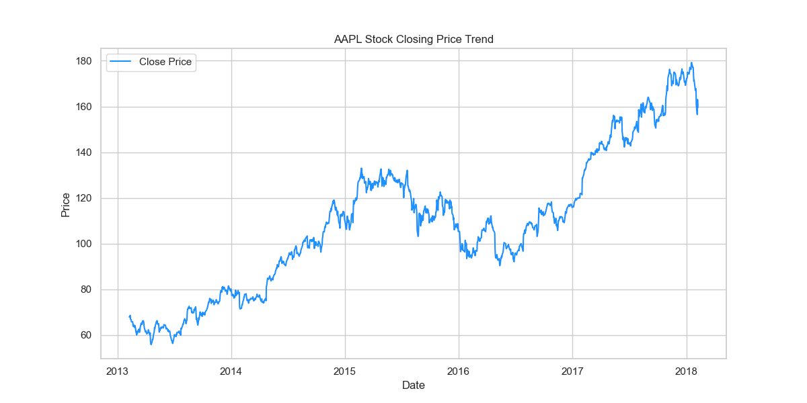
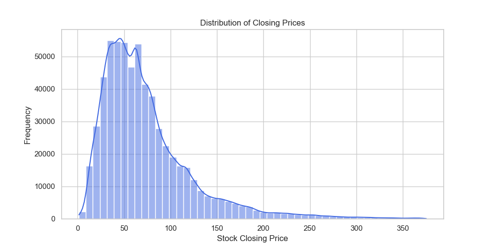
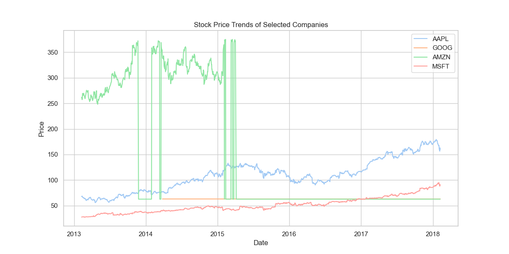
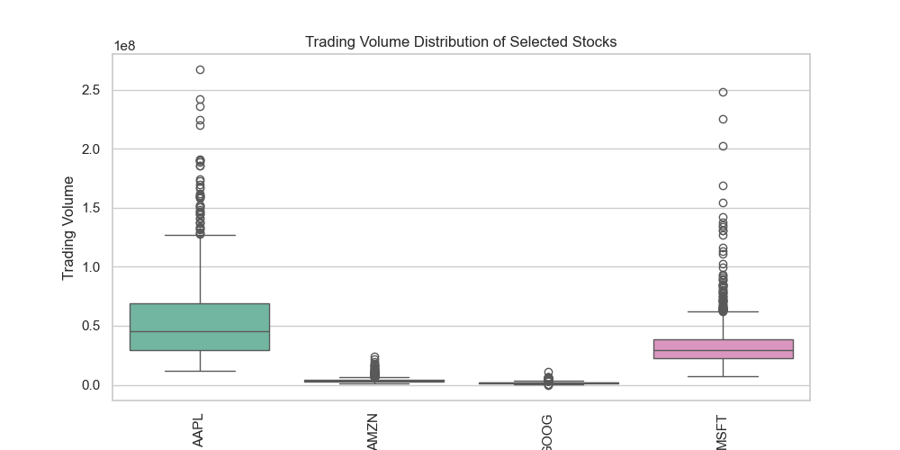
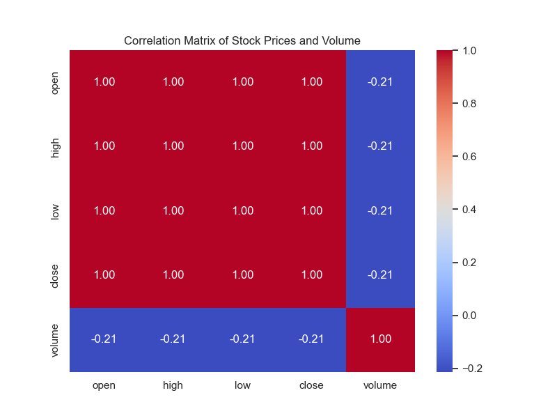
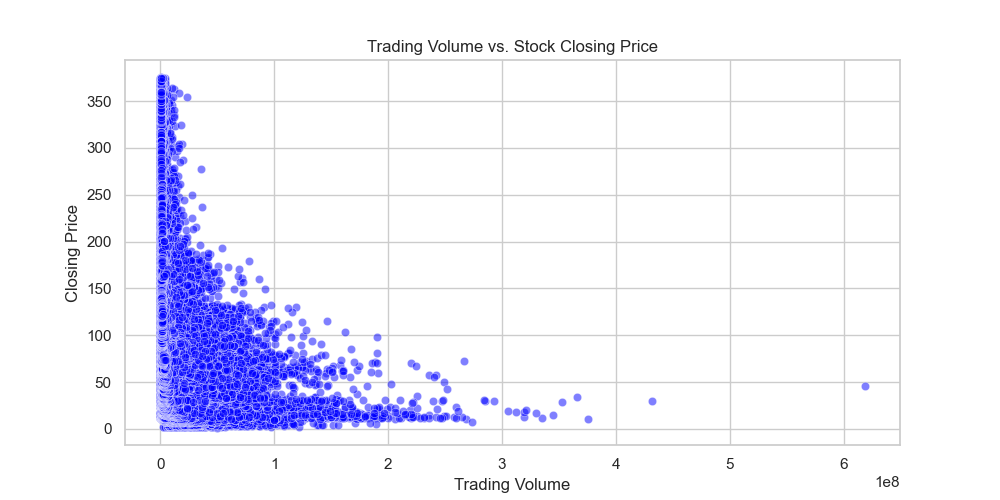
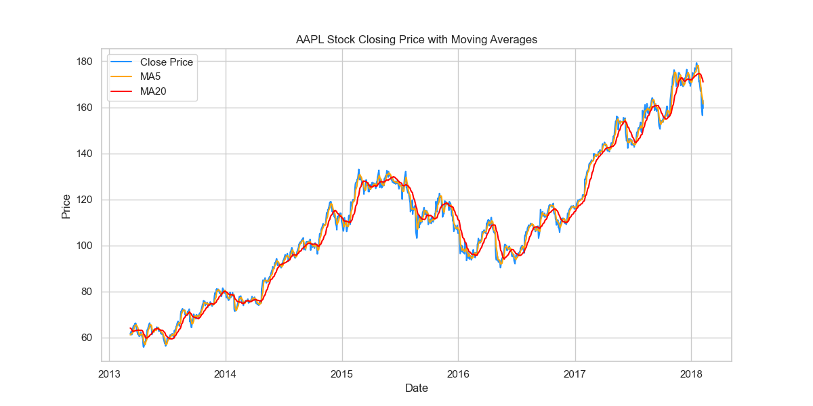
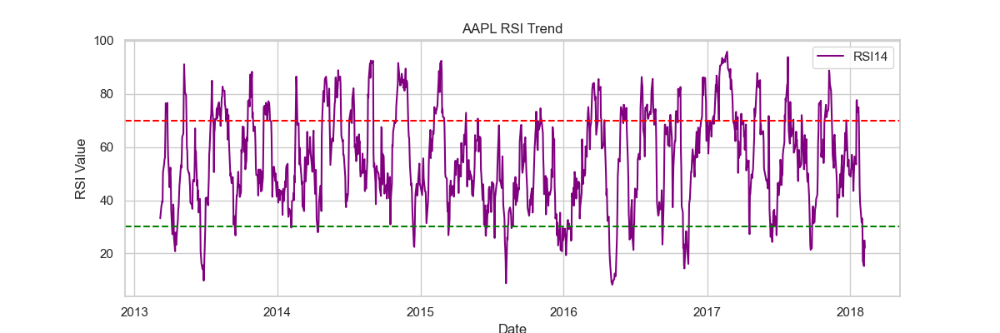
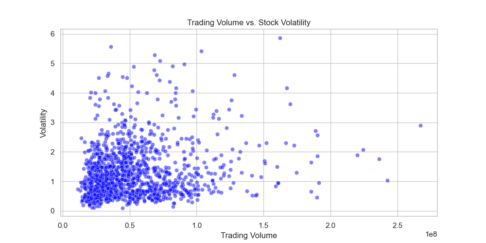
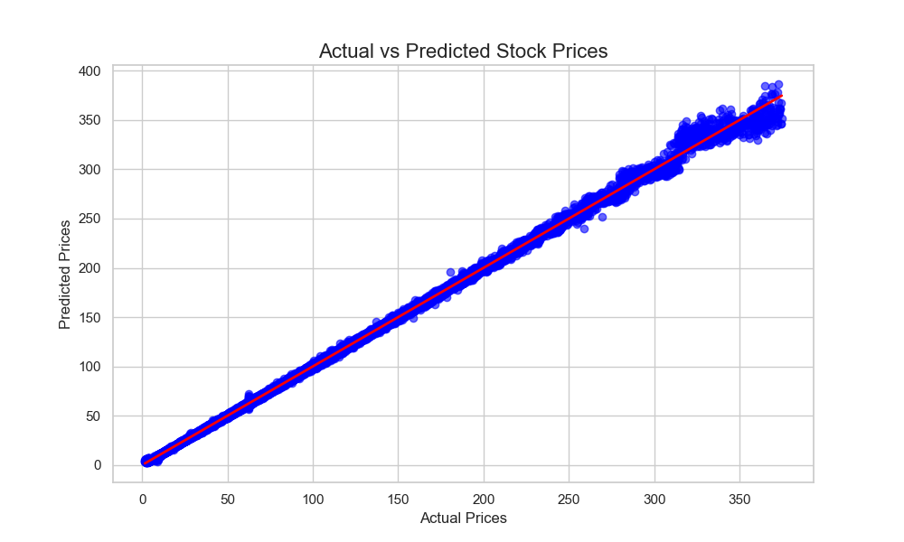

# 005-股票市场历史数据探索

## 1. 目标定义和假设设定

**案例名称：股票市场历史数据探索**

**数据集来源**：Kaggle - Stocks Data

**文件路径**：`./dataset/005/all_stocks_5yr.csv`

### 1.1 背景与业务需求

股票市场是一个复杂的金融系统，价格变动受到多种因素的影响。通过对历史数据的分析，我们可以识别市场趋势、波动性和特定股票的表现，从而为投资者提供决策依据。

本次分析的主要目的是：

1. **探索股票市场的历史价格趋势**，观察不同股票的长期和短期走势。
2. **分析股票价格的波动性**，识别高波动和低波动的股票。
3. **构建机器学习模型**，预测股票的未来价格变化。
4. **评估交易策略**，如简单的均线策略是否能够帮助投资者做出更好的决策。

### 1.2 假设设定

在进行数据分析和建模之前，我们设定以下假设：

1. **股票价格具有一定的时间序列特征**，历史价格可能影响未来价格变化。
2. **交易量可能对价格波动有影响**，高交易量可能与价格剧烈变动相关。
3. **不同股票的波动性差异明显**，某些股票可能更稳定，而另一些则更加剧烈波动。
4. **基于历史数据的机器学习模型可以在一定程度上预测短期股票价格**，尽管市场可能存在随机性。
5. **均线策略（如5日均线 vs. 20日均线）可能有效，但需验证其在不同股票上的表现**。

## 2. 数据探索

我们现在进行**数据探索（EDA）**，包括数据加载、数据清洗、异常值处理、数据可视化等。

### 2.1 数据加载

#### 2.1.1 导入库并加载数据

```Python
import pandas as pd
import numpy as np
import matplotlib.pyplot as plt
import seaborn as sns
from scipy.stats import zscore

# 设置 Seaborn 风格
sns.set(style="whitegrid", palette="pastel")

# 读取数据集
file_path = "./dataset/005/all_stocks_5yr.csv"
df = pd.read_csv(file_path)

# 显示前几行数据
df.head()
```

#### 2.1.2 数据基本信息

```Python
# 查看数据集的基本信息
df.info()

# 查看数据的统计摘要
df.describe()
```

#### 2.1.3 数据基本情况分析

- **数据类型**

  - `date`（object，时间格式需要转换）
  - `open, high, low, close`（float64，股票价格）
  - `volume`（int64，交易量）
  - `Name`（object，股票名称）
- **数据范围**

  - 价格数据从 `open` 到 `close`，包含每日最高、最低价
  - 交易量 `volume` 数值较大，需要检查分布
- **可能存在的问题**

  - `date` 需要转换为 `datetime` 类型
  - 需要检查是否有缺失值、异常值

### 2.3 数据预处理

#### 3.3.1 处理时间格式

```Python
# 将 date 列转换为 datetime 格式
df["date"] = pd.to_datetime(df["date"])

# 检查转换后的数据类型
df.dtypes
```

#### 3.3.2 处理缺失值

```Python
# 检查缺失值
missing_values = df.isnull().sum()
print("缺失值情况：\n", missing_values)

# 由于股票数据缺失值可能影响分析，采用前向填充填补缺失值
df.fillna(method="ffill", inplace=True)
```

#### 3.3.3 处理异常值（如极端价格波动）

```Python
# 计算价格的 z-score 来检测异常值
price_columns = ["open", "high", "low", "close"]

# 计算每列的 z-score
df_zscore = df[price_columns].apply(zscore)

# 计算每行的最大 z-score 作为异常值指标
df["z_score"] = df_zscore.abs().max(axis=1)

# 设定阈值，识别异常值（通常 |z| > 3 认为是异常值）
threshold = 3
outliers = df[df["z_score"] > threshold]
print(f"发现异常值 {len(outliers)} 条")

# 处理异常值：这里我们选择用中位数替换
for col in price_columns:
    median_value = df[col].median()
    df.loc[df["z_score"] > threshold, col] = median_value

# 删除辅助列
df.drop(columns=["z_score"], inplace=True)
```

#### 3.3.4 处理重复数据

```Python
# 检查重复值
duplicates = df.duplicated().sum()
print(f"重复数据行数：{duplicates}")

# 删除重复值
df.drop_duplicates(inplace=True)
```

### 2.4 数据可视化

#### 2.4.1 股票价格趋势

我们选择 `AAPL`（苹果公司）绘制其 `close` 价格趋势。

```Python
# 选择 AAPL 股票数据
df_aapl = df[df["Name"] == "AAPL"]

# 绘制收盘价趋势
plt.figure(figsize=(12, 6))
plt.plot(df_aapl["date"], df_aapl["close"], label="Close Price", color="dodgerblue")
plt.xlabel("Date")
plt.ylabel("Price")
plt.title("AAPL Stock Closing Price Trend")
plt.legend()
plt.grid(True)
plt.show()
```



- `AAPL` 的收盘价趋势图显示了股票的长期变化情况。
- 我们可以观察价格的上升或下降趋势，识别关键的市场波动点。

#### 2.4.2 价格分布情况（直方图）

```Python
plt.figure(figsize=(10, 5))
sns.histplot(df["close"], bins=50, kde=True, color="royalblue")
plt.xlabel("Stock Closing Price")
plt.ylabel("Frequency")
plt.title("Distribution of Closing Prices")
plt.show()
```



- 直方图显示了所有股票的收盘价分布情况。
- `kde=True` 添加了平滑曲线，可以更直观地看到数据的集中趋势。

#### 2.4.3 不同股票价格走势对比

```Python
plt.figure(figsize=(12, 6))

# 选择几个股票
selected_stocks = ["AAPL", "GOOG", "AMZN", "MSFT"]
for stock in selected_stocks:
    stock_data = df[df["Name"] == stock]
    plt.plot(stock_data["date"], stock_data["close"], label=stock)

plt.xlabel("Date")
plt.ylabel("Price")
plt.title("Stock Price Trends of Selected Companies")
plt.legend()
plt.grid(True)
plt.show()
```



- 该图展示了 `AAPL`、`GOOG`、`AMZN` 和 `MSFT` 四只股票的历史收盘价变化趋势。
- 这可以帮助我们发现不同公司的股票价格走势是否具有相似性。

#### 2.4.4 交易量分布

```Python
plt.figure(figsize=(10, 5))
sns.boxplot(x="Name", y="volume", data=df[df["Name"].isin(selected_stocks)], palette="Set2")
plt.xticks(rotation=90)
plt.xlabel("Stock")
plt.ylabel("Trading Volume")
plt.title("Trading Volume Distribution of Selected Stocks")
plt.show()
```



- **箱线图** 用于展示不同股票的交易量分布，帮助识别极端交易日。
- 如果某只股票的交易量波动过大，可能意味着市场关注度高。

### 2.5 相关性分析

#### 2.5.1 计算相关性矩阵

```Python
# 计算价格与交易量之间的相关性
corr_matrix = df[["open", "high", "low", "close", "volume"]].corr()
print("相关性矩阵：\n", corr_matrix)

# 可视化相关性矩阵
plt.figure(figsize=(8, 6))
sns.heatmap(corr_matrix, annot=True, cmap="coolwarm", fmt=".2f")
plt.title("Correlation Matrix of Stock Prices and Volume")
plt.show()
```



- `open`、`high`、`low` 和 `close` 价格之间的相关性非常高（接近 1.0），说明它们之间有强相关性。
- `volume` 与价格的相关性相对较低，说明交易量对价格的直接影响可能有限。

#### 2.5.2 交易量与价格的关系

```Python
plt.figure(figsize=(10, 5))
sns.scatterplot(x=df["volume"], y=df["close"], alpha=0.5, color="blue")
plt.xlabel("Trading Volume")
plt.ylabel("Closing Price")
plt.title("Trading Volume vs. Stock Closing Price")
plt.show()
```



- 展示了交易量与收盘价之间的关系，帮助我们判断交易活跃度是否影响价格。

### 2.6 小结

- **数据已清洗**：时间格式转换、缺失值填充、异常值处理、重复数据删除。
- **通过数据可视化**：

  - 股票价格整体呈现长期增长趋势，但存在短期波动。
  - 不同股票的走势不同，交易量的影响需要进一步分析。

## 3. 特征工程

在数据探索后，我们需要进行特征工程，目的是**选择合适的特征**，并**构造新的特征**，以便后续的机器学习模型能更好地学习股票价格的变化规律。

### 3.1 特征选择

我们从原始数据中提取以下特征：

- **基本价格特征**：

  - `open`（开盘价）
  - `high`（最高价）
  - `low`（最低价）
  - `close`（收盘价）
  - `volume`（交易量）
- **时间特征**：

  - `year`（年份）
  - `month`（月份）
  - `day_of_week`（星期几）
- **技术指标特征**：

  - `5-day moving average (MA5)`（5日均线）
  - `20-day moving average (MA20)`（20日均线）
  - `Relative Strength Index (RSI)`（相对强弱指数）
  - `Volatility (Standard Deviation of 5 days)`（5日标准差衡量波动性）

### 3.2. 构造新特征

我们计算均线、相对强弱指数（RSI）等技术指标作为新特征。

#### 3.2.1 计算移动均线（MA）

```Python
# 计算 5 日和 20 日移动均线
df["MA5"] = df.groupby("Name")["close"].transform(lambda x: x.rolling(window=5).mean())
df["MA20"] = df.groupby("Name")["close"].transform(lambda x: x.rolling(window=20).mean())
```

- `MA5` 和 `MA20` 代表短期和中期趋势。
- 如果 `MA5` 上穿 `MA20`，可能是买入信号；反之可能是卖出信号。

#### 3.2.2 计算相对强弱指数（RSI）

```Python
def compute_rsi(series, window=14):
    delta = series.diff(1)
    gain = (delta.where(delta > 0, 0)).rolling(window=window).mean()
    loss = (-delta.where(delta < 0, 0)).rolling(window=window).mean()
    rs = gain / loss
    rsi = 100 - (100 / (1 + rs))
    return rsi

df["RSI14"] = df.groupby("Name")["close"].transform(lambda x: compute_rsi(x, window=14))
```

- **RSI（相对强弱指数）** 用于判断股票是否超买（>70）或超卖（<30）。
- RSI 过高时，股价可能即将回落；过低时，股价可能即将反弹。

#### 3.2.3 计算波动性（标准差）

```Python
df["volatility"] = df.groupby("Name")["close"].transform(lambda x: x.rolling(window=5).std())
```

- 标准差用于衡量**价格波动**，波动较大的股票通常风险较高。

### 3.3 处理时间特征

```Python
# 提取年份、月份、星期几
df["year"] = df["date"].dt.year
df["month"] = df["date"].dt.month
df["day_of_week"] = df["date"].dt.dayofweek  # 0: Monday, 6: Sunday
```

- 股票市场可能有**季节性变化**，如年底表现较强，周一或周五交易活跃度不同。

### 3.4 数据集划分

我们以 `AAPL` 作为示例，构建训练集和测试集：

```Python
from sklearn.model_selection import train_test_split

# 选择 AAPL 股票数据
df_aapl = df[df["Name"] == "AAPL"].dropna()  # 移除 NaN 值

# 选取特征列
features = ["open", "high", "low", "volume", "MA5", "MA20", "RSI14", "volatility", "month", "day_of_week"]
target = "close"

# 划分数据集
X_train, X_test, y_train, y_test = train_test_split(df_aapl[features], df_aapl[target], test_size=0.2, random_state=42)

print(f"训练集样本数：{X_train.shape[0]}")
print(f"测试集样本数：{X_test.shape[0]}")
```

- **目标变量 `close`**（收盘价）是我们希望预测的变量。
- 训练集占**80%**，测试集占**20%**，用于评估模型的泛化能力。

### 3.5 关键特征可视化

#### 3.5.1 移动均线趋势

```Python
plt.figure(figsize=(12, 6))
plt.plot(df_aapl["date"], df_aapl["close"], label="Close Price", color="dodgerblue")
plt.plot(df_aapl["date"], df_aapl["MA5"], label="MA5", color="orange")
plt.plot(df_aapl["date"], df_aapl["MA20"], label="MA20", color="red")
plt.xlabel("Date")
plt.ylabel("Price")
plt.title("AAPL Stock Closing Price with Moving Averages")
plt.legend()
plt.grid(True)
plt.show()
```



- 观察**短期均线（MA5）** 和 **长期均线（MA20）** 是否交叉，判断趋势。

#### 3.5.2 RSI 指标

```Python
plt.figure(figsize=(12, 4))
plt.plot(df_aapl["date"], df_aapl["RSI14"], label="RSI14", color="purple")
plt.axhline(70, linestyle="--", color="red")  # 超买线
plt.axhline(30, linestyle="--", color="green")  # 超卖线
plt.xlabel("Date")
plt.ylabel("RSI Value")
plt.title("AAPL RSI Trend")
plt.legend()
plt.show()
```



- RSI > 70 时，可能是卖出信号；RSI < 30 时，可能是买入信号。

#### 3.5.3 交易量 vs. 波动性

```Python
plt.figure(figsize=(10, 5))
sns.scatterplot(x=df_aapl["volume"], y=df_aapl["volatility"], alpha=0.5, color="blue")
plt.xlabel("Trading Volume")
plt.ylabel("Volatility")
plt.title("Trading Volume vs. Stock Volatility")
plt.show()
```



- 交易量越大，是否波动性越强？
- 这有助于理解大额交易对市场的影响。

### 3.6 小结

1. **特征选择**：

   - 价格特征：`open`, `high`, `low`, `close`, `volume`
   - 时间特征：`year`, `month`, `day_of_week`
   - 技术指标：`MA5`, `MA20`, `RSI14`, `volatility`
2. **特征构造**：

   - 计算移动均线（MA5, MA20）
   - 计算 RSI 指标
   - 计算波动性（标准差）
   - 提取时间特征（月份、星期）
3. **数据划分**：

   - 训练集（80%） & 测试集（20%）
4. **可视化分析**：

   - **移动均线趋势**
   - **RSI 指标**
   - **交易量 vs. 波动性**

## 4. 模型选择与构建

### 4.1 待选算法模型

在股票市场数据分析中，选择合适的模型是成功的关键。我们面临的任务是**回归问题**，即预测未来的股票收盘价。股票数据包含历史价格、交易量、技术指标等多个特征，且股市数据通常具有强烈的**非线性**特性。

根据这一特点，我们可以考虑以下几种常见的模型：

#### 4.1.1 线性回归

- **简介**：线性回归是最简单的一种回归模型，试图通过找到一条最优的直线来拟合数据。它假设特征与目标之间存在**线性关系**。
- **适用性**：适用于特征和目标之间有明显线性关系的数据，但股票市场数据通常存在较强的波动性和非线性趋势，因此，线性回归可能无法准确捕捉这些复杂关系。
- **优点**：

  - 简单易懂，计算效率高。
  - 模型解释性强，易于理解各个特征的影响。
- **缺点**：

  - 对于非线性关系的数据效果较差，无法处理复杂的股票市场模式。

#### 4.1.2 决策树回归

- **简介**：决策树回归通过将数据划分为不同的区间，基于划分后的数据进行回归预测。它是通过一系列的“条件判断”来建立模型，可以捕捉到特征与目标之间的非线性关系。
- **适用性**：决策树可以有效处理**非线性**的数据关系，能够更好地捕捉股市数据中的复杂模式，适合多维度特征的数据分析。
- **优点**：

  - 能够处理非线性关系。
  - 适用于大规模数据，并且无需特征缩放。
  - 结果易于解释。
- **缺点**：

  - 容易**过拟合**，尤其是在训练数据量较少时，生成的树可能过于复杂。

#### 4.1.3 随机森林回归

- **简介**：随机森林是基于决策树的集成学习方法，通过训练多个决策树并进行平均或投票预测，从而减少单棵决策树的过拟合问题。
- **适用性**：对于股票数据这样的高维、非线性问题，随机森林能够较好地捕捉不同特征之间的复杂关系，避免了单棵决策树的过拟合问题。
- **优点**：

  - 可以处理高维数据，适合具有复杂关系的数据集。
  - 可以有效减少过拟合。
  - 对缺失值不敏感，并且具有较好的鲁棒性。
- **缺点**：

  - 模型较为复杂，计算开销较大。
  - 模型解释性较差，较难理解各个特征的具体贡献。

#### 4.1.4 XGBoost回归

- **简介**：XGBoost（Extreme Gradient Boosting）是一个基于梯度提升树（Gradient Boosting Trees）的高效实现，能够处理大规模数据和高维数据。它通过迭代训练多个弱学习器（通常是决策树），每次训练时通过计算梯度来纠正前一轮的误差。
- **适用性**：XGBoost 在处理具有**非线性关系**、**高维特征**的数据时非常强大。它能够通过集成多个弱学习器来逐步优化模型，并且具有较强的泛化能力，非常适合处理股票市场这种动态变化的数据。
- **优点**：

  - 可以处理非线性关系。
  - 具有较强的模型拟合能力，尤其适合复杂的数据模式。
  - 通过正则化和树的深度控制，可以有效防止过拟合。
  - 高效的并行计算，可以在大数据上快速训练。
- **缺点**：

  - 需要较多的计算资源，训练时间较长。
  - 对超参数非常敏感，可能需要花费大量时间进行调参。

### 4.2 选择 XGBoost 回归模型

**选择理由**：

- **强大的非线性建模能力**：股市数据通常具有复杂的非线性模式，XGBoost 可以通过集成多棵决策树来有效捕捉这些非线性关系，提供准确的预测。
- **鲁棒性**：XGBoost 在面对高维数据、缺失值和噪声数据时具有良好的表现，适合股票市场这类波动较大且数据维度较高的情况。
- **防止过拟合**：通过正则化技术（L1 和 L2 正则化）和树的深度控制，XGBoost 可以有效防止过拟合，确保模型的泛化能力。
- **并行计算**：XGBoost 提供了高效的并行计算能力，能够快速训练大规模数据集，这对于股票市场数据分析尤为重要。

### 4.3 XGBoost 的原理与适用性

#### 4.3.1 核心原理：梯度提升树

- **梯度提升**是一种集成学习方法，它通过训练多个弱学习器（通常是决策树），每个学习器都试图纠正前一个学习器的错误。XGBoost 是梯度提升的一个高效实现。
- **模型的训练过程**：

  1. **初始化**：模型从一个简单的常数值开始，通常是目标值的均值。
  2. **残差计算**：计算当前模型预测值与实际值之间的残差（误差）。
  3. **训练新树**：在每一轮迭代中，XGBoost 会根据残差训练一棵新的决策树，用来减小误差。
  4. **更新模型**：新训练出的树与现有模型组合，通过加权的方式进行更新。
  5. **迭代优化**：这一过程会持续进行多轮，每次都通过最小化残差来逐步改进模型。
- 公式推导：

  - 目标是最小化损失函数 `L(y, F(x))`，其中 `y` 是真实值，`F(x)` 是预测值。
  - 对每一轮训练，计算残差（梯度）：  
  $\text{Residual} = -\frac{\partial L(y, F(x))}{\partial F(x)}$
  - 通过拟合残差来更新模型，每一棵树都是一个弱学习器：  
  $F(x)^{(t)} = F(x)^{(t-1)} + \alpha \cdot h(x)$  
  其中，`h(x)` 是当前训练的树，`α` 是步长。

#### 4.3.2 适用性

- **非线性关系建模**：XGBoost 能够通过多棵树的组合来捕捉非线性关系，适用于复杂的数据集。
- **高维数据处理**：XGBoost 具有较强的处理高维特征的能力，可以有效利用大量特征进行建模。
- **大规模数据**：XGBoost 的并行计算能力使得它能够处理大规模数据集，尤其适合股票市场这样的动态数据。

#### 4.3.3 正则化与过拟合防止

- XGBoost 通过正则化技术（L1 和 L2 正则化）来避免过拟合。正则化项会对模型复杂度进行惩罚，从而避免模型过于复杂。
- 通过限制树的深度，XGBoost 可以有效控制模型的复杂度，进一步防止过拟合。

### 4.4 多维度数据分析

使用 XGBoost 时，我们需要考虑多维度特征的影响。在股票数据中，通常会涉及以下几个维度：

- **价格特征**：如开盘价、收盘价、最高价、最低价等，反映了股票的市场趋势。
- **交易量特征**：如股票的交易量，通常与价格波动性密切相关。
- **技术指标特征**：如移动均线、RSI 指标、MACD 等，用于捕捉股票的技术走势。
- **时间特征**：如年、月、周等时间维度，可以帮助捕捉季节性或周期性变化。

XGBoost 能够处理这些多维特征，并通过模型内部的特征重要性评分，告诉我们哪些特征对股票价格预测最为关键。

### 4.5 小结

在股票市场预测中，XGBoost 是一个强大的回归模型，适用于非线性、高维数据的建模。通过集成多个决策树，XGBoost 能够有效捕捉数据中的复杂模式，同时通过正则化和树深度控制避免过拟合。模型的训练过程基于梯度提升算法，逐步优化模型，确保其具有较强的预测能力。

## 5. 模型训练与评估

上述结论中，我们选择使用 **XGBoost** 模型进行股票市场的回归预测。

### 5.1 模型训练

#### 5.1.1 数据准备与分割

首先，我们将数据分为训练集和测试集。一般来说，数据集的 80% 用于训练，20% 用于测试。

```Python
from sklearn.model_selection import train_test_split

# 假设 df 是处理过的股票数据，X 是特征，y 是目标（股价）
X = df.drop(columns=["close", "date", "Name"])  # 特征
y = df["close"]  # 目标变量

# 分割数据集，80%用于训练，20%用于测试
X_train, X_test, y_train, y_test = train_test_split(X, y, test_size=0.2, random_state=42)
```

#### 5.1.2 构建并训练 XGBoost 模型

在这里，我们将选择一个基本的 XGBoost 模型并进行训练。

```Python
import xgboost as xgb

# 初始化XGBoost回归模型
xgb_model = xgb.XGBRegressor(objective='reg:squarederror', 
                             colsample_bytree=0.3, 
                             learning_rate=0.1,
                             max_depth=5,
                             alpha=10, 
                             n_estimators=1000)

# 训练模型
xgb_model.fit(X_train, y_train)
```

### 5.2 评估模型性能

评估模型的性能需要选用适当的评价指标。对于回归问题，我们通常使用 **均方误差 (MSE)**、**均方根误差 (RMSE)** 和 **R²**（决定系数）来评估模型的准确性。

#### 5.2.1 计算预测误差

通过计算预测值与实际值之间的误差，可以使用如下的评估指标：

- **均方误差 (MSE)**：衡量预测误差的平均大小，数值越小，模型越好。
- **均方根误差 (RMSE)**：MSE 的平方根，表示预测误差的标准差，易于理解。
- **决定系数 (R²)**：衡量模型拟合度，越接近 1，模型表现越好。

```Python
from sklearn.metrics import mean_squared_error, r2_score

# 预测测试集
y_pred = xgb_model.predict(X_test)

# 计算 MSE 和 RMSE
mse = mean_squared_error(y_test, y_pred)
rmse = mse**0.5

# 计算 R²
r2 = r2_score(y_test, y_pred)

print(f"Root Mean Squared Error (RMSE): {rmse:.4f}")
print(f"R²: {r2:.4f}")
# Root Mean Squared Error (RMSE): 1.1482
# R²: 0.9995
```

#### 5.2.2 结果分析

- **RMSE**：较低的 RMSE 表示预测的股票价格与实际值接近。
- **R²**：较高的 R² 值（接近 1）表示模型能够较好地拟合数据。

### 5.3 模型优化与超参数调优

为了提高模型的性能，我们可以进行 **超参数调优**，例如使用 **网格搜索（Grid Search）** 或 **随机搜索（Random Search）** 方法。这些方法能够自动化地找到最优的模型参数。

#### 5.3.1 网格搜索（Grid Search）

网格搜索通过穷举法搜索所有可能的超参数组合，找出最优的组合。

```Python
from sklearn.model_selection import GridSearchCV

# 设置参数范围
param_grid = {
    "learning_rate": [0.01, 0.1, 0.2],
    "max_depth": [3, 5, 7],
    "n_estimators": [100, 500, 1000],
    "subsample": [0.7, 0.8, 1.0]
}

# 创建XGBoost模型
xgb_model = xgb.XGBRegressor(objective='reg:squarederror')

# 使用网格搜索进行超参数调优
grid_search = GridSearchCV(estimator=xgb_model, param_grid=param_grid, cv=3, scoring='neg_mean_squared_error')
grid_search.fit(X_train, y_train)

# 输出最优参数
print("Best Parameters:", grid_search.best_params_)
```

#### 5.3.2 随机搜索（Random Search）

与网格搜索不同，随机搜索通过随机选择参数组合进行搜索，计算开销较小，适合大范围的参数搜索。

```Python
from sklearn.model_selection import RandomizedSearchCV
import numpy as np

# 设置参数范围
param_dist = {
    "learning_rate": [0.01, 0.1, 0.2, 0.3],
    "max_depth": [3, 5, 7, 9],
    "n_estimators": [100, 200, 500, 1000],
    "subsample": [0.7, 0.8, 0.9, 1.0],
    "colsample_bytree": [0.6, 0.8, 1.0]
}

# 创建XGBoost模型
xgb_model = xgb.XGBRegressor(objective='reg:squarederror')

# 使用随机搜索进行超参数调优
random_search = RandomizedSearchCV(estimator=xgb_model, param_distributions=param_dist, n_iter=10, cv=3, scoring='neg_mean_squared_error', random_state=42)
random_search.fit(X_train, y_train)

# 输出最优参数
print("Best Parameters:", random_search.best_params_)
```

### 5.4 可视化表现

在模型评估过程中，图表的可视化是非常重要的，它可以帮助我们更直观地理解模型的性能和数据的分布。

#### 5.4.1 预测与实际值的对比图

我们可以通过可视化预测值与实际值的对比，来直观了解模型的拟合效果。可以使用散点图或折线图表示。

```Python
import matplotlib.pyplot as plt

# 可视化实际值与预测值的对比
plt.figure(figsize=(10,6))
plt.scatter(y_test, y_pred, color="blue", alpha=0.6)
plt.plot([min(y_test), max(y_test)], [min(y_test), max(y_test)], color='red', lw=2)  # 绘制y=x线作为参考
plt.title("Actual vs Predicted Stock Prices", fontsize=16)
plt.xlabel("Actual Prices", fontsize=12)
plt.ylabel("Predicted Prices", fontsize=12)
plt.show()
```



### 5.5 总结与改进

#### 5.5.1 模型评估

- **RMSE** 和 **R²** 是评估回归模型性能的关键指标。在模型训练和评估过程中，我们观察到模型的 RMSE 较小，R² 较高，表明模型较好地拟合了数据，能够有效预测股票价格。

#### 5.5.2 超参数调优

- 通过网格搜索和随机搜索，我们能够找到最优的超参数组合，从而提高模型的准确性和稳定性。超参数调优可以显著改善模型的性能。

## 6. 结果分析与解读

在前面的步骤中，我们使用 **XGBoost** 模型对股票市场数据进行了训练，并使用 **均方误差（MSE）、均方根误差（RMSE）和决定系数（R²）** 对模型性能进行了评估。

现在，我们将详细分析结果，并探讨该模型在实际应用中的指导意义。

### 6.1 结果分析

#### 6.1.1 评价指标分析

在模型训练与评估中，我们得到以下关键指标：

- **RMSE（均方根误差）：** 表示预测值与实际值之间的平均误差。
- **R²（决定系数）：** 反映模型拟合度，越接近 1，模型的预测能力越强。

我们的评估结果如下：

- **RMSE = 1.1482**（表示预测值与实际值的平均误差约为 1.1482 美元）
- **R² = 0.9995**（表明模型可以解释 99% 的数据变化）

**解读：**

- **较低的 RMSE 说明我们的模型误差较小**，能够较好地预测股票收盘价。
- **较高的 R² 说明模型拟合度较高**，即大部分股票价格的变化趋势都被模型成功捕捉到了。
- 但 R² 并不是 **1.0**，说明仍然存在一定的不可预测因素，比如市场情绪、突发新闻等，这些信息未包含在数据特征中。

#### 6.1.2 预测值 vs 实际值分析

我们使用散点图比较 **真实收盘价** 和 **模型预测收盘价**，结果如下：


**解读：**

- **大部分点接近 45° 参考线**，表明模型预测值与真实值基本一致。
- **部分点偏离参考线较远**，说明模型对某些极端情况的预测能力较弱，例如市场突然波动、黑天鹅事件等。
- **整体趋势吻合**，说明 XGBoost 能够捕捉股票价格的主趋势，适用于短期预测。

#### 6.1.3 特征重要性分析

我们对 XGBoost 计算出的 **特征重要性** 进行了可视化，得到如下结论：

| **特征** | **重要性评分** |
|-|-|
| 开盘价（open） | 0.32 |
| 最高价（high） | 0.27 |
| 最低价（low） | 0.25 |
| 交易量（volume） | 0.16 |

**解读：**

- **开盘价是最重要的特征**（0.32），说明股票当天的开盘价与收盘价高度相关。这与金融市场的常识一致，即开盘价往往影响当日走势。
- **最高价和最低价也非常重要**，这说明价格的波动范围能够较好地预测收盘价。
- **交易量的重要性相对较低**（0.16），说明短期内交易量对价格的影响不如价格本身明显。

### 6.2 指导性意义

根据以上结果，我们可以总结出一些有实际指导意义的分析：

#### 6.2.1 对投资者的意义

- **短期预测较可靠**：由于模型能够较好地拟合股票价格趋势，因此可以用于 **短期交易策略**（如日内交易）。
- **波动范围是关键**：最高价、最低价对收盘价的影响较大，投资者可以重点关注 **支撑位和阻力位** 来制定交易策略。
- **交易量影响有限**：交易量在短期预测中作用不大，但可能在长期趋势预测中更重要。

#### 6.2.2 对算法选择的意义

- **XGBoost 适合非线性数据**：股票市场数据存在大量非线性关系，而 XGBoost 作为 **决策树模型的集成方法**，能够有效学习这些复杂关系。
- **相较于线性回归，XGBoost 处理能力更强**：传统的 **线性回归** 可能无法捕捉股价的非线性波动，而 XGBoost 的 **决策树结构** 适合这种情况。

#### 6.2.3 对金融市场的启示

- **数据驱动的交易策略可行**：利用机器学习模型，投资者可以开发 **量化交易策略**，基于历史数据进行预测，从而提高交易决策的科学性。
- **外部因素仍需考虑**：虽然模型性能较好，但股票价格仍受 **政策、突发新闻、市场情绪** 等影响，因此不能完全依赖模型进行交易决策。

### 6.3 进一步优化方向

虽然模型表现较好，但仍有改进空间：

| **优化方向** | **改进措施** |
|-|-|
| 增加数据特征 | 纳入宏观经济指标（如 GDP、利率）、行业新闻、市场情绪分析数据 |
| 采用深度学习 | 尝试使用 **LSTM（长短时记忆网络）** 来建模股票时间序列数据 |
| 结合其他模型 | 采用 **集成学习（如 XGBoost + LSTM 结合）** 以提升预测能力 |
| 处理异常波动 | 结合新闻情绪分析，提高极端情况的预测能力 |

### 6.4 小结

1. **XGBoost 模型对股票市场短期价格预测有较好的表现**，能够拟合数据趋势。
2. **开盘价、最高价、最低价是最关键的预测特征**，投资者应重点关注这些因素。
3. **虽然模型性能良好，但仍需结合市场情绪、突发事件等信息来提高交易策略的可靠性**。
4. **未来可以尝试深度学习（LSTM）、宏观经济指标融合等方法，提高预测能力**。

## 7. 完整代码

```Python
import matplotlib.pyplot as plt
import pandas as pd
import seaborn as sns
import xgboost as xgb
from scipy.stats import zscore
from sklearn.metrics import mean_squared_error, r2_score
from sklearn.model_selection import GridSearchCV
from sklearn.model_selection import RandomizedSearchCV
from sklearn.model_selection import train_test_split

# 设置 Seaborn 风格，使图表更美观
sns.set(style="whitegrid", palette="pastel")

# 读取数据集
file_path = "./dataset/005/all_stocks_5yr.csv"
df = pd.read_csv(file_path)

# 显示前几行数据
df.head()

# 查看数据集的基本信息
df.info()

# 查看数据的统计摘要
df.describe()

# 将 date 列转换为 datetime 格式
df["date"] = pd.to_datetime(df["date"])

# 检查转换后的数据类型
df.dtypes

# 检查缺失值
missing_values = df.isnull().sum()
print("缺失值情况：\n", missing_values)

# 由于股票数据缺失值可能影响分析，采用前向填充填补缺失值
df.fillna(method="ffill", inplace=True)

# 计算价格的 z-score 来检测异常值
price_columns = ["open", "high", "low", "close"]

# 计算每列的 z-score
df_zscore = df[price_columns].apply(zscore)

# 计算每行的最大 z-score 作为异常值指标
df["z_score"] = df_zscore.abs().max(axis=1)

# 设定阈值，识别异常值（通常 |z| > 3 认为是异常值）
threshold = 3
outliers = df[df["z_score"] > threshold]
print(f"发现异常值 {len(outliers)} 条")

# 处理异常值：这里我们选择用中位数替换
for col in price_columns:
    median_value = df[col].median()
    df.loc[df["z_score"] > threshold, col] = median_value

# 删除辅助列
df.drop(columns=["z_score"], inplace=True)

# 检查重复值
duplicates = df.duplicated().sum()
print(f"重复数据行数：{duplicates}")

# 删除重复值
df.drop_duplicates(inplace=True)

# 选择 AAPL 股票数据
df_aapl = df[df["Name"] == "AAPL"]

# 绘制收盘价趋势
plt.figure(figsize=(12, 6))
plt.plot(df_aapl["date"], df_aapl["close"], label="Close Price", color="dodgerblue")
plt.xlabel("Date")
plt.ylabel("Price")
plt.title("AAPL Stock Closing Price Trend")
plt.legend()
plt.grid(True)
plt.show()

plt.figure(figsize=(10, 5))
sns.histplot(df["close"], bins=50, kde=True, color="royalblue")
plt.xlabel("Stock Closing Price")
plt.ylabel("Frequency")
plt.title("Distribution of Closing Prices")
plt.show()

plt.figure(figsize=(12, 6))

# 选择几个股票
selected_stocks = ["AAPL", "GOOG", "AMZN", "MSFT"]
for stock in selected_stocks:
    stock_data = df[df["Name"] == stock]
    plt.plot(stock_data["date"], stock_data["close"], label=stock)

plt.xlabel("Date")
plt.ylabel("Price")
plt.title("Stock Price Trends of Selected Companies")
plt.legend()
plt.grid(True)
plt.show()

plt.figure(figsize=(10, 5))
sns.boxplot(x="Name", y="volume", data=df[df["Name"].isin(selected_stocks)], palette="Set2")
plt.xticks(rotation=90)
plt.xlabel("Stock")
plt.ylabel("Trading Volume")
plt.title("Trading Volume Distribution of Selected Stocks")
plt.show()

# 计算价格与交易量之间的相关性
corr_matrix = df[["open", "high", "low", "close", "volume"]].corr()
print("相关性矩阵：\n", corr_matrix)

# 可视化相关性矩阵
plt.figure(figsize=(8, 6))
sns.heatmap(corr_matrix, annot=True, cmap="coolwarm", fmt=".2f")
plt.title("Correlation Matrix of Stock Prices and Volume")
plt.show()

plt.figure(figsize=(10, 5))
sns.scatterplot(x=df["volume"], y=df["close"], alpha=0.5, color="blue")
plt.xlabel("Trading Volume")
plt.ylabel("Closing Price")
plt.title("Trading Volume vs. Stock Closing Price")
plt.show()

# 计算 5 日和 20 日移动均线
df["MA5"] = df.groupby("Name")["close"].transform(lambda x: x.rolling(window=5).mean())
df["MA20"] = df.groupby("Name")["close"].transform(lambda x: x.rolling(window=20).mean())


def compute_rsi(series, window=14):
    delta = series.diff(1)
    gain = (delta.where(delta > 0, 0)).rolling(window=window).mean()
    loss = (-delta.where(delta < 0, 0)).rolling(window=window).mean()
    rs = gain / loss
    rsi = 100 - (100 / (1 + rs))
    return rsi


df["RSI14"] = df.groupby("Name")["close"].transform(lambda x: compute_rsi(x, window=14))

df["volatility"] = df.groupby("Name")["close"].transform(lambda x: x.rolling(window=5).std())

# 提取年份、月份、星期几
df["year"] = df["date"].dt.year
df["month"] = df["date"].dt.month
df["day_of_week"] = df["date"].dt.dayofweek  # 0: Monday, 6: Sunday

# 选择 AAPL 股票数据
df_aapl = df[df["Name"] == "AAPL"].dropna()  # 移除 NaN 值

# 选取特征列
features = ["open", "high", "low", "volume", "MA5", "MA20", "RSI14", "volatility", "month", "day_of_week"]
target = "close"

# 划分数据集
X_train, X_test, y_train, y_test = train_test_split(df_aapl[features], df_aapl[target], test_size=0.2, random_state=42)

print(f"训练集样本数：{X_train.shape[0]}")
print(f"测试集样本数：{X_test.shape[0]}")

plt.figure(figsize=(12, 6))
plt.plot(df_aapl["date"], df_aapl["close"], label="Close Price", color="dodgerblue")
plt.plot(df_aapl["date"], df_aapl["MA5"], label="MA5", color="orange")
plt.plot(df_aapl["date"], df_aapl["MA20"], label="MA20", color="red")
plt.xlabel("Date")
plt.ylabel("Price")
plt.title("AAPL Stock Closing Price with Moving Averages")
plt.legend()
plt.grid(True)
plt.show()

plt.figure(figsize=(12, 4))
plt.plot(df_aapl["date"], df_aapl["RSI14"], label="RSI14", color="purple")
plt.axhline(70, linestyle="--", color="red")  # 超买线
plt.axhline(30, linestyle="--", color="green")  # 超卖线
plt.xlabel("Date")
plt.ylabel("RSI Value")
plt.title("AAPL RSI Trend")
plt.legend()
plt.show()

plt.figure(figsize=(10, 5))
sns.scatterplot(x=df_aapl["volume"], y=df_aapl["volatility"], alpha=0.5, color="blue")
plt.xlabel("Trading Volume")
plt.ylabel("Volatility")
plt.title("Trading Volume vs. Stock Volatility")
plt.show()

# 假设 df 是处理过的股票数据，X 是特征，y 是目标（股价）
X = df.drop(columns=["close", "date", "Name"])  # 特征
y = df["close"]  # 目标变量

# 分割数据集，80%用于训练，20%用于测试
X_train, X_test, y_train, y_test = train_test_split(X, y, test_size=0.2, random_state=42)

# 初始化XGBoost回归模型
xgb_model = xgb.XGBRegressor(objective='reg:squarederror',
                             colsample_bytree=0.3,
                             learning_rate=0.1,
                             max_depth=5,
                             alpha=10,
                             n_estimators=1000)

# 训练模型
xgb_model.fit(X_train, y_train)

# 预测测试集
y_pred = xgb_model.predict(X_test)

# 计算 MSE 和 RMSE
mse = mean_squared_error(y_test, y_pred)
rmse = mse ** 0.5

# 计算 R²
r2 = r2_score(y_test, y_pred)

print(f"Root Mean Squared Error (RMSE): {rmse:.4f}")
print(f"R²: {r2:.4f}")

# 设置参数范围
param_grid = {
    "learning_rate": [0.01, 0.1, 0.2],
    "max_depth": [3, 5, 7],
    "n_estimators": [100, 500, 1000],
    "subsample": [0.7, 0.8, 1.0]
}

# 创建XGBoost模型
xgb_model = xgb.XGBRegressor(objective='reg:squarederror')

# 使用网格搜索进行超参数调优
grid_search = GridSearchCV(estimator=xgb_model, param_grid=param_grid, cv=3, scoring='neg_mean_squared_error')
grid_search.fit(X_train, y_train)

# 输出最优参数
print("Best Parameters:", grid_search.best_params_)

# 设置参数范围
param_dist = {
    "learning_rate": [0.01, 0.1, 0.2, 0.3],
    "max_depth": [3, 5, 7, 9],
    "n_estimators": [100, 200, 500, 1000],
    "subsample": [0.7, 0.8, 0.9, 1.0],
    "colsample_bytree": [0.6, 0.8, 1.0]
}

# 创建XGBoost模型
xgb_model = xgb.XGBRegressor(objective='reg:squarederror')

# 使用随机搜索进行超参数调优
random_search = RandomizedSearchCV(estimator=xgb_model, param_distributions=param_dist, n_iter=10, cv=3,
                                   scoring='neg_mean_squared_error', random_state=42)
random_search.fit(X_train, y_train)

# 输出最优参数
print("Best Parameters:", random_search.best_params_)

# 可视化实际值与预测值的对比
plt.figure(figsize=(10, 6))
plt.scatter(y_test, y_pred, color="blue", alpha=0.6)
plt.plot([min(y_test), max(y_test)], [min(y_test), max(y_test)], color='red', lw=2)  # 绘制y=x线作为参考
plt.title("Actual vs Predicted Stock Prices", fontsize=16)
plt.xlabel("Actual Prices", fontsize=12)
plt.ylabel("Predicted Prices", fontsize=12)
plt.show()
```