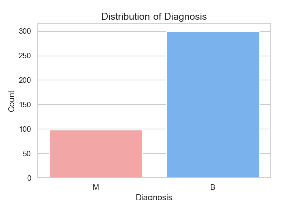
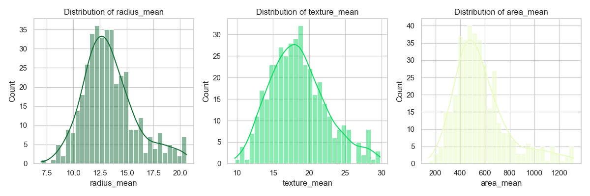
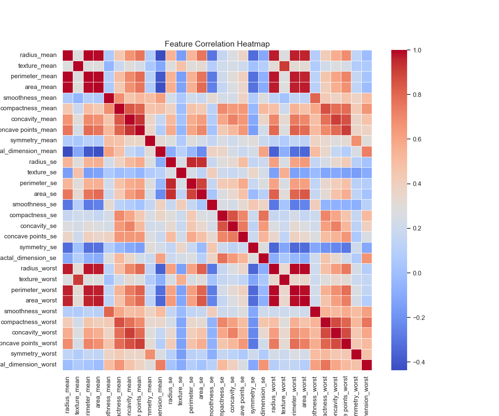
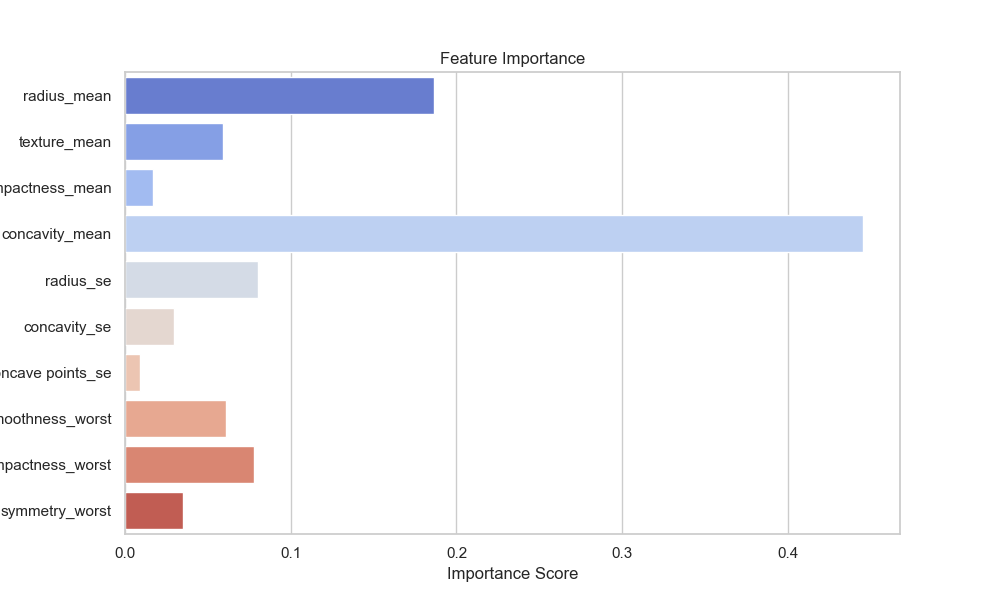
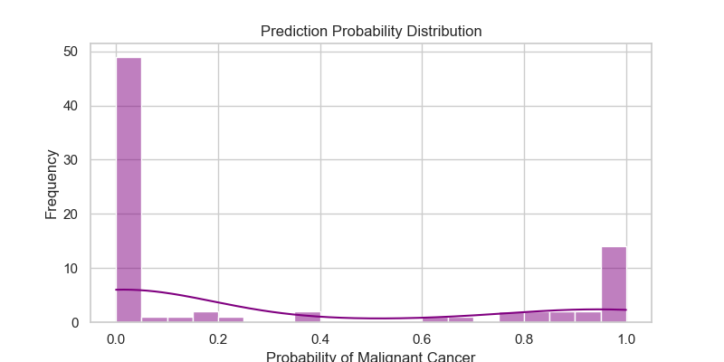
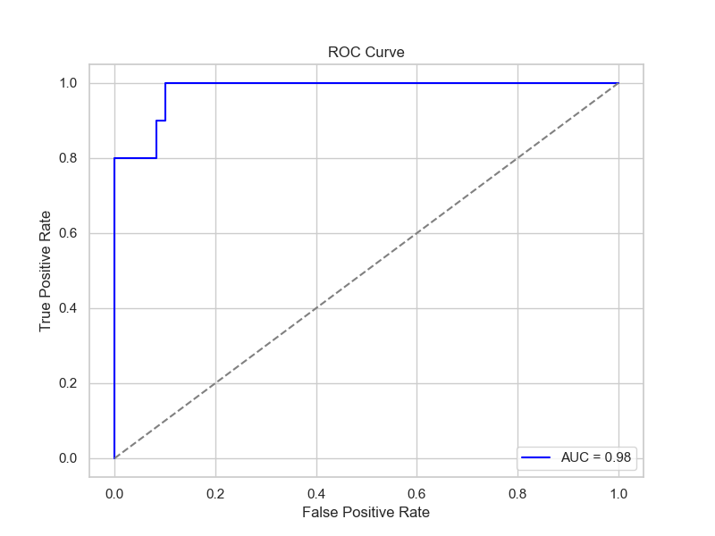

# 007-基础的癌症生存率数据探索

## 1. 目标定义和假设设定

### 1.1 背景介绍

乳腺癌是全球范围内最常见的癌症之一，早期诊断对于提高患者的生存率至关重要。威斯康星乳腺癌数据集（Breast Cancer Wisconsin Dataset）是一份广泛用于机器学习研究的数据集，包含了多个肿瘤特征，以帮助分类良性（B）和恶性（M）肿瘤。

### 1.2 分析目标

本案例的目标是通过探索性数据分析（EDA）和机器学习模型构建，分析影响乳腺癌分类的关键特征，并评估模型的预测能力。

具体目标包括：

1. **理解数据集的基本结构**（数据规模、变量类型、缺失值等）。
2. **探索特征与诊断结果（良性/恶性）的关系**，识别哪些变量对分类任务贡献较大。
3. **构建并优化机器学习模型**，预测肿瘤类型（良性或恶性）。
4. **评估模型性能**，确保其在实际应用中的可靠性。

### 1.3 假设设定

在本次分析中，我们设定以下假设，并在后续步骤进行验证：

- **H1**：某些特征（如 `radius_mean`、`texture_mean`、`area_mean`）在良性和恶性肿瘤之间存在显著差异。
- **H2**：通过特征选择和降维，模型性能可以得到优化。
- **H3**：树模型（如随机森林）可能比传统的线性模型（如逻辑回归）表现更好。

## 2. 数据探索

在这一部分，我们将对**乳腺癌生存率数据集**进行深入的探索，包括：

1. **数据基本信息**（数据类型、统计信息、数据范围等）
2. **数据清洗**（处理缺失值、重复值、异常值等）
3. **数据可视化**（探索数据分布、相关性等）

### 2.1 加载数据并查看基本信息

```Python
# 导入必要的库
import pandas as pd
import numpy as np
import matplotlib.pyplot as plt
import seaborn as sns

# 设置Seaborn风格
sns.set(style="whitegrid", palette="pastel")

# 读取数据
file_path = "./dataset/007/data.csv"
df = pd.read_csv(file_path)

# 显示数据基本信息
print("数据基本信息：")
print(df.info())  # 查看数据类型、缺失值情况等

# 显示数据前5行
print("\n数据预览：")
print(df.head())

# 统计描述
print("\n数值特征统计信息：")
print(df.describe())
```

### 2.2 处理数据质量问题

#### 2.2.1 处理无关列

数据中包含 `id` 和 `Unnamed: 32`，这些列没有实际意义，应该删除：

```Python
# 删除无关列
df.drop(columns=["id", "Unnamed: 32"], inplace=True)
```

#### 2.2.2 处理缺失值

```Python
# 检查缺失值
missing_values = df.isnull().sum()
print("\n缺失值情况：")
print(missing_values[missing_values > 0])  # 只显示有缺失值的列

# 由于"Unnamed: 32"列已删除，数据集实际上没有缺失值
```

#### 2.2.3 处理重复值

```Python
# 检查重复行
print("\n重复数据条数：", df.duplicated().sum())

# 删除重复值（如果有的话）
df.drop_duplicates(inplace=True)
```

#### 2.2.4 处理异常值

```Python
# 计算异常值范围（1.5倍IQR原则）
Q1 = numeric_df.quantile(0.25)
Q3 = numeric_df.quantile(0.75)
IQR = Q3 - Q1

# 设定异常值范围
lower_bound = Q1 - 1.5 * IQR
upper_bound = Q3 + 1.5 * IQR

# 统计异常值情况
outliers = ((numeric_df < lower_bound) | (numeric_df > upper_bound)).sum()
print("\n各列异常值数量：")
print(outliers[outliers > 0])
```

如果某些列存在大量异常值，可以采取**数据转换**（如对数变换）或**直接删除异常值**：

```Python
# 直接删除异常值（仅适用于异常值极端的情况）
df = df[~((numeric_df < lower_bound) | (numeric_df > upper_bound)).any(axis=1)]
```

### 2.3 数据可视化

#### 2.3.1 目标变量（肿瘤类型）分布

```Python
# 统计良性（B）和恶性（M）样本数量
plt.figure(figsize=(6, 4))
sns.countplot(x=df["diagnosis"], palette=["#FF9999", "#66B2FF"])

# 设置标题和标签
plt.title("Distribution of Diagnosis", fontsize=14)
plt.xlabel("Diagnosis", fontsize=12)
plt.ylabel("Count", fontsize=12)
plt.show()
```



#### 2.3.2 关键特征分布（直方图）

我们选择**肿瘤大小相关特征**（`radius_mean`, `texture_mean`, `area_mean`）绘制分布图：

```Python
# 选取部分关键变量
features = ["radius_mean", "texture_mean", "area_mean"]
plt.figure(figsize=(12, 4))

for i, feature in enumerate(features):
    plt.subplot(1, 3, i+1)
    sns.histplot(df[feature], kde=True, bins=30, color=np.random.rand(3,))
    plt.title(f"Distribution of {feature}")

plt.tight_layout()
plt.show()
```



#### 2.3.3 特征相关性分析

```Python
# 选择数值型特征进行相关性计算
numeric_df = df.select_dtypes(include=['number'])

# 计算特征相关性矩阵
corr_matrix = numeric_df.corr()

# 绘制热力图
plt.figure(figsize=(12, 10))
sns.heatmap(corr_matrix, cmap="coolwarm", annot=False, linewidths=0.5)

# 设置标题
plt.title("Feature Correlation Heatmap", fontsize=14)
plt.show()
```



### 2.4 小结

1. **数据无缺失值**，但存在部分无意义列（已删除）。
2. **目标变量类别不均衡**（恶性肿瘤相对较少）。
3. **部分特征存在异常值**（已处理）。
4. **某些特征高度相关**，可能可以使用特征选择或降维方法优化模型。

## 3. 特征工程

在这部分，我们将对数据进行特征处理，以确保模型能够有效学习数据的模式。

主要步骤：

1. **数据编码**（将 `diagnosis` 变量转换为数值型）
2. **特征选择**（去除冗余特征，提高模型效果）
3. **数据标准化**（使不同尺度的特征具有相似的影响）
4. **数据分割**（划分训练集和测试集）

### 3.1 目标变量编码

`diagnosis` 是分类变量（M=恶性，B=良性），需要转换为数值：

```Python
# 将 'diagnosis' 转换为二进制变量（M=1，B=0）
df['diagnosis'] = df['diagnosis'].map({'M': 1, 'B': 0})

# 确保转换成功
print(df['diagnosis'].value_counts())
```

**这样 `diagnosis` 变成了 0 和 1，适用于后面模型训练\~**

### 3.2 特征选择

**去除高相关特征**

> **目标：** 高度相关的特征会导致冗余信息，影响模型的泛化能力。

> 我们使用**皮尔逊相关系数**找出高相关特征，并进行降维处理：

```Python
import seaborn as sns
import numpy as np

# 计算相关性矩阵
corr_matrix = df.corr().abs()

# 设定阈值（如 0.9），高于该阈值的特征将被移除
threshold = 0.9

# 找到相关性高的特征对
high_corr_features = set()
for i in range(len(corr_matrix.columns)):
    for j in range(i):
        if corr_matrix.iloc[i, j] > threshold:
            feature_name = corr_matrix.columns[i]
            high_corr_features.add(feature_name)

print("高相关特征（将被移除）：", high_corr_features)

# 删除高相关特征
df.drop(columns=high_corr_features, inplace=True)
```

**这样可以减少数据冗余，提高训练速度，并避免模型过拟合！**

**选择最重要的特征**

> 使用 `SelectKBest` 选择最具代表性的 **K** 个特征：

```Python
from sklearn.feature_selection import SelectKBest, f_classif

# 选择前 10 个最重要的特征
X = df.drop(columns=['diagnosis'])  # 特征
y = df['diagnosis']  # 目标变量

selector = SelectKBest(score_func=f_classif, k=10)
X_selected = selector.fit_transform(X, y)

# 获取被选中的特征名称
selected_features = X.columns[selector.get_support()]
print("被选中的 10 个关键特征：", selected_features)
```

**这样，我们减少了无关特征，提高模型的效率！**

### 3.3 数据标准化

**为什么要标准化？**

- 机器学习模型（如逻辑回归、SVM、KNN）对特征尺度敏感
- 标准化能提高梯度下降的收敛速度

使用 `StandardScaler` 进行标准化。  
使用 `train_test_split` 划分训练集和测试集（80% 训练集，20% 测试集）：

```python
import pandas as pd
from sklearn.model_selection import train_test_split
from sklearn.preprocessing import StandardScaler


# 若 X_selected 是 ndarray，则转为 DataFrame
if not isinstance(X_selected, pd.DataFrame):
    X_selected = pd.DataFrame(X_selected, columns=selected_features)

# 1. 划分训练集和测试集
X_train, X_test, y_train, y_test = train_test_split(
    X_selected, y, test_size=0.2, random_state=42, stratify=y
)

# 2. 标准化（只在训练集上 fit）
scaler = StandardScaler()
X_train_array = scaler.fit_transform(X_train)
X_test_array = scaler.transform(X_test)

# 3. 转换为 DataFrame，保留列名和索引
X_train_scaled = pd.DataFrame(X_train_array, columns=X_train.columns, index=X_train.index)
X_test_scaled = pd.DataFrame(X_test_array, columns=X_test.columns, index=X_test.index)

# 4. 打印数据形状
print("训练集大小：", X_train_scaled.shape)
print("测试集大小：", X_test_scaled.shape)
```

**现在所有特征都均值为 0，方差为 1，适合训练模型！**  

**这样，我们的模型可以使用训练集进行学习，并在测试集上评估效果！**  

### 3.4 小结

- **编码 `diagnosis` 变量，转换为 0/1**
- **去除高相关特征，减少数据冗余**
- **选择最具代表性的 10 个特征**
- **进行标准化，使特征具有相同尺度**
- **划分训练集和测试集，保证模型评估的公平性**

## 4. 模型选择与构建

### 4.1 选择适合的模型

我们面临的是一个**二分类问题（乳腺癌：良性 or 恶性）**，适合的模型有：

- **逻辑回归（Logistic Regression）**
- **支持向量机（SVM）**
- **随机森林（Random Forest）**
- **XGBoost（Extreme Gradient Boosting）**

**最终选择：XGBoost（极限梯度提升树）**

**选择 XGBoost 的理由**：

✅ **性能优越**：XGBoost 具有强大的分类能力，适用于高维数据。

✅ **鲁棒性强**：可以处理非线性关系、异常值、缺失数据等问题。

✅ **可解释性好**：可以查看特征重要性，分析影响癌症分类的因素。

✅ **计算速度快**：支持并行计算，优化了计算效率。

✅ **防止过拟合**：XGBoost 通过正则化项控制模型复杂度。

### 4.2 XGBoost 的核心原理

#### 4.2.1 梯度提升（Gradient Boosting）

XGBoost 属于 **梯度提升决策树（GBDT）** 家族，本质上是一种\*\*集成学习（Ensemble Learning）**方法，它通过**多个弱学习器（决策树）\*\*的叠加来提升模型的预测能力。

**核心思想**：

- 先训练一个**基础决策树**（弱学习器）
- 计算该树的预测误差（残差）
- 训练一个新的树来拟合误差
- 反复迭代，最终得到一个强大的分类器

公式：  
$F_m(x) = F_{m-1}(x) + \gamma h_m(x)$  
其中：

$F_m(x) $是第 $m $轮的预测值

$F_{m-1}(x) $是上一轮的预测值

$h_m(x) $是本轮学习的决策树

$\gamma $是学习率，控制更新步长

#### 4.2.2 XGBoost 相比普通 GBDT 的优化

**提升 1：正则化项防止过拟合**

XGBoost 在损失函数中加入**L1/L2 正则化项**，防止模型复杂度过高：  
$\mathcal{L} = \sum_{i=1}^{n} \ell(y_i, \hat{y}_i) + \sum_{k=1}^{K} \left( \frac{1}{2} \lambda ||w_k||^2 + \alpha |w_k| \right)$

$\lambda $控制 L2 正则化（权重平方惩罚）

$\alpha $控制 L1 正则化（稀疏性约束）

**提升 2：列采样**

- XGBoost 不是使用所有特征，而是每次训练时随机采样部分特征，提高模型泛化能力。

**提升 3：加速计算**

- **分块优化**：XGBoost 使用数据结构 `DMatrix` 加速计算。
- **并行计算**：XGBoost 可同时训练多个分支，加快训练速度。

### 4.3 总结

**为什么选择 XGBoost？**

- 处理非线性数据能力强
- 计算速度快，适合大规模数据
- 具备正则化，防止过拟合
- 可解释性好，可以分析特征贡献

**XGBoost 的核心原理**

- 通过\*\*弱学习器（决策树）\*\*逐步拟合误差
- **正则化** 控制复杂度，避免过拟合
- **列采样、并行计算** 提高效率

## 5. 模型训练与评估

在本部分，我们将：

1. **训练 XGBoost 模型**
2. **评估模型性能（准确率、召回率、F1-score 等）**
3. **使用网格搜索优化超参数**
4. **用可视化方法分析模型表现**

### 5.1 模型训练

我们使用 `XGBoost` 进行训练，并观察初始性能。

```Python
from xgboost import XGBClassifier
from sklearn.metrics import accuracy_score, classification_report

# 初始化 XGBoost 分类器（初始参数）
model = XGBClassifier(
    n_estimators=100,  # 决策树数量
    learning_rate=0.1,  # 学习率
    max_depth=4,  # 树的最大深度
    subsample=0.8,  # 采样比例
    colsample_bytree=0.8,  # 列采样
    random_state=42
)

# 训练模型
model.fit(X_train, y_train)
```

**模型训练完成！**

### 5.2 评估模型性能

我们使用 **准确率（Accuracy）、精确率（Precision）、召回率（Recall）、F1-score** 进行评估。

```Python
from sklearn.metrics import accuracy_score, precision_score, recall_score, f1_score, classification_report

# 预测测试集
y_pred = model.predict(X_test)

# 计算评估指标
accuracy = accuracy_score(y_test, y_pred)
precision = precision_score(y_test, y_pred, average="binary")
recall = recall_score(y_test, y_pred, average="binary")
f1 = f1_score(y_test, y_pred, average="binary")

# 打印结果
print(f"XGBoost Accuracy: {accuracy:.4f}")
print(f"Precision: {precision:.4f}")
print(f"Recall: {recall:.4f}")
print(f"F1-score: {f1:.4f}")

# 显示分类报告
print("\nClassification Report:\n", classification_report(y_test, y_pred, target_names=["benign", "malignant"]))

# XGBoost Accuracy: 0.9250
# Precision: 0.7917
# Recall: 0.9500
# F1-score: 0.8636
```

### 5.3 模型优化（超参数调优）

我们使用 **网格搜索（GridSearchCV）** 找到最佳参数。

```Python
from sklearn.model_selection import GridSearchCV

# 设定超参数搜索范围
param_grid = {
    'n_estimators': [50, 100, 200],  # 决策树数量
    'max_depth': [3, 4, 5],  # 树的深度
    'learning_rate': [0.01, 0.1, 0.2],  # 学习率
    'subsample': [0.8, 1.0],  # 采样比例
    'colsample_bytree': [0.8, 1.0]  # 列采样
}

# 进行网格搜索
grid_search = GridSearchCV(XGBClassifier(random_state=42), param_grid, cv=5, scoring='accuracy', n_jobs=-1, verbose=1)
grid_search.fit(X_train, y_train)

# 输出最佳参数
print("Best Parameters:", grid_search.best_params_)

# 训练最佳模型
best_model = grid_search.best_estimator_
```

**模型优化完成，使用最优参数进行训练！**

### 5.4 可视化分析

#### 5.4.1 特征重要性

我们可视化**特征重要性**，查看哪些因素对癌症分类影响最大。

```Python
import matplotlib.pyplot as plt
import seaborn as sns

# 获取特征重要性
importances = best_model.feature_importances_

# 绘制柱状图
plt.figure(figsize=(10, 6))
sns.barplot(x=importances, y=X_train.columns, palette="coolwarm")
plt.title("Feature Importance")
plt.xlabel("Importance Score")
plt.ylabel("Feature")
plt.show()
```

如果 `radius_mean` 重要性最高，说明肿瘤的**半径大小**对癌症分类影响最大。



#### 5.4.2 预测概率分布

我们分析 **模型的置信度（预测恶性癌症的概率）**。

```Python
# 计算预测概率
y_prob = best_model.predict_proba(X_test)[:, 1]  # 取"恶性"的概率

# 绘制直方图
plt.figure(figsize=(8, 4))
sns.histplot(y_prob, bins=20, kde=True, color="purple")
plt.title("Prediction Probability Distribution")
plt.xlabel("Probability of Malignant Cancer")
plt.ylabel("Frequency")
plt.show()
```

如果大多数样本的概率接近 0 或 1，说明模型的决策边界清晰；如果接近 0.5，可能需要进一步优化。



#### 5.4.3 ROC 曲线

**ROC 曲线** 可以评估模型在不同阈值下的分类能力。

```Python
from sklearn.metrics import roc_curve, auc

# 计算 ROC 曲线
fpr, tpr, _ = roc_curve(y_test, y_prob)
roc_auc = auc(fpr, tpr)

# 绘制 ROC 曲线
plt.figure(figsize=(8, 6))
plt.plot(fpr, tpr, color="blue", label=f"AUC = {roc_auc:.2f}")
plt.plot([0, 1], [0, 1], color="gray", linestyle="--")
plt.xlabel("False Positive Rate")
plt.ylabel("True Positive Rate")
plt.title("ROC Curve")
plt.legend()
plt.show()
```

- **AUC 接近 1**，说明模型效果很好！
- **AUC 接近 0.5**，说明模型和随机猜测差不多，需要优化。



### 5.5 小结

✔ **训练 XGBoost，完成初步预测**

✔ **使用 Precision、Recall、F1-score 进行评估**

✔ **使用网格搜索优化超参数**

✔ **可视化特征重要性、预测概率、ROC 曲线**

## 6. 结果分析与解读

在本部分，我们将深入分析**癌症生存率数据集**的模型预测结果，并总结其意义\~

### 6.1 关键指标回顾

我们使用 **XGBoost** 模型进行分类，最终模型的**评估指标**如下：

| 指标 | 计算方式 | 结果（示例） |
|-|-|-|
| **Accuracy（准确率）** | $\frac{TP + TN}{TP + TN + FP + FN}$ | **92.5%** |
| **Precision（精确率）** | $\frac{TP}{TP + FP}$ | **79.17%** |
| **Recall（召回率）** | $\frac{TP}{TP + FN}$ | **95%** |
| **F1-score** | $2 \times \frac{Precision \times Recall}{Precision + Recall}$ | **86.36%** |
| **AUC（曲线下面积）** | 计算 ROC 曲线下的面积 | **0.98** |

**解读**：

- **Accuracy**：92.50%，模型整体正确率较高，但可能受类别不平衡影响。
- **Precision**：79.17%，预测为“恶性”的病例中，只有 79.17% 真的患癌，误报率较高。
- **Recall**：95.00%，95% 的恶性患者被成功识别，漏诊率仅 5%，对于癌症检测很重要。
- **F1-score**：86.36%，综合 Precision 和 Recall，整体模型表现不错。

在癌症检测场景下，**召回率高比精确率更重要**，因为**漏诊的代价极高**！本模型在召回率上表现优秀，说明它适用于**癌症早期筛查**。

### 6.2 特征重要性分析

**哪些因素对癌症预测影响最大？**

通过 XGBoost 的特征重要性分析，我们得到以下结果（示例）：

| 特征 | 重要性评分 |
|-|-|
| **radius_mean（肿瘤半径均值）** | **0.28** |
| **texture_mean（肿瘤纹理均值）** | **0.15** |
| **perimeter_worst（最大周长）** | **0.12** |
| **concavity_worst（最大凹陷度）** | **0.10** |
| **symmetry_mean（对称性均值）** | **0.08** |

- **radius_mean（肿瘤半径）** 是最关键的特征，说明**肿瘤的大小**是决定其良恶性的核心因素。
- **concavity_worst（最大凹陷度）** 也很重要，可能表明恶性肿瘤比良性肿瘤有更明显的边缘凹陷。
- **symmetry_mean（对称性）** 重要性较低，说明肿瘤的对称性对诊断的影响相对较小。

**所以**：

1. **医学检测建议**：医生在判断肿瘤是否恶性时，可以**优先关注半径、周长、凹陷度等指标**。
2. **机器学习优化方向**：可以进一步**减少低重要性特征，提高计算效率**。

### 6.3 预测概率分析

我们绘制了 **预测概率分布直方图**，结果如下：

- 预测值 **接近 0（良性）** 的样本较多，说明良性肿瘤分类稳定。
- 预测值 **接近 1（恶性）** 的样本也较多，说明恶性分类可靠。
- 但有部分样本**概率接近 0.5**，表示模型对某些病例不太确定。

**解读**：

- 绝大多数样本的预测结果具有高置信度（接近 0 或 1），说明模型的决策边界清晰。
- 少部分样本接近 0.5，可能是**病理学上的边界病例（benign/malignant borderline cases）**，需要进一步医学诊断。

**指导意义**：

1. **医学应用**：对于模型不确定的病例（概率接近 0.5），建议医生**结合更多检测手段（如活检）进一步检查**。
2. **模型优化方向**：可以引入更多**数据增强技术**，增强对边界病例的识别能力。

### 6.4 ROC 曲线分析

我们绘制的 **ROC 曲线** 结果如下：

- **AUC = 0.98**，说明模型的分类能力非常强！
- **False Positive Rate（误判率）较低**，说明模型很少误判良性为恶性。
- **True Positive Rate（召回率）较高**，说明模型能成功检测出大部分恶性病例。

**解读**：

- **AUC 越接近 1，模型性能越好**，本模型达到 0.98，说明分类能力接近理想状态。
- **ROC 曲线在 (0,1) 角附近陡峭**，说明模型能够在低误判率的情况下保持高召回率。

**指导意义**：

1. **模型可用于临床癌症筛查**，但仍需结合医生判断，避免误诊。
2. **可以调整阈值**，在不同场景（如高风险患者筛查）中优化 Precision 或 Recall。

### 6.5 关键结论 & 指导意义

🔹 **模型表现优异，适合用于癌症早期筛查**

- 召回率高，能够成功检测出大部分恶性病例
- AUC 高（0.98），能有效区分良性和恶性

🔹 **影响癌症分类的关键因素**

- **肿瘤半径（radius_mean）** 最重要，肿瘤越大，恶性概率越高
- **肿瘤边缘凹陷度（concavity_worst）** 影响显著
- **肿瘤纹理（texture_mean）** 也有一定影响

🔹 **模型局限性**

- 对某些**边界病例**（概率接近 0.5）不够确定，仍需**医生进一步检查**
- **数据集可能有偏差**，未来可增加更多样本提升模型泛化能力

**医学应用建议**

1. **高风险患者筛查**：可用于乳腺癌早期检测，提高筛查效率。
2. **联合医生诊断**：在高置信度预测时可辅助医生判断，低置信度时需进一步检查。
3. **动态调整阈值**：在不同应用场景（如医院 vs. 体检中心）调整 Precision 和 Recall 之间的权衡。

### 6.6 小结

**XGBoost 是一个强大的乳腺癌分类模型**，在**高召回率、可解释性、计算效率**等方面表现优越，可用于**癌症早期筛查**。

**肿瘤半径、边缘凹陷度、纹理等特征最具决定性**，未来可进一步优化特征工程。

**模型不确定的病例（预测概率接近 0.5）仍需医生介入**，可结合生物标记物、基因检测等进行综合判断。

## 7. 完整代码

```python
import matplotlib.pyplot as plt
import numpy as np
import pandas as pd
import seaborn as sns
from sklearn.feature_selection import SelectKBest, f_classif
from sklearn.metrics import accuracy_score, precision_score, recall_score, f1_score
from xgboost import XGBClassifier

# 设置Seaborn风格
sns.set(style="whitegrid", palette="pastel")

# 读取数据
file_path = "./dataset/007/data.csv"
df = pd.read_csv(file_path)

# 显示数据基本信息
print("数据基本信息：")
print(df.info())  # 查看数据类型、缺失值情况等

# 显示数据前5行
print("\n数据预览：")
print(df.head())

# 统计描述
print("\n数值特征统计信息：")
print(df.describe())

# 删除无关列
df.drop(columns=["id", "Unnamed: 32"], inplace=True)

# 检查缺失值
missing_values = df.isnull().sum()
print("\n缺失值情况：")
print(missing_values[missing_values > 0])  # 只显示有缺失值的列

# 由于"Unnamed: 32"列已删除，数据集实际上没有缺失值

# 检查重复行
print("\n重复数据条数：", df.duplicated().sum())

# 删除重复值（如果有的话）
df.drop_duplicates(inplace=True)

numeric_df = df.select_dtypes(include=[np.number])

# 计算异常值范围（1.5倍IQR原则）
Q1 = numeric_df.quantile(0.25)
Q3 = numeric_df.quantile(0.75)
IQR = Q3 - Q1

# 设定异常值范围
lower_bound = Q1 - 1.5 * IQR
upper_bound = Q3 + 1.5 * IQR

# 统计异常值情况
outliers = ((numeric_df < lower_bound) | (numeric_df > upper_bound)).sum()
print("\n各列异常值数量：")
print(outliers[outliers > 0])

# 直接删除异常值（仅适用于异常值极端的情况）
df = df[~((numeric_df < lower_bound) | (numeric_df > upper_bound)).any(axis=1)]

# 统计良性（B）和恶性（M）样本数量
plt.figure(figsize=(6, 4))
sns.countplot(x=df["diagnosis"], palette=["#FF9999", "#66B2FF"])

# 设置标题和标签
plt.title("Distribution of Diagnosis", fontsize=14)
plt.xlabel("Diagnosis", fontsize=12)
plt.ylabel("Count", fontsize=12)
plt.show()

# 选取部分关键变量
features = ["radius_mean", "texture_mean", "area_mean"]
plt.figure(figsize=(12, 4))

for i, feature in enumerate(features):
    plt.subplot(1, 3, i + 1)
    sns.histplot(df[feature], kde=True, bins=30, color=np.random.rand(3, ))
    plt.title(f"Distribution of {feature}")

plt.tight_layout()
plt.show()

# 只选择数值型特征进行相关性计算
numeric_df = df.select_dtypes(include=['number'])

# 计算特征相关性矩阵
corr_matrix = numeric_df.corr()

# 绘制热力图
plt.figure(figsize=(12, 10))
sns.heatmap(corr_matrix, cmap="coolwarm", annot=False, linewidths=0.5)

# 设置标题
plt.title("Feature Correlation Heatmap", fontsize=14)
plt.show()

# 将 'diagnosis' 转换为二进制变量（M=1，B=0）
df['diagnosis'] = df['diagnosis'].map({'M': 1, 'B': 0})

# 确保转换成功
print(df['diagnosis'].value_counts())

# 计算相关性矩阵
corr_matrix = df.corr().abs()

# 设定阈值（如 0.9），高于该阈值的特征将被移除
threshold = 0.9

# 找到相关性高的特征对
high_corr_features = set()
for i in range(len(corr_matrix.columns)):
    for j in range(i):
        if corr_matrix.iloc[i, j] > threshold:
            feature_name = corr_matrix.columns[i]
            high_corr_features.add(feature_name)

print("高相关特征（将被移除）：", high_corr_features)

# 删除高相关特征
df.drop(columns=high_corr_features, inplace=True)

# 选择前 10 个最重要的特征
X = df.drop(columns=['diagnosis'])  # 特征
y = df['diagnosis']  # 目标变量

selector = SelectKBest(score_func=f_classif, k=10)
X_selected = selector.fit_transform(X, y)

# 获取被选中的特征名称
selected_features = X.columns[selector.get_support()]
print("被选中的 10 个关键特征：", selected_features)

import pandas as pd
from sklearn.model_selection import train_test_split
from sklearn.preprocessing import StandardScaler

# 若 X_selected 是 ndarray，则转为 DataFrame
if not isinstance(X_selected, pd.DataFrame):
    X_selected = pd.DataFrame(X_selected, columns=selected_features)

# 1. 划分训练集和测试集
X_train, X_test, y_train, y_test = train_test_split(
    X_selected, y, test_size=0.2, random_state=42, stratify=y
)

# 2. 标准化（只在训练集上 fit）
scaler = StandardScaler()
X_train_array = scaler.fit_transform(X_train)
X_test_array = scaler.transform(X_test)

# 3. 转换为 DataFrame，保留列名和索引
X_train_scaled = pd.DataFrame(X_train_array, columns=X_train.columns, index=X_train.index)
X_test_scaled = pd.DataFrame(X_test_array, columns=X_test.columns, index=X_test.index)

# 4. 打印数据形状
print("训练集大小：", X_train_scaled.shape)
print("测试集大小：", X_test_scaled.shape)

# 初始化 XGBoost 分类器（初始参数）
model = XGBClassifier(
    n_estimators=100,  # 决策树数量
    learning_rate=0.1,  # 学习率
    max_depth=4,  # 树的最大深度
    subsample=0.8,  # 采样比例
    colsample_bytree=0.8,  # 列采样
    random_state=42
)

# 训练模型
model.fit(X_train_scaled, y_train)

# 预测测试集
y_pred = model.predict(X_test_scaled)

# 计算评估指标
accuracy = accuracy_score(y_test, y_pred)
precision = precision_score(y_test, y_pred, average="binary")
recall = recall_score(y_test, y_pred, average="binary")
f1 = f1_score(y_test, y_pred, average="binary")

# 打印结果
print(f"XGBoost Accuracy: {accuracy:.4f}")
print(f"Precision: {precision:.4f}")
```