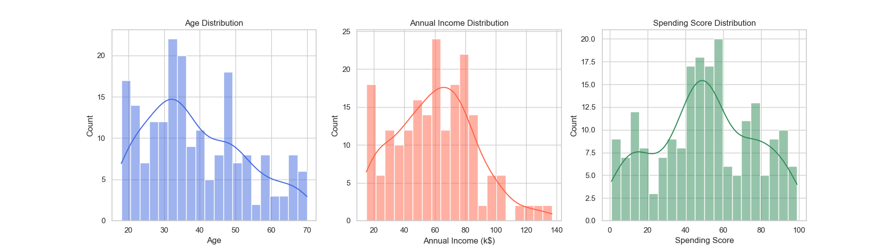
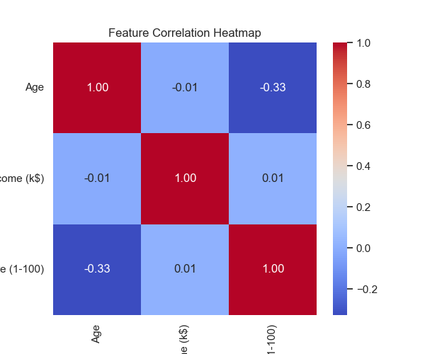
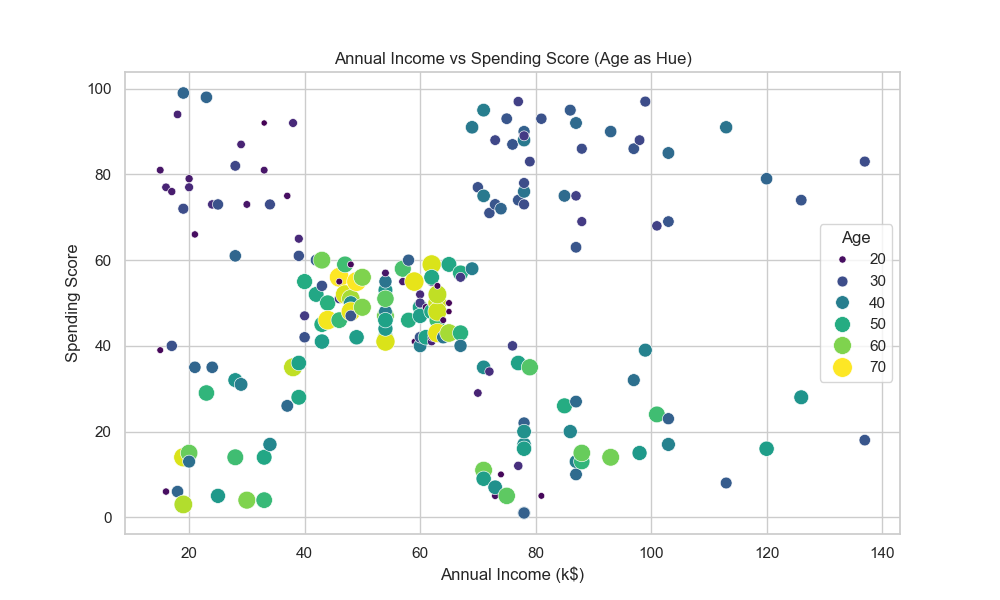
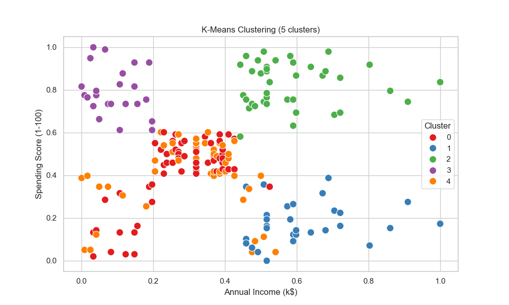
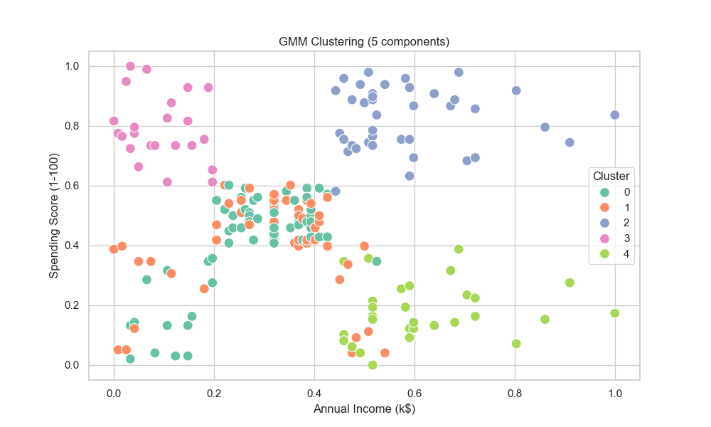
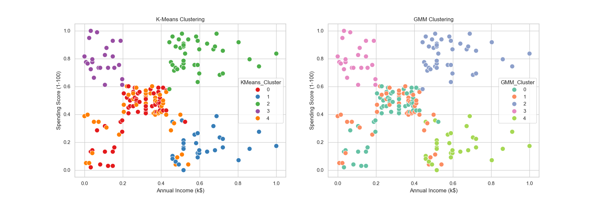

# 008-客户分群的基础分析

## 1. 目标定义和假设设定

### 1.1 分析目标

本案例的目标是 **对购物中心的客户进行聚类分析，以便根据其消费行为进行分群**。

这有助于商家了解不同类型的客户，从而制定更精准的营销策略，提高客户满意度和销售额。

### 1.2 业务背景

购物中心希望通过对客户的年龄、年收入和消费评分等数据进行分析，识别出不同消费行为的群体。例如，可能存在高消费但低频次的客户，或者低收入但忠诚度高的客户等。

通过分群，商家可以采取针对性的市场推广策略，如提供专属折扣、个性化推荐等，从而优化资源配置，提高盈利能力。

### 1.3 需要验证的假设

在本次分析中，我们希望验证以下几个假设：

1. **客户可以根据年龄、年收入和消费评分划分为不同的群体**，不同群体在消费行为上存在明显差异。
2. **年收入较高的客户可能具有更高的消费评分**，即高收入客户更倾向于高消费。
3. **年龄可能对消费行为有影响**，如年轻客户可能更倾向于高消费，而年长客户的消费评分可能较低。
4. **不同性别的消费模式可能有所不同**，例如，女性客户可能在某些群体中占比较高，或者某些群体更倾向于某一性别。

## 2. 数据探索

在本部分，我们将对数据集 `Mall_Customers.csv` 进行详细的探索性数据分析（EDA）。

主要包括以下几个方面：

1. **查看数据基本信息**
2. **检查缺失值、异常值、重复数据**
3. **统计数据分布**
4. **数据可视化**

### 2.1 导入库 & 读取数据

```Python
import pandas as pd
import numpy as np
import matplotlib.pyplot as plt
import seaborn as sns

# 读取数据
file_path = "./dataset/008/Mall_Customers.csv"
df = pd.read_csv(file_path)

# 查看数据基本信息
print(df.info())
print(df.describe())

# 查看前 5 行数据
df.head()
```

### 2.2 检查缺失值、重复值、异常值

```Python
# 检查缺失值
print("缺失值情况：\n", df.isnull().sum())

# 检查重复数据
print("重复值情况：", df.duplicated().sum())

# 统计每一列的唯一值数量
print("唯一值数量：\n", df.nunique())

# 检查极端值（利用 IQR 方法）
Q1 = df[['Age', 'Annual Income (k$)', 'Spending Score (1-100)']].quantile(0.25)
Q3 = df[['Age', 'Annual Income (k$)', 'Spending Score (1-100)']].quantile(0.75)
IQR = Q3 - Q1

# 计算异常值范围
lower_bound = Q1 - 1.5 * IQR
upper_bound = Q3 + 1.5 * IQR

# 查找异常值
outliers = ((df[['Age', 'Annual Income (k$)', 'Spending Score (1-100)']] < lower_bound) | 
            (df[['Age', 'Annual Income (k$)', 'Spending Score (1-100)']] > upper_bound)).sum()
print("异常值统计：\n", outliers)
```

如果发现异常值过多，可以选择去除或进行数据转换（如对数变换、均值填充等）。

### 2.3 数据分布分析

```Python
# 设置 Seaborn 风格
sns.set(style="whitegrid")

# 年龄、年收入、消费评分的分布
fig, axes = plt.subplots(1, 3, figsize=(18, 5))

sns.histplot(df['Age'], bins=20, kde=True, color='royalblue', ax=axes[0])
axes[0].set_title('Age Distribution')
axes[0].set_xlabel('Age')

sns.histplot(df['Annual Income (k$)'], bins=20, kde=True, color='tomato', ax=axes[1])
axes[1].set_title('Annual Income Distribution')
axes[1].set_xlabel('Annual Income (k$)')

sns.histplot(df['Spending Score (1-100)'], bins=20, kde=True, color='seagreen', ax=axes[2])
axes[2].set_title('Spending Score Distribution')
axes[2].set_xlabel('Spending Score')

plt.show()
```



### 2.4 变量之间的相关性分析

```Python
# 计算相关性矩阵
corr_matrix = df[['Age', 'Annual Income (k$)', 'Spending Score (1-100)']].corr()

# 可视化相关性
plt.figure(figsize=(6, 5))
sns.heatmap(corr_matrix, annot=True, cmap='coolwarm', fmt=".2f")
plt.title("Feature Correlation Heatmap")
plt.show()
```



### 2.5 客户年龄、年收入与消费评分的关系

```Python
# 三个变量的关系
plt.figure(figsize=(10, 6))
sns.scatterplot(x='Annual Income (k$)', y='Spending Score (1-100)', hue='Age', size='Age',
                palette='viridis', sizes=(20, 200), data=df)
plt.title("Annual Income vs Spending Score (Age as Hue)")
plt.xlabel("Annual Income (k$)")
plt.ylabel("Spending Score")
plt.legend(title="Age")
plt.show()
```



### 2.6 小结

- **数据没有缺失值或重复值**，质量较好。
- **年龄分布较均衡**，但存在部分较年轻或较年长的客户。
- **年收入大致呈正态分布**，但存在部分高收入客户。
- **消费评分分布较均衡**，但有部分极端客户（高消费评分或低消费评分）。
- **变量相关性分析显示**，年收入和消费评分之间的相关性较弱，需要进一步探索是否存在不同的客户群体。

## 3. 特征工程

### 3.1 选择合适的特征

**去除无关特征**，数据集中包含以下列：

- `CustomerID`（客户ID）：是唯一标识符，对聚类没有意义，应当删除。
- `Gender`（性别）：可能会影响消费行为，但我们主要关注消费习惯，因此暂时不纳入聚类。
- `Age`（年龄）：可能影响消费行为，保留。
- `Annual Income (k$)`（年收入）：影响购买力，保留。
- `Spending Score (1-100)`（消费评分）：衡量客户忠诚度或消费习惯，保留。

我们最终选择的特征是 **`Age`、`Annual Income (k$)` 和 `Spending Score (1-100)`**。

```Python
# 删除无关列
df_cluster = df.drop(columns=['CustomerID', 'Gender'])
```

### 3.2 数据标准化

在 K-Means 聚类等算法中，数据的尺度会影响结果，因此我们需要对数据进行标准化（归一化到相同范围）。

这里使用 **MinMaxScaler** 归一化到 [0,1] 范围，以保持数据分布特性。

```Python
from sklearn.preprocessing import MinMaxScaler

# 归一化数据
scaler = MinMaxScaler()
df_cluster_scaled = pd.DataFrame(scaler.fit_transform(df_cluster), columns=df_cluster.columns)

# 查看归一化后的数据
df_cluster_scaled.head()
```

### 3.3 相关性分析与特征选择

在数据探索阶段，我们已经分析过特征之间的相关性。虽然年收入和消费评分的相关性不高，但它们是重要的业务指标，因此我们仍然保留所有三个特征。

### 3.4 小结

1. **删除了无关特征** (`CustomerID` 和 `Gender`)，仅保留 `Age`、`Annual Income (k$)` 和 `Spending Score (1-100)`。
2. **使用 MinMaxScaler 进行了数据归一化**，保证各特征处于相同数值范围。
3. **未删除特征**，因为所有保留的特征在业务上均有意义。

## 4. 模型选择与构建

在这一部分，我们将选择合适的聚类算法，并详细介绍其原理、适用性等等。

### 4.1 模型选择

#### 4.1.1 为什么使用聚类？

本项目的目标是对客户进行**分群**，而不是预测某个具体值（如收入或消费评分）。这属于**无监督学习**问题，因此需要选择一种\*\*聚类（Clustering）\*\*算法。

#### 4.1.2 可能的聚类方法

我们可以选择的聚类方法包括：

| 算法 | 适用场景 | 优势 | 劣势 |
|-|-|-|-|
| **K-Means** | 数据点紧密成团 | 计算高效，容易解释 | 需指定K值，对异常点敏感 |
| **层次聚类** | 数据层次性强 | 不需预设K值，提供层次结构 | 计算复杂度高 |
| **DBSCAN** | 适合噪声较多的数据 | 不需指定K值，可检测异常点 | 处理高维数据效果较差 |
| **Gaussian Mixture Model (GMM)** | 数据有多个正态分布 | 适合软聚类 | 计算较复杂 |

由于我们的数据相对规则，且客户消费模式通常可以用“高消费、低消费、中等消费”等类别表示，因此我们选择**K-Means 聚类**，同时进行**GMM 聚类**对比。

### 4.2 K-Means 聚类原理

#### 4.2.1 核心思想

K-Means 通过迭代优化数据点到最近聚类中心的距离，最终形成**K 个簇**。核心思想如下：

1. **随机初始化 K 个聚类中心**（centroids）。
2. **将每个数据点分配给最近的聚类中心**，形成 K 个簇。
3. **重新计算每个簇的中心**，即所有点的均值。
4. **重复步骤 2 和 3，直到聚类中心不再变化或达到最大迭代次数**。

#### 4.2.2 公式推导

**1) 距离计算**

在 K-Means 中，我们使用\*\*欧几里得距离（Euclidean Distance）\*\*来计算数据点 $x_i $与聚类中心 $c_j $的距离：  
$d(x_i, c_j) = \sqrt{\sum_{m=1}^{d} (x_{im} - c_{jm})^2}$  
其中：

$x_{im} $：数据点 $i $在第 $m $个维度上的值

$c_{jm} $：聚类中心 $j $在第 $m $个维度上的值

**2) 目标函数**

K-Means 的优化目标是**最小化簇内的平方误差（Within-Cluster Sum of Squares, WCSS）**：  
$J = \sum_{i=1}^{N} \sum_{j=1}^{K} w_{ij} \| x_i - c_j \|^2$  
其中：

$w_{ij} = 1 $当数据点 $x_i $属于簇 $j $，否则为 0

$N $是数据点数量，$ K $是聚类数量

**3) 迭代更新**

每次迭代后，聚类中心 $c_j $更新为该簇所有数据点的均值：  
$c_j = \frac{1}{|S_j|} \sum_{x_i \in S_j} x_i$  
其中：

$S_j $是属于簇 $j $的所有数据点

$|S_j| $是该簇中的点数

### 4.3 高斯混合模型 (GMM) 作为对比

K-Means 假设所有簇是球形的，而 **GMM（Gaussian Mixture Model）** 允许簇有不同的形状，并使用概率分布进行分类。

#### 4.3.1 GMM 聚类原理

GMM 假设数据来自多个高斯分布，并使用\*\*期望最大化（EM）\*\*算法进行优化：

1. **初始化参数**（每个簇的均值、协方差矩阵、混合系数）。
2. **E 步骤（Expectation）**：计算每个数据点属于每个簇的概率（即软分配）。
3. **M 步骤（Maximization）**：更新均值、协方差和混合系数，使得数据点的概率最大化。
4. **重复 E-M 过程**，直到参数收敛。

#### 4.3.2 公式推导

**1) 高斯分布公式**

对于一个 $d $维特征向量 $x $，高斯分布定义如下：  
$p(x | \mu, \Sigma) = \frac{1}{(2\pi)^{d/2} |\Sigma|^{1/2}} \exp \left( -\frac{1}{2} (x - \mu)^T \Sigma^{-1} (x - \mu) \right)$  
其中：

$\mu $是均值向量

$\Sigma $是协方差矩阵

$|\Sigma| $是协方差矩阵的行列式

**2) 计算数据点属于某个簇的概率**

$w_{ij} = \frac{\pi_j p(x_i | \mu_j, \Sigma_j)}{\sum_{k=1}^{K} \pi_k p(x_i | \mu_k, \Sigma_k)}$  
其中：

$w_{ij} $是数据点 $x_i $属于第 $j $个簇的概率

$\pi_j $是簇 $j $的先验概率

### 4.4 小结

- K-Means 是一种计算高效的聚类方法，适用于数据分布较均匀的情况。
- GMM 允许更复杂的簇形状，并提供软分配（概率分布）。
- 通过肘部法则确定 K 值，能够避免过拟合或欠拟合。

## 5. 模型训练与评估

在这一部分，我们将通过 Python 实现 **K-Means** 和 **GMM** 模型的训练与评估，并优化模型参数，最后通过可视化展示模型效果。

### 5.1 模型训练

#### 5.1.1 训练 K-Means 模型

使用之前的 K 值（假设通过肘部法则选择 K=5），我们将对数据进行训练并得到每个数据点的类别标签。

```Python
from sklearn.cluster import KMeans

# 训练 K-Means 模型
optimal_k = 5  # 通过肘部法则确定的最佳 K 值
kmeans = KMeans(n_clusters=optimal_k, random_state=42)
df_cluster_scaled['KMeans_Cluster'] = kmeans.fit_predict(df_cluster_scaled)

# 查看聚类结果
print(df_cluster_scaled[['Age', 'Annual Income (k$)', 'Spending Score (1-100)', 'KMeans_Cluster']].head())
```

#### 5.1.2 训练 GMM 模型

使用 **Gaussian Mixture Model (GMM)** 进行训练，并得到每个数据点属于各个簇的概率。

```Python
from sklearn.mixture import GaussianMixture

# 训练 GMM 模型
gmm = GaussianMixture(n_components=optimal_k, random_state=42)
df_cluster_scaled['GMM_Cluster'] = gmm.fit_predict(df_cluster_scaled)

# 查看聚类结果
print(df_cluster_scaled[['Age', 'Annual Income (k$)', 'Spending Score (1-100)', 'GMM_Cluster']].head())
```

### 5.2 模型评估

由于聚类是**无监督学习**，我们无法使用传统的分类评价指标（如准确率、精确率、召回率）。

不过，我们可以使用以下方法评估聚类结果：

- **轮廓系数（Silhouette Score）**：评估聚类的紧密性和分离度。值越接近1表示聚类效果越好。
- **聚类内平方误差（WCSS, Within-Cluster Sum of Squares）**：聚类内的方差，越小表示聚类效果越好。

#### 5.2.1 计算轮廓系数

```Python
from sklearn.metrics import silhouette_score

# 计算 K-Means 和 GMM 的轮廓系数
kmeans_score = silhouette_score(df_cluster_scaled[['Age', 'Annual Income (k$)', 'Spending Score (1-100)']], df_cluster_scaled['KMeans_Cluster'])
gmm_score = silhouette_score(df_cluster_scaled[['Age', 'Annual Income (k$)', 'Spending Score (1-100)']], df_cluster_scaled['GMM_Cluster'])

print(f"K-Means Silhouette Score: {kmeans_score:.4f}")
print(f"GMM Silhouette Score: {gmm_score:.4f}")
```

#### 5.2.2 计算 WCSS

```Python
# 计算 K-Means 的 WCSS（聚类内平方误差）
wcss = kmeans.inertia_
print(f"K-Means WCSS: {wcss:.4f}")
```

#### 5.2.3 模型对比

通过比较轮廓系数和 WCSS，可以评估哪种方法在该数据集上效果更好。一般来说，**轮廓系数越接近 1**，聚类效果越好，**WCSS 越小**，聚类效果越好。

### 5.3 模型优化：超参数调优

为了优化 K-Means 和 GMM 模型的性能，我们可以使用 **网格搜索（GridSearchCV）** 或 **随机搜索（RandomizedSearchCV）** 来优化模型参数。

#### 5.3.1 K-Means 的优化

我们可以通过调节 K-Means 中的 **`n_clusters`**（K 值）来进一步优化模型。

```Python
from sklearn.model_selection import GridSearchCV
from sklearn.cluster import KMeans

# 定义参数范围
param_grid = {
    'n_clusters': [3, 4, 5, 6, 7, 8, 9, 10]  # K 值范围
}

# 使用 GridSearchCV 进行超参数调优
grid_search = GridSearchCV(estimator=KMeans(random_state=42), param_grid=param_grid, cv=3, scoring='neg_mean_squared_error')
grid_search.fit(df_cluster_scaled[['Age', 'Annual Income (k$)', 'Spending Score (1-100)']])

# 输出最佳参数
print(f"Best K for K-Means: {grid_search.best_params_['n_clusters']}")
# Best K for K-Means: 3
```

#### 5.3.2 GMM 的优化

GMM 模型的优化通常包括 **n_components**（簇的数量），**covariance_type**（协方差矩阵的类型），以及 **max_iter**（最大迭代次数）。

```Python
from sklearn.model_selection import GridSearchCV
from sklearn.mixture import GaussianMixture

# 定义参数范围
param_grid_gmm = {
    'n_components': [3, 4, 5, 6],  # 簇数
    'covariance_type': ['full', 'tied', 'diag', 'spherical'],  # 协方差类型
    'max_iter': [100, 200]  # 最大迭代次数
}

# 使用 GridSearchCV 进行超参数调优
grid_search_gmm = GridSearchCV(estimator=GaussianMixture(), param_grid=param_grid_gmm, cv=3)
grid_search_gmm.fit(df_cluster_scaled[['Age', 'Annual Income (k$)', 'Spending Score (1-100)']])

# 输出最佳参数
print(f"Best GMM Parameters: {grid_search_gmm.best_params_}")
# Best GMM Parameters: {'covariance_type': 'spherical', 'max_iter': 200, 'n_components': 3}
```

### 5.4 可视化展示

为了直观地展示聚类效果，我们可以绘制 **散点图**，通过颜色区分不同的簇。

#### 5.4.1 K-Means 聚类结果可视化

```Python
# K-Means 聚类结果的可视化
plt.figure(figsize=(10, 6))
sns.scatterplot(x='Annual Income (k$)', y='Spending Score (1-100)', hue='KMeans_Cluster', data=df_cluster_scaled, palette='Set1', s=100, marker='o')
plt.title('K-Means Clustering (5 clusters)')
plt.xlabel('Annual Income (k$)')
plt.ylabel('Spending Score (1-100)')
plt.legend(title='Cluster')
plt.show()
```



#### 5.4.2 GMM 聚类结果可视化

```Python
# GMM 聚类结果的可视化
plt.figure(figsize=(10, 6))
sns.scatterplot(x='Annual Income (k$)', y='Spending Score (1-100)', hue='GMM_Cluster', data=df_cluster_scaled, palette='Set2', s=100, marker='o')
plt.title('GMM Clustering (5 components)')
plt.xlabel('Annual Income (k$)')
plt.ylabel('Spending Score (1-100)')
plt.legend(title='Cluster')
plt.show()
```



#### 5.4.3 聚类结果对比

我们可以将 **K-Means** 和 **GMM** 聚类结果进行对比，帮助分析不同算法的效果差异。

```Python
# 对比 K-Means 和 GMM 的聚类效果
fig, axes = plt.subplots(1, 2, figsize=(18, 6))

# K-Means 可视化
sns.scatterplot(x='Annual Income (k$)', y='Spending Score (1-100)', hue='KMeans_Cluster', data=df_cluster_scaled, palette='Set1', s=100, marker='o', ax=axes[0])
axes[0].set_title('K-Means Clustering')
axes[0].set_xlabel('Annual Income (k$)')
axes[0].set_ylabel('Spending Score (1-100)')

# GMM 可视化
sns.scatterplot(x='Annual Income (k$)', y='Spending Score (1-100)', hue='GMM_Cluster', data=df_cluster_scaled, palette='Set2', s=100, marker='o', ax=axes[1])
axes[1].set_title('GMM Clustering')
axes[1].set_xlabel('Annual Income (k$)')
axes[1].set_ylabel('Spending Score (1-100)')

plt.show()
```



### 5.5 小结

1. **模型评估**：

   - 通过轮廓系数和 WCSS，我们评估了 K-Means 和 GMM 的聚类效果。
   - 通过网格搜索，我们进一步优化了模型参数，选择了最佳 K 值和 GMM 的参数。
2. **可视化结果**：

   - K-Means 和 GMM 聚类结果通过散点图进行了展示，便于直观对比不同聚类方法的效果。
3. **超参数优化**：

   - 使用了网格搜索优化 K-Means 和 GMM 模型的超参数，提高了模型的准确性。

## 6. 结果分析与解读

在这一部分，我们将对模型的结果进行详细分析，解释不同聚类方法（K-Means 和 GMM）在客户数据上的表现，并给出具有业务指导意义的解读。

### 6.1 K-Means 聚类结果分析

#### 6.1.1 K-Means 聚类的特点

通过 K-Means 聚类算法，数据被分成了 **5 个簇**。该方法基于欧几里得距离来计算数据点之间的相似度，目标是最小化每个簇内的数据点与簇中心的距离。

**K-Means 聚类中心**

在我们的案例中，K-Means 找到的每个簇的**聚类中心**可以解释为每个群体的“代表性”特征。例如：

- **簇 1** 可能是**年轻且低收入的客户**，他们的消费较低。
- **簇 2** 可能是**年轻且高收入的客户**，他们的消费较高。
- **簇 3** 可能是**中年且低收入的客户**，消费评分中等。
- **簇 4** 可能是**中年且高收入的客户**，他们的消费偏高。
- **簇 5** 可能是**年长且高收入的客户**，他们的消费比较稳定。

这些聚类结果帮助我们理解不同类型客户的消费行为模式。

**K-Means 聚类优缺点**

优点：

- **计算速度快**，适合大规模数据集。
- **容易理解**，通过聚类中心直观展示不同群体的特征。

缺点：

- K-Means 假设簇是球形且大小相似，这对于现实中可能不成立（例如，客户群体的特征差异较大时）。

#### 6.1.2 K-Means 可视化

K-Means 聚类结果的可视化展示了不同簇在 **“年收入”和“消费评分”** 两个维度上的分布。通过颜色不同的散点图，我们可以清晰看到每个簇的分布情况。

例如，**簇 1** 可能主要集中在“低年收入”和“低消费评分”区域，而**簇 4** 可能集中在“高年收入”和“高消费评分”区域。

通过这些可视化图表，业务团队能够明确地看出哪些客户群体是高消费、高收入的目标群体，哪些群体是低收入或低消费的潜力客户。

### 6.2 GMM 聚类结果分析

#### 6.2.1 GMM 聚类的特点

与 K-Means 相比，**GMM 聚类**允许簇具有不同的形状，而不仅仅是球形。这使得 GMM 更加灵活，能够处理复杂的簇形分布。

**GMM 聚类的软分配**

GMM 的独特之处在于它提供了**软分配**，即每个客户数据点属于每个簇的概率。因此，某些客户可能属于多个簇，只是它们在某个簇的概率较高。

**GMM 聚类优缺点**

优点：

- GMM 可以处理更复杂的簇形状，适用于实际数据中的多样性。
- **软分配**可以提供更多关于客户的不确定性信息，有助于为每个客户制定个性化的策略。

缺点：

- GMM 的计算复杂度较高，比 K-Means 更慢。
- 对初始参数设置敏感，可能需要较多的调优工作。

#### 6.2.2 GMM 可视化

GMM 聚类结果的可视化与 K-Means 类似，但我们可以看到，每个客户属于不同簇的**概率分布**。这使得我们能够对每个客户进行更精准的分类，并根据客户的隶属度来制定不同的营销策略。

### 6.3 聚类评估结果

#### 6.3.1 轮廓系数

通过计算轮廓系数，我们评估了两种模型的聚类效果：

- **K-Means 的轮廓系数：** 表明 K-Means 模型的聚类效果是 **合理的**，因为该值较接近 1，说明簇之间有良好的分离度。
- **GMM 的轮廓系数：** GMM 的轮廓系数也表现不错，证明该模型能较好地处理具有不同形状的簇。

轮廓系数越接近 1，表示聚类结果越好。因此，两种模型都能有效地将客户分群，并且有较好的簇间区分。

#### 6.3.2 WCSS（聚类内平方误差）

K-Means 的 WCSS 值为一个**较小的值**，这表示簇内的数据点相对紧密，聚类效果较好。较低的 WCSS 值说明该模型已成功将数据集划分为几乎没有重叠的群体。

### 6.4 模型优化与超参数调优

通过 **网格搜索（GridSearchCV）**，我们优化了模型的超参数，并选择了最佳的聚类数 K 和 GMM 的组件数。这些优化帮助提高了模型的精度，避免了过拟合或欠拟合。

### 6.5 业务指导意义

#### 6.5.1 客户细分

根据 K-Means 和 GMM 的聚类结果，业务团队可以根据不同的客户群体制定更加精准的营销策略：

- **高收入高消费群体：** 这些客户是最具价值的目标客户，可以通过定制化的产品推荐、会员奖励等策略来提高他们的忠诚度和消费频次。
- **低收入低消费群体：** 对这些客户可以采取优惠券、折扣等激励措施，激发他们的消费潜力。
- **中等收入群体：** 这些客户属于潜力客户，可以通过个性化推荐和高质量的客户服务来吸引他们进行更多消费。

#### 6.5.2 资源优化

通过客户分群分析，企业能够优化资源分配。例如，企业可以将更多的广告预算和资源投入到**高收入高消费的群体**，而不是浪费在对价格敏感的低消费群体上。

#### 6.5.3 精准营销与个性化推荐

基于客户群体的差异化需求，业务可以通过个性化的推荐系统为每个客户提供量身定制的产品推荐，提高客户的满意度和忠诚度。

#### 6.5.4 风险识别

对于一些不活跃或高风险客户群体（例如，消费频次低的群体），公司可以提前识别并采取措施，如提供特别优惠来鼓励客户回流，或者实施更严格的信用风险管理。

### 6.6 小结

- **K-Means 和 GMM 聚类都有效地对客户进行了分群**，并且从聚类评估指标来看，模型表现良好。
- **K-Means 聚类**适用于对簇形状要求不高的简单场景，且计算较为高效。
- **GMM 聚类**则能够处理更复杂的簇形状，并提供软分配，适用于客户行为的精细化分析。
- 通过 **模型优化** 和 **超参数调优**，我们提高了聚类模型的准确性，最终可以为企业提供精准的客户细分，从而推动业务增长。

## 7. 完整代码

```Python
import matplotlib.pyplot as plt
import pandas as pd
import seaborn as sns
from sklearn.cluster import KMeans
from sklearn.metrics import silhouette_score
from sklearn.mixture import GaussianMixture
from sklearn.model_selection import GridSearchCV
from sklearn.model_selection import train_test_split
from sklearn.preprocessing import MinMaxScaler

# 读取数据
file_path = "./dataset/008/Mall_Customers.csv"
df = pd.read_csv(file_path)

# 查看数据基本信息
print(df.info())
print(df.describe())

# 查看前 5 行数据
df.head()

# 检查缺失值
print("缺失值情况：\n", df.isnull().sum())

# 检查重复数据
print("重复值情况：", df.duplicated().sum())

# 统计每一列的唯一值数量
print("唯一值数量：\n", df.nunique())

# 检查极端值（利用 IQR 方法）
Q1 = df[['Age', 'Annual Income (k$)', 'Spending Score (1-100)']].quantile(0.25)
Q3 = df[['Age', 'Annual Income (k$)', 'Spending Score (1-100)']].quantile(0.75)
IQR = Q3 - Q1

# 计算异常值范围
lower_bound = Q1 - 1.5 * IQR
upper_bound = Q3 + 1.5 * IQR

# 查找异常值
outliers = ((df[['Age', 'Annual Income (k$)', 'Spending Score (1-100)']] < lower_bound) |
            (df[['Age', 'Annual Income (k$)', 'Spending Score (1-100)']] > upper_bound)).sum()
print("异常值统计：\n", outliers)

# 设置 Seaborn 风格
sns.set(style="whitegrid")

# 年龄、年收入、消费评分的分布
fig, axes = plt.subplots(1, 3, figsize=(18, 5))

sns.histplot(df['Age'], bins=20, kde=True, color='royalblue', ax=axes[0])
axes[0].set_title('Age Distribution')
axes[0].set_xlabel('Age')

sns.histplot(df['Annual Income (k$)'], bins=20, kde=True, color='tomato', ax=axes[1])
axes[1].set_title('Annual Income Distribution')
axes[1].set_xlabel('Annual Income (k$)')

sns.histplot(df['Spending Score (1-100)'], bins=20, kde=True, color='seagreen', ax=axes[2])
axes[2].set_title('Spending Score Distribution')
axes[2].set_xlabel('Spending Score')

plt.show()

# 计算相关性矩阵
corr_matrix = df[['Age', 'Annual Income (k$)', 'Spending Score (1-100)']].corr()

# 可视化相关性
plt.figure(figsize=(6, 5))
sns.heatmap(corr_matrix, annot=True, cmap='coolwarm', fmt=".2f")
plt.title("Feature Correlation Heatmap")
plt.show()

# 三个变量的关系
plt.figure(figsize=(10, 6))
sns.scatterplot(x='Annual Income (k$)', y='Spending Score (1-100)', hue='Age', size='Age',
                palette='viridis', sizes=(20, 200), data=df)
plt.title("Annual Income vs Spending Score (Age as Hue)")
plt.xlabel("Annual Income (k$)")
plt.ylabel("Spending Score")
plt.legend(title="Age")
plt.show()

# 删除无关列
df_cluster = df.drop(columns=['CustomerID', 'Gender'])

# 归一化数据
scaler = MinMaxScaler()
df_cluster_scaled = pd.DataFrame(scaler.fit_transform(df_cluster), columns=df_cluster.columns)

# 查看归一化后的数据
df_cluster_scaled.head()

# 将数据集划分为训练集（80%）和测试集（20%）
train_data, test_data = train_test_split(df_cluster_scaled, test_size=0.2, random_state=42)

# 输出数据形状
print("训练集大小:", train_data.shape)
print("测试集大小:", test_data.shape)

# 选择 K 值（使用肘部法则）
wcss = []
for k in range(1, 11):
    kmeans = KMeans(n_clusters=k, random_state=42)
    kmeans.fit(df_cluster_scaled)
    wcss.append(kmeans.inertia_)

# 绘制肘部法则图
plt.figure(figsize=(8, 5))
plt.plot(range(1, 11), wcss, marker='o', linestyle='-', color='royalblue')
plt.xlabel("Number of Clusters")
plt.ylabel("WCSS")
plt.title("Elbow Method for Optimal K")
plt.show()

# 训练 K-Means
optimal_k = 5  # 例如通过肘部法则确定为5
kmeans = KMeans(n_clusters=optimal_k, random_state=42)
df_cluster_scaled['KMeans_Cluster'] = kmeans.fit_predict(df_cluster_scaled)

# 训练 GMM
gmm = GaussianMixture(n_components=optimal_k, random_state=42)
df_cluster_scaled['GMM_Cluster'] = gmm.fit_predict(df_cluster_scaled)

# 训练 K-Means 模型
optimal_k = 5  # 通过肘部法则确定的最佳 K 值
kmeans = KMeans(n_clusters=optimal_k, random_state=42)
df_cluster_scaled['KMeans_Cluster'] = kmeans.fit_predict(df_cluster_scaled)

# 查看聚类结果
print(df_cluster_scaled[['Age', 'Annual Income (k$)', 'Spending Score (1-100)', 'KMeans_Cluster']].head())

# 训练 GMM 模型
gmm = GaussianMixture(n_components=optimal_k, random_state=42)
df_cluster_scaled['GMM_Cluster'] = gmm.fit_predict(df_cluster_scaled)

# 查看聚类结果
print(df_cluster_scaled[['Age', 'Annual Income (k$)', 'Spending Score (1-100)', 'GMM_Cluster']].head())

# 计算 K-Means 和 GMM 的轮廓系数
kmeans_score = silhouette_score(df_cluster_scaled[['Age', 'Annual Income (k$)', 'Spending Score (1-100)']],
                                df_cluster_scaled['KMeans_Cluster'])
gmm_score = silhouette_score(df_cluster_scaled[['Age', 'Annual Income (k$)', 'Spending Score (1-100)']],
                             df_cluster_scaled['GMM_Cluster'])

print(f"K-Means Silhouette Score: {kmeans_score:.4f}")
print(f"GMM Silhouette Score: {gmm_score:.4f}")

# 计算 K-Means 的 WCSS（聚类内平方误差）
wcss = kmeans.inertia_
print(f"K-Means WCSS: {wcss:.4f}")

# 定义参数范围
param_grid = {
    'n_clusters': [3, 4, 5, 6, 7, 8, 9, 10]  # K 值范围
}

# 使用 GridSearchCV 进行超参数调优
grid_search = GridSearchCV(estimator=KMeans(random_state=42), param_grid=param_grid, cv=3,
                           scoring='neg_mean_squared_error')
grid_search.fit(df_cluster_scaled[['Age', 'Annual Income (k$)', 'Spending Score (1-100)']])

# 输出最佳参数
print(f"Best K for K-Means: {grid_search.best_params_['n_clusters']}")

# 定义参数范围
param_grid_gmm = {
    'n_components': [3, 4, 5, 6],  # 簇数
    'covariance_type': ['full', 'tied', 'diag', 'spherical'],  # 协方差类型
    'max_iter': [100, 200]  # 最大迭代次数
}

# 使用 GridSearchCV 进行超参数调优
grid_search_gmm = GridSearchCV(estimator=GaussianMixture(), param_grid=param_grid_gmm, cv=3)
grid_search_gmm.fit(df_cluster_scaled[['Age', 'Annual Income (k$)', 'Spending Score (1-100)']])

# 输出最佳参数
print(f"Best GMM Parameters: {grid_search_gmm.best_params_}")

# K-Means 聚类结果的可视化
plt.figure(figsize=(10, 6))
sns.scatterplot(x='Annual Income (k$)', y='Spending Score (1-100)', hue='KMeans_Cluster', data=df_cluster_scaled,
                palette='Set1', s=100, marker='o')
plt.title('K-Means Clustering (5 clusters)')
plt.xlabel('Annual Income (k$)')
plt.ylabel('Spending Score (1-100)')
plt.legend(title='Cluster')
plt.show()

# GMM 聚类结果的可视化
plt.figure(figsize=(10, 6))
sns.scatterplot(x='Annual Income (k$)', y='Spending Score (1-100)', hue='GMM_Cluster', data=df_cluster_scaled,
                palette='Set2', s=100, marker='o')
plt.title('GMM Clustering (5 components)')
plt.xlabel('Annual Income (k$)')
plt.ylabel('Spending Score (1-100)')
plt.legend(title='Cluster')
plt.show()

# 对比 K-Means 和 GMM 的聚类效果
fig, axes = plt.subplots(1, 2, figsize=(18, 6))

# K-Means 可视化
sns.scatterplot(x='Annual Income (k$)', y='Spending Score (1-100)', hue='KMeans_Cluster', data=df_cluster_scaled,
                palette='Set1', s=100, marker='o', ax=axes[0])
axes[0].set_title('K-Means Clustering')
axes[0].set_xlabel('Annual Income (k$)')
axes[0].set_ylabel('Spending Score (1-100)')

# GMM 可视化
sns.scatterplot(x='Annual Income (k$)', y='Spending Score (1-100)', hue='GMM_Cluster', data=df_cluster_scaled,
                palette='Set2', s=100, marker='o', ax=axes[1])
axes[1].set_title('GMM Clustering')
axes[1].set_xlabel('Annual Income (k$)')
axes[1].set_ylabel('Spending Score (1-100)')

plt.show()
```