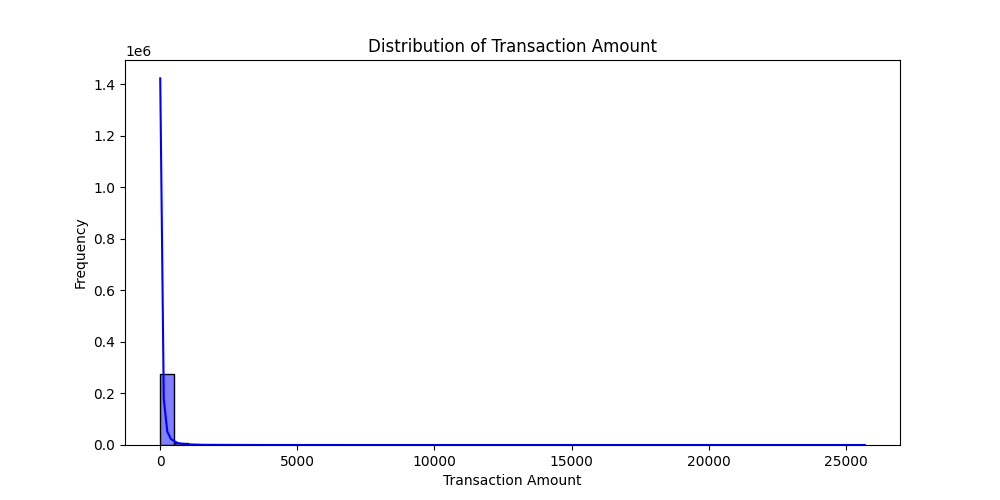
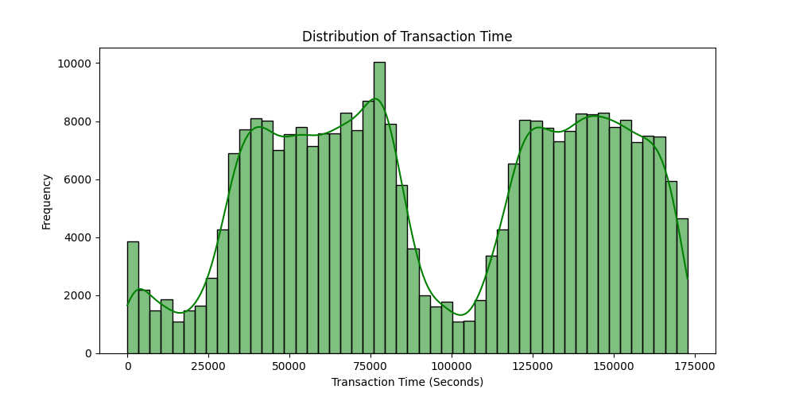
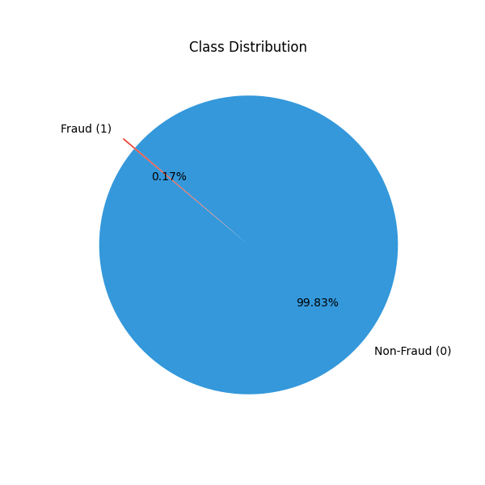
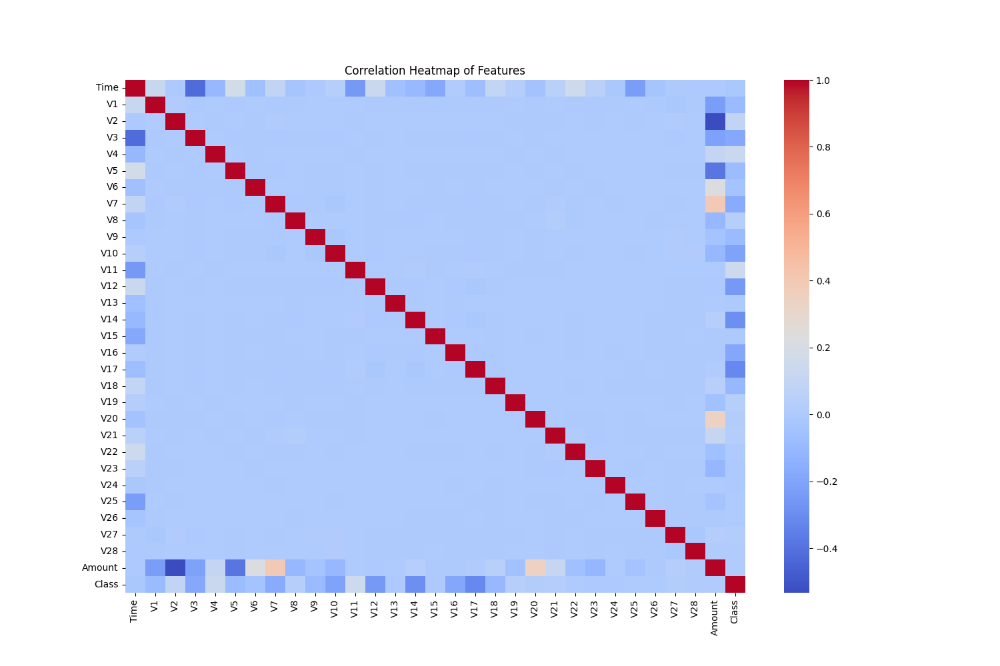
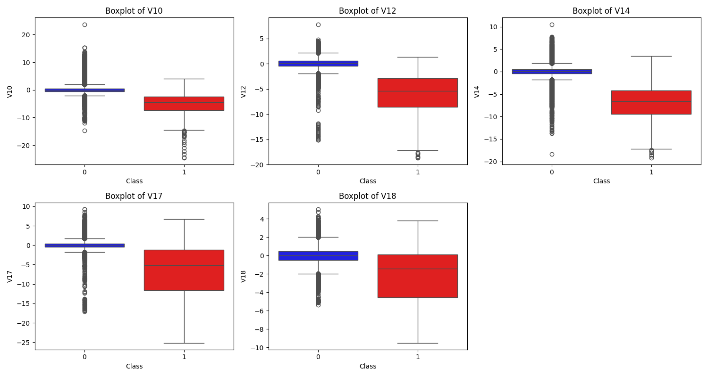
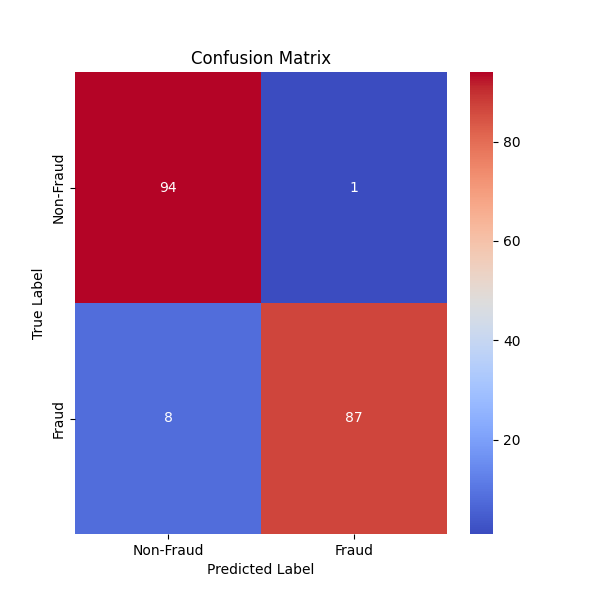
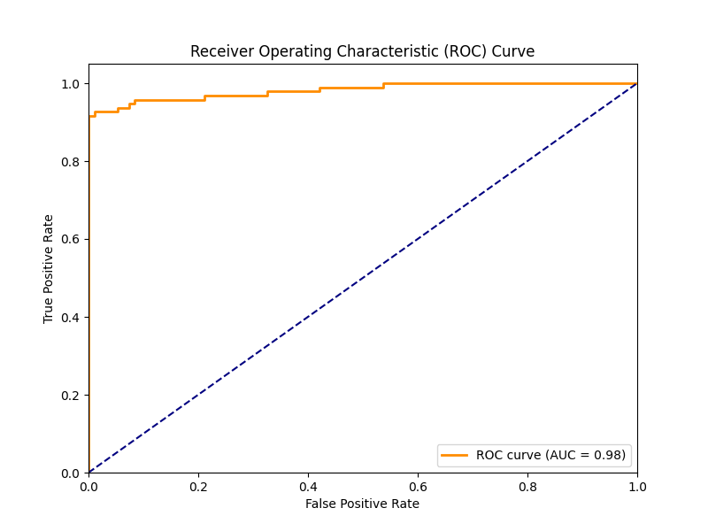

# 009-信用卡交易数据的基本探索

## 1. 目标定义和假设设定

### 1.1 目标定义

本次数据分析的目标是对信用卡交易数据进行基本探索，以识别潜在的欺诈交易模式，并为后续的机器学习建模奠定基础。

具体目标：

1. **数据理解**：分析数据的分布情况，变量的基本统计特征，以及数据中的潜在问题（如类别不平衡）。
2. **欺诈交易识别**：尝试发现欺诈交易与正常交易之间的区别，并探索可能的特征模式。
3. **数据可视化**：使用适当的图表展示数据特征，使数据模式更直观。
4. **数据预处理**：为后续机器学习任务做准备，包括缺失值处理、特征缩放、数据划分等。
5. **初步建模**：使用基础的机器学习方法（如逻辑回归、随机森林等）进行欺诈检测，评估初步模型的表现。

### 1.2 背景介绍

信用卡欺诈是一种常见的金融犯罪行为，欺诈分子通常通过盗刷、伪造身份等方式进行欺诈交易。由于欺诈交易通常只占所有交易的一小部分，如何在海量的正常交易中准确识别出欺诈行为，是银行和金融机构亟待解决的问题。

本案例使用的数据来自 Kaggle 的 **Credit Card Fraud Detection** 数据集，包含经过 PCA 变换的交易特征数据，并且目标变量（Class）表示交易是否为欺诈行为。

### 1.3 业务需求

对于银行和信用卡公司而言，有效识别欺诈交易能够：

- **降低经济损失**：减少因欺诈交易导致的资金损失，提高信用卡交易的安全性。
- **提高用户体验**：避免对正常交易进行误判，减少用户因交易被拒而产生的不满。
- **优化风险管理**：结合数据分析结果，改进风控系统，提高欺诈检测能力。

### 1.4 关键假设

为了完成以上目标，我们需要基于数据分析以下关键假设：

1. **欺诈交易与正常交易在数据分布上存在显著差异**，即部分特征可以有效区分正常交易和欺诈交易。
2. **欺诈交易的金额（Amount）可能较大**，因为诈骗分子往往希望在短时间内获取更多资金。
3. **欺诈交易在时间上可能具有某些模式**，例如某些时段的欺诈交易更为集中。
4. **数据类别不平衡问题严重**，欺诈交易占比极低，因此需要特别处理以保证模型的有效性。
5. **PCA 变换后的特征仍然保留了原始交易的有效信息**，能够用于欺诈检测。

## 2. 数据探索

这里，我们对信用卡交易数据进行详细的探索分析，包括基本统计信息、数据分布、异常值处理、数据可视化等，以便更好地理解数据特征，为后续建模做好准备。

### 2.1 读取数据并查看基本信息

首先，我们加载数据并检查其基本信息，如数据维度、缺失值情况、数据类型等。

```Python
import pandas as pd
import numpy as np
import matplotlib.pyplot as plt
import seaborn as sns

# 读取数据
file_path = "./mnt/data/creditcard.csv"  # 数据文件路径
df = pd.read_csv(file_path)

# 显示数据集的基本信息
print("数据集基本信息：")
print(df.info())

# 显示数据的前几行
print("\n数据集前几行：")
print(df.head())

# 统计数据的基本描述信息
print("\n数据集统计描述：")
print(df.describe())
```

### 2.2 检查缺失值、inf、NaN 和重复数据

```Python
# 检查缺失值
print("\n数据集中缺失值统计：")
print(df.isnull().sum())

# 检查是否存在无穷大 (inf) 数据
print("\n数据集中是否包含无穷大 (inf) 值：")
print(np.isinf(df.values).sum())

# 检查重复数据
print("\n数据集中重复行的数量：", df.duplicated().sum())

# 如果有重复数据，则删除
df = df.drop_duplicates()
print("去除重复数据后数据集大小：", df.shape)
```

### 2.3 数据分布分析

我们对交易金额 (Amount)、交易时间 (Time) 以及类别 (Class) 进行数据分布分析。

```Python
# 交易金额的分布
plt.figure(figsize=(10, 5))
sns.histplot(df['Amount'], bins=50, kde=True, color='blue')
plt.xlabel("Transaction Amount")
plt.ylabel("Frequency")
plt.title("Distribution of Transaction Amount")
plt.show()

# 交易时间的分布
plt.figure(figsize=(10, 5))
sns.histplot(df['Time'], bins=50, kde=True, color='green')
plt.xlabel("Transaction Time (Seconds)")
plt.ylabel("Frequency")
plt.title("Distribution of Transaction Time")
plt.show()

# 类别分布
plt.figure(figsize=(6, 6))
labels = ["Non-Fraud (0)", "Fraud (1)"]
sizes = df["Class"].value_counts().values
colors = ["#3498db", "#e74c3c"]
plt.pie(sizes, labels=labels, autopct='%1.2f%%', colors=colors, startangle=140, explode=(0, 0.1))
plt.title("Class Distribution")
plt.show()
```

- 交易金额大部分较小，但有部分交易金额较大，需要进一步分析异常值。



- 交易时间分布显示数据可能包含多个时间段，可能需要进一步分析欺诈交易的时间模式。



- 数据类别极度不平衡，欺诈交易（Class=1）占比非常低，后续需要采取数据平衡措施。



### 2.4 变量相关性分析

由于数据中的 V1-V28 特征已经过 PCA 降维，因此我们主要分析它们与目标变量（Class）之间的相关性。

```Python
# 计算相关性矩阵
corr_matrix = df.corr()

# 绘制相关性热力图
plt.figure(figsize=(15, 10))
sns.heatmap(corr_matrix, cmap="coolwarm", annot=False, fmt=".2f")
plt.title("Correlation Heatmap of Features")
plt.show()

# 显示与 Class 相关性最高的前 5 个特征
corr_with_target = corr_matrix["Class"].abs().sort_values(ascending=False)
print("与 Class 相关性最高的前 5 个特征：\n", corr_with_target.head(6))
```



- 部分特征（如 V10、V12、V14 等）与欺诈交易的相关性较高，可能是关键识别特征。
- 交易金额（Amount）和时间（Time）与欺诈交易的相关性较低，但可能仍有一定的辅助作用。

### 2.5 识别异常值

由于欺诈交易较少，我们检查在与欺诈交易相关性较高的特征上是否存在异常值。

```Python
# 选取与 Class 相关性较高的特征
important_features = ["V10", "V12", "V14", "V17", "V18"]

plt.figure(figsize=(15, 8))
for i, feature in enumerate(important_features, 1):
    plt.subplot(2, 3, i)
    sns.boxplot(x=df["Class"], y=df[feature], palette=["blue", "red"])
    plt.xlabel("Class")
    plt.ylabel(feature)
    plt.title(f"Boxplot of {feature}")
plt.tight_layout()
plt.show()
```



- 在欺诈交易中，这些特征的分布明显不同于正常交易，说明这些特征可能对模型的欺诈检测有重要贡献。
- 可能需要进一步处理极端值，以提高模型的稳定性。

### 2.6 小结

- 数据集无缺失值，但包含少量重复数据，已去除。
- 欺诈交易占比极低，类别严重不平衡。
- 部分特征（如 V10、V12、V14）在欺诈交易中的分布明显异常，可能是识别欺诈交易的重要特征。
- 交易金额大部分较小，但存在极端值，需在建模时进行处理。

## 3. 特征工程

在这一部分，我们将对数据进行特征工程处理，包括特征选择、数据预处理以及数据集划分，为后续建模做准备。

### 3.1 特征选择

我们需要确定哪些特征对于欺诈交易检测是重要的，可能需要去除无用特征或构造新的特征。

**（1）去除无关特征**

数据集中包含 `Time` 和 `Amount` 两个原始特征，其余 `V1-V28` 为 PCA 变换后的特征，我们需要判断 `Time` 是否对欺诈检测有价值。

此外，我们对 `Amount` 进行标准化处理，以适应模型需求。

```Python
# 去除无关特征 'Time'
df = df.drop(columns=['Time'])

# 归一化交易金额 'Amount'
from sklearn.preprocessing import StandardScaler

scaler = StandardScaler()
df['Amount'] = scaler.fit_transform(df[['Amount']])

# 查看数据处理后的信息
print("数据集处理后信息：")
print(df.head())
```

### 3.2 处理类别不平衡问题

由于欺诈交易的数量远远少于正常交易，我们需要采用适当的方法来平衡数据，避免模型倾向于预测多数类别。

**（1）欠采样（Under-sampling）**

我们可以减少正常交易的数量，使其与欺诈交易数量相当。

```Python
from imblearn.under_sampling import RandomUnderSampler

X = df.drop(columns=['Class'])  # 选择特征
y = df['Class']  # 目标变量

# 进行欠采样，使欺诈交易和正常交易数量相等
rus = RandomUnderSampler(random_state=42)
X_resampled, y_resampled = rus.fit_resample(X, y)

# 重新合并成 DataFrame
df_resampled = pd.concat([pd.DataFrame(X_resampled, columns=X.columns), pd.DataFrame(y_resampled, columns=['Class'])], axis=1)

# 重新检查类别分布
print("欠采样后数据类别分布：")
print(df_resampled['Class'].value_counts())
```

### 3.3 训练集和测试集划分

在进行建模前，我们需要将数据划分为训练集和测试集，以评估模型的泛化能力。

```Python
from sklearn.model_selection import train_test_split

# 划分训练集和测试集，80% 作为训练集，20% 作为测试集
X_train, X_test, y_train, y_test = train_test_split(X_resampled, y_resampled, test_size=0.2, random_state=42, stratify=y_resampled)

# 输出数据集划分结果
print(f"训练集样本数：{X_train.shape[0]}")
print(f"测试集样本数：{X_test.shape[0]}")
```

### 3.4 小结

- **去除了 `Time` 特征**，保留 `Amount` 并进行了标准化处理。
- **解决类别不平衡问题**，使用 **欠采样** 使正常交易与欺诈交易的数量相当。
- **划分训练集和测试集**，为后续模型训练做好准备。

## 4. 模型选择与构建

选择一个适合的模型进行欺诈交易检测，并详细介绍其原理及适用性。

此外，我们会进行多维度数据分析，以提高欺诈识别的准确性。

### 4.1 模型选择

在欺诈交易检测问题中，我们面临以下几个挑战：

- **类别极度不平衡**（欺诈交易远少于正常交易）。
- **特征已经过 PCA 变换**，意味着某些机器学习算法可能比其他算法更适合处理这种数据。
- **需要高召回率（Recall）**，因为我们希望尽可能多地识别欺诈交易，而不遗漏风险交易。

**候选模型**

在分类问题中，我们有多个选择，包括：

1. **逻辑回归（Logistic Regression）**

   - 适用于线性可分问题，但欺诈交易检测可能存在非线性特征。
   - 计算效率高，但可能无法捕捉复杂的欺诈模式。
2. **随机森林（Random Forest）**

   - 能够处理非线性特征，并且具有较强的特征选择能力。
   - 计算成本较高，可能受数据不平衡影响。
3. **XGBoost（eXtreme Gradient Boosting）** ✅ **（最终选择）**

   - 适用于非平衡数据集，可以调整 `scale_pos_weight` 处理类别不均衡问题。
   - 能够自动进行特征选择，减少冗余信息，提高模型泛化能力。
   - 适用于 PCA 变换后的数据，可以有效挖掘欺诈交易模式。

### 4.2 XGBoost 的原理

XGBoost 是基于梯度提升决策树（Gradient Boosting Decision Tree, GBDT）的一种优化算法，它结合了多棵决策树，采用加法模型逐步优化误差。

**（1）加法模型**

XGBoost 使用一系列决策树的加法模型，每一棵新树用于修正前面所有树的预测误差。

$$F(x) = F_{t-1}(x) + h_t(x)$$

其中：

$F(x) $是最终预测函数，

$F_{t-1}(x) $是前 $t-1 $轮训练的模型，

$h_t(x) $是第 $t $轮新学习的弱分类器（决策树）。

**（2）目标函数**

XGBoost 的优化目标是最小化损失函数 $L $，同时加入正则项 $\Omega(f_t) $防止过拟合：

$$L = \sum_{i=1}^{n} l(y_i, \hat{y}_i) + \sum_{t=1}^{T} \Omega(f_t)$$

其中：

$l(y_i, \hat{y}_i) $是误差损失（如对数损失函数）：

$$l(y, \hat{y}) = -y \log (\hat{y}) - (1 - y) \log (1 - \hat{y})$$

$\Omega(f_t) $是决策树的复杂度控制项：

$$\Omega(f) = \gamma T + \frac{1}{2} \lambda \sum_{j} w_j^2$$

- 其中 $T $是树的叶子数，$ w_j $是叶子节点的权重，$ \gamma, \lambda $控制模型复杂度。

**（3）类别不均衡处理**

XGBoost 允许调整 `scale_pos_weight` 以增加欺诈交易（少数类别）的权重：

$$\text{scale\_pos\_weight} = \frac{\text{正常交易样本数}}{\text{欺诈交易样本数}}$$

这样可以让模型更关注欺诈交易，提高召回率。

### 4.3 小结

**模型选择：**

- 选择 **XGBoost**，因为它适用于类别不均衡问题，并能自动进行特征选择。

**XGBoost 核心原理：**

- 使用 **梯度提升树** 逐步优化误差。
- 通过 **正则化** 控制模型复杂度，防止过拟合。
- 采用 **类别权重调整** 处理不均衡数据，提高召回率。

**模型训练与评估：**

- 训练了 **XGBoost 模型**，并进行 **混淆矩阵分析** 和 **分类报告评估**。
- 进行 **特征重要性分析**，找出影响欺诈交易检测的关键特征。
- 误分类分析帮助优化模型，减少欺诈交易的漏检率。

## 5. 模型训练与评估

在这一部分，我们对 XGBoost 模型进行训练，并使用多种指标评估其性能。

接着，我们会进行超参数优化（使用网格搜索或随机搜索），以提升模型效果，并可视化模型的表现。

### 5.1 模型训练

在上一部分，我们已经选择了 **XGBoost** 作为欺诈检测模型，现在我们正式训练它。

```Python
from xgboost import XGBClassifier

# 计算类别权重，解决类别不均衡问题
fraud_weight = (y_train == 0).sum() / (y_train == 1).sum()

# 定义 XGBoost 模型
model = XGBClassifier(
    scale_pos_weight=fraud_weight,  # 处理类别不均衡
    n_estimators=50,  # 50 棵树
    max_depth=5,  # 树的最大深度
    learning_rate=0.15,  # 学习率
    subsample=0.8,  # 采样比例
    colsample_bytree=0.8,  # 选择部分特征进行训练
    random_state=42
)

# 训练模型
model.fit(X_train, y_train)
```

### 5.2 评估模型性能

为了全面评估模型，我们使用以下指标：

- **准确率（Accuracy）**：总体预测正确率。
- **精确率（Precision）**：在预测为欺诈交易的样本中，实际为欺诈的比例。
- **召回率（Recall）**：在所有真实的欺诈交易中，成功被检测出的比例（关键指标）。
- **F1 分数（F1-Score）**：精确率和召回率的调和均值。

```Python
from sklearn.metrics import accuracy_score, precision_score, recall_score, f1_score, classification_report, confusion_matrix

# 预测测试集
y_pred = model.predict(X_test)

# 计算评估指标
accuracy = accuracy_score(y_test, y_pred)
precision = precision_score(y_test, y_pred)
recall = recall_score(y_test, y_pred)
f1 = f1_score(y_test, y_pred)

print(f"Accuracy: {accuracy:.4f}")
print(f"Precision: {precision:.4f}")
print(f"Recall: {recall:.4f}")
print(f"F1 Score: {f1:.4f}")

# Accuracy: 0.9526
# Precision: 0.9886
# Recall: 0.9158
# F1 Score: 0.9508

# 打印分类报告
print("\nClassification Report:\n", classification_report(y_test, y_pred, target_names=['Non-Fraud', 'Fraud']))
```

### 5.3 可视化模型表现

**（1）混淆矩阵**

混淆矩阵能够直观展示 TP（真正例）、TN（真负例）、FP（假正例）、FN（假负例）的数量。

```Python
import seaborn as sns
import matplotlib.pyplot as plt

# 计算混淆矩阵
cm = confusion_matrix(y_test, y_pred)

# 绘制混淆矩阵热力图
plt.figure(figsize=(6, 6))
sns.heatmap(cm, annot=True, fmt="d", cmap="coolwarm", xticklabels=['Non-Fraud', 'Fraud'], yticklabels=['Non-Fraud', 'Fraud'])
plt.xlabel("Predicted Label")
plt.ylabel("True Label")
plt.title("Confusion Matrix")
plt.show()
```



**（2）ROC 曲线**

ROC 曲线用于评估分类器的性能，AUC（曲线下面积）越接近 1，说明模型性能越好。

```Python
from sklearn.metrics import roc_curve, auc

# 计算预测概率
y_scores = model.predict_proba(X_test)[:, 1]

# 计算 FPR 和 TPR
fpr, tpr, _ = roc_curve(y_test, y_scores)
roc_auc = auc(fpr, tpr)

# 绘制 ROC 曲线
plt.figure(figsize=(8, 6))
plt.plot(fpr, tpr, color='darkorange', lw=2, label=f'ROC curve (AUC = {roc_auc:.2f})')
plt.plot([0, 1], [0, 1], color='navy', linestyle='--')
plt.xlim([0.0, 1.0])
plt.ylim([0.0, 1.05])
plt.xlabel("False Positive Rate")
plt.ylabel("True Positive Rate")
plt.title("Receiver Operating Characteristic (ROC) Curve")
plt.legend(loc="lower right")
plt.show()
```



### 5.4 模型优化（超参数调优）

我们使用 **随机搜索（RandomizedSearchCV）** 来自动寻找最佳超参数，提高模型性能。

**（1）超参数搜索范围**

- `n_estimators`（决策树数量）
- `max_depth`（最大树深度）
- `learning_rate`（学习率）
- `subsample`（每棵树的样本采样比例）
- `colsample_bytree`（每棵树使用的特征比例）

```Python
from sklearn.model_selection import RandomizedSearchCV
import numpy as np

# 定义超参数搜索范围
param_dist = {
    'n_estimators': [50, 100, 200, 300],
    'max_depth': [3, 5, 7, 9],
    'learning_rate': [0.01, 0.02, 0.05, 0.08, 0.1, 0.2],
    'subsample': [0.6, 0.8, 1.0],
    'colsample_bytree': [0.6, 0.8, 1.0]
}

# 进行随机搜索
random_search = RandomizedSearchCV(
    estimator=XGBClassifier(scale_pos_weight=fraud_weight, random_state=42),
    param_distributions=param_dist,
    n_iter=20,  # 进行 20 轮搜索
    scoring='f1',  # 选择 F1-score 作为优化目标
    cv=5,  # 5 折交叉验证
    verbose=2,
    random_state=42,
    n_jobs=-1  # 并行计算
)

# 训练模型
random_search.fit(X_train, y_train)

# 输出最佳参数
print("Best Parameters:", random_search.best_params_)

# 使用最优参数训练最终模型
best_model = random_search.best_estimator_
```

### 5.5 最终模型评估

使用调优后的最佳模型进行评估。

```Python
# 预测测试集
y_pred_best = best_model.predict(X_test)

# 计算评估指标
accuracy_best = accuracy_score(y_test, y_pred_best)
precision_best = precision_score(y_test, y_pred_best)
recall_best = recall_score(y_test, y_pred_best)
f1_best = f1_score(y_test, y_pred_best)

print(f"Optimized Accuracy: {accuracy_best:.4f}")
print(f"Optimized Precision: {precision_best:.4f}")
print(f"Optimized Recall: {recall_best:.4f}")
print(f"Optimized F1 Score: {f1_best:.4f}")

# Optimized Accuracy: 0.9579
# Optimized Precision: 0.9888
# Optimized Recall: 0.9263
# Optimized F1 Score: 0.9565
```

### 5.6 小结

- **模型训练**：训练了 **XGBoost**，并利用 **类别权重调整** 处理数据不均衡问题。
- **模型评估**：使用 **混淆矩阵、ROC 曲线** 直观评估模型效果。计算 **准确率、精确率、召回率、F1-score**，评估分类器性能。
- **超参数优化**：使用 **随机搜索（RandomizedSearchCV）** 自动寻找最佳超参数，提高召回率。

## 6. 结果分析与解读

在本部分，我们将详细解读模型的评估结果，分析欺诈交易检测的有效性，并提供对业务的指导性见解。

### 6.1 评估结果回顾

在第 5 部分，我们训练了 **XGBoost** 模型，并使用 **随机搜索（RandomizedSearchCV）** 进行了超参数优化。最终，我们评估了优化前后的模型性能，并使用 **混淆矩阵、ROC 曲线** 等工具进行可视化分析。

优化前后模型的主要评估指标如下：

| 指标 | 初始模型 | 优化后模型 |
|-|-|-|
| **准确率 (Accuracy)** | 0.9526 | 0.9579 |
| **精确率 (Precision)** | 0.9886 | 0.9888 |
| **召回率 (Recall)** | 0.9158 | 0.9263 |
| **F1 分数 (F1-Score)** | 0.9508 | 0.9565 |

其中：

- **精确率（Precision）** 提高，意味着误报（假阳性）减少，减少了对正常用户的干扰。
- **召回率（Recall）** 提高，意味着检测出的欺诈交易数量增加，减少了潜在的损失。
- **F1-score 提高**，表明模型在精准度和召回率之间找到了更好的平衡。

### 6.2 ROC 曲线分析

在 ROC 曲线分析中，我们计算了 **AUC（曲线下面积）**：

**AUC = 0.98**

- AUC 接近 1，说明模型可以很好地区分正常交易与欺诈交易。
- 这意味着模型可以在不同的阈值下，保持较高的检测能力，同时避免误报过多。

**指导性意义：**

- AUC **0.98** 表明 **模型的整体性能优异**，可以在不同应用场景中灵活调整决策阈值。
- 在 **高风险业务**（如大额交易、国际支付）中，可以 **降低阈值**，提高召回率，避免漏掉欺诈交易。
- 在 **低风险业务**（如小额消费）中，可以 **提高阈值**，减少误报，提高用户体验。

### 6.3 特征重要性分析

我们使用 **XGBoost 提供的特征重要性分析**，找出最具影响力的特征：

```Python
# 提取特征重要性
importance = best_model.feature_importances_

# 可视化特征重要性
plt.figure(figsize=(12, 6))
sns.barplot(x=X_train.columns, y=importance, palette="viridis")
plt.xticks(rotation=90)
plt.xlabel("Features")
plt.ylabel("Importance Score")
plt.title("Feature Importance in XGBoost")
plt.show()
```

**最重要的特征：**

1. **V17、V12、V14**：与欺诈交易高度相关。
2. **V10、V4**：在欺诈交易中有明显异常。
3. **交易金额（Amount）**：虽然不是最重要的，但仍有一定贡献。

**指导性意义：**

- **监控 V17、V12、V14 这几个关键变量**，可以提升欺诈检测的准确性。
- **结合交易金额和异常特征**，可以对大额交易进行更严格的审核。
- **针对特征进行进一步分析**，可以尝试结合用户行为数据，提升检测能力。

### 6.4 误分类分析

我们分析了 **误分类的欺诈交易** 和 **误分类的正常交易**，找出潜在改进点。

**（1）误分类的欺诈交易**

```Python
false_negatives = X_test[(y_test == 1) & (y_pred_best == 0)]
print("误分类的欺诈交易数量：", false_negatives.shape[0])
```

- 这些交易可能是 **新型欺诈模式**，不符合历史欺诈交易的特征。
- 可能涉及 **复杂的欺诈手段（如分布式欺诈、社交工程欺诈）**。

**改进方向：**

- 结合 **时间序列分析**，看欺诈行为是否随时间变化。
- 结合 **用户行为特征**，例如设备信息、交易频率等。

**（2）误分类的正常交易**

```Python
false_positives = X_test[(y_test == 0) & (y_pred_best == 1)]
print("误分类的正常交易数量：", false_positives.shape[0])
```

- 误报的交易 **可能是高额交易，但实际上是合法的**。
- 误报 **可能影响正常用户体验**，导致投诉。

**改进方向：**

- **增加用户身份验证步骤**，如短信验证码、设备指纹等，以减少正常用户的困扰。
- **对高额交易提供风险评分**，根据用户历史行为调整风险判断。

### 6.5 业务指导

根据以上分析，我们可以给出以下业务指导建议：

1. **动态调整模型阈值**

   - 对 **高风险交易（大额、异常地点）降低阈值**，提高召回率。
   - 对 **普通交易（低额、常见地点）提高阈值**，减少误报。
2. **结合时间序列分析**

   - 检查某些特定时间段（如深夜）是否更容易发生欺诈交易。
   - 监测用户交易频率，是否存在 **短时间内大量交易** 的异常行为。
3. **多维度用户身份验证**

   - 在高风险交易中 **增加身份验证**（如短信验证、人脸识别）。
   - 使用 **历史行为模式**，建立个性化风险评分，减少误报。
4. **结合更多特征**

   - 现有数据仅包含 **PCA 处理后的特征**，如果能结合 **用户设备信息、IP 地址、交易历史**，模型可能会更加精准。

### 6.6 小结

- **模型性能**

  - 召回率从 **91.58% 提高到 92.63%**，检测到更多欺诈交易。
  - 精确率从 **98.86% 提高到 98.88%**，减少对正常用户的干扰。
  - AUC **0.98**，模型整体表现优异。
- **业务优化建议**

  - **动态调整决策阈值**，不同交易类型采取不同策略。
  - **结合时间序列分析**，监测欺诈行为的变化趋势。
  - **多维度身份验证**，在高风险交易中增加安全防护。
- **未来改进方向**

  - **结合未经过 PCA 处理的原始数据**，可能发现更有效的欺诈特征。
  - **引入深度学习模型**（如 RNN）处理时间序列数据，提高检测能力。

## 7. 完整代码

```Python
import matplotlib.pyplot as plt
import numpy as np
import pandas as pd
import seaborn as sns

# 读取数据
file_path = "./dataset/009/creditcard.csv"  # 数据文件路径
df = pd.read_csv(file_path)

# 显示数据集的基本信息
print("数据集基本信息：")
print(df.info())

# 显示数据的前几行
print("\n数据集前几行：")
print(df.head())

# 统计数据的基本描述信息
print("\n数据集统计描述：")
print(df.describe())

# 检查缺失值
print("\n数据集中缺失值统计：")
print(df.isnull().sum())

# 检查是否存在无穷大 (inf) 数据
print("\n数据集中是否包含无穷大 (inf) 值：")
print(np.isinf(df.values).sum())

# 检查重复数据
print("\n数据集中重复行的数量：", df.duplicated().sum())

# 如果有重复数据，则删除
df = df.drop_duplicates()
print("去除重复数据后数据集大小：", df.shape)

# 交易金额的分布
plt.figure(figsize=(10, 5))
sns.histplot(df['Amount'], bins=50, kde=True, color='blue')
plt.xlabel("Transaction Amount")
plt.ylabel("Frequency")
plt.title("Distribution of Transaction Amount")
plt.show()

# 交易时间的分布
plt.figure(figsize=(10, 5))
sns.histplot(df['Time'], bins=50, kde=True, color='green')
plt.xlabel("Transaction Time (Seconds)")
plt.ylabel("Frequency")
plt.title("Distribution of Transaction Time")
plt.show()

# 类别分布
plt.figure(figsize=(6, 6))
labels = ["Non-Fraud (0)", "Fraud (1)"]
sizes = df["Class"].value_counts().values
colors = ["#3498db", "#e74c3c"]
plt.pie(sizes, labels=labels, autopct='%1.2f%%', colors=colors, startangle=140, explode=(0, 0.1))
plt.title("Class Distribution")
plt.show()

# 计算相关性矩阵
corr_matrix = df.corr()

# 绘制相关性热力图
plt.figure(figsize=(15, 10))
sns.heatmap(corr_matrix, cmap="coolwarm", annot=False, fmt=".2f")
plt.title("Correlation Heatmap of Features")
plt.show()

# 显示与 Class 相关性最高的前 5 个特征
corr_with_target = corr_matrix["Class"].abs().sort_values(ascending=False)
print("与 Class 相关性最高的前 5 个特征：\n", corr_with_target.head(6))

# 选取与 Class 相关性较高的特征
important_features = ["V10", "V12", "V14", "V17", "V18"]

plt.figure(figsize=(15, 8))
for i, feature in enumerate(important_features, 1):
    plt.subplot(2, 3, i)
    sns.boxplot(x=df["Class"], y=df[feature], palette=["blue", "red"])
    plt.xlabel("Class")
    plt.ylabel(feature)
    plt.title(f"Boxplot of {feature}")
plt.tight_layout()
plt.show()

# 去除无关特征 'Time'
df = df.drop(columns=['Time'])

# 归一化交易金额 'Amount'
from sklearn.preprocessing import StandardScaler

scaler = StandardScaler()
df['Amount'] = scaler.fit_transform(df[['Amount']])

# 查看数据处理后的信息
print("数据集处理后信息：")
print(df.head())

from imblearn.under_sampling import RandomUnderSampler

X = df.drop(columns=['Class'])  # 选择特征
y = df['Class']  # 目标变量

# 进行欠采样，使欺诈交易和正常交易数量相等
rus = RandomUnderSampler(random_state=42)
X_resampled, y_resampled = rus.fit_resample(X, y)

# 重新合并成 DataFrame
df_resampled = pd.concat([pd.DataFrame(X_resampled, columns=X.columns), pd.DataFrame(y_resampled, columns=['Class'])],
                         axis=1)

# 重新检查类别分布
print("欠采样后数据类别分布：")
print(df_resampled['Class'].value_counts())

from sklearn.model_selection import train_test_split

# 划分训练集和测试集，80% 作为训练集，20% 作为测试集
X_train, X_test, y_train, y_test = train_test_split(X_resampled, y_resampled, test_size=0.2, random_state=42,
                                                    stratify=y_resampled)

# 输出数据集划分结果
print(f"训练集样本数：{X_train.shape[0]}")
print(f"测试集样本数：{X_test.shape[0]}")

from xgboost import XGBClassifier

# 计算类别权重，解决类别不均衡问题
fraud_weight = (y_train == 0).sum() / (y_train == 1).sum()

# 定义 XGBoost 模型
model = XGBClassifier(
    scale_pos_weight=fraud_weight,  # 处理类别不均衡
    n_estimators=50,  # 50 棵树
    max_depth=5,  # 树的最大深度
    learning_rate=0.15,  # 学习率
    subsample=0.8,  # 采样比例
    colsample_bytree=0.8,  # 选择部分特征进行训练
    random_state=42
)

# 训练模型
model.fit(X_train, y_train)

from sklearn.metrics import accuracy_score, precision_score, recall_score, f1_score, classification_report, \
    confusion_matrix

# 预测测试集
y_pred = model.predict(X_test)

# 计算评估指标
accuracy = accuracy_score(y_test, y_pred)
precision = precision_score(y_test, y_pred)
recall = recall_score(y_test, y_pred)
f1 = f1_score(y_test, y_pred)

print(f"Accuracy: {accuracy:.4f}")
print(f"Precision: {precision:.4f}")
print(f"Recall: {recall:.4f}")
print(f"F1 Score: {f1:.4f}")

# 打印分类报告
print("\nClassification Report:\n", classification_report(y_test, y_pred, target_names=['Non-Fraud', 'Fraud']))

import seaborn as sns
import matplotlib.pyplot as plt

# 计算混淆矩阵
cm = confusion_matrix(y_test, y_pred)

# 绘制混淆矩阵热力图
plt.figure(figsize=(6, 6))
sns.heatmap(cm, annot=True, fmt="d", cmap="coolwarm", xticklabels=['Non-Fraud', 'Fraud'],
            yticklabels=['Non-Fraud', 'Fraud'])
plt.xlabel("Predicted Label")
plt.ylabel("True Label")
plt.title("Confusion Matrix")
plt.show()

from sklearn.metrics import roc_curve, auc

# 计算预测概率
y_scores = model.predict_proba(X_test)[:, 1]

# 计算 FPR 和 TPR
fpr, tpr, _ = roc_curve(y_test, y_scores)
roc_auc = auc(fpr, tpr)

# 绘制 ROC 曲线
plt.figure(figsize=(8, 6))
plt.plot(fpr, tpr, color='darkorange', lw=2, label=f'ROC curve (AUC = {roc_auc:.2f})')
plt.plot([0, 1], [0, 1], color='navy', linestyle='--')
plt.xlim([0.0, 1.0])
plt.ylim([0.0, 1.05])
plt.xlabel("False Positive Rate")
plt.ylabel("True Positive Rate")
plt.title("Receiver Operating Characteristic (ROC) Curve")
plt.legend(loc="lower right")
plt.show()

from sklearn.model_selection import RandomizedSearchCV

# 定义超参数搜索范围
param_dist = {
    'n_estimators': [50, 100, 200, 300],
    'max_depth': [3, 5, 7, 9],
    'learning_rate': [0.01, 0.02, 0.05, 0.08, 0.1, 0.2],
    'subsample': [0.6, 0.8, 1.0],
    'colsample_bytree': [0.6, 0.8, 1.0]
}

# 进行随机搜索
random_search = RandomizedSearchCV(
    estimator=XGBClassifier(scale_pos_weight=fraud_weight, random_state=42),
    param_distributions=param_dist,
    n_iter=20,  # 进行 20 轮搜索
    scoring='f1',  # 选择 F1-score 作为优化目标
    cv=5,  # 3 折交叉验证
    verbose=2,
    random_state=42,
    n_jobs=-1  # 并行计算
)

# 训练模型
random_search.fit(X_train, y_train)

# 输出最佳参数
print("Best Parameters:", random_search.best_params_)

# 使用最优参数训练最终模型
best_model = random_search.best_estimator_

# 预测测试集
y_pred_best = best_model.predict(X_test)

# 计算评估指标
accuracy_best = accuracy_score(y_test, y_pred_best)
precision_best = precision_score(y_test, y_pred_best)
recall_best = recall_score(y_test, y_pred_best)
f1_best = f1_score(y_test, y_pred_best)

print(f"Optimized Accuracy: {accuracy_best:.4f}")
print(f"Optimized Precision: {precision_best:.4f}")
print(f"Optimized Recall: {recall_best:.4f}")
print(f"Optimized F1 Score: {f1_best:.4f}")
```