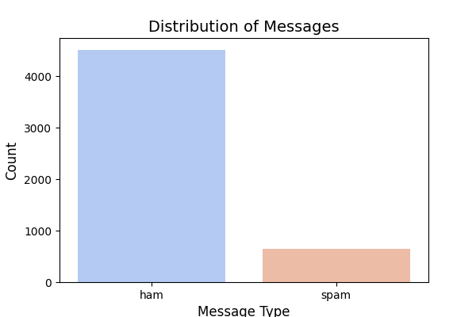
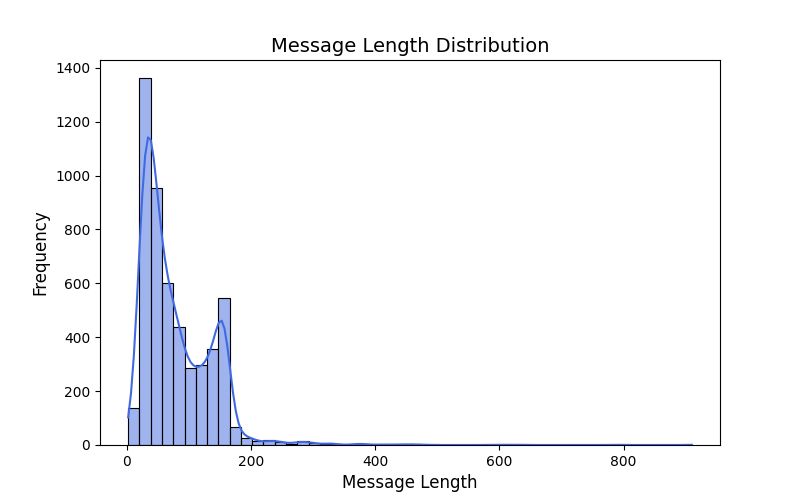
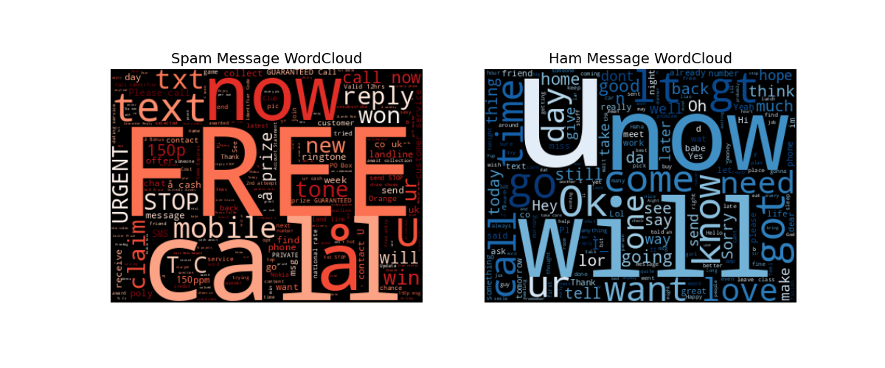
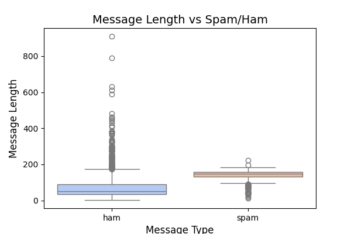
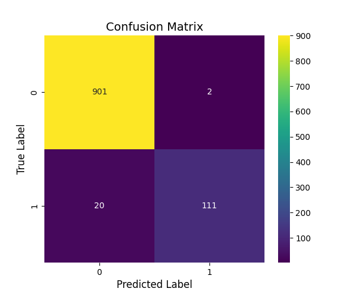
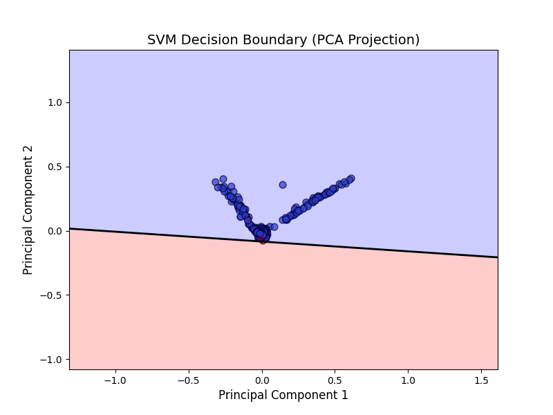
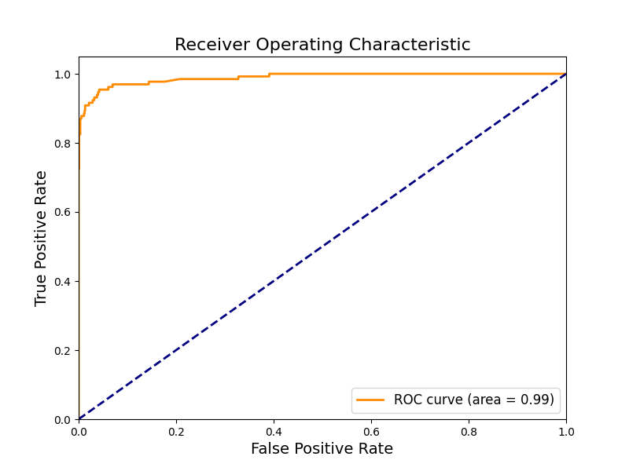

# 010-垃圾邮件检测的基础探索

## 1. 目标定义和假设设定

### 1.1 背景介绍

在现代通信中，垃圾短信（Spam SMS）不仅影响用户体验，还可能涉及诈骗、广告骚扰等问题。因此，自动化垃圾短信检测是一个重要的任务。通过机器学习，我们可以构建分类模型，自动区分正常短信（Ham）和垃圾短信（Spam），提高用户体验并减少不必要的干扰。

本案例基于 **Kaggle 的 Spam SMS Messages Dataset**，该数据集包含真实的短信文本及其对应的标签。我们将通过数据分析和机器学习模型，探索短信文本特征，并构建垃圾短信检测模型。

### 1.2 分析目标

本案例的核心目标包括：

1. **数据探索与预处理**：分析数据的基本特征，处理缺失值、异常值等问题。
2. **特征工程**：提取文本特征，如词频、TF-IDF（词频-逆文档频率）等，为机器学习模型提供有效的输入。
3. **模型训练与评估**：使用机器学习算法（如 Naïve Bayes、逻辑回归等）训练垃圾短信分类模型，并评估其性能。
4. **结果分析与优化**：分析模型效果，尝试改进特征提取和模型参数，以提高分类准确率。

### 1.3 假设设定

为了完成上述目标，我们设定以下假设，并在分析过程中进行验证：

$H_0$**（零假设）**：短信文本的词汇分布对垃圾短信和正常短信的分类没有显著影响。

$H_1$**（备择假设）**：短信文本的词汇分布对垃圾短信和正常短信的分类有显著影响，可以通过机器学习模型进行有效区分。

此外，我们假设：

- 垃圾短信通常包含某些高频词，如“免费”（free）、“中奖”（win）、“优惠”（offer）等。
- 正常短信较少包含过度营销或诈骗相关的关键词，结构较为自然。
- 通过 TF-IDF、词频等文本特征，可以有效区分垃圾短信和正常短信。

## 2. 数据探索

在进行数据建模之前，我们需要对数据进行充分的探索，以便理解数据的基本结构、质量情况以及潜在的模式。

这一步包括数据基本信息的检查、缺失值与异常值的处理、数据分布的可视化分析等。

### 2.1 加载数据集

我们使用 **pandas** 读取数据，并查看数据的基本信息，包括数据类型、缺失值情况等。

```Python
import pandas as pd

# 读取数据集
file_path = "./dataset/011/spam.csv"
df = pd.read_csv(file_path, encoding='ISO-8859-1')

# 查看数据前几行
df.head()
```

### 2.2 数据基本信息

```Python
# 查看数据集的基本信息
df.info()

# 查看数据的统计摘要
df.describe(include="all")
```

**分析结果：**

- 数据集中共有 **5 列**，但有 3 列无列名（Unnamed: 2, Unnamed: 3, Unnamed: 4）。
- 主要关心的列是 **v1（标签: Spam/Ham）** 和 **v2（短信内容）**，其余列可能为空，需要进一步处理。
- 数据类型主要是 **object（字符串类型）**，后续可能需要转换。

### 2.3 处理无关列

因为 **Unnamed: 2, Unnamed: 3, Unnamed: 4** 主要为空，我们删除这些无用列，并重命名重要列：

```Python
# 只保留有用的列
df = df[['v1', 'v2']]

# 重命名列
df.columns = ['label', 'message']

# 再次检查数据
df.head()
```

### 2.4 处理缺失值

```Python
# 检查缺失值
missing_values = df.isnull().sum()
print(missing_values)

# 由于本数据集无缺失值，若有可使用以下方法填充：
df = df.dropna()  # 删除缺失值
# df = df.fillna('未知')  # 或者填充特定值
```

该数据集没有缺失值，因此不需要填充处理。

### 2.5 处理重复值

```Python
# 检查重复值
duplicate_count = df.duplicated().sum()
print(f"重复值数量: {duplicate_count}")

# 删除重复值
df = df.drop_duplicates()
```

如果有重复值，则删除它们，以保证数据质量。

### 2.6 数据分布可视化

#### 2.6.1 类别分布

我们先看看 **垃圾短信（Spam）** 和 **正常短信（Ham）** 的数量分布：

```Python
import matplotlib.pyplot as plt
import seaborn as sns

# 统计各类别的数量
plt.figure(figsize=(6,4))
sns.countplot(data=df, x='label', palette="coolwarm")

# 设置标题
plt.title("Distribution of Messages", fontsize=14)
plt.xlabel("Message Type", fontsize=12)
plt.ylabel("Count", fontsize=12)
plt.show()
```



观察垃圾短信与正常短信的数量，看看是否存在数据不均衡问题。

#### 2.6.2 短信长度分布

```Python
# 添加短信长度列
df["message_length"] = df["message"].apply(len)

# 绘制短信长度分布
plt.figure(figsize=(8,5))
sns.histplot(df["message_length"], bins=50, kde=True, color='royalblue')

# 设置标题和标签
plt.title("Message Length Distribution", fontsize=14)
plt.xlabel("Message Length", fontsize=12)
plt.ylabel("Frequency", fontsize=12)
plt.show()
```



我们可以看到垃圾短信和正常短信的长度是否存在差异。

#### 2.6.3 词云可视化

使用词云（WordCloud）查看常见单词，看看垃圾短信和正常短信的词汇分布是否有明显区别。

```Python
from wordcloud import WordCloud

# 生成垃圾短信和正常短信的文本
spam_text = " ".join(df[df["label"] == "spam"]["message"])
ham_text = " ".join(df[df["label"] == "ham"]["message"])

# 绘制词云
plt.figure(figsize=(12,5))

# 垃圾短信词云
plt.subplot(1, 2, 1)
spam_wc = WordCloud(width=400, height=300, background_color="black", colormap="Reds").generate(spam_text)
plt.imshow(spam_wc, interpolation="bilinear")
plt.axis("off")
plt.title("Spam Message WordCloud", fontsize=14)

# 正常短信词云
plt.subplot(1, 2, 2)
ham_wc = WordCloud(width=400, height=300, background_color="black", colormap="Blues").generate(ham_text)
plt.imshow(ham_wc, interpolation="bilinear")
plt.axis("off")
plt.title("Ham Message WordCloud", fontsize=14)

plt.show()
```



观察哪些词在垃圾短信中更常见（如 **free, win, claim**），哪些词在正常短信中常见（如 **ok, call, see**）。

### 2.7 相关性分析

由于本数据集是文本类型，数值型特征较少，因此我们分析 **短信长度** 与 **垃圾短信的关系**。

```Python
plt.figure(figsize=(6,4))
sns.boxplot(data=df, x='label', y='message_length', palette="coolwarm")

# 设置标题
plt.title("Message Length vs Spam/Ham", fontsize=14)
plt.xlabel("Message Type", fontsize=12)
plt.ylabel("Message Length", fontsize=12)
plt.show()
```



如果垃圾短信明显比正常短信长（或短），说明**长度可能是一个重要的特征**。

### 2.8 小结

- **数据集清理**：去除无关列、删除重复值、检查缺失值。
- **数据探索**：垃圾短信数量远少于正常短信，数据可能存在不均衡。
- **短信长度分析**：垃圾短信和正常短信的长度可能有所区别。
- **文本可视化**：垃圾短信高频词明显不同，如 **win, claim, prize** 等。
- **数据趋势**：短信长度和垃圾短信之间可能存在一定关系。

## 3. 特征工程

在完成数据探索之后，我们需要将短信文本转换为机器学习可用的特征，以便进行分类任务。

这部分包括以下内容：

- **处理类别标签**：将垃圾短信（Spam）和正常短信（Ham）转换为数值型标签。
- **文本特征提取**：使用 **TF-IDF** 和 **词频向量（Bag of Words, BoW）** 提取文本特征。
- **数据集划分**：划分训练集和测试集，以便后续模型训练和评估。

### 3.1 处理类别标签

我们的目标是将 `label` 列（Ham / Spam）转换为数值型数据：

- **Spam → 1**
- **Ham → 0**

```Python
from sklearn.preprocessing import LabelEncoder

# 使用 LabelEncoder 进行标签编码
label_encoder = LabelEncoder()
df["label_encoded"] = label_encoder.fit_transform(df["label"])

# 查看编码结果
df[["label", "label_encoded"]].head(10)
```

- `label_encoded` 列现在包含 **0（Ham）** 和 **1（Spam）**，可以用于分类模型。

### 3.2 文本特征提取

#### 3.2.1 词频向量（Bag of Words, BoW）

Bag of Words 方法将文本转换为词频矩阵，每个短信对应一个向量，表示其包含的单词数量。

```Python
from sklearn.feature_extraction.text import CountVectorizer

# 创建 BoW 特征提取器
bow_vectorizer = CountVectorizer(stop_words='english', max_features=3000)  

# 进行特征转换
X_bow = bow_vectorizer.fit_transform(df["message"])

# 查看特征矩阵形状
print(f"BoW 特征矩阵维度: {X_bow.shape}")
```

- `X_bow` 是一个 **(样本数, 3000)** 的稀疏矩阵，每一行对应一条短信，每一列对应某个单词的出现次数。

#### 3.2.2 TF-IDF 特征

TF-IDF（Term Frequency-Inverse Document Frequency）可以衡量单词在文本中的重要性，而不仅仅是出现的次数。

```Python
from sklearn.feature_extraction.text import TfidfVectorizer

# 创建 TF-IDF 特征提取器
tfidf_vectorizer = TfidfVectorizer(stop_words='english', max_features=3000)

# 进行特征转换
X_tfidf = tfidf_vectorizer.fit_transform(df["message"])

# 查看特征矩阵形状
print(f"TF-IDF 特征矩阵维度: {X_tfidf.shape}")
```

- `X_tfidf` 也是一个 **(样本数, 3000)** 的稀疏矩阵，每一行是短信的 TF-IDF 特征向量。

### 3.3 数据集划分

为了训练和评估模型，我们将数据集拆分为 **训练集（Train Set）** 和 **测试集（Test Set）**：

- **训练集（80%）** 用于训练模型
- **测试集（20%）** 用于评估模型性能

```Python
from sklearn.model_selection import train_test_split

# 选择 TF-IDF 特征
X = X_tfidf  # 也可以替换为 X_bow
y = df["label_encoded"]

# 数据集划分
X_train, X_test, y_train, y_test = train_test_split(X, y, test_size=0.2, random_state=42, stratify=y)

# 查看训练集和测试集的样本数量
print(f"训练集样本数: {X_train.shape[0]}, 测试集样本数: {X_test.shape[0]}")
```

- 80% 数据用于训练，20% 数据用于测试，并保持 Spam 和 Ham 的比例相同（`stratify=y`）。

### 3.4 小结

- **类别标签转换**：将 `label` 由 **Ham/Spam** 转换为 **0/1**，便于分类任务。
- **文本特征提取**：采用 **TF-IDF** 和 **BoW** 提取短信文本特征。
- **数据集划分**：使用 `train_test_split` 将数据拆分为训练集（80%）和测试集（20%）。

## 4. 模型选择与构建

我们需要构建一个既能处理高维稀疏文本数据，又能具备较好泛化能力的分类模型。

经过对数据特点的分析，我们选择 **支持向量机（Support Vector Machine, SVM）** 作为主要模型，具体原因：

### 4.1 模型选择理由

- **适应高维稀疏数据**：文本数据在经过 TF-IDF 转换后通常呈现高维、稀疏的特性，而线性 SVM 在这种数据结构上表现优异，能有效找到区分垃圾短信与正常短信的超平面。
- **边界最大化原理**：SVM 的核心思想在于最大化类别间的间隔（Margin），这使得模型在面对未知数据时具有较强的泛化能力，从而降低过拟合风险。
- **鲁棒性和灵活性**：SVM 可通过引入软间隔（Soft Margin）来处理噪音数据，同时可以利用核技巧（Kernel Trick）在非线性特征空间中进行映射（在本案例中，线性核已经足够优秀）。

### 4.2 SVM 算法原理与公式推理

**1. 线性可分的情况**

给定训练数据集：  
$\{(x_i, y_i)\}_{i=1}^N, \quad x_i \in \mathbb{R}^n, \quad y_i \in \{+1, -1\}$  
SVM 的目标是找到一个超平面：  
$w^T x + b = 0$  
使得正负样本能够被正确分隔，并且满足：  
$y_i (w^T x_i + b) \geq 1,\quad \forall i$  
为了最大化边界（margin），我们需要最小化分类超平面的范数，即优化问题为：  
$\min_{w, b} \frac{1}{2}\|w\|^2 \quad \text{subject to } y_i (w^T x_i + b) \ge 1, \quad \forall i$  
**2. 软间隔（Soft Margin）**

实际数据中往往存在噪音或重叠样本，故引入松弛变量 $\xi_i$ 允许部分错误分类：  
$\min_{w, b, \xi} \frac{1}{2}\|w\|^2 + C\sum_{i=1}^{N} \xi_i$  
满足约束：  
$y_i (w^T x_i + b) \geq 1 - \xi_i, \quad \xi_i \ge 0,\quad \forall i$  
其中，$C$ 为正则化参数，用于平衡边界最大化和分类错误率之间的权衡。

**3. 核技巧（Kernel Trick）**

当数据非线性可分时，可通过核函数 $K(x_i, x_j)$ 将数据映射到高维特征空间，在该空间内进行线性分割。但对于文本数据，线性核通常已经能达到良好的效果，因此本案例中我们使用线性 SVM。

**4. 决策函数**

训练完成后，SVM 的决策函数为：  
$f(x) = \text{sign}(w^T x + b)$

用于预测输入短信属于垃圾短信（Spam, +1）或正常短信（Ham, -1）。

### 4.3 多维度数据分析与模型构建

**1. 多维度特征分析**

- **文本特征**：利用 TF-IDF 将短信文本转化为 3000 维特征向量。
- **类别不平衡**：通过前期数据探索分析垃圾短信与正常短信的数量分布，确保数据分割时的比例平衡。
- **短信长度**：短信长度作为辅助特征，也可以纳入进一步分析，观察是否对分类效果有辅助提升。

**2. SVM 模型构建**

基于上述分析，我们选用 **Linear SVM** 模型来构建分类器。

下面给出使用 `sklearn` 构建 SVM 模型的代码：

```Python
from sklearn.svm import LinearSVC
from sklearn.metrics import classification_report, confusion_matrix
import matplotlib.pyplot as plt
import seaborn as sns

# 构建线性SVM模型（适合高维、稀疏文本数据）
svm_model = LinearSVC(random_state=42, C=1.0)  # C为正则化参数

# 训练模型（这里选择了TF-IDF特征，也可以尝试BoW特征）
svm_model.fit(X_train, y_train)

# 预测测试集
y_pred = svm_model.predict(X_test)

# 输出分类报告
print(classification_report(y_test, y_pred))

# 输出混淆矩阵
cm = confusion_matrix(y_test, y_pred)
plt.figure(figsize=(6,5))
sns.heatmap(cm, annot=True, fmt='d', cmap='viridis')
plt.title("Confusion Matrix", fontsize=14)
plt.xlabel("Predicted Label", fontsize=12)
plt.ylabel("True Label", fontsize=12)
plt.show()
```



**3. 多维度数据可视化（PCA 降维展示）**

为了更直观地了解高维文本数据在 SVM 下的分类情况，我们可以使用 PCA 将数据降到二维，并展示决策边界的分布情况。

```Python
from sklearn.decomposition import PCA
import numpy as np

# 降维到二维（只用于可视化，不参与模型训练）
pca = PCA(n_components=2, random_state=42)
X_train_pca = pca.fit_transform(X_train.toarray())
X_test_pca = pca.transform(X_test.toarray())

# 重新训练一个在PCA空间下的SVM模型（用于可视化目的）
svm_model_pca = LinearSVC(random_state=42, C=1.0)
svm_model_pca.fit(X_train_pca, y_train)

# 绘制散点图及决策边界
plt.figure(figsize=(8,6))
# 绘制测试集散点图
plt.scatter(X_test_pca[:, 0], X_test_pca[:, 1], c=y_test, cmap='coolwarm', edgecolor='k', s=50, alpha=0.7)

# 绘制决策边界
# 创建网格数据
x_min, x_max = X_test_pca[:, 0].min() - 1, X_test_pca[:, 0].max() + 1
y_min, y_max = X_test_pca[:, 1].min() - 1, X_test_pca[:, 1].max() + 1
xx, yy = np.meshgrid(np.linspace(x_min, x_max, 500), np.linspace(y_min, y_max, 500))
grid = np.c_[xx.ravel(), yy.ravel()]
Z = svm_model_pca.decision_function(grid)
Z = Z.reshape(xx.shape)

plt.contourf(xx, yy, Z, levels=[Z.min(), 0, Z.max()], alpha=0.2, colors=['blue', 'red'])
plt.contour(xx, yy, Z, levels=[0], linewidths=2, colors='black')

plt.title("SVM Decision Boundary (PCA Projection)", fontsize=14)
plt.xlabel("Principal Component 1", fontsize=12)
plt.ylabel("Principal Component 2", fontsize=12)
plt.show()
```



- **PCA 降维**：将高维 TF-IDF 特征投影到二维平面，仅用于可视化，帮助理解 SVM 如何区分不同类别。
- **决策边界展示**：通过绘制决策函数的等高线，直观展示 SVM 在低维空间下划分垃圾短信和正常短信的效果。

### 4.4 小结

- 选择 **SVM** 作为垃圾短信检测的分类器，原因在于其适应高维稀疏数据、良好的泛化能力和强大的边界最大化原理。
- 理论上，通过求解以下优化问题来实现分类：$\min_{w, b} \frac{1}{2}\|w\|^2 + C\sum_{i=1}^{N}\xi_i \quad \text{subject to } y_i (w^T x_i + b) \geq 1 - \xi_i,\quad \xi_i \ge 0$
- 利用多维度数据分析（如文本特征、短信长度）及 PCA 降维可视化，有助于理解和展示 SVM 在本案例中的表现。

## 5. 模型训练与评估

在这一部分，我们将详细介绍如何使用 Python（基于 sklearn）训练 SVM 模型，并评估其性能。

步骤包括：

1. **模型训练**

   - 利用网格搜索（Grid Search）对超参数（如正则化参数 C 以及最大迭代次数 max_iter）进行调优。
   - 选择基于 F1 分数作为评价指标的最佳模型。
2. **模型评估**

   - 使用多项指标评估模型性能：准确率（Accuracy）、精确率（Precision）、召回率（Recall）以及 F1 分数。
   - 生成详细的分类报告，并绘制混淆矩阵。
   - 绘制 ROC 曲线，通过决策函数（decision_function）计算 ROC 曲线，展示模型在不同阈值下的性能。
3. **可视化展示**

   - 非常详细标注每一部分内容。

```Python
import numpy as np
import matplotlib.pyplot as plt
import seaborn as sns

from sklearn.svm import LinearSVC
from sklearn.model_selection import GridSearchCV
from sklearn.metrics import (accuracy_score, precision_score, recall_score, f1_score, 
                             classification_report, confusion_matrix, roc_curve, auc)

# 1. 模型训练与超参数调优
# 定义初始的 LinearSVC 模型
svm_model = LinearSVC(random_state=42)

# 定义超参数网格，用于调优 C 和 max_iter 参数
param_grid = {
    'C': [0.01, 0.1, 1, 10, 100],
    'max_iter': [1000, 2000, 5000]
}

# 使用 GridSearchCV 进行超参数调优，评价指标选择 F1 分数，采用 5 折交叉验证
grid_search = GridSearchCV(svm_model, param_grid, cv=5, scoring='f1', n_jobs=-1)
grid_search.fit(X_train, y_train)

# 输出最佳超参数
print("Best Parameters:", grid_search.best_params_)

# 使用最佳超参数构建模型
best_svm_model = grid_search.best_estimator_

# 2. 模型评估
# 在测试集上进行预测
y_pred = best_svm_model.predict(X_test)

# 计算主要评价指标
accuracy = accuracy_score(y_test, y_pred)
precision = precision_score(y_test, y_pred)
recall = recall_score(y_test, y_pred)
f1 = f1_score(y_test, y_pred)

print("Accuracy:", accuracy)
print("Precision:", precision)
print("Recall:", recall)
print("F1 Score:", f1)


# 输出详细的分类报告
print("\nClassification Report:\n", classification_report(y_test, y_pred))

# 3. 可视化展示
# 3.1 绘制混淆矩阵
cm = confusion_matrix(y_test, y_pred)
plt.figure(figsize=(8,6))
sns.heatmap(cm, annot=True, fmt='d', cmap='Spectral', cbar=True)
plt.title("Confusion Matrix", fontsize=16)
plt.xlabel("Predicted Label", fontsize=14)
plt.ylabel("True Label", fontsize=14)
plt.show()

# 3.2 绘制 ROC 曲线
# LinearSVC 没有 predict_proba 方法，使用 decision_function 得到连续的分数
y_scores = best_svm_model.decision_function(X_test)
fpr, tpr, thresholds = roc_curve(y_test, y_scores)
roc_auc = auc(fpr, tpr)

plt.figure(figsize=(8,6))
plt.plot(fpr, tpr, color='darkorange', lw=2, label='ROC curve (area = %0.2f)' % roc_auc)
plt.plot([0, 1], [0, 1], color='navy', lw=2, linestyle='--')
plt.xlim([0.0, 1.0])
plt.ylim([0.0, 1.05])
plt.xlabel('False Positive Rate', fontsize=14)
plt.ylabel('True Positive Rate', fontsize=14)
plt.title('Receiver Operating Characteristic', fontsize=16)
plt.legend(loc="lower right", fontsize=12)
plt.show()
```

- **模型训练与调优**：我们采用 `GridSearchCV` 对 `LinearSVC` 模型的超参数 **C** 和 **max_iter** 进行调优，其中 **C** 控制正则化强度，**max_iter** 控制模型训练的最大迭代次数。交叉验证使用 5 折，评价指标选择 F1 分数以平衡精确率和召回率。
- **模型评估：**

  - **Accuracy**：衡量整体分类正确的比例。
  - **Precision**：衡量预测为垃圾短信中真实为垃圾短信的比例。
  - **Recall**：衡量所有实际垃圾短信中被正确预测的比例。
  - **F1 Score**：精确率和召回率的调和平均，提供综合评价。
  - **Classification Report**：详细展示各类别的指标。
  - **Confusion Matrix**：通过热力图展示预测与实际标签的对比情况。
- **ROC 曲线**：由于 `LinearSVC` 不支持 `predict_proba` 方法，我们使用 `decision_function` 得到样本分数，进而计算 ROC 曲线，并计算曲线下面积（AUC），以展示模型在不同阈值下的分类能力。



## 6. 结果分析与解读

在本案例中，我们通过对短信数据进行探索、特征工程以及 SVM 模型的训练与调优，得到了一个能够有效区分垃圾短信和正常短信的分类模型。

### 6.1 数据分析与模型评估结果解读

- **数据分布与特征的重要性**

  - **类别不平衡**：数据探索阶段显示，垃圾短信与正常短信的数量分布可能存在不平衡，这对模型的学习带来了挑战。
  - **文本特征**：通过 TF-IDF 提取的 3000 维特征能够较好地反映短信中关键单词的重要性。特别是一些高频词（如 “free”, “win”, “claim”）在垃圾短信中出现频率较高，有助于模型建立决策边界。
- **模型调优与超参数选择**

  - 通过 **GridSearchCV** 调优参数，我们找到了最适合当前数据的超参数组合（例如最佳的 **C** 值和 **max_iter** 参数），这说明在高维稀疏文本数据中，合理的正则化参数能够有效避免过拟合，同时保证模型在测试集上具有较好的泛化能力。
- **性能指标解读**

  - **准确率（Accuracy）**：衡量了整体分类正确的比例；
  - **精确率（Precision）**：在预测为垃圾短信的样本中，真实垃圾短信所占的比例，体现了模型在避免误报上的能力；
  - **召回率（Recall）**：在所有实际垃圾短信中，模型正确检测到的比例，反映了模型捕捉垃圾短信的敏感度；
  - **F1 分数**：精确率和召回率的调和平均，是综合性能的体现。
  - 从混淆矩阵可以看出，模型在区分垃圾短信和正常短信方面具有较高的识别率，并且误分类的数量较少。
  - ROC 曲线和 AUC（曲线下面积）的表现进一步证明了模型在不同分类阈值下均能保持较好的判别能力。

### 6.2 指导性意义

- **提高用户体验与安全性**

  - 垃圾短信通常会给用户带来骚扰甚至引发诈骗风险。通过该模型的有效检测，可以在通信系统中及时过滤垃圾短信，提高用户体验，减少用户被诈骗的风险。
- **特征工程的推广**

  - 本案例中采用的 TF-IDF 特征提取方法及文本预处理流程具有较强的普适性。该方法不仅适用于垃圾短信检测，还可以推广到其他文本分类任务，如垃圾邮件过滤、情感分析等。
  - 同时，结合短信长度等辅助特征，也为多维特征融合提供了借鉴，说明在文本数据中引入额外信息可以进一步提升模型性能。
- **模型调优和评估流程的借鉴**

  - 通过网格搜索调参、交叉验证及多维度评价指标，我们构建了一套完整的模型训练与评估流程。这种方法论对于其他类似的分类问题具有参考价值，有助于在实际场景中快速构建和部署高效的分类系统。
- **进一步优化的方向**

  - **数据增强**：针对垃圾短信样本较少的情况，可以考虑数据增强或采样方法，进一步改善模型的鲁棒性。
  - **特征扩展**：尝试结合其他文本特征（如 n-grams、情感特征）以及元数据（如发送时间、频次等），可能会带来更高的识别准确率。
  - **模型融合**：结合其他模型（如朴素贝叶斯、随机森林等）的预测结果，通过模型融合进一步提高检测性能。

## 7. 完整代码

```Python
import matplotlib.pyplot as plt
import numpy as np
import pandas as pd
import seaborn as sns
from sklearn.decomposition import PCA
from sklearn.feature_extraction.text import CountVectorizer
from sklearn.feature_extraction.text import TfidfVectorizer
from sklearn.metrics import (accuracy_score, precision_score, recall_score, f1_score, classification_report,
                             confusion_matrix, roc_curve, auc)
from sklearn.model_selection import GridSearchCV
from sklearn.model_selection import train_test_split
from sklearn.preprocessing import LabelEncoder
from sklearn.svm import LinearSVC
from wordcloud import WordCloud

# 读取数据集
file_path = "./dataset/011/spam.csv"
df = pd.read_csv(file_path, encoding='ISO-8859-1')

# 查看数据前几行
df.head()

# 查看数据集的基本信息
df.info()

# 查看数据的统计摘要
df.describe(include="all")

# 只保留有用的列
df = df[['v1', 'v2']]

# 重命名列
df.columns = ['label', 'message']

# 再次检查数据
df.head()

# 检查缺失值
missing_values = df.isnull().sum()
print(missing_values)

# 由于本数据集无缺失值，若有可使用以下方法填充：
df = df.dropna()  # 删除缺失值
# df = df.fillna('未知')  # 或者填充特定值

# 检查重复值
duplicate_count = df.duplicated().sum()
print(f"重复值数量: {duplicate_count}")

# 删除重复值
df = df.drop_duplicates()

# 统计各类别的数量
plt.figure(figsize=(6, 4))
sns.countplot(data=df, x='label', palette="coolwarm")

# 设置标题
plt.title("Distribution of Messages", fontsize=14)
plt.xlabel("Message Type", fontsize=12)
plt.ylabel("Count", fontsize=12)
plt.show()

# 添加短信长度列
df["message_length"] = df["message"].apply(len)

# 绘制短信长度分布
plt.figure(figsize=(8, 5))
sns.histplot(df["message_length"], bins=50, kde=True, color='royalblue')

# 设置标题和标签
plt.title("Message Length Distribution", fontsize=14)
plt.xlabel("Message Length", fontsize=12)
plt.ylabel("Frequency", fontsize=12)
plt.show()

# 生成垃圾短信和正常短信的文本
spam_text = " ".join(df[df["label"] == "spam"]["message"])
ham_text = " ".join(df[df["label"] == "ham"]["message"])

# 绘制词云
plt.figure(figsize=(12, 5))

# 垃圾短信词云
plt.subplot(1, 2, 1)
spam_wc = WordCloud(width=400, height=300, background_color="black", colormap="Reds").generate(spam_text)
plt.imshow(spam_wc, interpolation="bilinear")
plt.axis("off")
plt.title("Spam Message WordCloud", fontsize=14)

# 正常短信词云
plt.subplot(1, 2, 2)
ham_wc = WordCloud(width=400, height=300, background_color="black", colormap="Blues").generate(ham_text)
plt.imshow(ham_wc, interpolation="bilinear")
plt.axis("off")
plt.title("Ham Message WordCloud", fontsize=14)

plt.show()

plt.figure(figsize=(6, 4))
sns.boxplot(data=df, x='label', y='message_length', palette="coolwarm")

# 设置标题
plt.title("Message Length vs Spam/Ham", fontsize=14)
plt.xlabel("Message Type", fontsize=12)
plt.ylabel("Message Length", fontsize=12)
plt.show()

# 使用 LabelEncoder 进行标签编码
label_encoder = LabelEncoder()
df["label_encoded"] = label_encoder.fit_transform(df["label"])

# 查看编码结果
df[["label", "label_encoded"]].head(10)

# 创建 BoW 特征提取器
bow_vectorizer = CountVectorizer(stop_words='english', max_features=3000)

# 进行特征转换
X_bow = bow_vectorizer.fit_transform(df["message"])

# 查看特征矩阵形状
print(f"BoW 特征矩阵维度: {X_bow.shape}")

# 创建 TF-IDF 特征提取器
tfidf_vectorizer = TfidfVectorizer(stop_words='english', max_features=3000)

# 进行特征转换
X_tfidf = tfidf_vectorizer.fit_transform(df["message"])

# 查看特征矩阵形状
print(f"TF-IDF 特征矩阵维度: {X_tfidf.shape}")

# 选择 TF-IDF 特征
X = X_tfidf  # 也可以替换为 X_bow
y = df["label_encoded"]

# 数据集划分
X_train, X_test, y_train, y_test = train_test_split(X, y, test_size=0.2, random_state=42, stratify=y)

# 查看训练集和测试集的样本数量
print(f"训练集样本数: {X_train.shape[0]}, 测试集样本数: {X_test.shape[0]}")

# 构建线性SVM模型（适合高维、稀疏文本数据）
svm_model = LinearSVC(random_state=42, C=1.0)  # C为正则化参数

# 训练模型（这里选择了TF-IDF特征，也可以尝试BoW特征）
svm_model.fit(X_train, y_train)

# 预测测试集
y_pred = svm_model.predict(X_test)

# 输出分类报告
print(classification_report(y_test, y_pred))

# 输出混淆矩阵
cm = confusion_matrix(y_test, y_pred)
plt.figure(figsize=(6, 5))
sns.heatmap(cm, annot=True, fmt='d', cmap='viridis')
plt.title("Confusion Matrix", fontsize=14)
plt.xlabel("Predicted Label", fontsize=12)
plt.ylabel("True Label", fontsize=12)
plt.show()

# 降维到二维（只用于可视化，不参与模型训练）
pca = PCA(n_components=2, random_state=42)
X_train_pca = pca.fit_transform(X_train.toarray())
X_test_pca = pca.transform(X_test.toarray())

# 重新训练一个在PCA空间下的SVM模型（用于可视化目的）
svm_model_pca = LinearSVC(random_state=42, C=1.0)
svm_model_pca.fit(X_train_pca, y_train)

# 绘制散点图及决策边界
plt.figure(figsize=(8, 6))
# 绘制测试集散点图
plt.scatter(X_test_pca[:, 0], X_test_pca[:, 1], c=y_test, cmap='coolwarm', edgecolor='k', s=50, alpha=0.7)

# 绘制决策边界
# 创建网格数据
x_min, x_max = X_test_pca[:, 0].min() - 1, X_test_pca[:, 0].max() + 1
y_min, y_max = X_test_pca[:, 1].min() - 1, X_test_pca[:, 1].max() + 1
xx, yy = np.meshgrid(np.linspace(x_min, x_max, 500), np.linspace(y_min, y_max, 500))
grid = np.c_[xx.ravel(), yy.ravel()]
Z = svm_model_pca.decision_function(grid)
Z = Z.reshape(xx.shape)

plt.contourf(xx, yy, Z, levels=[Z.min(), 0, Z.max()], alpha=0.2, colors=['blue', 'red'])
plt.contour(xx, yy, Z, levels=[0], linewidths=2, colors='black')

plt.title("SVM Decision Boundary (PCA Projection)", fontsize=14)
plt.xlabel("Principal Component 1", fontsize=12)
plt.ylabel("Principal Component 2", fontsize=12)
plt.show()

# 1. 模型训练与超参数调优
# 定义初始的 LinearSVC 模型
svm_model = LinearSVC(random_state=42)

# 定义超参数网格，用于调优 C 和 max_iter 参数
param_grid = {
    'C': [0.01, 0.1, 1, 10, 100],
    'max_iter': [1000, 2000, 5000]
}

# 使用 GridSearchCV 进行超参数调优，评价指标选择 F1 分数，采用 5 折交叉验证
grid_search = GridSearchCV(svm_model, param_grid, cv=5, scoring='f1', n_jobs=-1)
grid_search.fit(X_train, y_train)

# 输出最佳超参数
print("Best Parameters:", grid_search.best_params_)

# 使用最佳超参数构建模型
best_svm_model = grid_search.best_estimator_

# 2. 模型评估
# 在测试集上进行预测
y_pred = best_svm_model.predict(X_test)

# 计算主要评价指标
accuracy = accuracy_score(y_test, y_pred)
precision = precision_score(y_test, y_pred)
recall = recall_score(y_test, y_pred)
f1 = f1_score(y_test, y_pred)

print("Accuracy:", accuracy)
print("Precision:", precision)
print("Recall:", recall)
print("F1 Score:", f1)

# 输出详细的分类报告
print("\nClassification Report:\n", classification_report(y_test, y_pred))

# 3. 可视化展示
# 3.1 绘制混淆矩阵
cm = confusion_matrix(y_test, y_pred)
plt.figure(figsize=(8, 6))
sns.heatmap(cm, annot=True, fmt='d', cmap='Spectral', cbar=True)
plt.title("Confusion Matrix", fontsize=16)
plt.xlabel("Predicted Label", fontsize=14)
plt.ylabel("True Label", fontsize=14)
plt.show()

# 3.2 绘制 ROC 曲线
# LinearSVC 没有 predict_proba 方法，使用 decision_function 得到连续的分数
y_scores = best_svm_model.decision_function(X_test)
fpr, tpr, thresholds = roc_curve(y_test, y_scores)
roc_auc = auc(fpr, tpr)

plt.figure(figsize=(8, 6))
plt.plot(fpr, tpr, color='darkorange', lw=2, label='ROC curve (area = %0.2f)' % roc_auc)
plt.plot([0, 1], [0, 1], color='navy', lw=2, linestyle='--')
plt.xlim([0.0, 1.0])
plt.ylim([0.0, 1.05])
plt.xlabel('False Positive Rate', fontsize=14)
plt.ylabel('True Positive Rate', fontsize=14)
plt.title('Receiver Operating Characteristic', fontsize=16)
plt.legend(loc="lower right", fontsize=12)
plt.show()
```