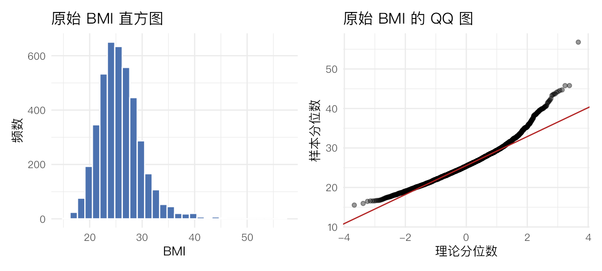
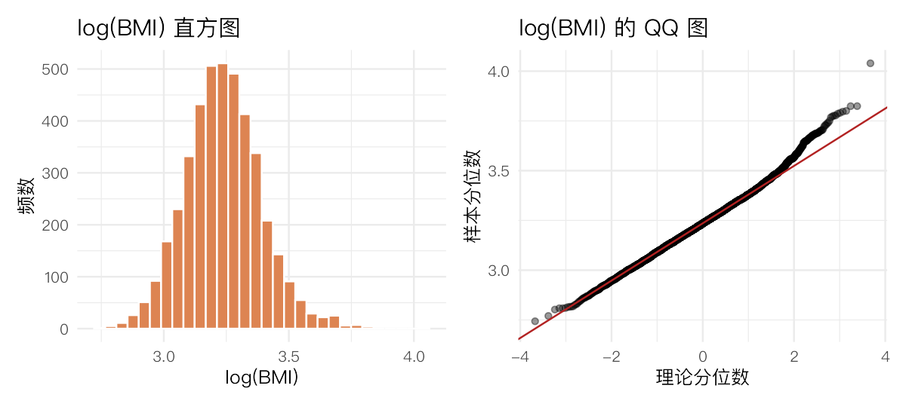
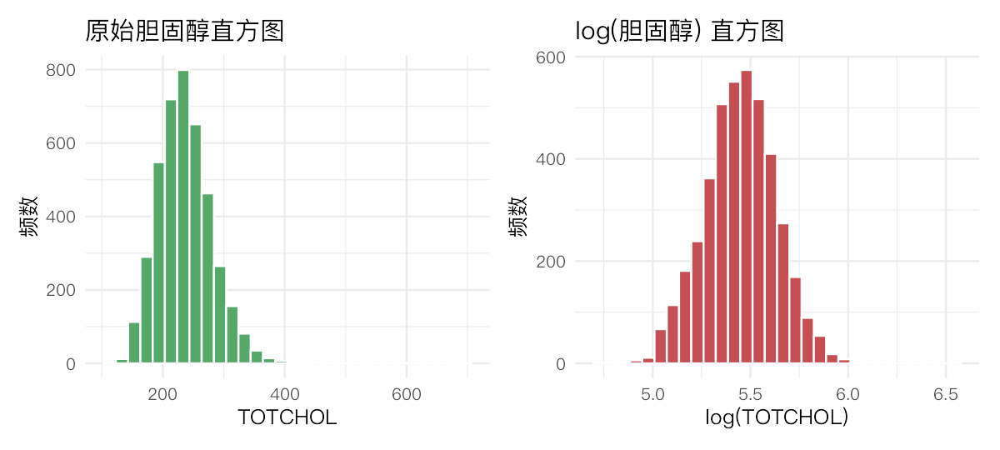
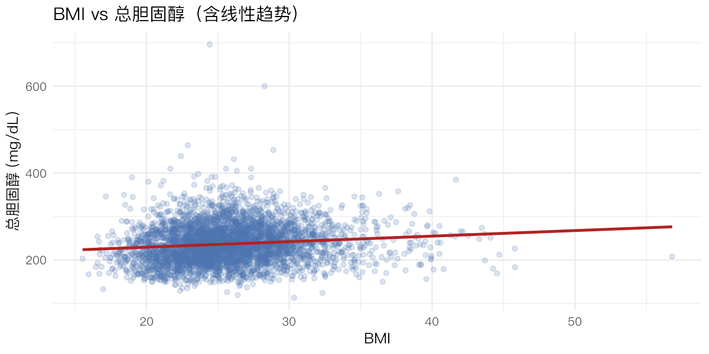
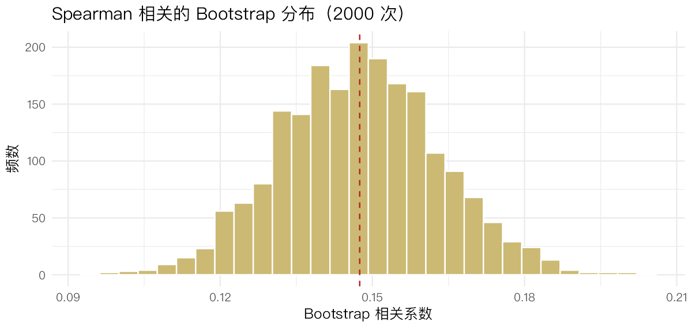

> **本节目标**：当数据**不服从正态分布**时，均值 ± t 检验那一套会失效，我们改用"非参数"工具。
> 本节围绕基线的 BMI 与胆固醇，依次完成：
> (1) **正态性检验**与变换；(2) 选择**稳健的相关系数**度量二者关系；
> (3) 用 **bootstrap**（自助法）在不假设分布的情况下估计标准误。
>
> **核心思路**：先"诊断"分布形状，再据此"选方法"。右偏 + 重尾 → 弃用 Pearson，改用基于秩的 Spearman；
> 标准误没有简单公式或不放心时 → 用 bootstrap 让数据自己"重抽样"告诉我们不确定性。

## 1 准备数据


``` r
library(tidyverse)
library(boot)        # 自助法 bootstrap，最主流实现
library(nortest)     # 大样本正态性检验（Anderson–Darling / Lilliefors）
theme_set(theme_minimal(base_size = 12, base_family = "PingFang SC"))

raw <- read_csv("../rawdata/Framingham_data.csv", show_col_types = FALSE)
base <- filter(raw, PERIOD == 1)

bmi  <- base$BMI[!is.na(base$BMI)]            # 完整 BMI
chol <- base$TOTCHOL[!is.na(base$TOTCHOL)]    # 完整胆固醇
pair <- base %>% select(BMI, TOTCHOL) %>% drop_na()   # 成对完整（用于相关）

c(n_bmi = length(bmi), n_chol = length(chol), n_pair = nrow(pair))
```

```
#>  n_bmi n_chol n_pair 
#>   4198   4165   4149
```

三个样本量略有不同，因为 BMI 与胆固醇的缺失行不完全重叠；做相关时必须用**成对完整**的数据。


``` r
# 偏度 / 峰度的小函数（峰度这里用"超额峰度"，正态=0）
skew <- function(x) mean((x - mean(x))^3) / sd(x)^3
kurt <- function(x) mean((x - mean(x))^4) / sd(x)^4 - 3
```

## 2 (a) BMI 的正态性与变换

### 2.1 原始 BMI：描述 + 检验 + 可视化


``` r
c(mean = mean(bmi), sd = sd(bmi), skewness = skew(bmi), kurtosis = kurt(bmi))
```

```
#>       mean         sd   skewness   kurtosis 
#> 25.7929776  4.0550476  0.9445261  2.4193508
```

``` r
# Shapiro–Wilk：R 中最常用的正态性检验，但样本量上限 5000
shapiro.test(bmi)
```

```
#> 
#> 	Shapiro-Wilk normality test
#> 
#> data:  bmi
#> W = 0.95984, p-value < 2.2e-16
```

偏度为正（右偏）、峰度为正（比正态更尖更重尾），Shapiro–Wilk 的 p 值远小于 0.05——**拒绝正态**。


``` r
p1 <- ggplot(tibble(bmi), aes(bmi)) +
  geom_histogram(bins = 30, fill = "#4C72B0", colour = "white") +
  labs(title = "原始 BMI 直方图", x = "BMI", y = "频数")
p2 <- ggplot(tibble(bmi), aes(sample = bmi)) +
  stat_qq(alpha = 0.4) + stat_qq_line(colour = "firebrick") +
  labs(title = "原始 BMI 的 QQ 图", x = "理论分位数", y = "样本分位数")
patchwork::wrap_plots(p1, p2)
```



**怎么读 QQ 图**：点若落在红线上即接近正态。这里两端点偏离红线、右上翘起，正是右偏的标志。

### 2.2 对数变换后再检验

右偏数据最常用的"矫正"是取对数 `log()`，它压缩大值、拉伸小值。


``` r
log_bmi <- log(bmi)
c(skewness = skew(log_bmi), kurtosis = kurt(log_bmi))
```

```
#>  skewness  kurtosis 
#> 0.2979614 0.6358607
```

``` r
shapiro.test(log_bmi)
```

```
#> 
#> 	Shapiro-Wilk normality test
#> 
#> data:  log_bmi
#> W = 0.99339, p-value = 5.367e-13
```


``` r
p1 <- ggplot(tibble(log_bmi), aes(log_bmi)) +
  geom_histogram(bins = 30, fill = "#DD8452", colour = "white") +
  labs(title = "log(BMI) 直方图", x = "log(BMI)", y = "频数")
p2 <- ggplot(tibble(log_bmi), aes(sample = log_bmi)) +
  stat_qq(alpha = 0.4) + stat_qq_line(colour = "firebrick") +
  labs(title = "log(BMI) 的 QQ 图", x = "理论分位数", y = "样本分位数")
patchwork::wrap_plots(p1, p2)
```



偏度大幅缩小、QQ 图明显变直。**但 Shapiro–Wilk 仍可能拒绝**——这是大样本检验的通病：样本量上千时，再微小的偏离也会显著。所以**不能只看 p 值**，要结合图形和偏度判断"实用上是否够正态"。变换后已**接近**正态，足够后续使用。

## 3 (b) 胆固醇的正态性与变换

对胆固醇重复同样三步。


``` r
c(skewness = skew(chol), kurtosis = kurt(chol))
```

```
#>  skewness  kurtosis 
#> 0.8818833 4.1479213
```

``` r
shapiro.test(chol)
```

```
#> 
#> 	Shapiro-Wilk normality test
#> 
#> data:  chol
#> W = 0.96793, p-value < 2.2e-16
```

``` r
log_chol <- log(chol)
c(log_skewness = skew(log_chol), log_kurtosis = kurt(log_chol))
```

```
#> log_skewness log_kurtosis 
#>   0.02634498   0.41781019
```

``` r
shapiro.test(log_chol)
```

```
#> 
#> 	Shapiro-Wilk normality test
#> 
#> data:  log_chol
#> W = 0.99724, p-value = 7.002e-07
```


``` r
p1 <- ggplot(tibble(chol), aes(chol)) +
  geom_histogram(bins = 30, fill = "#55A868", colour = "white") +
  labs(title = "原始胆固醇直方图", x = "TOTCHOL", y = "频数")
p2 <- ggplot(tibble(log_chol), aes(log_chol)) +
  geom_histogram(bins = 30, fill = "#C44E52", colour = "white") +
  labs(title = "log(胆固醇) 直方图", x = "log(TOTCHOL)", y = "频数")
patchwork::wrap_plots(p1, p2)
```



结论与 BMI 一致：原始数据右偏，取对数后偏度接近 0、分布更对称。

## 4 (c) 选择合适的相关系数

> **思路**：原始 BMI 与胆固醇都不服从正态，Pearson 相关（依赖正态、对离群点敏感）并不稳健。
> 题目又要求"为便于解释，使用未变换的数据"。这种情况下最主流的选择是 **Spearman 秩相关**——
> 它只用数据的**秩（名次）**，对分布形状和离群点都稳健。


``` r
ct <- cor.test(pair$BMI, pair$TOTCHOL, method = "spearman")
ct
```

```
#> 
#> 	Spearman's rank correlation rho
#> 
#> data:  pair$BMI and pair$TOTCHOL
#> S = 1.0148e+10, p-value < 2.2e-16
#> alternative hypothesis: true rho is not equal to 0
#> sample estimates:
#>       rho 
#> 0.1474967
```

``` r
rs <- unname(ct$estimate)        # Spearman 相关系数
n  <- nrow(pair)
se_formula <- sqrt(1 / (n - 1))  # 讲义公式：SE(r_s) ≈ sqrt(1/(n-1))
c(r_spearman = rs, n = n, SE_formula = se_formula, p_value = ct$p.value)
```

```
#>   r_spearman            n   SE_formula      p_value 
#> 1.474967e-01 4.149000e+03 1.552675e-02 1.295976e-21
```

相关系数约 0.15，为**弱正相关**；p 值极小，说明这个弱关系在统计上高度显著（大样本下很容易显著，但效应量本身不大）。标准误用讲义公式 `sqrt(1/(n-1))` 估出。


``` r
# 同时给出 Pearson 与 Kendall 作对比
rbind(
  Pearson  = c(est = cor(pair$BMI, pair$TOTCHOL),
               p = cor.test(pair$BMI, pair$TOTCHOL)$p.value),
  Spearman = c(est = rs, p = ct$p.value),
  Kendall  = c(est = cor(pair$BMI, pair$TOTCHOL, method = "kendall"),
               p = cor.test(pair$BMI, pair$TOTCHOL, method = "kendall")$p.value)
)
```

```
#>                 est            p
#> Pearson  0.11584109 7.176455e-14
#> Spearman 0.14749671 1.295976e-21
#> Kendall  0.09908267 1.581279e-21
```

三种方法结论一致（都是弱正相关、都显著）。Kendall 的 τ 数值通常比 Spearman 小，这是两者尺度不同所致，不代表关系更弱。


``` r
ggplot(pair, aes(BMI, TOTCHOL)) +
  geom_point(alpha = 0.2, colour = "#4C72B0") +
  geom_smooth(method = "lm", se = FALSE, colour = "firebrick") +
  labs(title = "BMI vs 总胆固醇（含线性趋势）", x = "BMI", y = "总胆固醇 (mg/dL)")
```



## 5 (d) 用 Bootstrap 估计标准误

> **bootstrap 的思想**：把手上的样本当作"总体"，**有放回地重抽**出很多个同样大小的新样本，
> 在每个新样本上重算一次统计量（这里是 Spearman r）。这一堆重算值的**标准差**，
> 就是该统计量标准误的估计——全程不需要任何分布假设。这是非参数推断的"瑞士军刀"。


``` r
boot_rs <- function(data, idx) cor(data$BMI[idx], data$TOTCHOL[idx], method = "spearman")

set.seed(123)
bo <- boot(pair, statistic = boot_rs, R = 2000)   # 2000 次重抽样
bo
```

```
#> 
#> ORDINARY NONPARAMETRIC BOOTSTRAP
#> 
#> 
#> Call:
#> boot(data = pair, statistic = boot_rs, R = 2000)
#> 
#> 
#> Bootstrap Statistics :
#>      original       bias    std. error
#> t1* 0.1474967 -3.98616e-05  0.01565586
```

``` r
boot_se <- sd(bo$t)                                # bootstrap 标准误
c(SE_bootstrap = boot_se, SE_formula = se_formula)
```

```
#> SE_bootstrap   SE_formula 
#>   0.01565586   0.01552675
```


``` r
ggplot(tibble(r = bo$t[, 1]), aes(r)) +
  geom_histogram(bins = 30, fill = "#CCB974", colour = "white") +
  geom_vline(xintercept = rs, linetype = 2, colour = "firebrick") +
  labs(title = "Spearman 相关的 Bootstrap 分布（2000 次）",
       x = "Bootstrap 相关系数", y = "频数")
```



直方图近似**钟形且对称**，说明在如此大的样本下，相关系数的抽样分布接近正态——这正是中心极限定理的体现。


``` r
boot.ci(bo, type = c("perc", "norm"))   # 百分位法 & 正态近似法的 95% CI
```

```
#> BOOTSTRAP CONFIDENCE INTERVAL CALCULATIONS
#> Based on 2000 bootstrap replicates
#> 
#> CALL : 
#> boot.ci(boot.out = bo, type = c("perc", "norm"))
#> 
#> Intervals : 
#> Level      Normal             Percentile     
#> 95%   ( 0.1169,  0.1782 )   ( 0.1174,  0.1789 )  
#> Calculations and Intervals on Original Scale
```

**比较**：bootstrap 标准误（0.0157 上下）与讲义公式标准误（0.0155）数量级一致、相互印证。两者都很小，因为样本量大。

## 6 拓展分析：更稳健的正态性检验 + 非参数两组比较

> **额外题目 1**：Shapiro–Wilk 上限 5000、且大样本过于敏感。Anderson–Darling 检验（`nortest`）没有样本量上限、
> 对尾部更敏感，是大样本下更主流的选择。
>
> **额外题目 2**：BMI 在"胆固醇理想 vs 不理想"两组间是否不同？由于 BMI 非正态，用 **Wilcoxon 秩和检验**
> （= Mann–Whitney U）比 t 检验更稳妥——这是本课"非参数两样本比较"的直接应用。


``` r
ad.test(bmi)          # Anderson–Darling（无 n≤5000 限制）
```

```
#> 
#> 	Anderson-Darling normality test
#> 
#> data:  bmi
#> A = 25.358, p-value < 2.2e-16
```

``` r
lillie.test(bmi)      # Lilliefors（KS 的改良版）
```

```
#> 
#> 	Lilliefors (Kolmogorov-Smirnov) normality test
#> 
#> data:  bmi
#> D = 0.052008, p-value < 2.2e-16
```

两个检验同样拒绝正态，与前面结论一致，但它们能用于任意大的样本。


``` r
grp <- base %>%
  mutate(chol_status = if_else(TOTCHOL >= 200, "Undesirable", "Desirable")) %>%
  filter(!is.na(BMI), !is.na(TOTCHOL))

wilcox.test(BMI ~ chol_status, data = grp)   # 非参数两组比较
```

```
#> 
#> 	Wilcoxon rank sum test with continuity correction
#> 
#> data:  BMI by chol_status
#> W = 1125566, p-value = 1.133e-15
#> alternative hypothesis: true location shift is not equal to 0
```

``` r
grp %>% group_by(chol_status) %>%
  summarise(n = n(), median_BMI = median(BMI), IQR = IQR(BMI), .groups = "drop")
```

```
#> # A tibble: 2 × 4
#>   chol_status     n median_BMI   IQR
#>   <chr>       <int>      <dbl> <dbl>
#> 1 Desirable     826       24.4  4.96
#> 2 Undesirable  3323       25.6  4.88
```

p 值极小：**胆固醇"不理想"组的 BMI 中位数显著更高**，与第 1 节箱线图、本节的正相关结论彼此呼应——多种方法殊途同归，正是稳健分析的标志。

## 7 小结

- **先诊断后选方法**：右偏 + 重尾 → 取对数可改善；分析相关用基于秩的 **Spearman**，比较两组用 **Wilcoxon**。
- **大样本下 p 值会"骗人"**：正态性检验几乎总会拒绝，务必结合**偏度 + QQ 图**做实用判断。
- **bootstrap** 用最少的假设给出标准误与置信区间，与解析公式互为验证。
- 结论一致性：BMI 与胆固醇是**弱正相关**，且"不理想"组 BMI 更高——为第 4 节的回归埋下伏笔。
