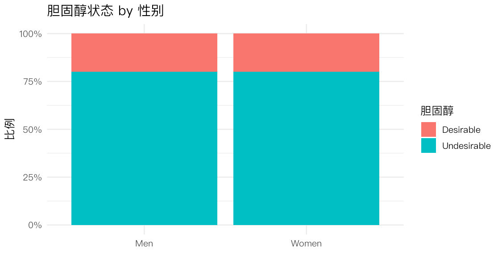
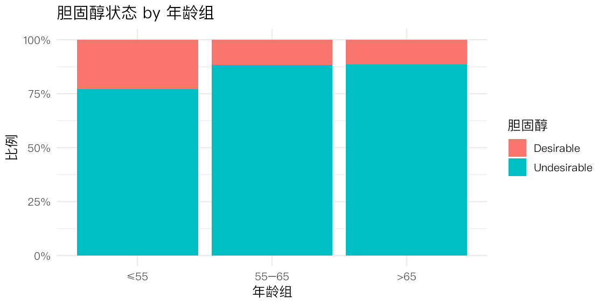
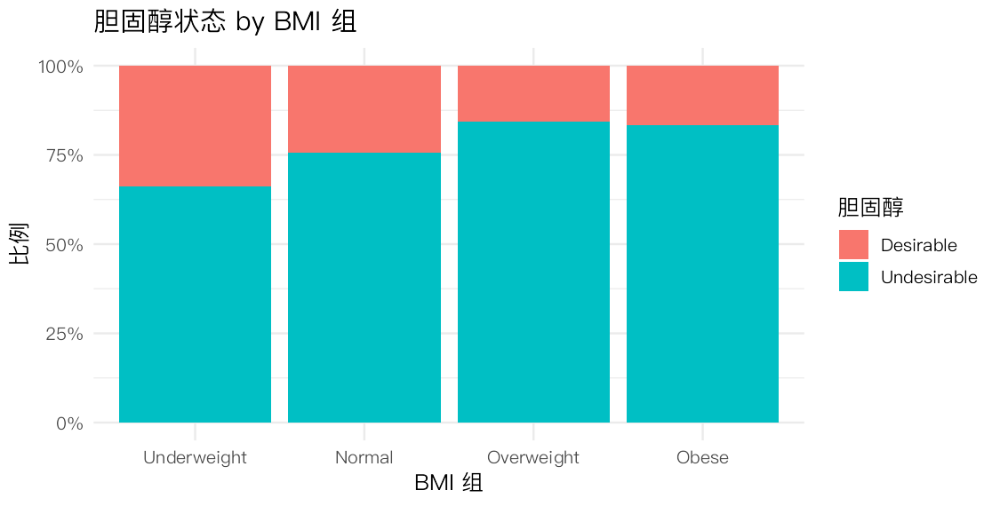

> **本节目标**：结局变成**二分类**——胆固醇"不理想（≥200）/理想"。我们要分别检验它与
> **BMI 组、年龄组、性别**是否**独立**。这就是经典的"两个分类变量是否相关"问题，
> 工具是**列联表（contingency table）+ 卡方检验**。
>
> **分析思路（每个变量三步走）**：① 列联表 + 行比例可视化；② 选检验方法并报告 p 值；③ 解释。
> 方法选择口诀：一般用 **Pearson 卡方**；当是 2×2 且有期望频数 < 5 时改用 **Fisher 精确检验**；
> 当解释变量**有序**（年龄组、BMI 组）时，额外做**趋势检验**更有功效。

## 1 准备数据


``` r
library(tidyverse)
theme_set(theme_minimal(base_size = 12, base_family = "PingFang SC"))

raw <- read_csv("../rawdata/Framingham_data.csv", show_col_types = FALSE)

dat <- raw %>%
  filter(PERIOD == 1, !is.na(TOTCHOL), !is.na(BMI), !is.na(AGE_group), !is.na(SEX)) %>%
  mutate(
    chol = factor(if_else(TOTCHOL >= 200, "Undesirable", "Desirable"),
                  levels = c("Desirable", "Undesirable")),
    Sex  = factor(SEX, levels = c(0, 1), labels = c("Men", "Women")),
    Age  = factor(AGE_group, levels = c(1, 2, 3), labels = c("≤55", "55–65", ">65")),
    BMIcat = cut(BMI, breaks = c(-Inf, 18.5, 25, 30, Inf), right = FALSE,
                 labels = c("Underweight", "Normal", "Overweight", "Obese"))
  )
nrow(dat)   # 完整样本量
```

```
#> [1] 4149
```

注意切点用 **200**（题目定义的"undesirable"），性别按数据字典 **0 = 男、1 = 女** 编码——编码错误是分类分析最常见的低级失误，务必先核对。

## 2 性别 × 胆固醇（2×2 表）


``` r
tab_sex <- table(dat$Sex, dat$chol)
tab_sex
```

```
#>        
#>         Desirable Undesirable
#>   Men         357        1442
#>   Women       469        1881
```

``` r
round(prop.table(tab_sex, margin = 1), 3)   # 按行（每个性别内）求比例
```

```
#>        
#>         Desirable Undesirable
#>   Men       0.198       0.802
#>   Women     0.200       0.800
```

行比例显示：男性与女性的"undesirable"比例**几乎相同**（约 80%）。是否真有差异？做卡方检验。


``` r
chisq.test(tab_sex)          # 默认带 Yates 连续性校正
```

```
#> 
#> 	Pearson's Chi-squared test with Yates' continuity correction
#> 
#> data:  tab_sex
#> X-squared = 0.0026191, df = 1, p-value = 0.9592
```

``` r
chisq.test(tab_sex, correct = FALSE)$expected   # 期望频数：都远大于 5
```

```
#>        
#>         Desirable Undesirable
#>   Men    358.1523    1440.848
#>   Women  467.8477    1882.152
```

期望频数全部 ≫ 5，**Pearson 卡方适用**（不需要 Fisher）。但 p ≈ 0.96，**无法拒绝独立**：在 200 的二分切点下，**性别与胆固醇状态没有关联**。这与第 1 节"女性胆固醇略高"的连续印象看似矛盾——原因是**二分化（≥200）把那一点微小差异抹平了**。这是个重要教训：把连续变量粗暴二分会损失信息，可能让真实存在的小差异变得"不显著"。


``` r
ggplot(dat, aes(Sex, fill = chol)) +
  geom_bar(position = "fill") +
  scale_y_continuous(labels = scales::percent) +
  labs(title = "胆固醇状态 by 性别", x = NULL, y = "比例", fill = "胆固醇")
```



## 3 年龄组 × 胆固醇（有序解释变量 → 加趋势检验）


``` r
tab_age <- table(dat$Age, dat$chol)
tab_age
```

```
#>         
#>          Desirable Undesirable
#>   ≤55         693        2322
#>   55–65       121         909
#>   >65           12          92
```

``` r
round(prop.table(tab_age, 1), 3)
```

```
#>         
#>          Desirable Undesirable
#>   ≤55       0.230       0.770
#>   55–65     0.117       0.883
#>   >65        0.115       0.885
```

``` r
chisq.test(tab_age)
```

```
#> 
#> 	Pearson's Chi-squared test
#> 
#> data:  tab_age
#> X-squared = 65.489, df = 2, p-value = 6.014e-15
```

卡方检验显著，说明各年龄组的"undesirable"比例**不全相等**。但年龄组是**有序**的，我们更想知道："比例是否随年龄**单调上升**？"——这要用**趋势检验**（Cochran–Armitage trend test）。


``` r
# prop.trend.test(成功数, 总数)：检验比例随有序组的线性趋势
succ  <- tab_age[, "Undesirable"]
total <- rowSums(tab_age)
rbind(undesirable = succ, total = total, prop = round(succ / total, 3))
```

```
#>                ≤55   55–65     >65
#> undesirable 2322.00  909.000  92.000
#> total       3015.00 1030.000 104.000
#> prop           0.77    0.883   0.885
```

``` r
prop.trend.test(succ, total)
```

```
#> 
#> 	Chi-squared Test for Trend in Proportions
#> 
#> data:  succ out of total ,
#>  using scores: 1 2 3
#> X-squared = 59.974, df = 1, p-value = 9.611e-15
```

趋势检验同样高度显著，从 `prop` 一行能看到比例随年龄上升（≤55 组明显更低，约 0.77；两个较高年龄组都升到约 0.88）——**年龄越大，胆固醇越可能不理想**。趋势检验把"3 个自由度的笼统差异"集中到"1 个自由度的单调趋势"上，**功效更高**，是有序分类变量的首选。


``` r
ggplot(dat, aes(Age, fill = chol)) +
  geom_bar(position = "fill") +
  scale_y_continuous(labels = scales::percent) +
  labs(title = "胆固醇状态 by 年龄组", x = "年龄组", y = "比例", fill = "胆固醇")
```



## 4 BMI 组 × 胆固醇


``` r
tab_bmi <- table(dat$BMIcat, dat$chol)
tab_bmi
```

```
#>              
#>               Desirable Undesirable
#>   Underweight        19          37
#>   Normal            448        1393
#>   Overweight        272        1456
#>   Obese              87         437
```

``` r
round(prop.table(tab_bmi, 1), 3)
```

```
#>              
#>               Desirable Undesirable
#>   Underweight     0.339       0.661
#>   Normal          0.243       0.757
#>   Overweight      0.157       0.843
#>   Obese           0.166       0.834
```

``` r
chisq.test(tab_bmi)
```

```
#> 
#> 	Pearson's Chi-squared test
#> 
#> data:  tab_bmi
#> X-squared = 51.938, df = 3, p-value = 3.088e-11
```

注意 "Underweight" 行人数很少。看一下期望频数是否有 < 5 的格子：


``` r
chisq.test(tab_bmi)$expected
```

```
#>              
#>               Desirable Undesirable
#>   Underweight  11.14871    44.85129
#>   Normal      366.51386  1474.48614
#>   Overweight  344.01735  1383.98265
#>   Obese       104.32008   419.67992
```

期望频数仍都 > 5（因为另一维的边际较大），Pearson 卡方可用；若担心稀疏也可用 `fisher.test()`。p 值显著。再做一次趋势检验（BMI 组也有序）：


``` r
succ_b  <- tab_bmi[, "Undesirable"]; total_b <- rowSums(tab_bmi)
prop.trend.test(succ_b, total_b)
```

```
#> 
#> 	Chi-squared Test for Trend in Proportions
#> 
#> data:  succ_b out of total_b ,
#>  using scores: 1 2 3 4
#> X-squared = 39.219, df = 1, p-value = 3.789e-10
```

``` r
round(succ_b / total_b, 3)
```

```
#> Underweight      Normal  Overweight       Obese 
#>       0.661       0.757       0.843       0.834
```

比例随 BMI 组递增（偏瘦→肥胖），趋势显著：**BMI 越高，胆固醇越可能不理想**。


``` r
ggplot(dat, aes(BMIcat, fill = chol)) +
  geom_bar(position = "fill") +
  scale_y_continuous(labels = scales::percent) +
  labs(title = "胆固醇状态 by BMI 组", x = "BMI 组", y = "比例", fill = "胆固醇")
```



## 5 三项检验小结


``` r
tibble(
  Variable = c("Sex", "Age group", "BMI group"),
  Method   = c("Pearson χ²", "Pearson χ² + 趋势检验", "Pearson χ² + 趋势检验"),
  p_value  = c(chisq.test(tab_sex)$p.value,
               chisq.test(tab_age)$p.value,
               chisq.test(tab_bmi)$p.value)
)
```

```
#> # A tibble: 3 × 3
#>   Variable  Method                 p_value
#>   <chr>     <chr>                    <dbl>
#> 1 Sex       Pearson χ²            9.59e- 1
#> 2 Age group Pearson χ² + 趋势检验 6.01e-15
#> 3 BMI group Pearson χ² + 趋势检验 3.09e-11
```

**年龄组与 BMI 组**与胆固醇状态显著相关，且呈**单调剂量–反应**趋势；而**性别在 200 的二分切点下并不显著**（p ≈ 0.96）。

## 6 拓展分析：优势比（OR）与分层的 Mantel–Haenszel 检验

> **额外题目 1**：卡方只告诉我们"相关与否"，不告诉"关联多强、朝哪个方向"。
> 对 2×2 表，**优势比（odds ratio, OR）**及其置信区间能量化关联强度——这是流行病学最核心的指标。
>
> **额外题目 2**：BMI 与胆固醇的关联，会不会只是因为"性别"同时影响两者造成的**混杂**？
> **Cochran–Mantel–Haenszel（CMH）检验**在控制性别（分层）后再检验关联，是分类数据里"校正混杂"的经典工具。


``` r
# 性别的 OR：以"undesirable"为事件，比较 Women vs Men
fisher.test(tab_sex)$estimate          # 条件极大似然 OR
```

```
#> odds ratio 
#>   0.992932
```

``` r
fisher.test(tab_sex)$conf.int          # 95% 置信区间
```

```
#> [1] 0.848551 1.161247
#> attr(,"conf.level")
#> [1] 0.95
```

OR ≈ 0.99，95% 置信区间约 (0.85, 1.16) **跨过 1**：再次确认**性别与二分胆固醇无显著关联**，与第 2 节一致。耐人寻味的是，连续分析（第 4 节）会发现女性的 log 胆固醇其实略高——可见 **OR 检验的只是"≥200 这条线两侧"的差异**，对分布整体的小幅平移并不敏感。**结局用连续还是二分，会改变结论**，这是分析设计的重要一课。


``` r
# 把 BMI 二分（Overweight/Obese vs 其余）便于构造 2×2×2 分层表
dat2 <- dat %>% mutate(highBMI = factor(BMI >= 25, labels = c("BMI<25", "BMI≥25")))
strat <- table(dat2$highBMI, dat2$chol, dat2$Sex)   # 2×2×2：按性别分层
strat
```

```
#> , ,  = Men
#> 
#>          
#>           Desirable Undesirable
#>   BMI<25        166         498
#>   BMI≥25       191         944
#> 
#> , ,  = Women
#> 
#>          
#>           Desirable Undesirable
#>   BMI<25        301         932
#>   BMI≥25       168         949
```

``` r
mantelhaen.test(strat)                  # 控制性别后，高 BMI 与胆固醇是否仍相关
```

```
#> 
#> 	Mantel-Haenszel chi-squared test with continuity correction
#> 
#> data:  strat
#> Mantel-Haenszel X-squared = 49.025, df = 1, p-value = 2.528e-12
#> alternative hypothesis: true common odds ratio is not equal to 1
#> 95 percent confidence interval:
#>  1.493876 2.040881
#> sample estimates:
#> common odds ratio 
#>          1.746088
```

CMH 检验在**分别控制男、女**之后，高 BMI 与"不理想"胆固醇**依然显著相关**，且合并 OR > 1。这说明 BMI–胆固醇的关联**不是性别混杂造成的**，在两性内部都成立——比单看一张总表更有说服力。

## 7 小结

- **二分类结局 + 分类协变量 → 列联表 + 卡方**：先看行比例形成判断，再用检验确认。
- **方法选择**：期望频数都 ≥5 用 Pearson 卡方；2×2 且稀疏用 Fisher；**有序**变量加**趋势检验**（功效更高）。
- **不要止步于 p 值**：用 **OR + 置信区间**量化方向与强度；用 **CMH 分层检验**排除混杂。
- 三个协变量都与胆固醇相关，年龄/BMI 呈剂量–反应——下一步自然是用 **logistic 回归**（第 5 节）把它们放进同一个模型。
