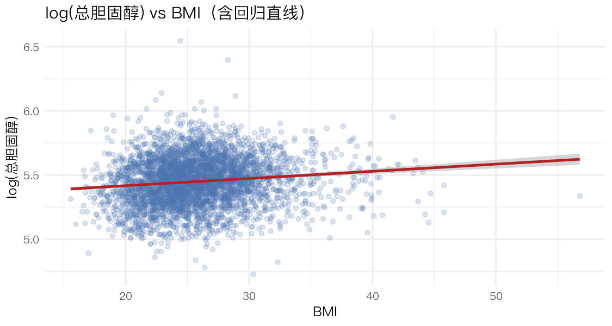
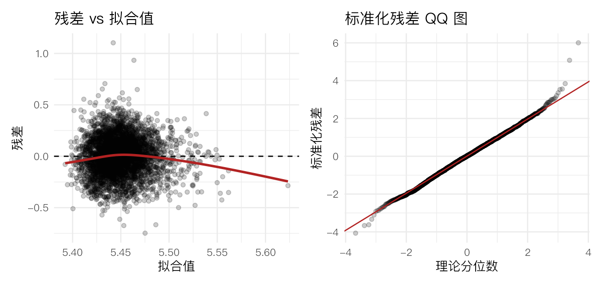
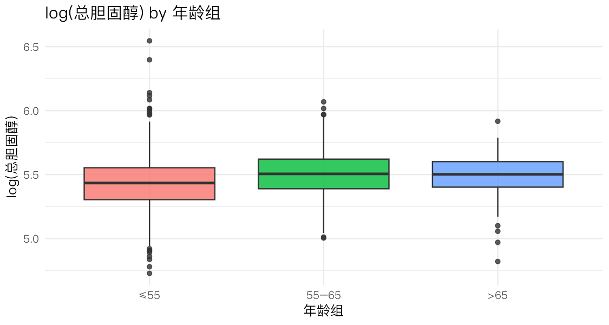
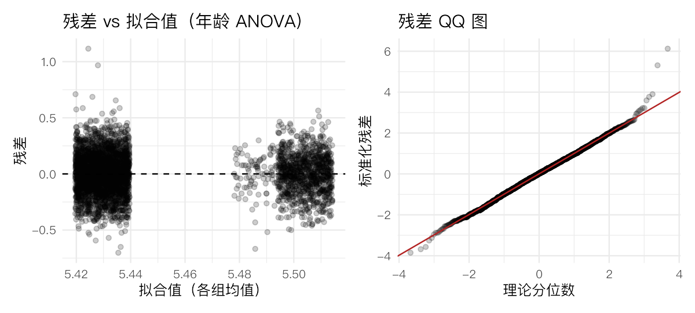
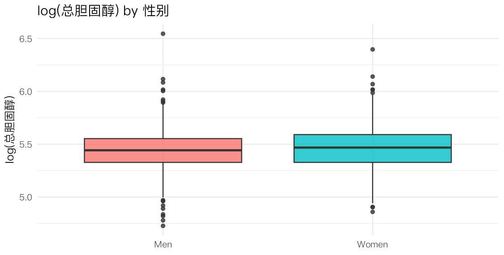

> **本节目标**：用回归把"关系"写成方程。结局取 **log(总胆固醇)**（第 2 节已说明它更接近正态），
> 依次拟合三个模型：
> (a) 对连续 **BMI** 的简单线性回归；(b) 对**年龄组**的单因素方差分析（ANOVA）；(c) 对**性别**的 ANOVA。
> 每个模型都要：**检验效应是否存在 → 可视化 → 残差诊断**。
>
> **关键认知**：ANOVA 其实就是"解释变量是分类变量"的线性回归；`lm()` 和 `aov()` 背后是同一套最小二乘。
> 残差诊断（看残差图）是回归的"体检"，比 p 值更能告诉你模型可不可信。

## 1 准备数据


``` r
library(tidyverse)
library(broom)     # tidy() / augment()：把模型结果整理成数据框，最主流
library(car)       # leveneTest()：方差齐性检验
theme_set(theme_minimal(base_size = 12, base_family = "PingFang SC"))

raw <- read_csv("../rawdata/Framingham_data.csv", show_col_types = FALSE)

base <- raw %>%
  filter(PERIOD == 1) %>%
  distinct(RANDID, .keep_all = TRUE) %>%      # 基线每人一行
  mutate(
    log_chol = log(TOTCHOL),
    Age = factor(AGE_group, levels = c(1, 2, 3), labels = c("≤55", "55–65", ">65")),
    Sex = factor(SEX, levels = c(0, 1), labels = c("Men", "Women"))
  )
```

## 2 (a) 简单线性回归：log(胆固醇) ~ BMI

### 2.1 拟合与检验


``` r
da <- base %>% select(log_chol, BMI) %>% drop_na()
fit_bmi <- lm(log_chol ~ BMI, data = da)
summary(fit_bmi)
```

```
#> 
#> Call:
#> lm(formula = log_chol ~ BMI, data = da)
#> 
#> Residuals:
#>      Min       1Q   Median       3Q      Max 
#> -0.74777 -0.12025  0.00211  0.12313  1.10322 
#> 
#> Coefficients:
#>              Estimate Std. Error t value Pr(>|t|)    
#> (Intercept) 5.3052980  0.0183855 288.559  < 2e-16 ***
#> BMI         0.0055985  0.0007043   7.949 2.41e-15 ***
#> ---
#> Signif. codes:  0 '***' 0.001 '**' 0.01 '*' 0.05 '.' 0.1 ' ' 1
#> 
#> Residual standard error: 0.1838 on 4147 degrees of freedom
#> Multiple R-squared:  0.01501,	Adjusted R-squared:  0.01477 
#> F-statistic: 63.18 on 1 and 4147 DF,  p-value: 2.413e-15
```

**怎么读 `summary`**：

- `BMI` 那一行的 **Estimate** 是斜率 β̂。它对应的 **Pr(>|t|)**（p 值）极小，**拒绝"BMI 无效应"**——BMI 与 log 胆固醇显著正相关。
- 因为结局是对数尺度，斜率要这样解释：**BMI 每增加 1，胆固醇按 exp(β̂) 倍变化**：


``` r
b <- coef(fit_bmi)["BMI"]
c(beta = b, multiplicative = exp(b), percent_per_unit = (exp(b) - 1) * 100)
```

```
#>             beta.BMI   multiplicative.BMI percent_per_unit.BMI 
#>          0.005598489          1.005614190          0.561418953
```

即 BMI 每高 1 个单位，总胆固醇平均高约 0.6%。效应虽小但方向明确、统计显著。

### 2.2 可视化关系


``` r
ggplot(da, aes(BMI, log_chol)) +
  geom_point(alpha = 0.2, colour = "#4C72B0") +
  geom_smooth(method = "lm", colour = "firebrick") +
  labs(title = "log(总胆固醇) vs BMI（含回归直线）", x = "BMI", y = "log(总胆固醇)")
```



### 2.3 R² = Pearson 相关系数的平方（单变量时）

题目要验证一个重要事实：**只有一个预测变量时，模型的 R² 恰好等于 X 与 Y 的 Pearson 相关系数的平方。**


``` r
r  <- cor(da$BMI, da$log_chol)        # Pearson 相关
r2 <- summary(fit_bmi)$r.squared      # 模型 R²
c(R2_model = r2, r_pearson = r, r_squared = r^2, difference = r2 - r^2)
```

```
#>     R2_model    r_pearson    r_squared   difference 
#> 1.500623e-02 1.224999e-01 1.500623e-02 1.474515e-16
```

两者相等（差异为机器精度的 0）。这说明 R² 度量的就是"X 解释了 Y 多大比例的变异"，与相关系数同源。这里 R² ≈ 0.015，说明 BMI 单独只能解释胆固醇变异的很小一部分——弱关系。

### 2.4 残差诊断：模型可信吗？

回归的四大假设：**线性、误差正态、同方差（等方差）、无强离群点**。靠"残差图"逐一检查。


``` r
aug <- augment(fit_bmi)   # 含 .fitted（拟合值）、.resid（残差）、.std.resid（标准化残差）

p1 <- ggplot(aug, aes(.fitted, .resid)) +
  geom_point(alpha = 0.2) + geom_hline(yintercept = 0, linetype = 2) +
  geom_smooth(se = FALSE, colour = "firebrick") +
  labs(title = "残差 vs 拟合值", x = "拟合值", y = "残差")

p2 <- ggplot(aug, aes(sample = .std.resid)) +
  stat_qq(alpha = 0.2) + stat_qq_line(colour = "firebrick") +
  labs(title = "标准化残差 QQ 图", x = "理论分位数", y = "标准化残差")

patchwork::wrap_plots(p1, p2)
```



- **残差 vs 拟合值**：红线大致水平、点上下均匀 → 线性与同方差基本满足。
- **QQ 图**：中段贴合，两端略偏 → 残差近似正态（对数变换的功劳）。


``` r
# |标准化残差| > 3 视为可疑离群点
sum(abs(aug$.std.resid) > 3)
```

```
#> [1] 15
```

仅极少数点的标准化残差超过 3，离群影响有限。综合判断：**模型设定基本合理**。

## 3 (b) 单因素 ANOVA：log(胆固醇) ~ 年龄组

### 3.1 检验"年龄无效应"


``` r
db <- base %>% select(log_chol, Age) %>% drop_na()
fit_age <- aov(log_chol ~ Age, data = db)
summary(fit_age)
```

```
#>               Df Sum Sq Mean Sq F value Pr(>F)    
#> Age            2   4.45  2.2258   67.06 <2e-16 ***
#> Residuals   4162 138.14  0.0332                   
#> ---
#> Signif. codes:  0 '***' 0.001 '**' 0.01 '*' 0.05 '.' 0.1 ' ' 1
```

F 检验 p 值极小，**拒绝"各年龄组均值相等"**：年龄组之间的 log 胆固醇有显著差异。


``` r
ggplot(db, aes(Age, log_chol, fill = Age)) +
  geom_boxplot(alpha = 0.8, show.legend = FALSE) +
  labs(title = "log(总胆固醇) by 年龄组", x = "年龄组", y = "log(总胆固醇)")
```



箱线图显示中位数随年龄上升，与 ANOVA 结论一致。

### 3.2 残差诊断 + 方差齐性


``` r
aug_age <- augment(fit_age)
p1 <- ggplot(aug_age, aes(.fitted, .resid)) +
  geom_point(alpha = 0.2, position = position_jitter(width = 0.01)) +
  geom_hline(yintercept = 0, linetype = 2) +
  labs(title = "残差 vs 拟合值（年龄 ANOVA）", x = "拟合值（各组均值）", y = "残差")
p2 <- ggplot(aug_age, aes(sample = .std.resid)) +
  stat_qq(alpha = 0.2) + stat_qq_line(colour = "firebrick") +
  labs(title = "残差 QQ 图", x = "理论分位数", y = "标准化残差")
patchwork::wrap_plots(p1, p2)
```



``` r
leveneTest(log_chol ~ Age, data = db)   # H0: 各组方差相等
```

```
#> Levene's Test for Homogeneity of Variance (center = median)
#>         Df F value  Pr(>F)  
#> group    2  2.5749 0.07628 .
#>       4162                  
#> ---
#> Signif. codes:  0 '***' 0.001 '**' 0.01 '*' 0.05 '.' 0.1 ' ' 1
```

QQ 图近似正态；Levene 检验若 p > 0.05 则支持方差齐性（ANOVA 的前提）。

### 3.3 事后检验（拒绝 H0 后才做）

ANOVA 只说"组间有差异"，但**没说哪几组之间不同**。用 **Tukey HSD** 做两两比较，它自动校正多重比较。


``` r
TukeyHSD(fit_age)
```

```
#>   Tukey multiple comparisons of means
#>     95% family-wise confidence level
#> 
#> Fit: aov(formula = log_chol ~ Age, data = db)
#> 
#> $Age
#>                    diff         lwr        upr     p adj
#> 55–65-≤55  0.07460352  0.05922779 0.08997926 0.0000000
#> >65-≤55     0.05832214  0.01572452 0.10091976 0.0038240
#> >65-55–65  -0.01628138 -0.06021711 0.02765435 0.6600279
```

看每一行的 `p adj`：若 < 0.05，则该对年龄组差异显著。`diff` 为正说明后者比前者高。据此可判断是"逐级递增"还是"某一组突出"。

## 4 (c) 单因素 ANOVA：log(胆固醇) ~ 性别


``` r
dc <- base %>% select(log_chol, Sex) %>% drop_na()
fit_sex <- aov(log_chol ~ Sex, data = dc)
summary(fit_sex)
```

```
#>               Df Sum Sq Mean Sq F value   Pr(>F)    
#> Sex            1   0.59  0.5917   17.35 3.18e-05 ***
#> Residuals   4163 142.00  0.0341                     
#> ---
#> Signif. codes:  0 '***' 0.001 '**' 0.01 '*' 0.05 '.' 0.1 ' ' 1
```

``` r
dc %>% group_by(Sex) %>%
  summarise(n = n(), mean_logchol = mean(log_chol), .groups = "drop")
```

```
#> # A tibble: 2 × 3
#>   Sex       n mean_logchol
#>   <fct> <int>        <dbl>
#> 1 Men    1803         5.44
#> 2 Women  2362         5.46
```


``` r
ggplot(dc, aes(Sex, log_chol, fill = Sex)) +
  geom_boxplot(alpha = 0.8, show.legend = FALSE) +
  labs(title = "log(总胆固醇) by 性别", x = NULL, y = "log(总胆固醇)")
```




``` r
leveneTest(log_chol ~ Sex, data = dc)
```

```
#> Levene's Test for Homogeneity of Variance (center = median)
#>         Df F value    Pr(>F)    
#> group    1  16.405 5.208e-05 ***
#>       4163                      
#> ---
#> Signif. codes:  0 '***' 0.001 '**' 0.01 '*' 0.05 '.' 0.1 ' ' 1
```

**重要对照**：在**连续**结局上，女性的均值略高且 ANOVA 显著（p 很小）；而第 3 节用 **200 二分**结局时性别却不显著。这正是上一节强调的——**二分化损失了信息**。连续分析更有功效，能检出这点小差异。

## 5 拓展分析：多元回归与效应修饰

> **额外题目**：把三个协变量放进**同一个模型**，看在彼此校正后各自的独立效应；
> 再用**交互项**正式检验"年龄/性别是否**改变** BMI 的效应"（即主线问题里的 effect modification）。


``` r
dm <- base %>% select(log_chol, BMI, Age, Sex) %>% drop_na()
fit_main <- lm(log_chol ~ BMI + Age + Sex, data = dm)
tidy(fit_main)
```

```
#> # A tibble: 5 × 5
#>   term        estimate std.error statistic  p.value
#>   <chr>          <dbl>     <dbl>     <dbl>    <dbl>
#> 1 (Intercept)  5.28     0.0187      283.   0       
#> 2 BMI          0.00515  0.000699      7.36 2.13e-13
#> 3 Age55–65     0.0699   0.00656      10.7  3.57e-26
#> 4 Age>65       0.0522   0.0181        2.89 3.86e- 3
#> 5 SexWomen     0.0269   0.00569       4.74 2.25e- 6
```

``` r
glance(fit_main)$r.squared
```

```
#> [1] 0.04761126
```

在相互校正后，BMI、年龄、性别**各自仍显著**，R² 比单变量模型明显提高——三者提供了互补的信息。


``` r
fit_int <- lm(log_chol ~ BMI * Sex + BMI * Age, data = dm)
anova(fit_main, fit_int)    # 整体：加入所有交互项是否显著改善模型
```

```
#> Analysis of Variance Table
#> 
#> Model 1: log_chol ~ BMI + Age + Sex
#> Model 2: log_chol ~ BMI * Sex + BMI * Age
#>   Res.Df    RSS Df Sum of Sq      F    Pr(>F)    
#> 1   4144 135.50                                  
#> 2   4141 134.58  3   0.92169 9.4536 3.192e-06 ***
#> ---
#> Signif. codes:  0 '***' 0.001 '**' 0.01 '*' 0.05 '.' 0.1 ' ' 1
```

整体交互检验 **显著**（p ≈ 3×10⁻⁶），说明**确实存在效应修饰**。但"谁在修饰 BMI 的效应"还需拆开看——分别只加一个交互项再比较：


``` r
fit_bmiSex <- lm(log_chol ~ BMI * Sex + Age, data = dm)   # 只加 BMI×性别
fit_bmiAge <- lm(log_chol ~ BMI * Age + Sex, data = dm)   # 只加 BMI×年龄
c(BMI_x_Sex = anova(fit_main, fit_bmiSex)[["Pr(>F)"]][2],
  BMI_x_Age = anova(fit_main, fit_bmiAge)[["Pr(>F)"]][2])
```

```
#>    BMI_x_Sex    BMI_x_Age 
#> 3.649692e-01 8.386621e-07
```

结论清晰：**BMI×性别不显著（p ≈ 0.36）**，但 **BMI×年龄显著（p ≈ 8×10⁻⁷）**。也就是说——

- **性别不修饰** BMI 的效应：男女中 BMI 与胆固醇的斜率一致；
- **年龄修饰** BMI 的效应：看交互系数，`BMI:Age` 为负，意味着 **BMI 的正向斜率在最年轻组（≤55）最陡，在更年长的组里被抵消、趋于平缓**。临床上即"**年轻人里 BMI 与胆固醇的关联更强**，年长者中减弱"。

这提醒我们：第 1 节按年龄分面时看到的"斜率差异"并非错觉，需要正式的交互检验才能确认。性别则相反——看起来没差异，检验也证实没差异。

## 6 小结

- **`lm` 与 `aov` 同根同源**：连续协变量→回归斜率；分类协变量→组间均值差。
- **对数结局的斜率**要用 `exp(β)` 解释成"倍数/百分比变化"。
- **单变量 R² = Pearson r²**：R² 就是相关性的平方，度量被解释的变异比例。
- **残差诊断 > p 值**：残差图同时体检线性、正态、同方差、离群点。
- **ANOVA 后做 Tukey** 才能知道"谁和谁不同"；**多重比较要校正**。
- **效应修饰用交互项 + 模型比较**检验；本数据中 BMI 效应**不随性别改变，但随年龄改变**（年轻人里 BMI–胆固醇关联更强）。
