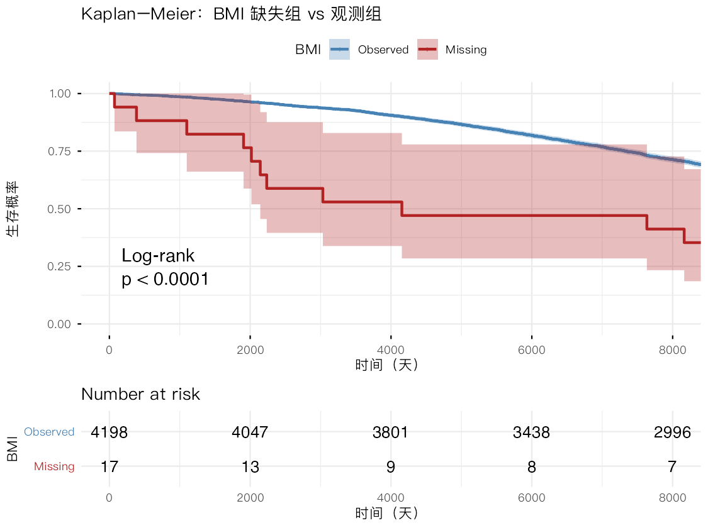
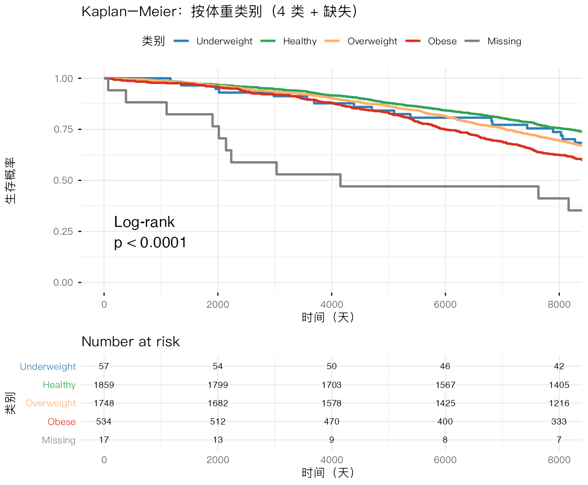
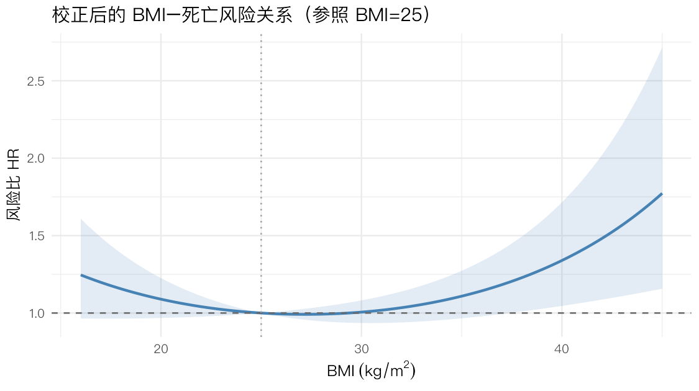

> **本节目标**：结局变成"**活了多久 / 是否死亡**"——这是**生存数据**，特点是**删失（censoring）**：
> 很多人到随访结束还活着，我们只知道"至少活了这么久"。普通回归无法处理删失，要用专门的生存分析。
> 工具有二：**Kaplan–Meier 曲线 + log-rank 检验**（非参数、看分组差异）和 **Cox 比例风险回归**（多因素校正）。
>
> **主线问题**：基线 BMI 与生存的关系，重点考察文献报道的 **U 形关联**（过瘦、过胖都更危险）。
> 用 `TIMEDTH`（时间）和 `DEATH`（事件）构造生存对象，分析只取基线 PERIOD 1。

## 1 准备数据


``` r
library(tidyverse)
library(survival)   # 生存分析的核心包：Surv() / survfit() / coxph()
library(survminer)  # ggsurvplot()：主流的 KM 曲线绘制（自动标删失点 + 风险表 + p 值）
library(broom)      # tidy() 把模型结果整理成数据框
theme_set(theme_minimal(base_size = 12, base_family = "PingFang SC"))

raw <- read_csv("../rawdata/Framingham_data.csv", show_col_types = FALSE)
dat <- filter(raw, PERIOD == 1)          # 只取基线
c(rows = nrow(dat), deaths = sum(dat$DEATH))
```

```
#>   rows deaths 
#>   4215   1388
```

`Surv(TIMEDTH, DEATH)` 把"时间 + 是否发生事件"打包成一个生存对象——这是所有生存分析函数的输入。

## 2 (a-i) BMI 缺失有多少？是否随机缺失（MAR）？


``` r
n_miss <- sum(is.na(dat$BMI))
c(n_missing_BMI = n_miss, pct = round(100 * n_miss / nrow(dat), 2))
```

```
#> n_missing_BMI           pct 
#>          17.0           0.4
```

``` r
dat$bmi_miss <- factor(ifelse(is.na(dat$BMI), "Missing", "Observed"),
                       levels = c("Observed", "Missing"))
```

> **为什么关心缺失机制？** 如果"BMI 是否缺失"和"生存"无关（**随机缺失 MAR**），直接丢掉缺失行影响不大；
> 但若缺失人群的生存本就不同（**非随机缺失**），丢弃会引入偏倚。怎么查？
> **比较缺失组 vs 观测组的生存曲线**——这是个巧妙的思路。


``` r
fit_miss <- survfit(Surv(TIMEDTH, DEATH) ~ bmi_miss, data = dat)
survdiff(Surv(TIMEDTH, DEATH) ~ bmi_miss, data = dat)   # log-rank 检验（数值结果）
```

```
#> Call:
#> survdiff(formula = Surv(TIMEDTH, DEATH) ~ bmi_miss, data = dat)
#> 
#>                      N Observed Expected (O-E)^2/E (O-E)^2/V
#> bmi_miss=Observed 4198     1377  1384.58    0.0415      16.9
#> bmi_miss=Missing    17       11     3.42   16.8266      16.9
#> 
#>  Chisq= 16.9  on 1 degrees of freedom, p= 4e-05
```

``` r
ggsurvplot(
  fit_miss, data = dat,
  censor = TRUE, censor.size = 2,          # "+" 自动标出删失点（survminer 默认开启）
  conf.int = TRUE,
  pval = TRUE, pval.method = TRUE,         # 在图上自动标注 log-rank p 值
  risk.table = TRUE, risk.table.height = 0.28,   # 底部"风险人数"表
  legend.title = "BMI", legend.labs = c("Observed", "Missing"),
  palette = c("steelblue", "firebrick"),
  xlab = "时间（天）", ylab = "生存概率",
  title = "Kaplan–Meier：BMI 缺失组 vs 观测组",
  ggtheme = theme_minimal(base_family = "PingFang SC"),
  tables.theme = theme_minimal(base_family = "PingFang SC")
)
```



图上曲线的 **"+" 号是删失点**（该时刻仍存活、之后失访或随访结束的人）；底部的**风险人数表**显示每个时间点还有多少人"在观察中"——这两样是规范 KM 图的标配，`ggsurvplot` 会自动加上。log-rank p 值（图右上）若 < 0.05，说明两组生存曲线显著不同——**BMI 缺失者的生存明显更差**，即 **BMI 并非随机缺失**。这种情况下，后续应把"缺失"**保留为一个单独类别**，而不是简单删除。

## 3 (a-ii) 体重分类与 U 形：KM 曲线

按题目定义把 BMI 切成 4 类，并把缺失单列为第 5 类（因为上一步判断为非随机缺失）。


``` r
dat <- dat %>%
  mutate(
    weight4 = cut(BMI, breaks = c(0, 18.5, 25, 30, Inf), right = FALSE,
                  labels = c("Underweight", "Healthy", "Overweight", "Obese")),
    weight5 = factor(ifelse(is.na(BMI), "Missing", as.character(weight4)),
                     levels = c("Underweight", "Healthy", "Overweight", "Obese", "Missing"))
  )
dat %>% group_by(weight5) %>%
  summarise(n = n(), deaths = sum(DEATH), death_rate = round(mean(DEATH), 3), .groups = "drop")
```

```
#> # A tibble: 5 × 4
#>   weight5         n deaths death_rate
#>   <fct>       <int>  <dbl>      <dbl>
#> 1 Underweight    57     18      0.316
#> 2 Healthy      1859    515      0.277
#> 3 Overweight   1748    617      0.353
#> 4 Obese         534    227      0.425
#> 5 Missing        17     11      0.647
```


``` r
fit_w <- survfit(Surv(TIMEDTH, DEATH) ~ weight5, data = dat)
survdiff(Surv(TIMEDTH, DEATH) ~ weight5, data = dat)
```

```
#> Call:
#> survdiff(formula = Surv(TIMEDTH, DEATH) ~ weight5, data = dat)
#> 
#>                        N Observed Expected (O-E)^2/E (O-E)^2/V
#> weight5=Underweight   57       18    18.67    0.0242    0.0245
#> weight5=Healthy     1859      515   631.83   21.6028   39.6711
#> weight5=Overweight  1748      617   570.01    3.8729    6.5726
#> weight5=Obese        534      227   164.07   24.1407   27.3866
#> weight5=Missing       17       11     3.42   16.8266   16.8701
#> 
#>  Chisq= 66.5  on 4 degrees of freedom, p= 1e-13
```

``` r
# 调色板顺序对应 weight5 的水平：Underweight/Healthy/Overweight/Obese/Missing
pal <- c("#2c7fb8", "#31a354", "#fdae6b", "#d7301f", "grey50")
ggsurvplot(
  fit_w, data = dat,
  censor = TRUE, censor.size = 2,
  pval = TRUE, pval.method = TRUE,
  risk.table = TRUE, risk.table.height = 0.32, risk.table.fontsize = 3,
  legend.title = "类别",
  legend.labs = c("Underweight", "Healthy", "Overweight", "Obese", "Missing"),
  palette = pal,
  xlab = "时间（天）", ylab = "生存概率",
  title = "Kaplan–Meier：按体重类别（4 类 + 缺失）",
  ggtheme = theme_minimal(base_family = "PingFang SC"),
  tables.theme = theme_minimal(base_family = "PingFang SC")
)
```



**怎么读 U 形**：看各组死亡率——**健康体重组最低（27.7%）**，肥胖组最高（42.5%），超重居中（35.3%），**过瘦组（31.6%，仅 57 人）略高于健康组**。所以本数据呈现"**健康体重最优、风险随肥胖明显上升**"，而过瘦端只有**轻微抬升**——U 形在**高 BMI 一侧清晰**、在**低 BMI 一侧较弱**（且过瘦组样本太小、估计不稳）。缺失组死亡率高达 64.7%、曲线垫底，再次印证其非随机缺失。注意这里用的是**粗死亡率**，KM 曲线另外考虑了随访时间，但结论方向一致。

## 4 (a-iii) 各类别的中位生存时间


``` r
fit_w4 <- survfit(Surv(TIMEDTH, DEATH) ~ weight4, data = dat,
                  subset = !is.na(dat$weight4))
summary(fit_w4)$table[, c("records", "events", "median")]
```

```
#>                     records events median
#> weight4=Underweight      57     18     NA
#> weight4=Healthy        1859    515     NA
#> weight4=Overweight     1748    617     NA
#> weight4=Obese           534    227     NA
```

**注意 `median` 多为 `NA`**。原因很关键：中位生存时间 = 生存曲线**降到 0.5** 时对应的时间；但本研究随访期内**大多数人都还活着**（事件率不高、删失很重），KM 曲线**始终没跌到 0.5**，自然就没有中位数。这是删失数据里非常典型、也容易被误解的现象——**不是数据出错，而是"还没等到一半人发生事件"**。

## 5 (b) Cox 比例风险回归

> **Cox 模型**建模"**风险率（hazard）**"：`h(t) = h0(t) · exp(β₁x₁ + …)`。
> 系数的 `exp(β)` 是**风险比（hazard ratio, HR）**：HR>1 风险升高，HR<1 风险降低。
> 它不需要假设基线风险 h0(t) 的形状（"半参数"），是生存分析里最主流的多因素工具。

按题目要求构造变量：BMI 在 25 处中心化（便于纳入二次项考察 U 形），glucose 取对数并中心化（同时加二次项），并加入"高血压 × 年龄组"交互。


``` r
cox_dat <- dat %>%
  filter(!is.na(BMI), !is.na(GLUCOSE), !is.na(TOTCHOL), !is.na(CURSMOKE),
         !is.na(PREVHYP), !is.na(AGE_group), !is.na(SEX)) %>%
  mutate(
    bmi_c    = BMI - 25,                 # 中心化到 25
    logglu_c = log(GLUCOSE) - mean(log(GLUCOSE)),
    Sex = factor(SEX), Age = factor(AGE_group),
    Hyp = factor(PREVHYP), Smoke = factor(CURSMOKE)
  )

cox_fit <- coxph(
  Surv(TIMEDTH, DEATH) ~ bmi_c + I(bmi_c^2) + Sex +
    logglu_c + I(logglu_c^2) + Hyp * Age + Smoke + TOTCHOL,
  data = cox_dat, ties = "efron"
)
broom::tidy(cox_fit, exponentiate = TRUE, conf.int = TRUE) %>%
  select(term, HR = estimate, conf.low, conf.high, p.value) %>%
  mutate(across(where(is.numeric), ~round(., 4)))
```

```
#> # A tibble: 12 × 5
#>    term              HR conf.low conf.high p.value
#>    <chr>          <dbl>    <dbl>     <dbl>   <dbl>
#>  1 bmi_c          0.992    0.974     1.01   0.392 
#>  2 I(bmi_c^2)     1.00     1.00      1.00   0.0119
#>  3 Sex1           0.579    0.514     0.653  0     
#>  4 logglu_c       1.59     1.14      2.20   0.0056
#>  5 I(logglu_c^2)  1.74     1.26      2.38   0.0007
#>  6 Hyp1           2.12     1.79      2.51   0     
#>  7 Age2           3.13     2.66      3.69   0     
#>  8 Age3          10.1      7.08     14.4    0     
#>  9 Smoke1         1.33     1.18      1.50   0     
#> 10 TOTCHOL        1.00     1.00      1.00   0.0065
#> 11 Hyp1:Age2      0.887    0.701     1.12   0.319 
#> 12 Hyp1:Age3      0.538    0.340     0.850  0.0079
```

### 5.1 (b-i) 有 U 形吗？

U 形的统计学体现是**二次项 `I(bmi_c^2)` 为正且显著**（抛物线开口向上、风险有最低点）。用似然比检验确认：


``` r
cox_no_q   <- update(cox_fit, . ~ . - I(bmi_c^2))          # 去掉二次项
anova(cox_no_q, cox_fit)                                   # U 形项是否显著
```

```
#> Analysis of Deviance Table
#>  Cox model: response is  Surv(TIMEDTH, DEATH)
#>  Model 1: ~ bmi_c + Sex + logglu_c + I(logglu_c^2) + Hyp + Age + Smoke + TOTCHOL + Hyp:Age
#>  Model 2: ~ bmi_c + I(bmi_c^2) + Sex + logglu_c + I(logglu_c^2) + Hyp * Age + Smoke + TOTCHOL
#>    loglik  Chisq Df Pr(>|Chi|)  
#> 1 -9746.7                       
#> 2 -9744.1 5.3587  1    0.02062 *
#> ---
#> Signif. codes:  0 '***' 0.001 '**' 0.01 '*' 0.05 '.' 0.1 ' ' 1
```

``` r
b1 <- coef(cox_fit)["bmi_c"]; b2 <- coef(cox_fit)["I(bmi_c^2)"]
bmi_vertex <- if (b2 > 0) 25 - b1 / (2 * b2) else NA       # 风险最低的 BMI
c(beta_linear = b1, beta_quad = b2, hazard_min_BMI = bmi_vertex)
```

```
#>    beta_linear.bmi_c beta_quad.I(bmi_c^2) hazard_min_BMI.bmi_c 
#>         -0.007966972          0.001829881         27.176910141
```

结果：**二次项显著**（LR 检验 p ≈ 0.021），且 `b2 ≈ +0.0018 > 0`（抛物线开口向上）——**支持 U 形**。顶点 `25 − b1/(2·b2) ≈ 27.2`，即在多因素校正后，**死亡风险最低的 BMI 约为 27 kg/m²**（略高于 25）。把校正后的 HR 随 BMI 画出来最直观：


``` r
b <- coef(cox_fit); V <- vcov(cox_fit)
grid <- tibble(BMI = seq(16, 45, 0.25), xc = BMI - 25,
               logHR = b1 * xc + b2 * xc^2)
idx <- c("bmi_c", "I(bmi_c^2)")
grid$se <- sqrt(grid$xc^2 * V[idx[1], idx[1]] +
                grid$xc^4 * V[idx[2], idx[2]] +
                2 * grid$xc^3 * V[idx[1], idx[2]])
ggplot(grid, aes(BMI, exp(logHR))) +
  geom_ribbon(aes(ymin = exp(logHR - 1.96 * se), ymax = exp(logHR + 1.96 * se)),
              fill = "steelblue", alpha = 0.15) +
  geom_line(colour = "steelblue", linewidth = 1) +
  geom_hline(yintercept = 1, linetype = 2, colour = "grey40") +
  geom_vline(xintercept = 25, linetype = 3, colour = "grey60") +
  labs(title = "校正后的 BMI–死亡风险关系（参照 BMI=25）",
       x = expression(BMI~(kg/m^2)), y = "风险比 HR")
```



曲线若呈"U 形/J 形"（两端 HR 高、中间低），即支持 BMI 与死亡的非线性关联。**系数解释**：因为在 25 处中心化，`bmi_c` 的 HR 是"BMI 恰为 25 处、每多 1 个单位"的瞬时风险比；整体效应要结合二次项看曲线。

### 5.2 (b-ii) 高血压 × 年龄组的交互


``` r
cox_no_int <- update(cox_fit, . ~ . - Hyp:Age)
anova(cox_no_int, cox_fit)        # 交互是否显著
```

```
#> Analysis of Deviance Table
#>  Cox model: response is  Surv(TIMEDTH, DEATH)
#>  Model 1: ~ bmi_c + I(bmi_c^2) + Sex + logglu_c + I(logglu_c^2) + Hyp + Age + Smoke + TOTCHOL
#>  Model 2: ~ bmi_c + I(bmi_c^2) + Sex + logglu_c + I(logglu_c^2) + Hyp * Age + Smoke + TOTCHOL
#>    loglik  Chisq Df Pr(>|Chi|)  
#> 1 -9747.5                       
#> 2 -9744.1 6.8763  2    0.03212 *
#> ---
#> Signif. codes:  0 '***' 0.001 '**' 0.01 '*' 0.05 '.' 0.1 ' ' 1
```

``` r
# 各年龄组内"高血压 vs 无"的 HR（合并主效应 + 交互）
hr_hyp_in_age <- function(g) {
  L <- setNames(rep(0, length(b)), names(b)); L["Hyp1"] <- 1
  if (g == 2) L["Hyp1:Age2"] <- 1
  if (g == 3) L["Hyp1:Age3"] <- 1
  est <- sum(L * b); se <- sqrt(as.numeric(t(L) %*% V %*% L))
  c(HR = exp(est), low = exp(est - 1.96 * se), up = exp(est + 1.96 * se))
}
round(t(sapply(1:3, hr_hyp_in_age)), 3)
```

```
#>         HR   low    up
#> [1,] 2.119 1.791 2.506
#> [2,] 1.880 1.582 2.234
#> [3,] 1.140 0.743 1.749
```

**结果**：交互**显著**（LR 检验 p ≈ 0.032）。上表是"高血压的危害 HR 在各年龄组的大小"：**2.12 → 1.88 → 1.14**，随年龄**递减**，且在最年长组不再显著（95% CI 含 1）。含义：**高血压对年轻人的相对危害最大**（风险翻倍以上），对老年人相对较小——因为老年人本就面临许多竞争性死亡风险，高血压的"额外"贡献占比下降。这正是交互项要传达的：一个因素的效应，取决于另一个因素的水平。

## 6 拓展分析：比例风险假设检验

> **额外题目**：Cox 模型的名字叫"**比例**风险"，核心假设是**各组的风险比不随时间变化**（HR 恒定）。
> 这个假设成立吗？`cox.zph()` 基于 Schoenfeld 残差做检验——这是 Cox 分析**必做**的诊断。


``` r
cox.zph(cox_fit)
```

```
#>                 chisq df     p
#> bmi_c          0.2179  1 0.641
#> I(bmi_c^2)     0.1800  1 0.671
#> Sex            5.2635  1 0.022
#> logglu_c       0.0152  1 0.902
#> I(logglu_c^2)  0.0204  1 0.886
#> Hyp            3.8714  1 0.049
#> Age            7.5890  2 0.022
#> Smoke          0.3588  1 0.549
#> TOTCHOL        1.0020  1 0.317
#> Hyp:Age        0.2934  2 0.864
#> GLOBAL        23.5698 12 0.023
```

要诚实解读：**GLOBAL p ≈ 0.023 < 0.05**，说明整体上存在一定程度的比例风险违背，主要来自 **Sex（p≈0.022）与 Age（p≈0.022）**（它们的效应随时间变化）。但**我们最关心的 BMI 线性项与二次项 p≈0.64、0.67，完全满足比例风险假设**——这让前面"U 形"的结论依然可靠。严格起见，可对 Sex/Age 做**分层**（`strata(Sex)`）或加入时间交互来改进模型。`cox.zph()` 的价值不在于"让所有 p>0.05"，而在于让我们**知道哪些结论稳、哪些需谨慎**——这正是 Cox 分析可信度的"安检"。

## 7 小结

- **生存数据的核心是删失**：用 `Surv(时间, 事件)` 表达"至少活了这么久"。
- **KM + log-rank**：非参数地画/比较分组生存曲线；本节用它判断"缺失是否随机"和"体重–生存的 U 形"。
- **中位生存可能为 NA**：当 KM 曲线没跌到 0.5（删失重、事件少）时，没有中位数——这是特征不是错误。
- **Cox 回归**：`exp(β)=HR`；中心化 + 二次项考察 **U 形**；交互项揭示"高血压危害随年龄变化"。
- **务必做 `cox.zph()`** 检验比例风险假设——这是 Cox 分析可信度的"安检"。
- 全套分析把结局从"胆固醇水平"推进到"生死结局"，完成了从关联到预后的闭环。
